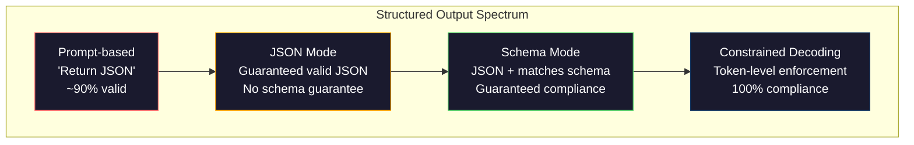
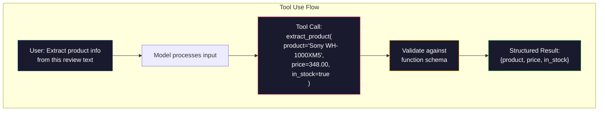

# Structured Outputs: JSON, Schema Validation, Constrained Decoding（结构化输出：JSON、模式验证、受限解码）

> 你的 LLM 返回一个字符串，但你的应用需要 JSON。这个差距导致的线上系统崩溃比任何模型幻觉都多。结构化输出是自然语言与类型化数据之间的桥梁。做对了，你的 LLM 就成为一个可靠的 API。做错了，你就得在凌晨三点用正则表达式解析自由文本。

**Type:** Build
**Languages:** Python
**Prerequisites:** Phase 10, Lessons 01-05 (LLMs from Scratch)
**Time:** ~90 minutes
**Related:** Phase 5 · 20 (Structured Outputs & Constrained Decoding) covers the decoder-level theory (FSM/CFG logit processors, Outlines, XGrammar). This lesson focuses on the production SDK surface (OpenAI `response_format`, Anthropic tool use, Instructor) — read Phase 5 · 20 first if you want to understand what is happening below the API.

## Learning Objectives

- Implement JSON-mode and schema-constrained outputs using OpenAI and Anthropic API parameters
- Build a Pydantic validation layer that rejects malformed LLM outputs and retries with error feedback
- Explain how constrained decoding forces valid JSON at the token level without post-processing
- Design robust extraction prompts that reliably convert unstructured text into typed data structures

## The Problem

你让 LLM："Extract the product name, price, and availability from this text." 它回复：

```
The product is the Sony WH-1000XM5 headphones, which cost $348.00 and are currently in stock.
```

这是一个完全正确的答案，但对你的应用却完全没用。你的库存系统需要 `{"product": "Sony WH-1000XM5", "price": 348.00, "in_stock": true}`。你需要的是一个包含特定键、特定类型和特定值约束的 JSON 对象，而不是一句话。

朴素的解决方案：在提示词中添加 "Respond in JSON"。这在 90% 的情况下有效。其余 10%，模型会将 JSON 包裹在 markdown 代码围栏中，或者加上诸如 "Here's the JSON:" 的前言，或者生成语法无效的 JSON，因为它过早地闭合了括号。你的 JSON 解析器崩溃了，流水线中断了。你添加了 try/except 和重试循环，但重试有时会产生不同的数据。现在你在解析问题之外还多了一致性问题。

这不是提示工程问题，而是解码问题。模型从左到右逐个生成 token。在每个位置，它从 100K+ 选项的词汇表中选择最有可能的下一个 token。其中大多数选项在任何给定位置都会产生无效的 JSON。如果模型刚输出了 `{"price":`，下一个 token 必须是数字、引号（表示字符串）、`null`、`true`、`false` 或负号。其他任何内容都会产生无效的 JSON。在没有约束的情况下，模型可能会选择一个完全合理的英语单词，但它在语法上却是灾难性的错误。

## The Concept

### The Structured Output Spectrum

结构化输出控制有四个级别，每个级别都比前一个更可靠。



**基于提示词（Prompt-based）**（"Respond in valid JSON"）：没有强制执行。模型通常会遵守，但有时不会。可靠性：~90%。失败模式：markdown 围栏、前言文本、截断输出、错误的结构。

**JSON 模式（JSON mode）**：API 保证输出是有效的 JSON。OpenAI 的 `response_format: { type: "json_object" }` 启用此功能。输出将无错误地解析，但它可能不匹配你的期望模式——额外的键、错误的类型、缺失的字段。

**模式模式（Schema mode）**：API 接受一个 JSON Schema 并保证输出匹配它。2026 年，每个主要提供者都原生支持此功能：OpenAI 的 `response_format: { type: "json_schema", json_schema: {...} }`（也作为 `tool_choice="required"`）、Anthropic 的带 `input_schema` 的 tool use、以及 Gemini 的 `response_schema` + `response_mime_type: "application/json"`。输出具有你指定的确切键、类型和约束。

**受限解码（Constrained decoding）**：在生成的每个 token 位置，解码器屏蔽所有会产生无效输出的 token。如果 schema 要求一个数字而模型即将输出一个字母，该 token 的概率被设为零。模型只能生成导向有效输出的 token。这是 OpenAI 的 structured output 模式以及 Outlines 和 Guidance 等库在底层实现的功能。

### JSON Schema: The Contract Language

JSON Schema 是你告诉模型（或验证层）输出必须具有什么形状的方式。每个主要的结构化输出系统都使用它。

```json
{
  "type": "object",
  "properties": {
    "product": { "type": "string" },
    "price": { "type": "number", "minimum": 0 },
    "in_stock": { "type": "boolean" },
    "categories": {
      "type": "array",
      "items": { "type": "string" }
    }
  },
  "required": ["product", "price", "in_stock"]
}
```

这个 schema 说：输出必须是一个对象，包含字符串 `product`、非负数 `price`、布尔值 `in_stock`，以及可选的字符串数组 `categories`。任何不匹配的输出都会被拒绝。

Schema 处理困难情况：嵌套对象、带类型项的数组、枚举（将字符串约束为特定值）、模式匹配（字符串上的正则表达式）以及组合器（`oneOf`、`anyOf`、`allOf` 用于多态输出）。

### The Pydantic Pattern

在 Python 中，你不需要手写 JSON Schema。你定义一个 Pydantic 模型，它会为你生成 schema。

```python
from pydantic import BaseModel

class Product(BaseModel):
    product: str
    price: float
    in_stock: bool
    categories: list[str] = []
```

这生成的 JSON Schema 与上面相同。Instructor 库（以及 OpenAI 的 SDK）直接接受 Pydantic 模型：传入模型类，拿回一个已验证的实例。如果 LLM 输出不匹配，Instructor 会自动重试。

### Function Calling / Tool Use

解决同一问题的替代接口。你不是要求模型直接生成 JSON，而是定义带有类型化参数的"工具"（函数）。模型输出一个带有结构化参数的函数调用。OpenAI 称之为"function calling"，Anthropic 称之为"tool use"。结果是一样的：结构化数据。



当模型需要选择调用*哪个*函数，而不仅仅是填写参数时，tool use 是更好的选择。如果你有 10 个不同的提取 schema，且模型必须根据输入选择正确的那个，tool use 同时为你提供 schema 选择和结构化输出。

### Common Failure Modes

即使有 schema 强制执行，结构化输出也可能以微妙的方式失败。

**幻觉值（Hallucinated values）**：输出匹配 schema 但包含编造的数据。当文本说 $348 时，模型生成 `{"price": 299.99}`。Schema 验证无法捕获这一点——类型正确，但值错误。

**枚举混淆（Enum confusion）**：你将一个字段约束为 `["in_stock", "out_of_stock", "preorder"]`。模型输出 `"available"`——语义上正确，但不在允许的集合中。良好的受限解码可以防止这种情况，但基于提示词的方法做不到。

**嵌套对象深度（Nested object depth）**：深度嵌套的 schema（4 层以上）会产生更多错误。每一层嵌套都是模型可能丢失结构轨迹的另一个位置。

**数组长度（Array length）**：模型可能生成过多或过少的数组项。Schema 支持 `minItems` 和 `maxItems`，但并非所有提供者都在解码级别强制执行它们。

**可选字段省略（Optional field omission）**：模型省略了技术上可选但对你用例在语义上重要的字段。即使数据有时缺失，也要在 schema 中将其设为 required——强制模型显式输出 `null`。

## Build It

### Step 1: JSON Schema Validator

从头构建一个验证器，检查 Python 对象是否匹配 JSON Schema。这是运行在输出端以验证合规性的内容。

```python
import json

def validate_schema(data, schema):
    errors = []
    _validate(data, schema, "", errors)
    return errors

def _validate(data, schema, path, errors):
    schema_type = schema.get("type")

    if schema_type == "object":
        if not isinstance(data, dict):
            errors.append(f"{path}: expected object, got {type(data).__name__}")
            return
        for key in schema.get("required", []):
            if key not in data:
                errors.append(f"{path}.{key}: required field missing")
        properties = schema.get("properties", {})
        for key, value in data.items():
            if key in properties:
                _validate(value, properties[key], f"{path}.{key}", errors)

    elif schema_type == "array":
        if not isinstance(data, list):
            errors.append(f"{path}: expected array, got {type(data).__name__}")
            return
        min_items = schema.get("minItems", 0)
        max_items = schema.get("maxItems", float("inf"))
        if len(data) < min_items:
            errors.append(f"{path}: array has {len(data)} items, minimum is {min_items}")
        if len(data) > max_items:
            errors.append(f"{path}: array has {len(data)} items, maximum is {max_items}")
        items_schema = schema.get("items", {})
        for i, item in enumerate(data):
            _validate(item, items_schema, f"{path}[{i}]", errors)

    elif schema_type == "string":
        if not isinstance(data, str):
            errors.append(f"{path}: expected string, got {type(data).__name__}")
            return
        enum_values = schema.get("enum")
        if enum_values and data not in enum_values:
            errors.append(f"{path}: '{data}' not in allowed values {enum_values}")

    elif schema_type == "number":
        if not isinstance(data, (int, float)):
            errors.append(f"{path}: expected number, got {type(data).__name__}")
            return
        minimum = schema.get("minimum")
        maximum = schema.get("maximum")
        if minimum is not None and data < minimum:
            errors.append(f"{path}: {data} is less than minimum {minimum}")
        if maximum is not None and data > maximum:
            errors.append(f"{path}: {data} is greater than maximum {maximum}")

    elif schema_type == "boolean":
        if not isinstance(data, bool):
            errors.append(f"{path}: expected boolean, got {type(data).__name__}")

    elif schema_type == "integer":
        if not isinstance(data, int) or isinstance(data, bool):
            errors.append(f"{path}: expected integer, got {type(data).__name__}")
```

### Step 2: Pydantic-Style Model to Schema

构建一个极简的类到 schema 转换器。定义一个 Python 类，自动生成其 JSON Schema。

```python
class SchemaField:
    def __init__(self, field_type, required=True, default=None, enum=None, minimum=None, maximum=None):
        self.field_type = field_type
        self.required = required
        self.default = default
        self.enum = enum
        self.minimum = minimum
        self.maximum = maximum

def python_type_to_schema(field):
    type_map = {
        str: "string",
        int: "integer",
        float: "number",
        bool: "boolean",
    }

    schema = {}

    if field.field_type in type_map:
        schema["type"] = type_map[field.field_type]
    elif field.field_type == list:
        schema["type"] = "array"
        schema["items"] = {"type": "string"}
    elif isinstance(field.field_type, dict):
        schema = field.field_type

    if field.enum:
        schema["enum"] = field.enum
    if field.minimum is not None:
        schema["minimum"] = field.minimum
    if field.maximum is not None:
        schema["maximum"] = field.maximum

    return schema

def model_to_schema(name, fields):
    properties = {}
    required = []

    for field_name, field in fields.items():
        properties[field_name] = python_type_to_schema(field)
        if field.required:
            required.append(field_name)

    return {
        "type": "object",
        "properties": properties,
        "required": required,
    }
```

### Step 3: Constrained Token Filter

模拟受限解码。给定一个部分 JSON 字符串和一个 schema，确定当前位置哪些 token 类别是有效的。

```python
def next_valid_tokens(partial_json, schema):
    stripped = partial_json.strip()

    if not stripped:
        return ["{"]

    try:
        json.loads(stripped)
        return ["<EOS>"]
    except json.JSONDecodeError:
        pass

    last_char = stripped[-1] if stripped else ""

    if last_char == "{":
        return ['"', "}"]
    elif last_char == '"':
        if stripped.endswith('":'):
            return ['"', "0-9", "true", "false", "null", "[", "{"]
        return ["a-z", '"']
    elif last_char == ":":
        return [" ", '"', "0-9", "true", "false", "null", "[", "{"]
    elif last_char == ",":
        return [" ", '"', "{", "["]
    elif last_char in "0123456789":
        return ["0-9", ".", ",", "}", "]"]
    elif last_char == "}":
        return [",", "}", "]", "<EOS>"]
    elif last_char == "]":
        return [",", "}", "<EOS>"]
    elif last_char == "[":
        return ['"', "0-9", "true", "false", "null", "{", "[", "]"]
    else:
        return ["any"]

def demonstrate_constrained_decoding():
    partial_states = [
        '',
        '{',
        '{"product"',
        '{"product":',
        '{"product": "Sony"',
        '{"product": "Sony",',
        '{"product": "Sony", "price":',
        '{"product": "Sony", "price": 348',
        '{"product": "Sony", "price": 348}',
    ]

    print(f"{'Partial JSON':<45} {'Valid Next Tokens'}")
    print("-" * 80)
    for state in partial_states:
        valid = next_valid_tokens(state, {})
        display = state if state else "(empty)"
        print(f"{display:<45} {valid}")
```

### Step 4: Extraction Pipeline

将所有内容组合成提取流水线：定义 schema、模拟 LLM 生成结构化输出、验证输出并处理重试。

```python
def simulate_llm_extraction(text, schema, attempt=0):
    if "headphones" in text.lower() or "sony" in text.lower():
        if attempt == 0:
            return '{"product": "Sony WH-1000XM5", "price": 348.00, "in_stock": true, "categories": ["audio", "headphones"]}'
        return '{"product": "Sony WH-1000XM5", "price": 348.00, "in_stock": true}'

    if "laptop" in text.lower():
        return '{"product": "MacBook Pro 16", "price": 2499.00, "in_stock": false, "categories": ["computers"]}'

    return '{"product": "Unknown", "price": 0, "in_stock": false}'

def extract_with_retry(text, schema, max_retries=3):
    for attempt in range(max_retries):
        raw = simulate_llm_extraction(text, schema, attempt)

        try:
            data = json.loads(raw)
        except json.JSONDecodeError as e:
            print(f"  Attempt {attempt + 1}: JSON parse error -- {e}")
            continue

        errors = validate_schema(data, schema)
        if not errors:
            return data

        print(f"  Attempt {attempt + 1}: Schema validation errors -- {errors}")

    return None

product_schema = {
    "type": "object",
    "properties": {
        "product": {"type": "string"},
        "price": {"type": "number", "minimum": 0},
        "in_stock": {"type": "boolean"},
        "categories": {"type": "array", "items": {"type": "string"}},
    },
    "required": ["product", "price", "in_stock"],
}
```

### Step 5: Run the Full Pipeline

```python
def run_demo():
    print("=" * 60)
    print("  Structured Output Pipeline Demo")
    print("=" * 60)

    print("\n--- Schema Definition ---")
    product_fields = {
        "product": SchemaField(str),
        "price": SchemaField(float, minimum=0),
        "in_stock": SchemaField(bool),
        "categories": SchemaField(list, required=False),
    }
    generated_schema = model_to_schema("Product", product_fields)
    print(json.dumps(generated_schema, indent=2))

    print("\n--- Schema Validation ---")
    test_cases = [
        ({"product": "Test", "price": 10.0, "in_stock": True}, "Valid object"),
        ({"product": "Test", "price": -5.0, "in_stock": True}, "Negative price"),
        ({"product": "Test", "in_stock": True}, "Missing price"),
        ({"product": "Test", "price": "ten", "in_stock": True}, "String as price"),
        ("not an object", "String instead of object"),
    ]

    for data, label in test_cases:
        errors = validate_schema(data, product_schema)
        status = "PASS" if not errors else f"FAIL: {errors}"
        print(f"  {label}: {status}")

    print("\n--- Constrained Decoding Simulation ---")
    demonstrate_constrained_decoding()

    print("\n--- Extraction Pipeline ---")
    texts = [
        "The Sony WH-1000XM5 headphones are priced at $348 and currently available.",
        "The new MacBook Pro 16-inch laptop costs $2499 but is sold out.",
        "This is a random sentence with no product info.",
    ]

    for text in texts:
        print(f"\n  Input: {text[:60]}...")
        result = extract_with_retry(text, product_schema)
        if result:
            print(f"  Output: {json.dumps(result)}")
        else:
            print(f"  Output: FAILED after retries")
```

## Use It

### OpenAI Structured Outputs

```python
# from openai import OpenAI
# from pydantic import BaseModel
#
# client = OpenAI()
#
# class Product(BaseModel):
#     product: str
#     price: float
#     in_stock: bool
#
# response = client.beta.chat.completions.parse(
#     model="gpt-5-mini",
#     messages=[
#         {"role": "system", "content": "Extract product information."},
#         {"role": "user", "content": "Sony WH-1000XM5, $348, in stock"},
#     ],
#     response_format=Product,
# )
#
# product = response.choices[0].message.parsed
# print(product.product, product.price, product.in_stock)
```

OpenAI 的 structured output 模式在内部使用受限解码。模型生成的每个 token 都保证能产生匹配 Pydantic schema 的输出。不需要重试，不需要验证。约束已融入解码过程。

### Anthropic Tool Use

```python
# import anthropic
#
# client = anthropic.Anthropic()
#
# response = client.messages.create(
#     model="claude-opus-4-7",
#     max_tokens=1024,
#     tools=[{
#         "name": "extract_product",
#         "description": "Extract product information from text",
#         "input_schema": {
#             "type": "object",
#             "properties": {
#                 "product": {"type": "string"},
#                 "price": {"type": "number"},
#                 "in_stock": {"type": "boolean"},
#             },
#             "required": ["product", "price", "in_stock"],
#         },
#     }],
#     messages=[{"role": "user", "content": "Extract: Sony WH-1000XM5, $348, in stock"}],
# )
```

Anthropic 通过 tool use 实现结构化输出。模型发出一个带有结构化参数（匹配 `input_schema`）的工具调用。同样的结果，不同的 API 表面。

### Instructor Library

```python
# pip install instructor
# import instructor
# from openai import OpenAI
# from pydantic import BaseModel
#
# client = instructor.from_openai(OpenAI())
#
# class Product(BaseModel):
#     product: str
#     price: float
#     in_stock: bool
#
# product = client.chat.completions.create(
#     model="gpt-5-mini",
#     response_model=Product,
#     messages=[{"role": "user", "content": "Sony WH-1000XM5, $348, in stock"}],
# )
```

Instructor 包装任何 LLM 客户端并添加了带验证的自动重试。如果第一次尝试验证失败，它将错误作为上下文发送回模型并要求其修正输出。这适用于任何提供者，不仅仅是 OpenAI。

## Ship It

本课生成 `outputs/prompt-structured-extractor.md` —— 一个可复用的提示词模板，给定一个 schema 定义即可从任何文本中提取结构化数据。输入一个 JSON Schema 和非结构化文本，返回验证后的 JSON。

还生成 `outputs/skill-structured-outputs.md` —— 一个基于你的提供者、可靠性要求和 schema 复杂度来选择正确结构化输出策略的决策框架。

## Exercises

1. 扩展 schema 验证器以支持 `oneOf`（数据必须匹配多个 schema 中的恰好一个）。这处理多态输出——例如，一个字段可以是 `Product` 或 `Service` 对象，它们有不同的形状。

2. 构建一个"schema diff"工具，比较两个 schema 并识别破坏性更改（删除必需字段、更改类型）与非破坏性更改（添加可选字段、放宽约束）。这对于在生产环境中对你的提取 schema 进行版本化至关重要。

3. 实现一个更真实的受限解码模拟器。给定一个 JSON Schema 和一个包含 100 个 token（字母、数字、标点、关键字）的词汇表，逐步遍历生成过程，在每个位置屏蔽无效 token。测量每个步骤词汇表中有多少百分比是有效的。

4. 构建一个提取评估套件。创建 50 个带有手工标注 JSON 输出的产品描述。对你的提取流水线全部 50 个运行，测量精确匹配、字段级别准确率和类型合规性。找出哪些字段最难正确提取。

5. 为你的提取流水线添加"置信度分数"。对每个提取的字段，估计模型有多自信（基于 token 概率，或通过运行 3 次提取并衡量一致性）。标记低置信度字段以供人工审核。

## Key Terms

| Term | What people say | What it actually means |
|------|----------------|----------------------|
| JSON mode | "Returns JSON" | API flag that guarantees syntactically valid JSON output, but does not enforce any particular schema |
| Structured output | "Typed JSON" | Output that matches a specific JSON Schema with correct keys, types, and constraints |
| Constrained decoding | "Guided generation" | At each token position, mask out tokens that would produce invalid output -- guarantees 100% schema compliance |
| JSON Schema | "A JSON template" | A declarative language for describing the structure, types, and constraints of JSON data (used by OpenAPI, JSON Forms, etc.) |
| Pydantic | "Python dataclasses+" | Python library that defines data models with type validation, used by FastAPI and Instructor to generate JSON Schemas |
| Function calling | "Tool use" | LLM outputs a structured function invocation (name + typed arguments) instead of free text -- OpenAI and Anthropic both support this |
| Instructor | "Pydantic for LLMs" | Python library that wraps LLM clients to return validated Pydantic instances, with automatic retry on validation failure |
| Token masking | "Filtering the vocabulary" | Setting specific token probabilities to zero during generation so the model cannot produce them |
| Schema compliance | "Matches the shape" | The output has every required field, correct types, values within constraints, and no extra disallowed fields |
| Retry loop | "Try again until it works" | Send validation errors back to the model and ask it to fix the output -- Instructor does this automatically, up to a configurable max |

## Further Reading

- [OpenAI Structured Outputs Guide](https://platform.openai.com/docs/guides/structured-outputs) -- official documentation for JSON Schema-based constrained decoding in the OpenAI API
- [Willard & Louf, 2023 -- "Efficient Guided Generation for Large Language Models"](https://arxiv.org/abs/2307.09702) -- the Outlines paper, describing how to compile JSON Schemas into finite state machines for token-level constraints
- [Instructor documentation](https://python.useinstructor.com/) -- the standard library for getting structured outputs from any LLM with Pydantic validation and retries
- [Anthropic Tool Use Guide](https://docs.anthropic.com/en/docs/tool-use) -- how Claude implements structured output via tool use with JSON Schema input_schema
- [JSON Schema specification](https://json-schema.org/) -- the full spec for the schema language used by every major structured output system
- [Outlines library](https://github.com/outlines-dev/outlines) -- open-source constrained generation using regex and JSON Schema compiled to finite state machines
- [Dong et al., "XGrammar: Flexible and Efficient Structured Generation Engine for Large Language Models" (MLSys 2025)](https://arxiv.org/abs/2411.15100) -- the current state-of-the-art grammar engine; pushdown-automaton compilation that masks tokens at ~100 ns / token.
- [Beurer-Kellner et al., "Prompting Is Programming: A Query Language for Large Language Models" (LMQL)](https://arxiv.org/abs/2212.06094) -- the LMQL paper framing constrained decoding as a query language with type and value constraints.
- [Microsoft Guidance (framework docs)](https://github.com/guidance-ai/guidance) -- template-driven constrained generation; vendor-agnostic complement to Outlines and XGrammar.
