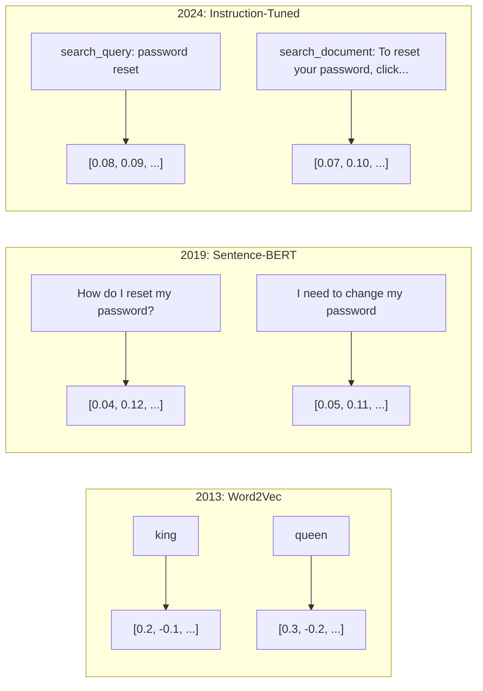
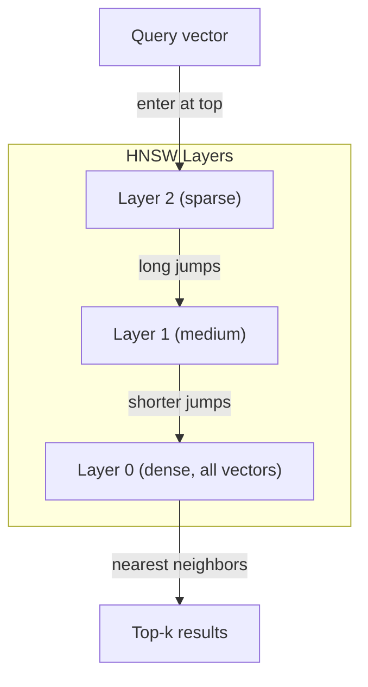
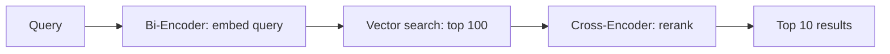

# Embeddings & Vector Representations（嵌入与向量表示）

> 文本是离散的，数学是连续的。每次你让 LLM 查找"相似"的文档、比较含义、或超越关键词进行搜索时，你都依赖于这两个世界之间的桥梁。这座桥梁就是嵌入（embedding）。如果你不理解嵌入，你就不理解现代 AI——你只是在使用它。

**Type:** Build
**Languages:** Python
**Prerequisites:** Phase 11, Lesson 01 (Prompt Engineering)
**Time:** ~75 minutes
**Related:** Phase 5 · 22 (Embedding Models Deep Dive) covers dense vs sparse vs multi-vector, Matryoshka truncation, and per-axis model selection. This lesson focuses on the production pipeline (vector DBs, HNSW, similarity math). Read Phase 5 · 22 before picking a model.

## Learning Objectives

- Generate text embeddings using API providers and open-source models, and compute cosine similarity between them
- Explain why embeddings solve the vocabulary mismatch problem that keyword search cannot handle
- Build a semantic search index that retrieves documents by meaning rather than exact keyword match
- Evaluate embedding quality using retrieval benchmarks (precision@k, recall) and choose the right embedding model for your task

## The Problem

你有一万条支持工单。一位客户写道 "my payment didn't go through." 你需要找到类似的过去工单。关键词搜索找到包含 "payment" 和 "didn't go through" 的工单，但漏掉了 "transaction failed"、"charge was declined" 和 "billing error"。这些工单用完全不同的词汇描述了完全相同的问题。

这就是词汇不匹配问题。人类语言有几十种方式来表达同一件事。关键词搜索将每个词视为没有含义的独立符号。它无法知道 "declined" 和 "didn't go through" 指的是同一个概念。

你需要一种文本的表示方式，其中决定相似性的是*含义*而非拼写。你需要一种方法，将 "my payment didn't go through" 和 "transaction was declined" 在某个数学空间中放置得很近，同时将 "my payment arrived on time" 推得很远——尽管它们共享词 "payment"。

这种表示就是嵌入。

## The Concept

### What Is an Embedding?

嵌入是一个稠密的浮点数向量，表示文本的含义。"稠密"一词很重要——每个维度都携带信息，这一点与稀疏表示（词袋模型、TF-IDF）不同，后者的多数维度为零。

"The cat sat on the mat" 会变成类似 `[0.023, -0.041, 0.087, ..., 0.012]` 的东西——根据模型不同，一个包含 768 到 3072 个数字的列表。这些数字编码了含义。你从不直接查看它们，而是比较它们。

### The Word2Vec Breakthrough

2013 年，Google 的 Tomas Mikolov 及其同事发表了 Word2Vec。核心洞察：训练一个神经网络从词的邻居来预测词（或从词来预测邻居），隐藏层的权重就变成了有意义的向量表示。

著名的结果：

```
king - man + woman = queen
```

词嵌入上的向量算术捕捉了语义关系。从 "man" 到 "woman" 的方向，大致等同于从 "king" 到 "queen" 的方向。这是该领域意识到几何可以编码含义的时刻。

Word2Vec 生成 300 维向量。每个词只有一个向量，不考虑上下文。"Bank" 在 "river bank" 和 "bank account" 中有相同的嵌入。这一局限推动了接下来十年的研究。

### From Words to Sentences

词嵌入表示单个 token。生产系统需要嵌入整个句子、段落或文档。出现了四种方法：

**平均法（Averaging）**：取句子中所有词向量的均值。成本低、有损失、但对于短文本出奇地不错。完全丢失了词序——"dog bites man" 和 "man bites dog" 得到相同的嵌入。

**CLS token**：Transformer 模型（BERT，2018）输出一个特殊的 [CLS] token 嵌入来表示整个输入。比平均法好，但 [CLS] token 是为下一句预测训练的，而非相似性。

**对比学习（Contrastive learning）**：显式训练模型将相似对推到一起，将不相似对拉开。Sentence-BERT（Reimers & Gurevych，2019）使用了这种方法，成为现代嵌入模型的基础。给定 "How do I reset my password?" 和 "I need to change my password"，模型学习到这些应该有几乎相同的向量。

**指令调优嵌入（Instruction-tuned embeddings）**：最新的方法。像 E5 和 GTE 这样的模型接受一个任务前缀（"search_query:"、"search_document:"），告诉模型应该生成什么类型的嵌入。这使一个模型能够服务多个任务。



### Modern Embedding Models

市场已经稳定在少数生产级选项中（MTEB 分数截至 2026 年初，MTEB v2）：

| Model | Provider | Dimensions | MTEB | Context | Cost / 1M tokens |
|-------|----------|-----------|------|---------|------------------|
| Gemini Embedding 2 | Google | 3072 (Matryoshka) | 67.7 (retrieval) | 8192 | $0.15 |
| embed-v4 | Cohere | 1024 (Matryoshka) | 65.2 | 128K | $0.12 |
| voyage-4 | Voyage AI | 1024/2048 (Matryoshka) | 66.8 | 32K | $0.12 |
| text-embedding-3-large | OpenAI | 3072 (Matryoshka) | 64.6 | 8192 | $0.13 |
| text-embedding-3-small | OpenAI | 1536 (Matryoshka) | 62.3 | 8192 | $0.02 |
| BGE-M3 | BAAI | 1024 (dense+sparse+ColBERT) | 63.0 multilingual | 8192 | Open-weight |
| Qwen3-Embedding | Alibaba | 4096 (Matryoshka) | 66.9 | 32K | Open-weight |
| Nomic-embed-v2 | Nomic | 768 (Matryoshka) | 63.1 | 8192 | Open-weight |

MTEB（Massive Text Embedding Benchmark，大规模文本嵌入基准）v2 涵盖了检索、分类、聚类、重排序和摘要等 100+ 任务。越高越好。到 2026 年，开源模型（Qwen3-Embedding、BGE-M3）在大多数维度上匹配或击败了闭源托管模型。Gemini Embedding 2 在纯检索上领先；Voyage/Cohere 在特定领域（金融、法律、代码）领先。始终在你自己的查询上基准测试后再做出选择。

### Similarity Metrics

给定两个嵌入向量，有三种方式衡量它们的相似程度：

**余弦相似度（Cosine similarity）**：两个向量之间角度的余弦值。范围从 -1（相反）到 1（方向相同）。忽略大小——如果方向相同，一个 10 词的句子和一个 500 词的文档可以得 1.0 分。这是 90% 用例的默认选择。

```
cosine_sim(a, b) = dot(a, b) / (||a|| * ||b||)
```

**点积（Dot product）**：两个向量的原始内积。向量归一化（单位长度）时，与余弦相似度完全相同。计算更快。OpenAI 的嵌入是归一化的，所以点积和余弦给出相同的排名。

```
dot(a, b) = sum(a_i * b_i)
```

**欧氏（L2）距离（Euclidean (L2) distance）**：向量空间中的直线距离。越小 = 越相似。对大小差异敏感。当空间中的绝对位置很重要，而非仅仅方向时使用。

```
L2(a, b) = sqrt(sum((a_i - b_i)^2))
```

何时使用哪个：

| Metric | Use when | Avoid when |
|--------|----------|------------|
| Cosine similarity | Comparing texts of different lengths; most retrieval tasks | Magnitude carries information |
| Dot product | Embeddings are already normalized; maximum speed | Vectors have varying magnitudes |
| Euclidean distance | Clustering; spatial nearest-neighbor problems | Comparing documents of wildly different lengths |

### Vector Databases and HNSW

暴力相似性搜索将查询与每个存储的向量进行比较。100 万个 1536 维向量意味着每次查询需要 15 亿次乘加操作。太慢了。

向量数据库使用近似最近邻（ANN）算法来解决此问题。主导算法是 HNSW（Hierarchical Navigable Small World，分层可导航小世界）：

1. 构建向量的多层图
2. 顶层稀疏——远距离簇之间的长距离连接
3. 底层密集——附近向量之间的细粒度连接
4. 搜索从顶层开始，贪婪下降进行细化
5. 在 O(log n) 时间内返回近似 top-k 结果，而非 O(n)

HNSW 用小的准确率损失（通常 95-99% 召回率）换取巨大的速度提升。在 1000 万向量上，暴力搜索需要数秒，HNSW 只需要毫秒。



生产选项：

| Database | Type | Best for | Max scale |
|----------|------|----------|-----------|
| Pinecone | Managed SaaS | Zero-ops production | Billions |
| Weaviate | Open source | Self-hosted, hybrid search | 100M+ |
| Qdrant | Open source | High performance, filtering | 100M+ |
| ChromaDB | Embedded | Prototyping, local dev | 1M |
| pgvector | Postgres extension | Already using Postgres | 10M |
| FAISS | Library | In-process, research | 1B+ |

### Chunking Strategies

文档太长，无法作为单个向量嵌入。一份 50 页的 PDF 涵盖几十个主题——其嵌入变成了所有内容的平均值，与任何特定内容都不相似。你将文档拆分成块（chunk），分别嵌入每个块。

**固定大小分块（Fixed-size chunking）**：每 N 个 token 拆分，带 M 个 token 的重叠。简单且可预测。当文档没有清晰结构时效果很好。一个 512-token 块带 50-token 重叠：块 1 是 token 0-511，块 2 是 token 462-973。

**基于句子的分块（Sentence-based chunking）**：在句子边界处拆分，将句子分组直到达到 token 限制。每个块至少是一个完整的句子。比固定大小更好，因为你不会把一个想法切成两半。

**递归分块（Recursive chunking）**：首先尝试在最大边界处拆分（节标题）。如果仍然太大，尝试段落边界。然后是句子边界。然后是字符限制。这就是 LangChain 的 `RecursiveCharacterTextSplitter`，对混合格式的语料效果很好。

**语义分块（Semantic chunking）**：嵌入每个句子，然后将嵌入相似的连续句子分组。当嵌入相似度降到阈值以下时，开始新的块。成本高（需要单独嵌入每个句子），但产生最连贯的块。

| Strategy | Complexity | Quality | Best for |
|----------|-----------|---------|----------|
| Fixed-size | Low | Decent | Unstructured text, logs |
| Sentence-based | Low | Good | Articles, emails |
| Recursive | Medium | Good | Markdown, HTML, mixed docs |
| Semantic | High | Best | Critical retrieval quality |

大多数系统的最佳点：256-512 token 块，带 50-token 重叠。

### Bi-Encoders vs Cross-Encoders

双编码器（Bi-encoder）独立嵌入查询和文档，然后比较向量。速度快——你嵌入查询一次并与预计算的文档嵌入进行比较。这是你用于检索的方式。

交叉编码器（Cross-encoder）将查询和文档作为单个输入，输出相关性分数。速度慢——它通过完整模型处理每个查询-文档对。但由于可以同时关注查询和文档的 token，准确率远高于双编码器。

生产模式：双编码器检索 top-100 候选，交叉编码器将其重排为 top-10。这就是先检索后重排（retrieve-then-rerank）流水线。



重排序模型：Cohere Rerank 3.5（每 1000 次查询 $2）、BGE-reranker-v2（免费、开源）、Jina Reranker v2（免费、开源）。

### Matryoshka Embeddings

传统嵌入是全有或全无的。一个 1536 维向量使用 1536 个浮点数。你无法截断到 256 维而不重新训练。

Matryoshka 表示学习（Matryoshka Representation Learning，Kusupati 等人，2022）解决了这个问题。模型被训练使得前 N 个维捕获最重要的信息，就像俄罗斯套娃。将 1536 维 Matryoshka 嵌入截断到 256 维会损失一些准确性，但仍然可用。

OpenAI 的 text-embedding-3-small 和 text-embedding-3-large 通过 `dimensions` 参数支持 Matryoshka 截断。请求 256 维而非 1536 维可将存储减少 6 倍，在 MTEB 基准上大约损失 3-5% 的准确率。

### Binary Quantization

一个以 float32 存储的 1536 维嵌入占用 6,144 字节。乘以 1000 万份文档：仅向量就需要 61 GB。

二值量化将每个浮点数转换为单个比特：正值变为 1，负值变为 0。存储从 6,144 字节降至 192 字节——32 倍减少。相似度使用汉明距离计算（计数不同比特），CPU 可以在单条指令中完成。

检索召回率上准确率损失约为 5-10%。常见模式：二值量化用于百万级向量上的初次搜索，然后用全精度向量对 top-1000 重新评分。这样可以以 32 倍更少的内存获得 95%+ 的全精度准确率。

```figure
cosine-similarity
```

## Build It

我们从头构建一个语义搜索引擎。没有向量数据库，没有外部嵌入 API。纯 Python 加 numpy 处理数学。

### Step 1: Text Chunking

```python
def chunk_text(text, chunk_size=200, overlap=50):
    words = text.split()
    chunks = []
    start = 0
    while start < len(words):
        end = start + chunk_size
        chunk = " ".join(words[start:end])
        chunks.append(chunk)
        start += chunk_size - overlap
    return chunks


def chunk_by_sentences(text, max_chunk_tokens=200):
    sentences = text.replace("\n", " ").split(".")
    sentences = [s.strip() + "." for s in sentences if s.strip()]
    chunks = []
    current_chunk = []
    current_length = 0
    for sentence in sentences:
        sentence_length = len(sentence.split())
        if current_length + sentence_length > max_chunk_tokens and current_chunk:
            chunks.append(" ".join(current_chunk))
            current_chunk = []
            current_length = 0
        current_chunk.append(sentence)
        current_length += sentence_length
    if current_chunk:
        chunks.append(" ".join(current_chunk))
    return chunks
```

### Step 2: Building Embeddings from Scratch

我们使用带 L2 归一化的 TF-IDF 实现一个简单的稠密嵌入。这不是神经嵌入，但它遵循相同的契约：文本输入，固定大小向量输出，相似文本产生相似向量。

```python
import math
import numpy as np
from collections import Counter

class SimpleEmbedder:
    def __init__(self):
        self.vocab = []
        self.idf = []
        self.word_to_idx = {}

    def fit(self, documents):
        vocab_set = set()
        for doc in documents:
            vocab_set.update(doc.lower().split())
        self.vocab = sorted(vocab_set)
        self.word_to_idx = {w: i for i, w in enumerate(self.vocab)}
        n = len(documents)
        self.idf = np.zeros(len(self.vocab))
        for i, word in enumerate(self.vocab):
            doc_count = sum(1 for doc in documents if word in doc.lower().split())
            self.idf[i] = math.log((n + 1) / (doc_count + 1)) + 1

    def embed(self, text):
        words = text.lower().split()
        count = Counter(words)
        total = len(words) if words else 1
        vec = np.zeros(len(self.vocab))
        for word, freq in count.items():
            if word in self.word_to_idx:
                tf = freq / total
                vec[self.word_to_idx[word]] = tf * self.idf[self.word_to_idx[word]]
        norm = np.linalg.norm(vec)
        if norm > 0:
            vec = vec / norm
        return vec
```

### Step 3: Similarity Functions

```python
def cosine_similarity(a, b):
    dot = np.dot(a, b)
    norm_a = np.linalg.norm(a)
    norm_b = np.linalg.norm(b)
    if norm_a == 0 or norm_b == 0:
        return 0.0
    return float(dot / (norm_a * norm_b))


def dot_product(a, b):
    return float(np.dot(a, b))


def euclidean_distance(a, b):
    return float(np.linalg.norm(a - b))
```

### Step 4: Vector Index with Brute-Force Search

```python
class VectorIndex:
    def __init__(self):
        self.vectors = []
        self.texts = []
        self.metadata = []

    def add(self, vector, text, meta=None):
        self.vectors.append(vector)
        self.texts.append(text)
        self.metadata.append(meta or {})

    def search(self, query_vector, top_k=5, metric="cosine"):
        scores = []
        for i, vec in enumerate(self.vectors):
            if metric == "cosine":
                score = cosine_similarity(query_vector, vec)
            elif metric == "dot":
                score = dot_product(query_vector, vec)
            elif metric == "euclidean":
                score = -euclidean_distance(query_vector, vec)
            else:
                raise ValueError(f"Unknown metric: {metric}")
            scores.append((i, score))
        scores.sort(key=lambda x: x[1], reverse=True)
        results = []
        for idx, score in scores[:top_k]:
            results.append({
                "text": self.texts[idx],
                "score": score,
                "metadata": self.metadata[idx],
                "index": idx
            })
        return results

    def size(self):
        return len(self.vectors)
```

### Step 5: The Semantic Search Engine

```python
class SemanticSearchEngine:
    def __init__(self, chunk_size=200, overlap=50):
        self.embedder = SimpleEmbedder()
        self.index = VectorIndex()
        self.chunk_size = chunk_size
        self.overlap = overlap

    def index_documents(self, documents, source_names=None):
        all_chunks = []
        all_sources = []
        for i, doc in enumerate(documents):
            chunks = chunk_text(doc, self.chunk_size, self.overlap)
            all_chunks.extend(chunks)
            name = source_names[i] if source_names else f"doc_{i}"
            all_sources.extend([name] * len(chunks))
        self.embedder.fit(all_chunks)
        for chunk, source in zip(all_chunks, all_sources):
            vec = self.embedder.embed(chunk)
            self.index.add(vec, chunk, {"source": source})
        return len(all_chunks)

    def search(self, query, top_k=5, metric="cosine"):
        query_vec = self.embedder.embed(query)
        return self.index.search(query_vec, top_k, metric)

    def search_with_scores(self, query, top_k=5):
        results = self.search(query, top_k)
        return [
            {
                "text": r["text"][:200],
                "source": r["metadata"].get("source", "unknown"),
                "score": round(r["score"], 4)
            }
            for r in results
        ]
```

### Step 6: Comparing Similarity Metrics

```python
def compare_metrics(engine, query, top_k=3):
    results = {}
    for metric in ["cosine", "dot", "euclidean"]:
        hits = engine.search(query, top_k=top_k, metric=metric)
        results[metric] = [
            {"score": round(h["score"], 4), "preview": h["text"][:80]}
            for h in hits
        ]
    return results
```

## Use It

使用生产级的嵌入 API，架构保持不变。只有嵌入器改变：

```python
from openai import OpenAI

client = OpenAI()

def openai_embed(texts, model="text-embedding-3-small", dimensions=None):
    kwargs = {"model": model, "input": texts}
    if dimensions:
        kwargs["dimensions"] = dimensions
    response = client.embeddings.create(**kwargs)
    return [item.embedding for item in response.data]
```

使用 OpenAI 的 Matryoshka 截断——相同模型，更少维度，更低存储：

```python
full = openai_embed(["semantic search query"], dimensions=1536)
compact = openai_embed(["semantic search query"], dimensions=256)
```

256 维向量使用 6 倍更少的存储。对于 1000 万份文档，就是 10 GB 对比 61 GB。在标准基准上，准确率损失大约是 3-5%。

使用 Cohere 进行重排序：

```python
import cohere

co = cohere.ClientV2()

results = co.rerank(
    model="rerank-v3.5",
    query="What is the refund policy?",
    documents=["Full refund within 30 days...", "No refunds after 90 days..."],
    top_n=3
)
```

本地嵌入，无需 API 依赖：

```python
from sentence_transformers import SentenceTransformer

model = SentenceTransformer("BAAI/bge-small-en-v1.5")
embeddings = model.encode(["semantic search query", "another document"])
```

我们构建的 VectorIndex 类可以与以上任何一种配合使用。更换嵌入函数，保留搜索逻辑。

## Ship It

本课生成：
- `outputs/prompt-embedding-advisor.md` —— 一个为特定用例选择嵌入模型和策略的提示词
- `outputs/skill-embedding-patterns.md` —— 一个教智能体如何在生产中有效使用嵌入的技能

## Exercises

1. **指标比较**：使用余弦相似度、点积和欧氏距离对 5 个相同的查询在示例文档上运行。记录每种方法的 top-3 结果。哪些查询上指标之间存在分歧？为什么？

2. **块大小实验**：使用 50、100、200 和 500 词的块大小索引示例文档。对每个运行 5 个查询并记录 top-1 相似度分数。绘制块大小与检索质量之间的关系。找到更大的块开始有害的点。

3. **Matryoshka 模拟**：构建一个生成 500 维向量的 SimpleEmbedder。截断到 50、100、200 和 500 维。测量每次截断时检索召回率如何降低。这模拟了 Matryoshka 行为，而无需真正的训练技巧。

4. **二值量化**：取搜索引擎的嵌入，将其转换为二进制（正数为 1，负数为 0），并实现汉明距离搜索。将 top-10 结果与全精度余弦相似度进行比较。测量重叠百分比。

5. **基于句子的分块**：用 `chunk_by_sentences` 替换固定大小分块。运行相同的查询并比较检索分数。尊重句子边界是否改善了结果？

## Key Terms

| Term | What people say | What it actually means |
|------|----------------|----------------------|
| Embedding | "Text to numbers" | A dense vector where geometric proximity encodes semantic similarity |
| Word2Vec | "The OG embedding" | 2013 model that learned word vectors by predicting context words; proved vector arithmetic encodes meaning |
| Cosine similarity | "How similar are two vectors" | Cosine of the angle between vectors; 1 = identical direction, 0 = orthogonal, -1 = opposite |
| HNSW | "Fast vector search" | Hierarchical Navigable Small World graph -- multi-layer structure enabling O(log n) approximate nearest neighbor search |
| Bi-encoder | "Embed separately, compare fast" | Encodes query and document independently into vectors; enables pre-computation and fast retrieval |
| Cross-encoder | "Slow but accurate reranker" | Processes query-document pair jointly through the full model; higher accuracy, no pre-computation |
| Matryoshka embeddings | "Truncatable vectors" | Embeddings trained so the first N dimensions capture the most important information, enabling variable-size storage |
| Binary quantization | "1-bit embeddings" | Converting float vectors to binary (sign bit only) for 32x storage reduction with Hamming distance search |
| Chunking | "Split docs for embedding" | Breaking documents into 256-512 token segments so each can be independently embedded and retrieved |
| Vector database | "Search engine for embeddings" | Data store optimized for storing vectors and performing approximate nearest neighbor search at scale |
| Contrastive learning | "Train by comparison" | Training approach that pushes similar pair embeddings together and dissimilar pair embeddings apart |
| MTEB | "The embedding benchmark" | Massive Text Embedding Benchmark -- 56 datasets across 8 tasks; standard for comparing embedding models |

## Further Reading

- Mikolov et al., "Efficient Estimation of Word Representations in Vector Space" (2013) -- the Word2Vec paper that started the embedding revolution with the king-queen analogy
- Reimers & Gurevych, "Sentence-BERT: Sentence Embeddings using Siamese BERT-Networks" (2019) -- how to train bi-encoders for sentence-level similarity, foundation of modern embedding models
- Kusupati et al., "Matryoshka Representation Learning" (2022) -- the technique behind variable-dimension embeddings that OpenAI adopted for text-embedding-3
- Malkov & Yashunin, "Efficient and Robust Approximate Nearest Neighbor using Hierarchical Navigable Small World Graphs" (2018) -- the HNSW paper, the algorithm behind most production vector search
- OpenAI Embeddings Guide (platform.openai.com/docs/guides/embeddings) -- practical reference for text-embedding-3 models including Matryoshka dimension reduction
- MTEB Leaderboard (huggingface.co/spaces/mteb/leaderboard) -- live benchmark comparing all embedding models across tasks and languages
- [Muennighoff et al., "MTEB: Massive Text Embedding Benchmark" (EACL 2023)](https://arxiv.org/abs/2210.07316) -- the benchmark defining 8 task categories (classification, clustering, pair classification, reranking, retrieval, STS, summarization, bitext mining) that the leaderboard reports; read before trusting any single MTEB score.
- [Sentence Transformers documentation](https://www.sbert.net/) -- canonical reference for bi-encoder vs cross-encoder, pooling strategies, and the ingest-split-embed-store RAG pipeline this lesson implements.
