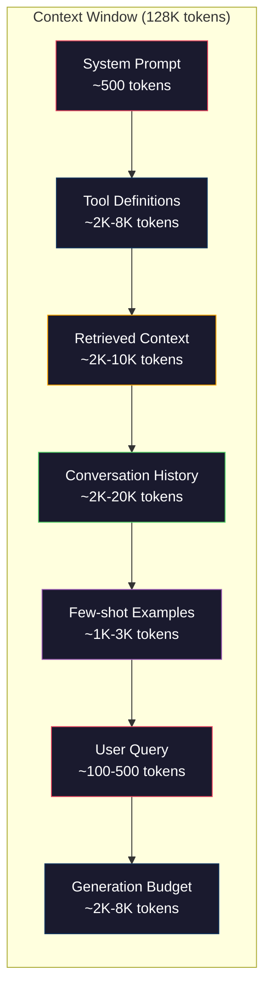
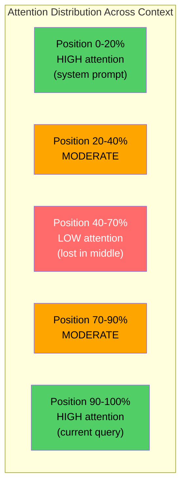
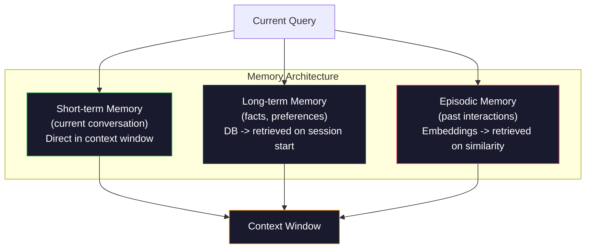

# Context Engineering: Windows, Budgets, Memory, and Retrieval（上下文工程：窗口、预算、记忆与检索）

> 提示工程是一个子集，上下文工程才是全局。提示词是你输入的一个字符串。上下文是进入模型窗口的全部内容：系统指令、检索到的文档、工具定义、对话历史、少样本示例以及提示词本身。2026 年最优秀的 AI 工程师都是上下文工程师。他们决定什么进入、什么留在外面、按什么顺序排列。

**Type:** Build
**Languages:** Python
**Prerequisites:** Phase 10 (LLMs from Scratch), Phase 11 Lesson 01-02
**Time:** ~90 minutes
**Related:** Phase 11 · 15 (Prompt Caching) — the cache-friendly layout is an extension of context engineering. Phase 5 · 28 (Long-Context Evaluation) for how to measure lost-in-the-middle with NIAH/RULER.

## Learning Objectives

- Calculate token budgets across all context window components (system prompt, tools, history, retrieved docs, generation headroom)
- Implement context window management strategies: truncation, summarization, and sliding window for conversation history
- Prioritize and order context components to maximize the model's attention on the most relevant information
- Build a context assembler that dynamically allocates tokens based on query type and available window space

## The Problem

Claude Opus 4.7 拥有 200K token 窗口（beta 版 1M）。GPT-5 有 400K。Gemini 3 Pro 有 2M。Llama 4 号称 10M。这些数字听起来很庞大，直到你将它们填满。

这是一个编程助手真实的分析。系统提示词：500 token。50 个工具的工具定义：8,000 token。检索到的文档：4,000 token。对话历史（10 轮）：6,000 token。当前用户查询：200 token。生成预算（最大输出）：4,000 token。总计：22,700 token。这只占 128K 窗口的 18%。

但注意力并不随上下文长度线性扩展。拥有 128K token 上下文的模型需要付出二次注意力成本（在标准 transformer 中是 O(n^2)，不过大多数生产模型使用高效注意力变体）。更重要的是，检索准确性会下降。"大海捞针"（Needle in a Haystack）测试表明，模型难以找到放置在长上下文中间的信息。Liu 等人（2023）的研究表明，LLM 以近乎完美的准确率检索长上下文开头和结尾的信息，但对于放置在中间（上下文 40-70% 的位置）的信息，准确率下降 10-20%。这种"中间迷失"效应因模型而异，但影响所有当前架构。

实践教训：拥有 200K 可用的 token 并不意味着使用 200K token 是有效的。一个精心策划的 10K token 上下文通常优于随意堆砌的 100K token 上下文。上下文工程是在上下文窗口内最大化信噪比的学科。

你放入窗口的每个 token 都会挤掉一个本可以携带更多相关信息的 token。每个不相关的工具定义、每个过时的对话轮次、每个不回答问题的那条检索文本——每一项都会让模型在任务上表现稍差一点。

## The Concept

### The Context Window is a Scarce Resource

将上下文窗口视为 RAM，而非磁盘。它速度快且可直接访问，但容量有限。你无法将所有内容装入，必须做出选择。



每个组件都在竞争空间。添加更多工具定义意味着对话历史的空间更少。添加更多检索到的上下文意味着少样本示例的空间更少。上下文工程是分配此预算以最大化任务表现的艺术。

### Lost-in-the-Middle

上下文工程中最重要的经验发现。模型对上下文*开头*和*结尾*的信息关注得更好。中间的信息获得较低的注意力分数，更可能被忽略。

Liu 等人（2023）系统地测试了这一点。他们将一个相关文档放置在 20 个不相关文档中的不同位置，并测量答案准确率。当相关文档处于第一位或最后一位时，准确率为 85-90%。当它处于中间（20 个中的第 10 位）时，准确率降至 60-70%。

这具有直接的工程含义：

- 将最重要的信息放在最前面（系统提示词、关键指令）
- 将当前查询和最相关的上下文放在最后（近因偏差有帮助）
- 将上下文的中间视为最低优先级区域
- 如果你必须在中间放置信息，在末尾重复关键点



### Context Components

**系统提示词（System prompt）**：设定角色、约束和行为规则。放在最前面，在整个对话中保持不变。Claude Code 使用约 6,000 token 的系统提示词，包括工具定义和行为指令。保持紧凑。系统提示词中的每个词都在每次 API 调用中重复发送。

**工具定义（Tool definitions）**：每个工具增加 50-200 token（名称、描述、参数 schema）。50 个工具，每个 150 token，在对话开始前就是 7,500 token。动态工具选择——仅包含与当前查询相关的工具——可以减少 60-80%。

**检索到的上下文（Retrieved context）**：来自向量数据库的文档、搜索结果、文件内容。检索的质量直接决定了回复的质量。糟糕的检索比没有检索更差——它用噪声填满窗口，并主动误导模型。

**对话历史（Conversation history）**：每个之前的用户消息和助手回复。随对话长度线性增长。一个 50 轮的对话，每轮 200 token，就是 10,000 token 的历史。其中大部分与当前查询无关。

**少样本示例（Few-shot examples）**：展示期望行为的输入/输出对。两到三个精心挑选的示例，通常比数千 token 的指令更能提高输出质量，但它们占用空间。

**生成预算（Generation budget）**：为模型回复保留的 token。如果你将窗口填满，模型就没有回答的空间。保留至少 2,000-4,000 token 用于生成。

### Context Compression Strategies

**历史摘要（History summarization）**：不是保留所有之前的轮次原文，而是定期摘要对话。100 token 的 "We discussed X, decided Y, and the user wants Z" 替代了花费 2,000 token 的 10 轮对话。当历史超过阈值（例如 5,000 token）时运行摘要。

**相关性过滤（Relevance filtering）**：根据当前查询对每个检索到的文档打分，丢弃低于阈值的文档。如果你检索了 10 个块但只有 3 个相关，丢弃其他 7 个。拥有 3 个高度相关的块比 10 个平庸的块更好。

**工具裁剪（Tool pruning）**：对用户查询意图进行分类，只包含与该意图相关的工具。代码问题不需要日历工具。日程安排问题不需要文件系统工具。这可以将工具定义从 8,000 token 减少到 1,000。

**递归摘要（Recursive summarization）**：对于非常长的文档，分阶段进行摘要。首先摘要每个章节，然后摘要这些摘要。一份 50 页的文档变成一份 500 token 的摘要，捕获关键要点。

### Memory Systems

上下文工程跨越三个时间范围。

**短期记忆（Short-term memory）**：当前对话。直接存储在上下文窗口中。随每一轮增长。通过摘要和截断进行管理。

**长期记忆（Long-term memory）**：跨对话持久化的事实和偏好。"The user prefers TypeScript." "The project uses PostgreSQL." 存储在数据库中，在会话开始时检索。Claude Code 将其存储在 CLAUDE.md 文件中。ChatGPT 将其存储在其记忆功能中。

**情节记忆（Episodic memory）**：可能相关的特定过去交互。"Last Tuesday, we debugged a similar issue in the auth module." 存储为嵌入，当当前对话与过去的某个情节匹配时检索。



### Dynamic Context Assembly

关键洞察：不同的查询需要不同的上下文。静态的系统提示词 + 静态的工具 + 静态的历史是浪费的。最好的系统按查询动态组装上下文。

1. 分类查询意图
2. 选择相关工具（而非所有工具）
3. 检索相关文档（而非固定集合）
4. 包含相关历史轮次（而非所有历史）
5. 添加与任务类型匹配的少样本示例
6. 按重要性排序：关键内容排在最前，重要内容排在最后，可选内容排在中间

这就是区分好的 AI 应用和优秀的 AI 应用的分水岭。模型是相同的。上下文是差异化因素。

## Build It

### Step 1: Token Counter

你无法管理你无法衡量的东西。构建一个简单的 token 计数器（使用空格分割进行近似，因为精确计数取决于分词器）。

```python
import json
import numpy as np
from collections import OrderedDict

def count_tokens(text):
    if not text:
        return 0
    return int(len(text.split()) * 1.3)

def count_tokens_json(obj):
    return count_tokens(json.dumps(obj))
```

### Step 2: Context Budget Manager

核心抽象。预算管理器跟踪每个组件使用了多少 token 并强制执行限制。

```python
class ContextBudget:
    def __init__(self, max_tokens=128000, generation_reserve=4000):
        self.max_tokens = max_tokens
        self.generation_reserve = generation_reserve
        self.available = max_tokens - generation_reserve
        self.allocations = OrderedDict()

    def allocate(self, component, content, max_tokens=None):
        tokens = count_tokens(content)
        if max_tokens and tokens > max_tokens:
            words = content.split()
            target_words = int(max_tokens / 1.3)
            content = " ".join(words[:target_words])
            tokens = count_tokens(content)

        used = sum(self.allocations.values())
        if used + tokens > self.available:
            allowed = self.available - used
            if allowed <= 0:
                return None, 0
            words = content.split()
            target_words = int(allowed / 1.3)
            content = " ".join(words[:target_words])
            tokens = count_tokens(content)

        self.allocations[component] = tokens
        return content, tokens

    def remaining(self):
        used = sum(self.allocations.values())
        return self.available - used

    def utilization(self):
        used = sum(self.allocations.values())
        return used / self.max_tokens

    def report(self):
        total_used = sum(self.allocations.values())
        lines = []
        lines.append(f"Context Budget Report ({self.max_tokens:,} token window)")
        lines.append("-" * 50)
        for component, tokens in self.allocations.items():
            pct = tokens / self.max_tokens * 100
            bar = "#" * int(pct / 2)
            lines.append(f"  {component:<25} {tokens:>6} tokens ({pct:>5.1f}%) {bar}")
        lines.append("-" * 50)
        lines.append(f"  {'Used':<25} {total_used:>6} tokens ({total_used/self.max_tokens*100:.1f}%)")
        lines.append(f"  {'Generation reserve':<25} {self.generation_reserve:>6} tokens")
        lines.append(f"  {'Remaining':<25} {self.remaining():>6} tokens")
        return "\n".join(lines)
```

### Step 3: Lost-in-the-Middle Reordering

实现重排序策略：最重要的项放在开头和结尾，最不重要的放在中间。

```python
def reorder_lost_in_middle(items, scores):
    paired = sorted(zip(scores, items), reverse=True)
    sorted_items = [item for _, item in paired]

    if len(sorted_items) <= 2:
        return sorted_items

    first_half = sorted_items[::2]
    second_half = sorted_items[1::2]
    second_half.reverse()

    return first_half + second_half

def score_relevance(query, documents):
    query_words = set(query.lower().split())
    scores = []
    for doc in documents:
        doc_words = set(doc.lower().split())
        if not query_words:
            scores.append(0.0)
            continue
        overlap = len(query_words & doc_words) / len(query_words)
        scores.append(round(overlap, 3))
    return scores
```

### Step 4: Conversation History Compressor

摘要旧的对话轮次以回收 token 预算。

```python
class ConversationManager:
    def __init__(self, max_history_tokens=5000):
        self.turns = []
        self.summaries = []
        self.max_history_tokens = max_history_tokens

    def add_turn(self, role, content):
        self.turns.append({"role": role, "content": content})
        self._compress_if_needed()

    def _compress_if_needed(self):
        total = sum(count_tokens(t["content"]) for t in self.turns)
        if total <= self.max_history_tokens:
            return

        while total > self.max_history_tokens and len(self.turns) > 4:
            old_turns = self.turns[:2]
            summary = self._summarize_turns(old_turns)
            self.summaries.append(summary)
            self.turns = self.turns[2:]
            total = sum(count_tokens(t["content"]) for t in self.turns)

    def _summarize_turns(self, turns):
        parts = []
        for t in turns:
            content = t["content"]
            if len(content) > 100:
                content = content[:100] + "..."
            parts.append(f"{t['role']}: {content}")
        return "Previous: " + " | ".join(parts)

    def get_context(self):
        parts = []
        if self.summaries:
            parts.append("[Conversation Summary]")
            for s in self.summaries:
                parts.append(s)
        parts.append("[Recent Conversation]")
        for t in self.turns:
            parts.append(f"{t['role']}: {t['content']}")
        return "\n".join(parts)

    def token_count(self):
        return count_tokens(self.get_context())
```

### Step 5: Dynamic Tool Selector

仅包含与当前查询相关的工具。分类意图，然后过滤。

```python
TOOL_REGISTRY = {
    "read_file": {
        "description": "Read contents of a file",
        "tokens": 120,
        "categories": ["code", "files"],
    },
    "write_file": {
        "description": "Write content to a file",
        "tokens": 150,
        "categories": ["code", "files"],
    },
    "search_code": {
        "description": "Search for patterns in codebase",
        "tokens": 130,
        "categories": ["code"],
    },
    "run_command": {
        "description": "Execute a shell command",
        "tokens": 140,
        "categories": ["code", "system"],
    },
    "create_calendar_event": {
        "description": "Create a new calendar event",
        "tokens": 180,
        "categories": ["calendar"],
    },
    "list_emails": {
        "description": "List recent emails",
        "tokens": 160,
        "categories": ["email"],
    },
    "send_email": {
        "description": "Send an email message",
        "tokens": 200,
        "categories": ["email"],
    },
    "web_search": {
        "description": "Search the web for information",
        "tokens": 140,
        "categories": ["research"],
    },
    "query_database": {
        "description": "Run a SQL query on the database",
        "tokens": 170,
        "categories": ["code", "data"],
    },
    "generate_chart": {
        "description": "Generate a chart from data",
        "tokens": 190,
        "categories": ["data", "visualization"],
    },
}

def classify_intent(query):
    query_lower = query.lower()

    intent_keywords = {
        "code": ["code", "function", "bug", "error", "file", "implement", "refactor", "debug", "test"],
        "calendar": ["meeting", "schedule", "calendar", "appointment", "event"],
        "email": ["email", "mail", "send", "inbox", "message"],
        "research": ["search", "find", "what is", "how does", "explain", "look up"],
        "data": ["data", "query", "database", "chart", "graph", "analytics", "sql"],
    }

    scores = {}
    for intent, keywords in intent_keywords.items():
        score = sum(1 for kw in keywords if kw in query_lower)
        if score > 0:
            scores[intent] = score

    if not scores:
        return ["code"]

    max_score = max(scores.values())
    return [intent for intent, score in scores.items() if score >= max_score * 0.5]

def select_tools(query, token_budget=2000):
    intents = classify_intent(query)
    relevant = {}
    total_tokens = 0

    for name, tool in TOOL_REGISTRY.items():
        if any(cat in intents for cat in tool["categories"]):
            if total_tokens + tool["tokens"] <= token_budget:
                relevant[name] = tool
                total_tokens += tool["tokens"]

    return relevant, total_tokens
```

### Step 6: Full Context Assembly Pipeline

将所有组件连接起来。给定一个查询，动态组装最优上下文。

```python
class ContextEngine:
    def __init__(self, max_tokens=128000, generation_reserve=4000):
        self.budget = ContextBudget(max_tokens, generation_reserve)
        self.conversation = ConversationManager(max_history_tokens=5000)
        self.system_prompt = (
            "You are a helpful AI assistant. You have access to tools for "
            "code editing, file management, web search, and data analysis. "
            "Use the appropriate tools for each task. Be concise and accurate."
        )
        self.knowledge_base = [
            "Python 3.12 introduced type parameter syntax for generic classes using bracket notation.",
            "The project uses PostgreSQL 16 with pgvector for embedding storage.",
            "Authentication is handled by Supabase Auth with JWT tokens.",
            "The frontend is built with Next.js 15 using the App Router.",
            "API rate limits are set to 100 requests per minute per user.",
            "The deployment pipeline uses GitHub Actions with Docker multi-stage builds.",
            "Test coverage must be above 80% for all new modules.",
            "The codebase follows the repository pattern for data access.",
        ]

    def assemble(self, query):
        self.budget = ContextBudget(self.budget.max_tokens, self.budget.generation_reserve)

        system_content, _ = self.budget.allocate("system_prompt", self.system_prompt, max_tokens=1000)

        tools, tool_tokens = select_tools(query, token_budget=2000)
        tool_text = json.dumps(list(tools.keys()))
        tool_content, _ = self.budget.allocate("tools", tool_text, max_tokens=2000)

        relevance = score_relevance(query, self.knowledge_base)
        threshold = 0.1
        relevant_docs = [
            doc for doc, score in zip(self.knowledge_base, relevance)
            if score >= threshold
        ]

        if relevant_docs:
            doc_scores = [s for s in relevance if s >= threshold]
            reordered = reorder_lost_in_middle(relevant_docs, doc_scores)
            doc_text = "\n".join(reordered)
            doc_content, _ = self.budget.allocate("retrieved_context", doc_text, max_tokens=3000)

        history_text = self.conversation.get_context()
        if history_text.strip():
            history_content, _ = self.budget.allocate("conversation_history", history_text, max_tokens=5000)

        query_content, _ = self.budget.allocate("user_query", query, max_tokens=500)

        return self.budget

    def chat(self, query):
        self.conversation.add_turn("user", query)
        budget = self.assemble(query)
        response = f"[Response to: {query[:50]}...]"
        self.conversation.add_turn("assistant", response)
        return budget


def run_demo():
    print("=" * 60)
    print("  Context Engineering Pipeline Demo")
    print("=" * 60)

    engine = ContextEngine(max_tokens=128000, generation_reserve=4000)

    print("\n--- Query 1: Code task ---")
    budget = engine.chat("Fix the bug in the authentication module where JWT tokens expire too early")
    print(budget.report())

    print("\n--- Query 2: Research task ---")
    budget = engine.chat("What is the best approach for implementing vector search in PostgreSQL?")
    print(budget.report())

    print("\n--- Query 3: After conversation history builds up ---")
    for i in range(8):
        engine.conversation.add_turn("user", f"Follow-up question number {i+1} about the implementation details of the system")
        engine.conversation.add_turn("assistant", f"Here is the response to follow-up {i+1} with technical details about the architecture")

    budget = engine.chat("Now implement the changes we discussed")
    print(budget.report())

    print("\n--- Tool Selection Examples ---")
    test_queries = [
        "Fix the bug in auth.py",
        "Schedule a meeting with the team for Tuesday",
        "Show me the database query performance stats",
        "Search for best practices on error handling",
    ]

    for q in test_queries:
        tools, tokens = select_tools(q)
        intents = classify_intent(q)
        print(f"\n  Query: {q}")
        print(f"  Intents: {intents}")
        print(f"  Tools: {list(tools.keys())} ({tokens} tokens)")

    print("\n--- Lost-in-the-Middle Reordering ---")
    docs = ["Doc A (most relevant)", "Doc B (somewhat relevant)", "Doc C (least relevant)",
            "Doc D (relevant)", "Doc E (moderately relevant)"]
    scores = [0.95, 0.60, 0.20, 0.80, 0.50]
    reordered = reorder_lost_in_middle(docs, scores)
    print(f"  Original order: {docs}")
    print(f"  Scores:         {scores}")
    print(f"  Reordered:      {reordered}")
    print(f"  (Most relevant at start and end, least relevant in middle)")
```

## Use It

### Claude Code's Context Strategy

Claude Code 使用分层方法管理上下文。系统提示词包含行为规则和工具定义（约 6K token）。当你打开一个文件时，其内容作为上下文注入。当你搜索时，结果被添加。旧的对话轮次被摘要。CLAUDE.md 提供跨会话持久化的长期记忆。

关键工程决策：Claude Code 不会将你的整个代码库倾倒进上下文。它按需检索相关文件。这就是实践中的上下文工程。

### Cursor's Dynamic Context Loading

Cursor 将你的整个代码库索引为嵌入。当你输入查询时，它使用向量相似度检索最相关的文件和代码块。只有这些片段进入上下文窗口。一个 50 万行的代码库被压缩为 5-10 个最相关的代码块。

这就是模式：嵌入一切，按需检索，只包含重要的。

### ChatGPT Memory

ChatGPT 将用户偏好和事实存储为长期记忆。在每个对话开始时，相关的记忆被检索并包含在系统提示词中。"The user prefers Python" 花费 5 个 token，但节省了跨对话重复指令的数百 token。

### RAG as Context Engineering

检索增强生成（Retrieval-Augmented Generation，RAG）是形式化的上下文工程。你不是将知识塞进模型权重（训练）或系统提示词（静态上下文），而是在查询时检索相关文档并将其注入上下文窗口。整个 RAG 流水线——分块、嵌入、检索、重排序——存在只为解决一个问题：将正确的信息放入上下文窗口。

## Ship It

本课生成 `outputs/prompt-context-optimizer.md` —— 一个可复用的提示词，用于审计上下文组装策略并推荐优化方案。输入你的系统提示词、工具数量、平均历史长度和检索策略，它会识别 token 浪费并提出改进建议。

还生成 `outputs/skill-context-engineering.md` —— 一个基于任务类型、上下文窗口大小和延迟预算设计上下文组装流水线的决策框架。

## Exercises

1. 向 ContextBudget 类添加一个 "token waste detector"。它应标记使用超过预算 30% 的组件，并建议针对每种组件类型的压缩策略（摘要历史、裁剪工具、重排文档）。

2. 为检索到的上下文实现语义去重。如果两个检索到的文档超过 80% 相似（按词重叠或嵌入的余弦相似度），只保留得分较高的那个。衡量这回收了多少 token 预算。

3. 构建一个 "context replay" 工具。给定一个对话记录，通过 ContextEngine 重放它，并可视化预算分配如何逐轮变化。绘制每个组件随时间变化的 token 使用情况。识别上下文开始被压缩的那一轮。

4. 实现一个基于优先级的工具选择器。不是二进制包含/排除，而是为每个工具分配一个与当前查询的相关性分数。按相关性降序包含工具，直到工具预算耗尽。比较包含 5、10、20 和 50 个工具时的任务表现。

5. 构建一个多策略上下文压缩器。实现三种压缩策略（截断、摘要、提取关键句），并在 20 份文档上对它们进行基准测试。衡量压缩率与信息保持之间的权衡（压缩版是否仍然包含查询答案？）。

## Key Terms

| Term | What people say | What it actually means |
|------|----------------|----------------------|
| Context window | "How much the model can read" | The maximum number of tokens (input + output) the model processes in a single forward pass -- 400K for GPT-5, 200K (1M beta) for Claude Opus 4.7, 2M for Gemini 3 Pro |
| Context engineering | "Advanced prompt engineering" | The discipline of deciding what goes into the context window, in what order, and at what priority -- encompasses retrieval, compression, tool selection, and memory management |
| Lost-in-the-middle | "Models forget stuff in the middle" | Empirical finding that LLMs attend better to the beginning and end of context, with 10-20% accuracy drop for information placed in the middle |
| Token budget | "How many tokens you have left" | An explicit allocation of context window capacity across components (system prompt, tools, history, retrieval, generation) with per-component limits |
| Dynamic context | "Loading stuff on the fly" | Assembling the context window differently for each query based on intent classification, relevant tool selection, and retrieval results |
| History summarization | "Compressing the conversation" | Replacing verbatim old conversation turns with a concise summary, reducing token cost while preserving key information |
| Tool pruning | "Only including relevant tools" | Classifying query intent and only including tool definitions that match, reducing tool token cost by 60-80% |
| Long-term memory | "Remembering across sessions" | Facts and preferences stored in a database and retrieved at session start -- CLAUDE.md, ChatGPT Memory, and similar systems |
| Episodic memory | "Remembering specific past events" | Past interactions stored as embeddings and retrieved when the current query is similar to a past conversation |
| Generation budget | "Room for the answer" | Tokens reserved for the model's output -- if the context fills the window completely, the model has no room to respond |

## Further Reading

- [Liu et al., 2023 -- "Lost in the Middle: How Language Models Use Long Contexts"](https://arxiv.org/abs/2307.03172) -- the definitive study on position-dependent attention, showing that models struggle with information in the middle of long contexts
- [Anthropic's Contextual Retrieval blog post](https://www.anthropic.com/news/contextual-retrieval) -- how Anthropic approaches context-aware chunk retrieval, reducing retrieval failure by 49%
- [Simon Willison's "Context Engineering"](https://simonwillison.net/2025/Jun/27/context-engineering/) -- the blog post that named the discipline and distinguished it from prompt engineering
- [LangChain documentation on RAG](https://python.langchain.com/docs/tutorials/rag/) -- practical implementation of retrieval-augmented generation as a context engineering pattern
- [Greg Kamradt's Needle in a Haystack test](https://github.com/gkamradt/LLMTest_NeedleInAHaystack) -- the benchmark that revealed position-dependent retrieval failures across all major models
- [Pope et al., "Efficiently Scaling Transformer Inference" (2022)](https://arxiv.org/abs/2211.05102) -- why context length drives memory and latency, and how KV cache, MQA, and GQA change the budget calculation.
- [Agrawal et al., "SARATHI: Efficient LLM Inference by Piggybacking Decodes with Chunked Prefills" (2023)](https://arxiv.org/abs/2308.16369) -- the two phases of inference that make long prompts expensive in TTFT but cheap in TPOT; the ground truth behind context-packing tradeoffs.
- [Ainslie et al., "GQA: Training Generalized Multi-Query Transformer Models from Multi-Head Checkpoints" (EMNLP 2023)](https://arxiv.org/abs/2305.13245) -- the grouped-query attention paper that cut KV memory 8× in production decoders without quality loss.
