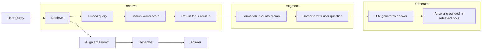
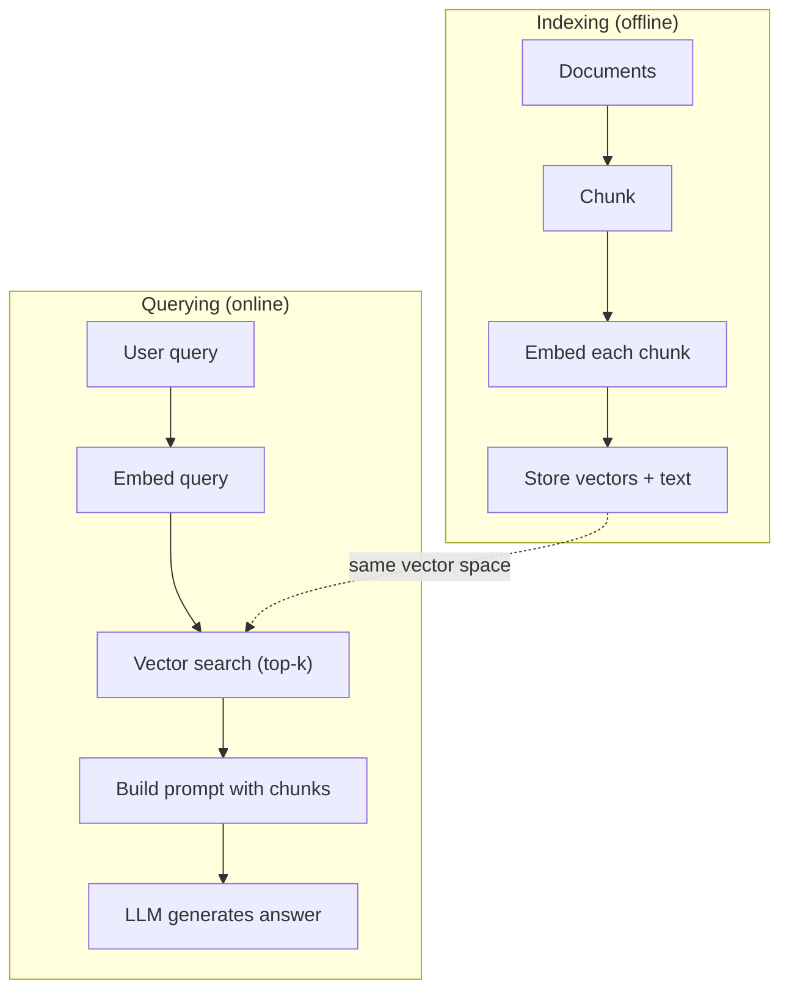

# RAG (Retrieval-Augmented Generation)（检索增强生成）

> 你的 LLM 知道截至训练截止日期的所有内容，但它对你的公司文档、代码库或上周的会议记录一无所知。RAG 通过检索相关文档并将其塞入提示词来解决此问题。这是生产 AI 中部署最广泛的模式。如果你从这门课程中只构建一样东西，那就构建一个 RAG 流水线。

**Type:** Build
**Languages:** Python
**Prerequisites:** Phase 10 (LLMs from Scratch), Phase 11 Lessons 01-05
**Time:** ~90 minutes
**Related:** Phase 5 · 23 (Chunking Strategies for RAG) for the six chunking algorithms and when each wins. Phase 5 · 22 (Embedding Models Deep Dive) for picking the embedder. Phase 11 · 07 (Advanced RAG) for hybrid search, reranking, and query transformation.

## Learning Objectives

- Build a complete RAG pipeline: document loading, chunking, embedding, vector storage, retrieval, and generation
- Implement semantic search using a vector database (ChromaDB, FAISS, or Pinecone) with proper indexing
- Explain why RAG is preferred over fine-tuning for knowledge-grounded applications (cost, freshness, attribution)
- Evaluate RAG quality using retrieval metrics (precision, recall) and generation metrics (faithfulness, relevance)

## The Problem

你为你的公司构建了一个聊天机器人。一位客户问 "What's the refund policy for enterprise plans?" LLM 给出了一个关于典型 SaaS 退款政策的泛泛回答。而实际政策，埋在一份 200 页的内部 wiki 中，规定企业客户享有 60 天的窗口期和按比例退款。LLM 从未见过这份文档，它不可能知道未经训练的内容。

微调（Fine-tuning）是一种解决方案。取 LLM，用你的内部文档训练它，然后部署更新后的模型。这可行，但有严重问题。微调需要数千美元的计算成本。一旦文档变更，模型就过时了。你无法知道模型从哪个来源获取信息。如果下个月公司收购了另一个产品线，你必须再次微调。

RAG 是另一种解决方案。保持模型不变。当有问题时，在你的文档库中搜索相关段落，将它们粘贴在问题之前的提示词中，然后让模型使用这些段落作为上下文来回答。文档库可以在几分钟内更新。你可以确切地看到检索了哪些文档。模型本身从不改变。这就是为什么 RAG 是生产中的主导模式：它更便宜、更新鲜、更可审计，并且适用于任何 LLM。

## The Concept

### The RAG Pattern

整个模式只需四个步骤：



查询 -> 检索 -> 增强提示词 -> 生成。每个 RAG 系统都遵循此模式。生产级 RAG 系统之间的区别在于每个步骤的细节：如何分块、如何嵌入、如何搜索以及如何构建提示词。

### Why RAG Beats Fine-Tuning

| Concern | Fine-tuning | RAG |
|---------|------------|-----|
| Cost | $1,000-$100,000+ per training run | $0.01-$0.10 per query (embedding + LLM) |
| Freshness | Stale until retrained | Updated in minutes by re-indexing docs |
| Auditability | Cannot trace answer to source | Can show exact retrieved passages |
| Hallucination | Still hallucinates freely | Grounded in retrieved documents |
| Data privacy | Training data baked into weights | Documents stay in your vector store |

微调永久更改模型的权重，RAG 临时更改模型的上下文。对于大多数应用，你需要的正是临时上下文。

微调胜出的唯一情况：当你需要模型采用特定风格、语调或推理模式，而这无法仅通过提示词实现时。对于事实性知识检索，RAG 每次都赢。

### Embedding Models

嵌入模型将文本转换为稠密向量。相似的文本在这个高维空间中产生相近的向量。"How do I reset my password?" 和 "I need to change my password" 产生几乎相同的向量，尽管它们共享的词很少。"The cat sat on the mat" 则产生一个非常不同的向量。

常见嵌入模型（2026 年阵容 — 完整分析见 Phase 5 · 22）：

| Model | Dimensions | Provider | Notes |
|-------|-----------|----------|-------|
| text-embedding-3-small | 1536 (Matryoshka) | OpenAI | Best price/performance for most use cases |
| text-embedding-3-large | 3072 (Matryoshka) | OpenAI | Higher accuracy, truncatable to 256/512/1024 |
| Gemini Embedding 2 | 3072 (Matryoshka) | Google | Top MTEB retrieval; 8K context |
| voyage-4 | 1024/2048 (Matryoshka) | Voyage AI | Domain variants (code, finance, law) |
| Cohere embed-v4 | 1024 (Matryoshka) | Cohere | Strong multilingual, 128K context |
| BGE-M3 | 1024 (dense + sparse + ColBERT) | BAAI (open-weight) | Three views from one model |
| Qwen3-Embedding | 4096 (Matryoshka) | Alibaba (open-weight) | Top open-weight retrieval score |
| all-MiniLM-L6-v2 | 384 | Open-weight (Sentence Transformers) | Prototyping baseline |

本课我们使用 TF-IDF 构建自己的简单嵌入。不是因为 TF-IDF 是生产系统使用的，而是因为它让概念变得具体：文本进去，向量出来，相似文本产生相似向量。

### Vector Similarity

给定两个向量，你如何衡量相似性？三种选择：

**余弦相似度（Cosine similarity）**：两个向量之间角度的余弦值。范围从 -1（相反）到 1（相同）。忽略大小，只关心方向。这是 RAG 的默认选择。

```
cosine_sim(a, b) = dot(a, b) / (||a|| * ||b||)
```

**点积（Dot product）**：原始内积。更大的向量获得更高的分数。当大小携带信息时有用（更长的文档可能更相关）。

```
dot(a, b) = sum(a_i * b_i)
```

**L2（欧氏）距离（L2 (Euclidean) distance）**：向量空间中的直线距离。距离越小 = 越相似。对大小差异敏感。

```
L2(a, b) = sqrt(sum((a_i - b_i)^2))
```

余弦相似度是标准。它通过归一化处理优雅地处理不同长度的文档。当有人说"向量搜索"时，几乎总是指余弦相似度。

### Chunking Strategies

文档太长，无法作为单个向量嵌入。一份 50 页的 PDF 可能产生糟糕的嵌入，因为它包含几十个主题。相反，你将文档拆分成块并分别嵌入每个块。

**固定大小分块（Fixed-size chunking）**：每 N 个 token 拆分。简单且可预测。一个 512-token 块带 50-token 重叠意味着块 1 是 token 0-511，块 2 是 token 462-973，以此类推。重叠确保你不会在不巧的边界处切分句子。

**语义分块（Semantic chunking）**：在自然边界处分块。段落、节或 markdown 标题。每个块是一个连贯的意义单元。实现更复杂，但产生更好的检索。

**递归分块（Recursive chunking）**：首先尝试在最大边界处拆分（节标题）。如果一节仍然太大，在段落边界处拆分。如果一段仍然太大，在句子边界处拆分。这就是 LangChain RecursiveCharacterTextSplitter 的方法，在实践中效果很好。

块大小比人们想的更重要：

- 太小（64-128 token）：每个块缺乏上下文。"It increased 15% last quarter" 不知道 "it" 指代什么是没有意义的。
- 太大（2048+ token）：每个块涵盖多个主题，稀释了相关性。当你搜索收入数据时，你得到一个 10% 关于收入、90% 关于员工人数的块。
- 最佳点（256-512 token）：足够的上下文使其自包含，足够聚焦使其相关。

大多数生产 RAG 系统使用 256-512 token 块带 50-token 重叠。Anthropic 的 RAG 指南推荐此范围。

### Vector Databases

一旦你有了嵌入，你需要一个地方来存储和搜索它们。选项：

| Database | Type | Best for |
|----------|------|----------|
| FAISS | Library (in-process) | Prototyping, small to medium datasets |
| Chroma | Lightweight DB | Local development, small deployments |
| Pinecone | Managed service | Production without ops overhead |
| Weaviate | Open source DB | Self-hosted production |
| pgvector | Postgres extension | Already using Postgres |
| Qdrant | Open source DB | High-performance self-hosted |

本课我们构建一个简单的内存向量库。它将向量存储在列表中，并进行暴力余弦相似度搜索。这相当于使用平索引（flat index）的 FAISS。它大约可扩展到 100,000 个向量之后变慢。生产系统使用 HNSW 等近似最近邻（ANN）算法在毫秒内搜索数百万向量。

### The Full Pipeline



索引阶段每个文档运行一次（或文档更新时）。查询阶段每次用户请求时运行。在生产中，索引可能在数小时内处理数百万文档，而查询必须在不到一秒内响应。

### Real Numbers

大多数生产 RAG 系统使用这些参数：

- **k = 5 到 10** 个每次查询检索的块
- **块大小 = 256 到 512 token**，带 50-token 重叠
- **上下文预算**：每次查询 2,500-5,000 token 的检索内容
- **总提示词**：约 8,000-16,000 token（系统提示词 + 检索到的块 + 对话历史 + 用户查询）
- **嵌入维度**：384-3072，取决于模型
- **索引吞吐量**：使用 API 嵌入每秒 100-1,000 份文档
- **查询延迟**：检索 50-200ms，生成 500-3000ms

```figure
rag-chunking
```

## Build It

### Step 1: Document Chunking

```python
def chunk_text(text, chunk_size=200, overlap=50):
    words = text.split()
    chunks = []
    start = 0
    while start < len(words):
        end = start + chunk_size
        chunk = " ".join(words[start:end])
        chunks.append(chunk)
        start += chunk_size - overlap
    return chunks
```

### Step 2: TF-IDF Embeddings

我们构建一个简单的嵌入函数。TF-IDF（词频-逆文档频率）不是神经嵌入，但它以捕获词重要性的方式将文本转换为向量。文档中的高频词获得更高的 TF。整个语料库中的罕见词获得更高的 IDF。乘积给出一个向量，其中重要、有区分度的词具有高值。

```python
import math
from collections import Counter

def build_vocabulary(documents):
    vocab = set()
    for doc in documents:
        vocab.update(doc.lower().split())
    return sorted(vocab)

def compute_tf(text, vocab):
    words = text.lower().split()
    count = Counter(words)
    total = len(words)
    return [count.get(word, 0) / total for word in vocab]

def compute_idf(documents, vocab):
    n = len(documents)
    idf = []
    for word in vocab:
        doc_count = sum(1 for doc in documents if word in doc.lower().split())
        idf.append(math.log((n + 1) / (doc_count + 1)) + 1)
    return idf

def tfidf_embed(text, vocab, idf):
    tf = compute_tf(text, vocab)
    return [t * i for t, i in zip(tf, idf)]
```

### Step 3: Cosine Similarity Search

```python
def cosine_similarity(a, b):
    dot = sum(x * y for x, y in zip(a, b))
    norm_a = math.sqrt(sum(x * x for x in a))
    norm_b = math.sqrt(sum(x * x for x in b))
    if norm_a == 0 or norm_b == 0:
        return 0.0
    return dot / (norm_a * norm_b)

def search(query_embedding, stored_embeddings, top_k=5):
    scores = []
    for i, emb in enumerate(stored_embeddings):
        sim = cosine_similarity(query_embedding, emb)
        scores.append((i, sim))
    scores.sort(key=lambda x: x[1], reverse=True)
    return scores[:top_k]
```

### Step 4: Prompt Construction

这就是 RAG 中"augmented"发生的地方。取检索到的块，将其格式化到提示词中，并要求 LLM 基于提供的上下文回答。

```python
def build_rag_prompt(query, retrieved_chunks):
    context = "\n\n---\n\n".join(
        f"[Source {i+1}]\n{chunk}"
        for i, chunk in enumerate(retrieved_chunks)
    )
    return f"""Answer the question based ONLY on the following context.
If the context doesn't contain enough information, say "I don't have enough information to answer that."

Context:
{context}

Question: {query}

Answer:"""
```

### Step 5: The Complete RAG Pipeline

```python
class RAGPipeline:
    def __init__(self):
        self.chunks = []
        self.embeddings = []
        self.vocab = []
        self.idf = []

    def index(self, documents):
        all_chunks = []
        for doc in documents:
            all_chunks.extend(chunk_text(doc))
        self.chunks = all_chunks
        self.vocab = build_vocabulary(all_chunks)
        self.idf = compute_idf(all_chunks, self.vocab)
        self.embeddings = [
            tfidf_embed(chunk, self.vocab, self.idf)
            for chunk in all_chunks
        ]

    def query(self, question, top_k=5):
        query_emb = tfidf_embed(question, self.vocab, self.idf)
        results = search(query_emb, self.embeddings, top_k)
        retrieved = [(self.chunks[i], score) for i, score in results]
        prompt = build_rag_prompt(
            question, [chunk for chunk, _ in retrieved]
        )
        return prompt, retrieved
```

### Step 6: Generation (simulated)

在生产中，这是你调用 LLM API 的地方。对于本课，我们模拟生成，从检索到的上下文中提取最相关的句子。

```python
def simple_generate(prompt, retrieved_chunks):
    query_words = set(prompt.lower().split("question:")[-1].split())
    best_sentence = ""
    best_score = 0
    for chunk in retrieved_chunks:
        for sentence in chunk.split("."):
            sentence = sentence.strip()
            if not sentence:
                continue
            words = set(sentence.lower().split())
            overlap = len(query_words & words)
            if overlap > best_score:
                best_score = overlap
                best_sentence = sentence
    return best_sentence if best_sentence else "I don't have enough information."
```

## Use It

使用真实的嵌入模型和 LLM 时，代码几乎不变：

```python
from openai import OpenAI

client = OpenAI()

def embed(text):
    response = client.embeddings.create(
        model="text-embedding-3-small",
        input=text
    )
    return response.data[0].embedding

def generate(prompt):
    response = client.chat.completions.create(
        model="gpt-4o-mini",
        messages=[{"role": "user", "content": prompt}],
        temperature=0
    )
    return response.choices[0].message.content
```

或使用 Anthropic：

```python
import anthropic

client = anthropic.Anthropic()

def generate(prompt):
    response = client.messages.create(
        model="claude-sonnet-4-20250514",
        max_tokens=1024,
        messages=[{"role": "user", "content": prompt}]
    )
    return response.content[0].text
```

流水线是相同的。更换嵌入函数，更换生成函数。检索逻辑、分块、提示词构建——无论使用哪个模型，都一样。

对于大规模的向量存储，用适当的向量数据库替换暴力搜索：

```python
import chromadb

client = chromadb.Client()
collection = client.create_collection("my_docs")

collection.add(
    documents=chunks,
    ids=[f"chunk_{i}" for i in range(len(chunks))]
)

results = collection.query(
    query_texts=["What is the refund policy?"],
    n_results=5
)
```

Chroma 在内部处理嵌入（默认使用 all-MiniLM-L6-v2）并将向量存储在本地数据库中。同样的模式，不同的管道。

## Ship It

本课生成：
- `outputs/prompt-rag-architect.md` —— 为特定用例设计 RAG 系统的提示词
- `outputs/skill-rag-pipeline.md` —— 教智能体如何构建和调试 RAG 流水线的技能

## Exercises

1. 用简单的词袋方法替换 TF-IDF 嵌入（二值：如果词存在则为 1，不存在则为 0）。比较示例文档上的检索质量。TF-IDF 应该胜出，因为它为罕见词分配更高权重。

2. 试验块大小：在同一文档集上尝试 50、100、200 和 500 词。对每种大小运行相同的 5 个查询，计算返回 top-3 中有相关块的次数。找到检索质量达到峰值的最佳点。

3. 为每个块添加元数据（源文档名称、块位置）。修改提示词模板以包含来源归属，使 LLM 能够引用其来源。

4. 实现一个简单评估：给定 10 个问答对，对每个问题通过 RAG 流水线运行，测量检索到的块中包含答案的百分比。这是 k 处的检索召回率。

5. 构建一个对话感知的 RAG 流水线：维护最近 3 次交换的历史，并将其与检索到的块一起包含在提示词中。在询问定价之后，使用诸如 "What about enterprise?" 的后续问题进行测试。

## Key Terms

| Term | What people say | What it actually means |
|------|----------------|----------------------|
| RAG | "AI that reads your docs" | Retrieve relevant documents, paste them into the prompt, and generate an answer grounded in those documents |
| Embedding | "Convert text to numbers" | A dense vector representation of text where similar meanings produce similar vectors |
| Vector database | "Search engine for AI" | A data store optimized for storing vectors and finding the nearest neighbors by similarity |
| Chunking | "Split docs into pieces" | Breaking documents into smaller segments (typically 256-512 tokens) so each can be embedded and retrieved independently |
| Cosine similarity | "How similar are two vectors" | The cosine of the angle between two vectors; 1 = identical direction, 0 = orthogonal, -1 = opposite |
| Top-k retrieval | "Get the k best matches" | Return the k most similar chunks to the query from the vector store |
| Context window | "How much text the LLM can see" | The maximum number of tokens the LLM can process in a single request; retrieved chunks must fit within this |
| Augmented generation | "Answer using given context" | Generating a response using retrieved documents as context rather than relying solely on trained knowledge |
| TF-IDF | "Word importance scoring" | Term Frequency times Inverse Document Frequency; weights words by how distinctive they are within a corpus |
| Indexing | "Preparing docs for search" | The offline process of chunking, embedding, and storing documents so they can be searched at query time |

## Further Reading

- Lewis et al., "Retrieval-Augmented Generation for Knowledge-Intensive NLP Tasks" (2020) -- the original RAG paper from Facebook AI Research that formalized the retrieve-then-generate pattern
- Anthropic's RAG documentation (docs.anthropic.com) -- practical guidelines for chunk sizes, prompt construction, and evaluation
- Pinecone Learning Center, "What is RAG?" -- clear visual explanations of the RAG pipeline with production considerations
- Sentence-BERT: Reimers & Gurevych (2019) -- the paper behind the all-MiniLM embedding models, showing how to train bi-encoders for semantic similarity
- [Karpukhin et al., "Dense Passage Retrieval for Open-Domain Question Answering" (EMNLP 2020)](https://arxiv.org/abs/2004.04906) -- the DPR paper that proved dense bi-encoder retrieval beats BM25 on open-domain QA and set the pattern for modern RAG retrievers.
- [LlamaIndex High-Level Concepts](https://docs.llamaindex.ai/en/stable/getting_started/concepts.html) -- the main concepts to know when building RAG pipelines: data loaders, node parsers, indices, retrievers, response synthesizers.
- [LangChain RAG tutorial](https://python.langchain.com/docs/tutorials/rag/) -- the opposite-flavor orchestrator; chain-of-runnables view of the same retrieve-then-generate pattern.
