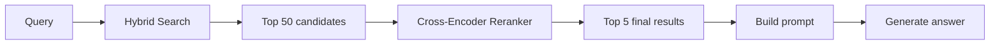
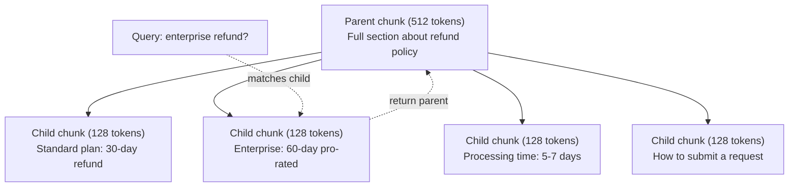
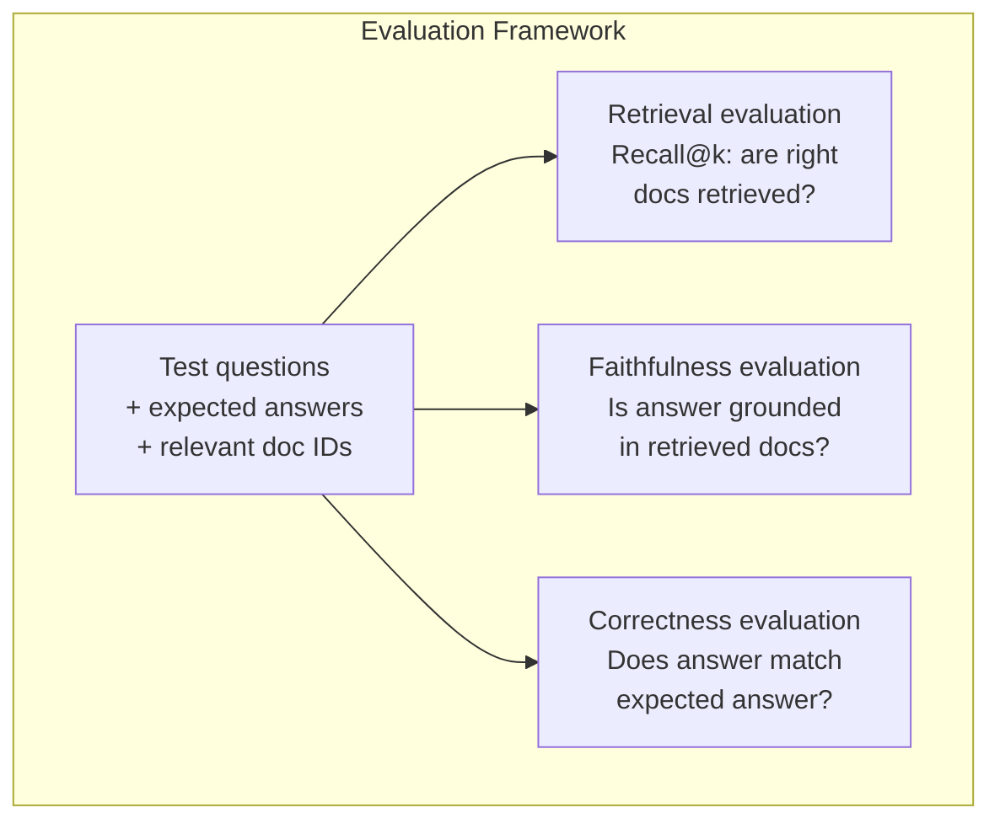

# Advanced RAG (Chunking, Reranking, Hybrid Search)（高级 RAG：分块、重排序、混合搜索）

> 基础 RAG 检索 top-k 个最相似的块。这对简单问题有效，但在多跳推理、模糊查询和大型语料库上会崩溃。高级 RAG 是区别在于：在 10 份文档上有效的演示，与在 1000 万份文档上有效的系统之间的差距。

**Type:** Build
**Languages:** Python
**Prerequisites:** Phase 11, Lesson 06 (RAG)
**Time:** ~90 minutes
**Related:** Phase 5 · 23 (Chunking Strategies for RAG) covers all six chunking algorithms — recursive, semantic, sentence, parent-document, late chunking, contextual retrieval — with Vectara/Anthropic benchmarks. This lesson builds on top: hybrid search, reranking, query transformation.

## Learning Objectives

- Implement advanced chunking strategies (semantic, recursive, parent-child) that preserve document structure and context
- Build a hybrid search pipeline combining BM25 keyword matching with semantic vector search and a cross-encoder reranker
- Apply query transformation techniques (HyDE, multi-query, step-back) to improve retrieval on ambiguous or complex questions
- Diagnose and fix common RAG failures: wrong chunk retrieved, answer not in context, multi-hop reasoning breakdown

## The Problem

你在第 06 课中构建了一个基础 RAG 流水线。它在小语料库的直接问题上运行良好。现在试试这些：

**模糊查询**："What was revenue last quarter?" 语义搜索返回关于收入策略、收入预测和 CFO 对收入增长看法的块。所有这些在语义上都与词 "revenue" 相似，但没有任何一个包含实际数字。正确的块说 "$47.2M in Q3 2025" 但使用了词 "earnings" 而非 "revenue"。嵌入模型认为 "revenue strategy" 比 "Q3 earnings were $47.2M" 更接近查询。

**多跳问题**："Which team had the highest customer satisfaction score improvement?" 这需要找到每个团队的满意度分数，比较它们，并找出最大值。没有任何一个块包含答案。信息分散在各个团队报告中。

**大型语料库问题**：你有 200 万个块。正确答案在块 #1,847,293。你的 top-5 检索拉回了 #14、#89,201、#1,200,000、#44 和 #901,333。在嵌入空间中接近，但没有一个包含答案。在这个规模上，近似最近邻搜索引入了足够的误差，使得相关结果被挤出 top-k。

基础 RAG 失败是因为向量相似度不等于相关性。一个块可以在语义上与查询相似，但对回答问题没有用。高级 RAG 用四种技术解决此问题：混合搜索（添加关键词匹配）、重排序（更仔细地评分候选）、查询转换（在搜索前修正查询）和更好的分块（以正确的粒度检索）。

## The Concept

### Hybrid Search: Semantic + Keyword

语义搜索（向量相似度）擅长理解含义。"How do I cancel my subscription?" 匹配 "Steps to terminate your plan"，尽管它们不共享任何词。但它会漏掉精确匹配。"Error code E-4021" 可能不匹配包含 "E-4021" 的块，如果嵌入模型将其视为噪声。

关键词搜索（BM25）恰恰相反。它在精确匹配上表现出色。"E-4021" 完美匹配。但 "cancel my subscription" 返回零结果，如果文档说 "terminate your plan"。

混合搜索同时运行两者，然后合并结果。

**BM25**（Best Matching 25）是标准的关键词搜索算法。自上世纪 90 年代以来一直是搜索引擎的支柱。公式：

```
BM25(q, d) = sum over terms t in q:
    IDF(t) * (tf(t,d) * (k1 + 1)) / (tf(t,d) + k1 * (1 - b + b * |d| / avgdl))
```

其中 tf(t,d) 是文档 d 中词 t 的词频，IDF(t) 是逆文档频率，|d| 是文档长度，avgdl 是平均文档长度，k1 控制词频饱和（默认 1.2），b 控制长度归一化（默认 0.75）。

简而言之：当文档包含查询词（尤其是罕见词）时，BM25 给文档打分更高，但对重复词有递减回报。一个出现 "revenue" 50 次的文档，其相关度不是出现 1 次的 50 倍。

### Reciprocal Rank Fusion (RRF)

你有两个排序列表：一个来自向量搜索，一个来自 BM25。如何合并它们？倒数排名融合（Reciprocal Rank Fusion，RRF）是标准方法。

```
RRF_score(d) = sum over rankings R:
    1 / (k + rank_R(d))
```

其中 k 是一个常数（通常为 60），防止排名第一的结果主导。

一个在向量搜索中排名 #1、在 BM25 中排名 #5 的文档获得：1/(60+1) + 1/(60+5) = 0.0164 + 0.0154 = 0.0318

一个在向量搜索中排名 #3、在 BM25 中排名 #2 的文档获得：1/(60+3) + 1/(60+2) = 0.0159 + 0.0161 = 0.0320

RRF 自然地平衡了两种信号。在两个列表中排名都高的文档获得最高分。在一个列表中排名 #1 但在另一个列表中没有出现的文档获得中等分数。这很稳健，因为它使用排名而非原始分数，因此两个系统之间分数分布的差异无关紧要。

### Reranking

检索（无论是向量、关键词还是混合）是快速但不精确的。它使用双编码器（bi-encoder）：查询和每个文档独立嵌入，然后比较。嵌入是一次计算后缓存的，这可以扩展到数百万文档。

重排序使用交叉编码器（cross-encoder）：查询和候选文档一起输入到一个模型中，模型输出相关性分数。模型同时看到两个文本，可以捕获它们之间的细粒度交互。交叉编码器可以理解 "What were Q3 earnings?" 与包含 "$47.2M in Q3" 的块高度相关，即使双编码器错过了这种联系。

权衡：交叉编码器比双编码器慢 100-1000 倍，因为它们联合处理查询-文档对。你无法为一百万个文档预计算交叉编码器分数。解决方案：检索一个更大的候选集（混合搜索的 top-50），然后用交叉编码器重排序以获得最终的 top-5。



常见重排序模型（2026 年阵容）：
- Cohere Rerank 3.5：托管 API，多语言，在混合语料库上召回增益最大
- Voyage rerank-2.5：托管 API，托管选项中延迟最低
- Jina-Reranker-v2 Multilingual：开源权重，100+ 语言
- bge-reranker-v2-m3：开源权重，强劲基线
- cross-encoder/ms-marco-MiniLM-L-6-v2：开源权重，可在 CPU 上运行用于原型开发
- ColBERTv2 / Jina-ColBERT-v2：延迟交互多向量重排序器——评分时复杂度为 O(tokens) 而非 O(docs)

### Query Transformation

有时问题不在于检索，而在于查询本身。"What was that thing about the new policy change?" 是一个糟糕的搜索查询。它不包含具体术语，嵌入是模糊的。没有任何检索系统能从这样的查询中找到正确的文档。

**查询重写（Query rewriting）**：将用户的查询重新表述为更好的搜索查询。LLM 可以做到这一点：

```
User: "What was that thing about the new policy change?"
Rewritten: "Recent policy changes and updates"
```

**HyDE（Hypothetical Document Embeddings，假设文档嵌入）**：不是用查询搜索，而是生成一个假设答案，嵌入它，然后搜索相似的真实文档。

```
Query: "What is the refund policy for enterprise?"
Hypothetical answer: "Enterprise customers are eligible for a full refund
within 60 days of purchase. Refunds are pro-rated based on the remaining
subscription period and processed within 5-7 business days."
```

嵌入假设答案并搜索与之相似的真实文档。直觉：假设答案在嵌入空间中比原始问题更接近真实答案。问题和答案具有不同的语言结构。通过生成假设答案，你在嵌入中弥合了"问题空间"和"答案空间"之间的差距。

HyDE 在检索前增加一次 LLM 调用，延迟增加 500-2000ms。当原始查询的检索质量差时值得使用。

### Parent-Child Chunking

标准分块强制进行权衡：小块用于精确检索，大块用于充足上下文。父-子分块消除了这种权衡。

为检索索引小块（128 token）。当检索到一个小块时，返回其父块（512 token）用于提示词。小块精确匹配查询，父块为 LLM 提供足够的上下文来生成好的答案。



查询 "enterprise refund?" 精确匹配子块 C2。但提示词收到完整的父块 P，其中包含关于处理时间和提交过程的周围上下文。

### Metadata Filtering

在运行向量搜索之前，按元数据过滤语料库：日期、来源、类别、作者、语言。这减少了搜索空间并防止不相关的结果。

"What changed in the security policy last month?" 应该只搜索过去 30 天内安全类别的文档。没有元数据过滤，你搜索整个语料库，可能会检索到一份 2 年前的安全文档，它恰好语义相似。

生产 RAG 系统在每个块旁边存储元数据：源文档、创建日期、类别、作者、版本。向量数据库支持在相似性搜索之前按元数据预过滤，这对于大规模性能至关重要。

### Evaluation

你构建了一个 RAG 系统。如何知道它是否有效？三个指标：

**检索相关性（Recall@k）**：对于一组已知相关文档的测试问题，相关文档出现在 top-k 结果中的百分比是多少？如果问题的答案在块 #47，块 #47 是否出现在 top-5？

**忠实度（Faithfulness）**：生成的答案是否以检索到的文档为基础？如果检索到的块说 "60-day refund window"，而模型说 "90-day refund window"，那就是忠实度失败。模型虽然有正确的上下文，但还是产生了幻觉。

**答案正确性（Answer correctness）**：生成的答案是否与期望答案匹配？这是端到端指标，结合了检索质量和生成质量。

一个简单的忠实度检查：取生成答案中的每个声明，验证它是否（实质上）出现在检索到的块中。如果答案包含不在任何检索到的块中的事实，很可能是幻觉。



## Build It

### Step 1: BM25 Implementation

```python
import math
from collections import Counter

class BM25:
    def __init__(self, k1=1.2, b=0.75):
        self.k1 = k1
        self.b = b
        self.docs = []
        self.doc_lengths = []
        self.avg_dl = 0
        self.doc_freqs = {}
        self.n_docs = 0

    def index(self, documents):
        self.docs = documents
        self.n_docs = len(documents)
        self.doc_lengths = []
        self.doc_freqs = {}

        for doc in documents:
            words = doc.lower().split()
            self.doc_lengths.append(len(words))
            unique_words = set(words)
            for word in unique_words:
                self.doc_freqs[word] = self.doc_freqs.get(word, 0) + 1

        self.avg_dl = sum(self.doc_lengths) / self.n_docs if self.n_docs else 1

    def score(self, query, doc_idx):
        query_words = query.lower().split()
        doc_words = self.docs[doc_idx].lower().split()
        doc_len = self.doc_lengths[doc_idx]
        word_counts = Counter(doc_words)
        score = 0.0

        for term in query_words:
            if term not in word_counts:
                continue
            tf = word_counts[term]
            df = self.doc_freqs.get(term, 0)
            idf = math.log((self.n_docs - df + 0.5) / (df + 0.5) + 1)
            numerator = tf * (self.k1 + 1)
            denominator = tf + self.k1 * (1 - self.b + self.b * doc_len / self.avg_dl)
            score += idf * numerator / denominator

        return score

    def search(self, query, top_k=10):
        scores = [(i, self.score(query, i)) for i in range(self.n_docs)]
        scores.sort(key=lambda x: x[1], reverse=True)
        return scores[:top_k]
```

### Step 2: Reciprocal Rank Fusion

```python
def reciprocal_rank_fusion(ranked_lists, k=60):
    scores = {}
    for ranked_list in ranked_lists:
        for rank, (doc_id, _) in enumerate(ranked_list):
            if doc_id not in scores:
                scores[doc_id] = 0.0
            scores[doc_id] += 1.0 / (k + rank + 1)
    fused = sorted(scores.items(), key=lambda x: x[1], reverse=True)
    return fused
```

### Step 3: Hybrid Search Pipeline

```python
def hybrid_search(query, chunks, vector_embeddings, vocab, idf, bm25_index, top_k=5, fusion_k=60):
    query_emb = tfidf_embed(query, vocab, idf)
    vector_results = search(query_emb, vector_embeddings, top_k=top_k * 3)
    bm25_results = bm25_index.search(query, top_k=top_k * 3)
    fused = reciprocal_rank_fusion([vector_results, bm25_results], k=fusion_k)
    return fused[:top_k]
```

### Step 4: Simple Reranker

在生产中，你会使用交叉编码器模型。这里我们构建一个使用词重叠、词重要性和短语匹配来评分查询-文档相关性的重排序器。

```python
def rerank(query, candidates, chunks):
    query_words = set(query.lower().split())
    stop_words = {"the", "a", "an", "is", "are", "was", "were", "what", "how",
                  "why", "when", "where", "do", "does", "for", "of", "in", "to",
                  "and", "or", "on", "at", "by", "it", "its", "this", "that",
                  "with", "from", "be", "has", "have", "had", "not", "but"}
    query_terms = query_words - stop_words

    scored = []
    for doc_id, initial_score in candidates:
        chunk = chunks[doc_id].lower()
        chunk_words = set(chunk.split())

        term_overlap = len(query_terms & chunk_words)

        query_bigrams = set()
        q_list = [w for w in query.lower().split() if w not in stop_words]
        for i in range(len(q_list) - 1):
            query_bigrams.add(q_list[i] + " " + q_list[i + 1])
        bigram_matches = sum(1 for bg in query_bigrams if bg in chunk)

        position_boost = 0
        for term in query_terms:
            pos = chunk.find(term)
            if pos != -1 and pos < len(chunk) // 3:
                position_boost += 0.5

        rerank_score = (
            term_overlap * 1.0
            + bigram_matches * 2.0
            + position_boost
            + initial_score * 5.0
        )
        scored.append((doc_id, rerank_score))

    scored.sort(key=lambda x: x[1], reverse=True)
    return scored
```

### Step 5: HyDE (Hypothetical Document Embeddings)

```python
def hyde_generate_hypothesis(query):
    templates = {
        "what": "The answer to '{query}' is as follows: Based on our documentation, {topic} involves specific policies and procedures that define how the process works.",
        "how": "To address '{query}': The process involves several steps. First, you need to initiate the request. Then, the system processes it according to the defined rules.",
        "default": "Regarding '{query}': Our records indicate specific details and policies related to this topic that provide a comprehensive answer."
    }
    query_lower = query.lower()
    if query_lower.startswith("what"):
        template = templates["what"]
    elif query_lower.startswith("how"):
        template = templates["how"]
    else:
        template = templates["default"]

    topic_words = [w for w in query.lower().split()
                   if w not in {"what", "is", "the", "how", "do", "does", "a", "an",
                                "for", "of", "to", "in", "on", "at", "by", "and", "or"}]
    topic = " ".join(topic_words) if topic_words else "this topic"

    return template.format(query=query, topic=topic)


def hyde_search(query, chunks, vector_embeddings, vocab, idf, top_k=5):
    hypothesis = hyde_generate_hypothesis(query)
    hypothesis_emb = tfidf_embed(hypothesis, vocab, idf)
    results = search(hypothesis_emb, vector_embeddings, top_k)
    return results, hypothesis
```

### Step 6: Parent-Child Chunking

```python
def create_parent_child_chunks(text, parent_size=200, child_size=50):
    words = text.split()
    parents = []
    children = []
    child_to_parent = {}

    parent_idx = 0
    start = 0
    while start < len(words):
        parent_end = min(start + parent_size, len(words))
        parent_text = " ".join(words[start:parent_end])
        parents.append(parent_text)

        child_start = start
        while child_start < parent_end:
            child_end = min(child_start + child_size, parent_end)
            child_text = " ".join(words[child_start:child_end])
            child_idx = len(children)
            children.append(child_text)
            child_to_parent[child_idx] = parent_idx
            child_start += child_size

        parent_idx += 1
        start += parent_size

    return parents, children, child_to_parent
```

### Step 7: Faithfulness Evaluation

```python
def evaluate_faithfulness(answer, retrieved_chunks):
    answer_sentences = [s.strip() for s in answer.split(".") if len(s.strip()) > 10]
    if not answer_sentences:
        return 1.0, []

    grounded = 0
    ungrounded = []
    context = " ".join(retrieved_chunks).lower()

    for sentence in answer_sentences:
        words = set(sentence.lower().split())
        stop_words = {"the", "a", "an", "is", "are", "was", "were", "and", "or",
                      "to", "of", "in", "for", "on", "at", "by", "it", "this", "that"}
        content_words = words - stop_words
        if not content_words:
            grounded += 1
            continue

        matched = sum(1 for w in content_words if w in context)
        ratio = matched / len(content_words) if content_words else 0

        if ratio >= 0.5:
            grounded += 1
        else:
            ungrounded.append(sentence)

    score = grounded / len(answer_sentences) if answer_sentences else 1.0
    return score, ungrounded


def evaluate_retrieval_recall(queries_with_relevant, retrieval_fn, k=5):
    total_recall = 0.0
    results = []

    for query, relevant_indices in queries_with_relevant:
        retrieved = retrieval_fn(query, k)
        retrieved_indices = set(idx for idx, _ in retrieved)
        relevant_set = set(relevant_indices)
        hits = len(retrieved_indices & relevant_set)
        recall = hits / len(relevant_set) if relevant_set else 1.0
        total_recall += recall
        results.append({
            "query": query,
            "recall": recall,
            "hits": hits,
            "total_relevant": len(relevant_set)
        })

    avg_recall = total_recall / len(queries_with_relevant) if queries_with_relevant else 0
    return avg_recall, results
```

## Use It

使用真实的交叉编码器进行重排序：

```python
from sentence_transformers import CrossEncoder

reranker = CrossEncoder("cross-encoder/ms-marco-MiniLM-L-6-v2")

def rerank_with_cross_encoder(query, candidates, chunks, top_k=5):
    pairs = [(query, chunks[doc_id]) for doc_id, _ in candidates]
    scores = reranker.predict(pairs)
    scored = list(zip([doc_id for doc_id, _ in candidates], scores))
    scored.sort(key=lambda x: x[1], reverse=True)
    return scored[:top_k]
```

使用 Cohere 的托管重排序器：

```python
import cohere

co = cohere.Client()

def rerank_with_cohere(query, candidates, chunks, top_k=5):
    docs = [chunks[doc_id] for doc_id, _ in candidates]
    response = co.rerank(
        model="rerank-english-v3.0",
        query=query,
        documents=docs,
        top_n=top_k
    )
    return [(candidates[r.index][0], r.relevance_score) for r in response.results]
```

使用真实 LLM 实现 HyDE：

```python
import anthropic

client = anthropic.Anthropic()

def hyde_with_llm(query):
    response = client.messages.create(
        model="claude-sonnet-4-20250514",
        max_tokens=256,
        messages=[{
            "role": "user",
            "content": f"Write a short paragraph that would be a good answer to this question. Do not say you don't know. Just write what the answer would look like.\n\nQuestion: {query}"
        }]
    )
    return response.content[0].text
```

使用 Weaviate 进行生产级混合搜索：

```python
import weaviate

client = weaviate.connect_to_local()

collection = client.collections.get("Documents")
response = collection.query.hybrid(
    query="enterprise refund policy",
    alpha=0.5,
    limit=10
)
```

alpha 参数控制平衡：0.0 = 纯关键词（BM25），1.0 = 纯向量，0.5 = 等权重。大多数生产系统使用 0.3 到 0.7 之间的 alpha。

## Ship It

本课生成：
- `outputs/prompt-advanced-rag-debugger.md` —— 用于诊断和修复 RAG 质量问题的提示词
- `outputs/skill-advanced-rag.md` —— 用于构建带有混合搜索和重排序的生产级 RAG 的技能

## Exercises

1. 在示例文档上比较 BM25 vs 向量搜索 vs 混合搜索。对于 5 个测试查询中的每一个，记录哪种方法在位置 #1 返回最相关的块。混合搜索应在 5 个中至少 3 个上胜出。

2. 实现一个元数据过滤器。为每个文档添加一个 "category" 字段（security、billing、api、product）。在运行向量搜索之前，将块过滤到仅相关类别。用 "What encryption is used?" 进行测试，验证它只搜索 security 类别的块。

3. 使用第 06 课的简单生成函数构建完整的 HyDE 流水线。在所有 5 个测试查询上比较直接查询搜索和 HyDE 搜索的检索质量（top-3 相关性）。HyDE 应该改善模糊查询的结果。

4. 在示例文档上实现父-子分块策略。使用 child_size=30 和 parent_size=100。用子块搜索但在提示词中返回父块。将生成的答案与 chunk_size=50 的标准分块进行比较。

5. 创建一个评估数据集：10 个带有已知答案块的问题。测量 (a) 仅向量搜索、(b) 仅 BM25、(c) 混合搜索、(d) 混合 + 重排序的 Recall@3、Recall@5 和 Recall@10。绘制结果并确定重排序在何处帮助最大。

## Key Terms

| Term | What people say | What it actually means |
|------|----------------|----------------------|
| BM25 | "Keyword search" | A probabilistic ranking algorithm that scores documents by term frequency, inverse document frequency, and document length normalization |
| Hybrid search | "Best of both worlds" | Running semantic (vector) and keyword (BM25) search in parallel, then merging results with rank fusion |
| Reciprocal Rank Fusion | "Merge ranked lists" | Combining multiple ranked lists by summing 1/(k + rank) for each document across all lists |
| Reranking | "Second pass scoring" | Using a more expensive cross-encoder model to re-score a candidate set from initial retrieval |
| Cross-encoder | "Joint query-document model" | A model that takes a query and document as a single input, producing a relevance score; more accurate than bi-encoders but too slow for full corpus search |
| Bi-encoder | "Independent embedding model" | A model that embeds queries and documents independently; fast because embeddings are precomputed, but less accurate than cross-encoders |
| HyDE | "Search with a fake answer" | Generate a hypothetical answer to the query, embed it, and search for real documents similar to it |
| Parent-child chunking | "Small search, big context" | Index small chunks for precise retrieval but return the larger parent chunk to provide sufficient context |
| Metadata filtering | "Narrow before searching" | Filtering documents by attributes (date, source, category) before running vector search to reduce the search space |
| Faithfulness | "Did it stay grounded" | Whether the generated answer is supported by the retrieved documents, as opposed to hallucinated from the model's training data |

## Further Reading

- Robertson & Zaragoza, "The Probabilistic Relevance Framework: BM25 and Beyond" (2009) -- the definitive reference for BM25, explaining the probabilistic foundations behind the formula
- Cormack et al., "Reciprocal Rank Fusion Outperforms Condorcet and Individual Rank Learning Methods" (2009) -- the original RRF paper showing it beats more complex fusion methods
- Gao et al., "Precise Zero-Shot Dense Retrieval without Relevance Labels" (2022) -- the HyDE paper demonstrating that hypothetical document embeddings improve retrieval without any training data
- Nogueira & Cho, "Passage Re-ranking with BERT" (2019) -- showed cross-encoder reranking on top of BM25 significantly improves retrieval quality
- [Khattab et al., "DSPy: Compiling Declarative Language Model Calls into Self-Improving Pipelines" (2023)](https://arxiv.org/abs/2310.03714) -- treats prompt construction and weight selection as an optimization problem over retrieval pipelines; read this for "program LLMs" instead of "prompt LLMs."
- [Edge et al., "From Local to Global: A Graph RAG Approach to Query-Focused Summarization" (Microsoft Research 2024)](https://arxiv.org/abs/2404.16130) -- GraphRAG paper: entity-relation extraction + Leiden community detection for query-focused summarization; the global vs local retrieval distinction.
- [Asai et al., "Self-RAG: Learning to Retrieve, Generate, and Critique through Self-Reflection" (ICLR 2024)](https://arxiv.org/abs/2310.11511) -- self-evaluating RAG with reflection tokens; the agentic frontier past static retrieve-then-generate.
- [LangChain Query Construction blog](https://blog.langchain.dev/query-construction/) -- how to translate natural-language queries into structured database queries (Text-to-SQL, Cypher) as a pre-retrieval step.
