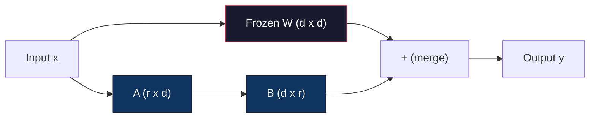
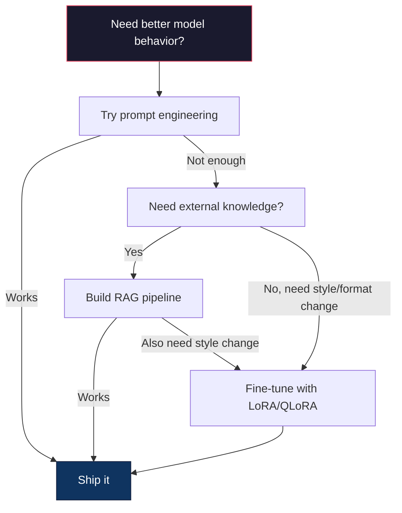

# Fine-Tuning with LoRA & QLoRA（使用 LoRA 和 QLoRA 进行微调）

> 全量微调一个 7B 模型需要 56GB 的显存。你没有，大多数公司也没有。LoRA 让你通过训练不到 1% 的参数，在 6GB 显存中微调同一模型。这不是妥协——在大多数任务上，它的质量与全量微调相匹配。整个开源微调生态系统都运行在这一技巧之上。

**Type:** Build
**Languages:** Python
**Prerequisites:** Phase 10, Lesson 06 (Instruction Tuning / SFT)
**Time:** ~75 minutes
**Related:** Phase 10 covers the SFT/DPO loops from scratch. This lesson plugs those into the 2026 PEFT toolkits (PEFT, TRL, Unsloth, Axolotl, LLaMA-Factory).

## Learning Objectives

- Implement LoRA by injecting low-rank adapter matrices (A and B) into a pretrained model's attention layers
- Calculate the parameter savings of LoRA vs full fine-tuning: rank r with d_model dimensions trains 2*r*d parameters instead of d^2
- Fine-tune a model using QLoRA (4-bit quantized base + LoRA adapters) to fit within consumer GPU memory
- Merge LoRA weights back into the base model for deployment and compare inference speed with and without adapters

## The Problem

你有一个基础模型——Llama 3 8B。你想让它以你公司的语气回答客户支持工单。SFT 是答案，但 SFT 有成本问题。

全量微调更新模型中的每个参数。Llama 3 8B 有 80 亿参数。在 fp16 中，每个参数占用 2 字节，仅加载权重就需要 16GB。在训练期间，你还需要梯度（16GB）、Adam 优化器状态（动量 + 方差共 32GB）和激活值。总计：单个 8B 模型大约需要 56GB 显存。

一块 A100 80GB 勉强能装下。在云提供商上两块 A100 每小时 3-4 美元。对 50,000 个样本训练 3 个 epoch 需要 6-10 小时，即每次实验 30-40 美元。运行 10 次实验来确定正确的超参数，部署前就花掉了 400 美元。

扩展到 Llama 3 70B，数字变得荒谬。仅权重就需要 140GB。你需要一个集群，每次实验超过 100 美元。

还有一个更深层的问题。全量微调修改模型中的每个权重。如果你在客户支持数据上微调，可能会降低模型的通用能力。这就是所谓的灾难性遗忘（catastrophic forgetting）。模型在你的任务上变得更好，但在其他所有方面变差。

你需要一种方法：训练更少的参数、使用更少的内存，并且不破坏模型已有的知识。

## The Concept

### LoRA: Low-Rank Adaptation

Microsoft 的 Edward Hu 及其同事于 2021 年 6 月发表了 LoRA。论文的洞察：微调期间的权重更新具有低内在秩。你不需要更新 4096x4096 权重矩阵中的全部 1670 万参数。更新中的有用信息可以用秩为 16 或 32 的矩阵来捕获。

数学如下。一个标准线性层计算：

```
y = Wx
```

其中 W 是一个 d_out x d_in 矩阵。对于一个 4096x4096 的注意力投影，那是 16,777,216 个参数。

LoRA 冻结 W 并添加一个低秩分解：

```
y = Wx + BAx
```

其中 B 是 (d_out x r)，A 是 (r x d_in)。秩 r 远小于 d——通常是 8、16 或 32。

对于一个 4096x4096 层且 r=16：
- 原始参数：4096 x 4096 = 16,777,216
- LoRA 参数：(4096 x 16) + (16 x 4096) = 65,536 + 65,536 = 131,072
- 减少：131,072 / 16,777,216 = 0.78%

你训练 0.78% 的参数，获得 95-100% 的质量。



A 用随机高斯分布初始化，B 初始化为零。这意味着 LoRA 贡献从零开始——模型从其原始行为开始训练，逐渐学习适应。

### The Scaling Factor: Alpha

LoRA 引入一个缩放因子 alpha，控制低秩更新对输出的影响程度：

```
y = Wx + (alpha / r) * BAx
```

当 alpha = r，缩放为 1x。当 alpha = 2r（常见的默认值），缩放为 2x。这个超参数独立于基础学习率控制 LoRA 路径的学习率。

实用指导：
- alpha = 2 * rank 是常见的社区约定（原始论文在大多数实验中使用 alpha = rank）
- alpha = rank 给出 1x 缩放，保守但稳定
- 较高的 alpha 意味着每步更大的更新，可以加速收敛或导致不稳定

### Where to Apply LoRA

Transformer 有许多线性层。你不需要对所有层都添加 LoRA。原始论文测试了不同组合：

| Target Layers | Trainable Params (7B) | Quality |
|--------------|----------------------|---------|
| q_proj only | 4.7M | Good |
| q_proj + v_proj | 9.4M | Better |
| q_proj + k_proj + v_proj + o_proj | 18.9M | Best for attention |
| All linear (attention + MLP) | 37.7M | Marginal gain, 2x params |

大多数任务的最佳点：q_proj + v_proj。这针对自注意力中的查询投影和值投影，它们控制模型关注什么以及提取什么信息。对于代码生成等复杂任务，添加 MLP 层有帮助，但对于更简单的任务，参数加倍带来的收益递减。

### Rank Selection

秩 r 控制适应的表达能力：

| Rank | Trainable Params (per layer) | Best For |
|------|---------------------------|----------|
| 4 | 32,768 | Simple classification, sentiment |
| 8 | 65,536 | Single-domain Q&A, summarization |
| 16 | 131,072 | Multi-domain tasks, instruction following |
| 32 | 262,144 | Complex reasoning, code generation |
| 64 | 524,288 | Diminishing returns for most tasks |
| 128 | 1,048,576 | Rarely justified |

Hu 等人表明 r=4 已能捕获简单任务的大部分适应。r=8 和 r=16 是实践中最常见的选择。超过 r=64 很少能提高质量，并开始失去 LoRA 的内存优势。

### QLoRA: 4-Bit Quantization + LoRA

华盛顿大学的 Tim Dettmers 及其同事于 2023 年 5 月发表了 QLoRA。思路：将冻结的基础模型量化为 4 位精度，然后在其上附加 fp16 的 LoRA 适配器。

这极大改变了内存方程：

| Method | Weight Memory (7B) | Training Memory (7B) | GPU Required |
|--------|-------------------|---------------------|-------------|
| Full fine-tune (fp16) | 14GB | ~56GB | 1x A100 80GB |
| LoRA (fp16 base) | 14GB | ~18GB | 1x A100 40GB |
| QLoRA (4-bit base) | 3.5GB | ~6GB | 1x RTX 3090 24GB |

QLoRA 做出了三个技术贡献：

**NF4（Normal Float 4-bit）**：一种专门为神经网络权重设计的新数据类型。神经网络权重大致遵循正态分布。NF4 将 16 个量化级别放置在标准正态分布的分位数处。这对于正态分布数据是信息论最优的。它比均匀 4 位量化（INT4）或标准 Float4 丢失更少信息。

**双重量化（Double quantization）**：量化常量本身占用内存。每 64 个权重需要一个 fp32 缩放因子（4 字节）。对于一个 7B 模型，这额外消耗约 0.4GB。双重量化将这些常量量化为 fp8，将开销降至约 0.1GB。小但积少成多。

**分页优化器（Paged optimizers）**：训练期间，优化器状态（Adam 的动量和方差）在长序列上可能超过 GPU 内存。分页优化器使用 NVIDIA 的统一内存在 GPU 内存耗尽时自动将优化器状态换页到 CPU RAM，并在需要时换回。这以一些吞吐量为代价防止了 OOM 崩溃。

### The Quality Question

减少参数或量化基础模型是否损害质量？多篇论文的结果：

| Method | MMLU (5-shot) | MT-Bench | HumanEval |
|--------|--------------|----------|-----------|
| Full fine-tune (Llama 2 7B) | 48.3 | 6.72 | 14.6 |
| LoRA r=16 | 47.9 | 6.68 | 14.0 |
| QLoRA r=16 (NF4) | 47.5 | 6.61 | 13.4 |
| QLoRA r=64 (NF4) | 48.1 | 6.70 | 14.2 |

LoRA 在 r=16 时在大多数基准上都在全量微调的 1% 以内。QLoRA 在 r=16 时再损失不到一个百分点。QLoRA 在 r=64 时基本匹配全量微调，同时使用 90% 更少的内存。

### Real-World Costs

在 50,000 个样本上微调 Llama 3 8B（3 个 epoch）：

| Method | GPU | Time | Cost |
|--------|-----|------|------|
| Full fine-tune | 2x A100 80GB | 8 hours | ~$32 |
| LoRA r=16 | 1x A100 40GB | 4 hours | ~$8 |
| QLoRA r=16 | 1x RTX 4090 24GB | 6 hours | ~$5 |
| QLoRA r=16 (Unsloth) | 1x RTX 4090 24GB | 2.5 hours | ~$2 |
| QLoRA r=16 | 1x T4 16GB | 12 hours | ~$4 |

在单块消费级 GPU 上进行 QLoRA，成本低于一顿午餐。这就是为什么开源模型微调社区在 2023 年爆发，以及为什么在 2026 年，以下每个训练框架都默认提供 QLoRA。

### The 2026 PEFT stack

| Framework | What it is | Pick when |
|-----------|-----------|-----------|
| **Hugging Face PEFT** | The canonical LoRA/QLoRA/DoRA/IA3 library | You want raw control and your training loop is already on `transformers.Trainer` |
| **TRL** | HF's reinforcement-from-feedback trainers (SFT, DPO, GRPO, PPO, ORPO) | You need DPO/GRPO after SFT; built on top of PEFT |
| **Unsloth** | Triton-kernel rewrite of the forward/backward pass | You want 2-5x speedup + half the VRAM with no accuracy loss; Llama/Mistral/Qwen family |
| **Axolotl** | YAML-config wrapper over PEFT + TRL + DeepSpeed + Unsloth | You want reproducible, version-controlled training runs |
| **LLaMA-Factory** | GUI/CLI/API over PEFT + TRL | You want zero-code fine-tuning; 100+ model families supported |
| **torchtune** | Native PyTorch recipes, no `transformers` dep | You want minimal deps and your org already standardizes on PyTorch |

经验法则：研究使用或一次性实验 → PEFT。可重复的生产流水线 → 启用 Unsloth 内核的 Axolotl。快速原型 → LLaMA-Factory。

### Merging Adapters

训练后，你有两个东西：冻结的基础模型和一个小的 LoRA 适配器（通常 10-100MB）。你可以：

1. **保持分离**：加载基础模型，在其上加载适配器。为不同任务切换适配器。这就是你如何从一个基础模型服务多个微调变体的方式。

2. **永久合并**：计算 W' = W + (alpha/r) * BA 并将结果保存为新的完整模型。合并后的模型与原始模型大小相同，没有推理开销，无需管理适配器。

对于服务多个任务（客户支持适配器、代码适配器、翻译适配器），保持分离。对于部署单个专用模型，进行合并。

用于组合多个适配器的高级合并技术：

- **TIES-Merging**（Yadav 等，2023）：修剪小幅值参数，解决符号冲突，然后合并。减少适配器之间的干扰。
- **DARE**（Yu 等，2023）：在合并前随机丢弃适配器参数并重新缩放其余部分。出奇地有效，可以组合多种能力。
- **任务算术**：简单地相加或相减适配器权重。添加一个"代码"适配器和一个"数学"适配器通常产生在这两方面都擅长的一个模型。

### When NOT to Fine-Tune

微调是第三选择，不是第一。

**第一：提示工程。** 写一个更好的系统提示词。添加少样本示例。使用思维链。这无需任何成本，只需几分钟。如果提示能达到 80% 的效果，你可能不需要微调。

**第二：RAG。** 如果模型需要了解你的特定数据（文档、知识库、产品目录），检索比将其烘焙到权重中更便宜且更易于维护。参见第 06 课。

**第三：微调。** 当你需要模型采用无法仅通过提示实现的特定风格、格式或推理模式时使用。当你需要一致的结构化输出时。当你需要将更大模型蒸馏到更小模型时。当延迟很重要且你无法承受少样本提示的额外 token 时。



```figure
lora-params
```

## Build It

我们使用纯 PyTorch 从头实现 LoRA。没有库，没有魔法。你将构建 LoRA 层，将其注入模型，训练它，并将权重合并回去。

### Step 1: The LoRA Layer

```python
import torch
import torch.nn as nn
import math

class LoRALayer(nn.Module):
    def __init__(self, in_features, out_features, rank=8, alpha=16):
        super().__init__()
        self.rank = rank
        self.alpha = alpha
        self.scaling = alpha / rank

        self.A = nn.Parameter(torch.randn(in_features, rank) * (1 / math.sqrt(rank)))
        self.B = nn.Parameter(torch.zeros(rank, out_features))

    def forward(self, x):
        return (x @ self.A @ self.B) * self.scaling
```

A 用缩放的随机值初始化。B 初始化为零。乘积 BA 从零开始，因此模型以其原始行为开始。

### Step 2: LoRA-Wrapped Linear Layer

```python
class LinearWithLoRA(nn.Module):
    def __init__(self, linear, rank=8, alpha=16):
        super().__init__()
        self.linear = linear
        self.lora = LoRALayer(
            linear.in_features, linear.out_features, rank, alpha
        )

        for param in self.linear.parameters():
            param.requires_grad = False

    def forward(self, x):
        return self.linear(x) + self.lora(x)
```

原始线性层被冻结。只有 LoRA 参数（A 和 B）是可训练的。

### Step 3: Inject LoRA into a Model

```python
def inject_lora(model, target_modules, rank=8, alpha=16):
    for param in model.parameters():
        param.requires_grad = False

    lora_layers = {}
    for name, module in model.named_modules():
        if isinstance(module, nn.Linear):
            if any(t in name for t in target_modules):
                parent_name = ".".join(name.split(".")[:-1])
                child_name = name.split(".")[-1]
                parent = dict(model.named_modules())[parent_name]
                lora_linear = LinearWithLoRA(module, rank, alpha)
                setattr(parent, child_name, lora_linear)
                lora_layers[name] = lora_linear
    return lora_layers
```

首先，冻结模型中的每个参数。然后遍历模型树，找到匹配目标名称的线性层，并用 LoRA 包装版本替换它们。LoRA 的 A 和 B 矩阵是整个模型中唯一可训练的参数。

### Step 4: Count Parameters

```python
def count_parameters(model):
    total = sum(p.numel() for p in model.parameters())
    trainable = sum(p.numel() for p in model.parameters() if p.requires_grad)
    frozen = total - trainable
    return {
        "total": total,
        "trainable": trainable,
        "frozen": frozen,
        "trainable_pct": 100 * trainable / total if total > 0 else 0
    }
```

### Step 5: Merge Weights Back

```python
def merge_lora_weights(model):
    for name, module in model.named_modules():
        if isinstance(module, LinearWithLoRA):
            with torch.no_grad():
                merged = (
                    module.lora.A @ module.lora.B
                ) * module.lora.scaling
                module.linear.weight.data += merged.T
            parent_name = ".".join(name.split(".")[:-1])
            child_name = name.split(".")[-1]
            if parent_name:
                parent = dict(model.named_modules())[parent_name]
            else:
                parent = model
            setattr(parent, child_name, module.linear)
```

合并后，LoRA 层消失。模型与原始大小相同，适应已烘焙到权重中。没有推理开销。

### Step 6: Simulated QLoRA Quantization

```python
def quantize_to_nf4(tensor, block_size=64):
    blocks = tensor.reshape(-1, block_size)
    scales = blocks.abs().max(dim=1, keepdim=True).values / 7.0
    scales = torch.clamp(scales, min=1e-8)
    quantized = torch.round(blocks / scales).clamp(-8, 7).to(torch.int8)
    return quantized, scales

def dequantize_from_nf4(quantized, scales, original_shape):
    dequantized = quantized.float() * scales
    return dequantized.reshape(original_shape)
```

这通过将权重映射到 64 个块内的 16 个离散级别来模拟 4 位量化。生产级 QLoRA 使用 bitsandbytes 库在 GPU 上实现真正的 NF4。

### Step 7: Training Loop

```python
def train_lora(model, data, epochs=5, lr=1e-3, batch_size=4):
    optimizer = torch.optim.AdamW(
        [p for p in model.parameters() if p.requires_grad], lr=lr
    )
    criterion = nn.MSELoss()

    losses = []
    for epoch in range(epochs):
        epoch_loss = 0.0
        n_batches = 0
        indices = torch.randperm(len(data["inputs"]))

        for i in range(0, len(indices), batch_size):
            batch_idx = indices[i:i + batch_size]
            x = data["inputs"][batch_idx]
            y = data["targets"][batch_idx]

            output = model(x)
            loss = criterion(output, y)

            optimizer.zero_grad()
            loss.backward()
            optimizer.step()

            epoch_loss += loss.item()
            n_batches += 1

        avg_loss = epoch_loss / n_batches
        losses.append(avg_loss)

    return losses
```

### Step 8: Full Demo

```python
def demo():
    torch.manual_seed(42)
    d_model = 256
    n_classes = 10

    model = nn.Sequential(
        nn.Linear(d_model, 512),
        nn.ReLU(),
        nn.Linear(512, 512),
        nn.ReLU(),
        nn.Linear(512, n_classes),
    )

    n_samples = 500
    x = torch.randn(n_samples, d_model)
    y = torch.randint(0, n_classes, (n_samples,))
    y_onehot = torch.zeros(n_samples, n_classes).scatter_(1, y.unsqueeze(1), 1.0)

    data = {"inputs": x, "targets": y_onehot}

    params_before = count_parameters(model)

    lora_layers = inject_lora(
        model, target_modules=["0", "2"], rank=8, alpha=16
    )

    params_after = count_parameters(model)

    losses = train_lora(model, data, epochs=20, lr=1e-3)

    merge_lora_weights(model)
    params_merged = count_parameters(model)

    return {
        "params_before": params_before,
        "params_after": params_after,
        "params_merged": params_merged,
        "losses": losses,
    }
```

演示创建一个小模型，向两层注入 LoRA，训练它，然后合并权重回去。参数计数从全量可训练降至约 1% 可训练（LoRA 训练期间），然后在合并后返回到原始架构。

## Use It

使用 Hugging Face 生态系统，在真实模型上使用 LoRA 大约需要 20 行代码：

```python
from transformers import AutoModelForCausalLM, AutoTokenizer
from peft import LoraConfig, get_peft_model, TaskType

model = AutoModelForCausalLM.from_pretrained("meta-llama/Llama-3.1-8B")
tokenizer = AutoTokenizer.from_pretrained("meta-llama/Llama-3.1-8B")

lora_config = LoraConfig(
    task_type=TaskType.CAUSAL_LM,
    r=16,
    lora_alpha=32,
    lora_dropout=0.05,
    target_modules=["q_proj", "v_proj"],
)

model = get_peft_model(model, lora_config)
model.print_trainable_parameters()
```

对于 QLoRA，添加 bitsandbytes 量化：

```python
from transformers import BitsAndBytesConfig

bnb_config = BitsAndBytesConfig(
    load_in_4bit=True,
    bnb_4bit_quant_type="nf4",
    bnb_4bit_compute_dtype=torch.bfloat16,
    bnb_4bit_use_double_quant=True,
)

model = AutoModelForCausalLM.from_pretrained(
    "meta-llama/Llama-3.1-8B",
    quantization_config=bnb_config,
    device_map="auto",
)

model = get_peft_model(model, lora_config)
```

就这样。同样的训练循环，同样的数据流水线。基础模型现在以 4 位精度存在，LoRA 适配器以 fp16 训练，整个东西适合 6GB 内存。

使用 Hugging Face Trainer 进行训练：

```python
from transformers import TrainingArguments, Trainer
from datasets import load_dataset

dataset = load_dataset("tatsu-lab/alpaca", split="train[:5000]")

training_args = TrainingArguments(
    output_dir="./lora-llama",
    num_train_epochs=3,
    per_device_train_batch_size=4,
    gradient_accumulation_steps=4,
    learning_rate=2e-4,
    fp16=True,
    logging_steps=10,
    save_strategy="epoch",
    optim="paged_adamw_8bit",
)

trainer = Trainer(
    model=model,
    args=training_args,
    train_dataset=dataset,
)

trainer.train()

model.save_pretrained("./lora-adapter")
```

保存的适配器是 10-100MB。基础模型保持不被修改。你可以在 Hugging Face Hub 上分享适配器，而无需重新分发完整模型。

## Ship It

本课生成：
- `outputs/prompt-lora-advisor.md` —— 一个帮助你为特定任务决定 LoRA 秩、目标模块和超参数的提示词
- `outputs/skill-fine-tuning-guide.md` —— 一个教智能体何时以及如何微调的决策树技能

## Exercises

1. **秩消融研究。** 使用秩为 2、4、8、16、32 和 64 运行演示。绘制最终 loss 对 rank 的图。找到收益递减点，即翻倍秩不再使损失减半。对于 256 维特征的简单分类任务，这应大约在 r=8-16。

2. **目标模块比较。** 修改 inject_lora 仅针对层 "0"、仅层 "2"、仅层 "4"，以及全部三层。每种变体训练 20 个 epoch。比较收敛速度和最终损失。这反映了针对 q_proj vs v_proj vs 所有线性层的真实决策。

3. **量化误差分析。** 在 quantize_to_nf4 / dequantize_from_nf4 前后取训练模型权重矩阵。计算均方误差、最大绝对误差以及原始权重与重构权重之间的相关性。试验 block_size 值为 32、64、128 和 256。

4. **多适配器服务。** 在数据的不同子集上训练两个 LoRA 适配器（偶数索引 vs 奇数索引）。保存两个适配器。加载基础模型一次，然后切换适配器并验证每个适配器在相同输入上产生不同的输出。这就是生产系统如何从一个基础模型服务多个微调模型。

5. **合并 vs 非合并推理。** 在相同的 100 个输入上比较 merge_lora_weights 前后 LoRA 模型的输出。验证输出是否相同（浮点容差在 1e-5 以内）。然后对两者的推理速度进行基准测试——合并后应稍快，因为它是单个矩阵乘法而非两个。

## Key Terms

| Term | What people say | What it actually means |
|------|----------------|----------------------|
| LoRA | "Efficient fine-tuning" | Low-Rank Adaptation: freeze base weights, train two small matrices A and B whose product approximates the full weight update |
| QLoRA | "Fine-tune on a laptop" | Quantized LoRA: load the base model in 4-bit NF4, train LoRA adapters in fp16 on top, enabling 7B fine-tuning in 6GB VRAM |
| Rank (r) | "How much the model can learn" | The inner dimension of the A and B matrices; controls expressiveness vs. parameter count |
| Alpha | "LoRA learning rate" | Scaling factor applied to the LoRA output; alpha/r scales the adaptation's contribution to the final output |
| NF4 | "4-bit quantization" | Normal Float 4: a 4-bit data type with quantization levels at normal distribution quantiles, optimal for neural network weights |
| Adapter | "The small trained part" | The LoRA A and B matrices saved as a separate file (10-100MB), loadable on top of any copy of the base model |
| Target modules | "Which layers to LoRA" | The specific linear layers (q_proj, v_proj, etc.) where LoRA adapters are injected |
| Merging | "Bake it in" | Computing W + (alpha/r) * BA and replacing the original weight, eliminating the adapter overhead at inference |
| Paged optimizers | "Don't OOM during training" | Offloading optimizer states (Adam momentum, variance) to CPU when GPU memory is exhausted |
| Catastrophic forgetting | "Fine-tuning broke everything else" | When updating all weights causes the model to lose previously learned capabilities |

## Further Reading

- Hu et al., "LoRA: Low-Rank Adaptation of Large Language Models" (2021) -- the original paper introducing the low-rank decomposition method, tested on GPT-3 175B with rank as low as 4
- Dettmers et al., "QLoRA: Efficient Finetuning of Quantized Language Models" (2023) -- introduces NF4, double quantization, and paged optimizers, enabling 65B fine-tuning on a single 48GB GPU
- PEFT library documentation (huggingface.co/docs/peft) -- the standard library for LoRA, QLoRA, and other parameter-efficient methods in the Hugging Face ecosystem
- Yadav et al., "TIES-Merging: Resolving Interference When Merging Models" (2023) -- techniques for combining multiple LoRA adapters without quality degradation
- [Rafailov et al., "Direct Preference Optimization: Your Language Model is Secretly a Reward Model" (NeurIPS 2023)](https://arxiv.org/abs/2305.18290) -- DPO derivation; the preference-tuning stage that comes after SFT, no reward model needed.
- [TRL documentation](https://huggingface.co/docs/trl/) -- official reference for `SFTTrainer`, `DPOTrainer`, `KTOTrainer`, and the integration surface with PEFT/bitsandbytes/Unsloth.
- [Unsloth documentation](https://docs.unsloth.ai/) -- fused kernels that double fine-tuning throughput and halve memory; the performance layer under TRL.
- [Axolotl documentation](https://axolotl-ai-cloud.github.io/axolotl/) -- YAML-configured multi-GPU SFT/DPO/QLoRA trainer; the config-as-code alternative to hand-written scripts.
