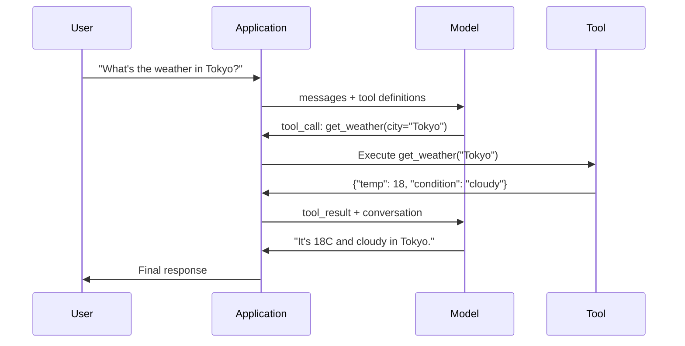

# Function Calling & Tool Use（函数调用与工具使用）

> LLM 什么也做不了，它们只能生成文本。这就是全部能力。它们不能检查天气、查询数据库、发送邮件、运行代码或读取文件。你见过的每一个 "AI 智能体" 都是一个 LLM 在生成 JSON，说明要调用哪个函数——然后由你的代码实际去调用它。模型是大脑，工具是双手，函数调用是连接它们的神经系统。

**Type:** Build
**Languages:** Python
**Prerequisites:** Phase 11 Lesson 03 (Structured Outputs)
**Time:** ~75 minutes
**Related:** Phase 11 · 14 (Model Context Protocol) — when a tool is shared across hosts, graduate from inline function-calling to an MCP server. This lesson covers the inline case; MCP covers the protocol case.

## Learning Objectives

- Implement a function calling loop: define tool schemas, parse the model's tool-call JSON, execute functions, and return results
- Design tool schemas with clear descriptions and typed parameters that the model can reliably invoke
- Build a multi-turn agent loop that chains multiple function calls to answer complex queries
- Handle function calling edge cases: parallel tool calls, error propagation, and preventing infinite tool loops

## The Problem

你构建了一个聊天机器人。一位用户问："What's the weather in Tokyo right now?"

模型回复："I don't have access to real-time weather data, but based on the season, Tokyo is likely around 15 degrees Celsius..."

那是一个穿着免责声明外衣的幻觉。模型不知道天气，也永远不会知道。天气每小时变化，而模型的训练数据是几个月前的。

正确的答案需要调用 OpenWeatherMap API，获取当前温度，并返回真实数字。模型无法调用 API，但你的代码可以。缺失的环节：一个结构化协议，让模型能够说"我需要用这些参数调用天气 API"，并让你的代码执行它并将结果反馈回去。

这就是函数调用。模型输出结构化 JSON，描述要调用哪个函数以及使用什么参数。你的应用执行该函数，结果回到对话中，模型使用结果来生成最终答案。

没有函数调用，LLM 是百科全书。有了它，它们成为智能体。

## The Concept

### The Function Calling Loop

每个工具使用交互都遵循相同的 5 步循环。



第 1 步：用户发送消息。第 2 步：模型接收消息以及工具定义（描述可用函数的 JSON Schema）。第 3 步：模型不是回复文本，而是输出一个工具调用——一个包含函数名称和参数的结构化 JSON 对象。第 4 步：你的代码执行该函数并捕获结果。第 5 步：结果返回给模型，模型现在拥有了真实数据来生成最终答案。

模型从不执行任何操作。它只决定调用什么以及使用什么参数。你的代码是执行器。

### Tool Definitions: The JSON Schema Contract

每个工具由一个 JSON Schema 定义，告诉模型该函数做什么、接受什么参数以及这些参数必须是什么类型。

```json
{
  "type": "function",
  "function": {
    "name": "get_weather",
    "description": "Get current weather for a city. Returns temperature in Celsius and conditions.",
    "parameters": {
      "type": "object",
      "properties": {
        "city": {
          "type": "string",
          "description": "City name, e.g. 'Tokyo' or 'San Francisco'"
        },
        "units": {
          "type": "string",
          "enum": ["celsius", "fahrenheit"],
          "description": "Temperature units"
        }
      },
      "required": ["city"]
    }
  }
}
```

`description` 字段至关重要。模型读取它们来决定何时以及如何使用工具。模糊的描述如 "gets weather" 产生的工具选择不如 "Get current weather for a city. Returns temperature in Celsius and conditions." 描述是工具选择的提示词。

### Provider Comparison

每个主要提供者都支持函数调用，但 API 表面有所不同。

| Provider | API Parameter | Tool Call Format | Parallel Calls | Forced Calling |
|----------|--------------|-----------------|---------------|----------------|
| OpenAI (GPT-5, o4) | `tools` | `tool_calls[].function` | Yes (multiple per turn) | `tool_choice="required"` |
| Anthropic (Claude 4.6/4.7) | `tools` | `content[].type="tool_use"` | Yes (multiple blocks) | `tool_choice={"type":"any"}` |
| Google (Gemini 3) | `function_declarations` | `functionCall` | Yes | `function_calling_config` |
| Open-weight (Llama 4, Qwen3, DeepSeek-V3) | Native `tools` on Llama 4; Hermes or ChatML on others | Mixed | Model-dependent | Prompt-based or `tool_choice` if supported |

到 2026 年，三大闭源提供者已经趋同于几乎相同的基于 JSON Schema 的格式。Llama 4 提供了与 OpenAI 形状匹配的原生 `tools` 字段。开源微调版本仍然存在差异——Hermes 格式（NousResearch）是第三方微调中最常见的。对于跨主机的共享工具，优先选择 MCP（Phase 11 · 14）而非内联函数调用——服务器对它们全部相同。

### Tool Choice: Auto, Required, Specific

你控制模型何时使用工具。

**Auto**（默认）：模型决定是调用工具还是直接回复。"What's 2+2?" -- 直接回复。"What's the weather?" -- 调用工具。

**Required**：模型必须至少调用一个工具。当你知道用户意图需要工具时使用。防止模型猜测而非查找真实数据。

**特定函数（Specific function）**：强制模型调用某个特定函数。`tool_choice={"type":"function", "function": {"name": "get_weather"}}` 保证无论查询如何都调用天气工具。用于路由——当上游逻辑已确定需要哪个工具时使用。

### Parallel Function Calling

GPT-4o 和 Claude 可以在单轮中调用多个函数。用户问："What's the weather in Tokyo and New York?" 模型同时输出两个工具调用：

```json
[
  {"name": "get_weather", "arguments": {"city": "Tokyo"}},
  {"name": "get_weather", "arguments": {"city": "New York"}}
]
```

你的代码执行两者（理想情况下并发），返回两个结果，然后模型合成一个回复。这将往返次数从 2 减少到 1。对于每次查询有 5-10 次工具调用的智能体，并行调用可将延迟减少 60-80%。

### Structured Outputs vs Function Calling

第 03 课介绍了结构化输出。函数调用使用相同的 JSON Schema 机制，但用于不同目的。

**Structured outputs**：强制模型以特定形状生成数据。输出是最终产品。示例：从文本中提取产品信息为 `{name, price, in_stock}`。

**Function calling**：模型声明执行操作的意图。输出是一个中间步骤。示例：`get_weather(city="Tokyo")`——模型在请求一个操作，而非生成最终答案。

需要数据提取时使用结构化输出。需要模型与外部系统交互时使用函数调用。

### Security: The Non-Negotiable Rules

函数调用是你能给 LLM 的最危险的能力。模型选择要执行什么。如果你的工具集包含数据库查询，模型构造查询。如果它包含 shell 命令，模型编写它们。

**Rule 1: 永远不要将模型生成的 SQL 直接传递给数据库。** 模型会并且将会生成 DROP TABLE、UNION 注入或返回每一行的查询。始终参数化，始终验证，始终使用操作白名单。

**Rule 2: 函数白名单。** 模型只能调用你明确定义的函数。永远不要构建一个通用的 "execute any function by name" 工具。如果你有 50 个内部函数，只暴露用户需要的 5 个。

**Rule 3: 验证参数。** 模型可能传递城市名称 `"; DROP TABLE users; --"`。在执行前按预期的类型、范围和格式验证每个参数。

**Rule 4: 清理工具结果。** 如果工具返回敏感数据（API 密钥、PII、内部错误），在将其发回给模型之前进行过滤。模型将逐字将工具结果包含在其回复中。

**Rule 5: 限制工具调用频率。** 循环中的模型可以调用工具数百次。设置最大次数（每次对话 10-20 次是合理的）。中断无限循环。

### Error Handling

工具会失败。API 超时。数据库宕机。文件不存在。模型需要知道工具何时失败以及为什么。

将错误作为结构化工具结果返回，而不是异常：

```json
{
  "error": true,
  "message": "City 'Toky' not found. Did you mean 'Tokyo'?",
  "code": "CITY_NOT_FOUND"
}
```

模型读取此内容，调整其参数，然后重试。模型善于从结构化错误消息中自我纠正，但不善于从空响应或通用的 "something went wrong" 错误中恢复。

### MCP: Model Context Protocol

MCP 是 Anthropic 提出的工具互操作性开放标准。与每个应用定义自己的工具不同，MCP 提供了一个通用协议：工具由 MCP 服务器提供，由 MCP 客户端消费（如 Claude Code、Cursor 或你的应用）。

一个 MCP 服务器可以向任何兼容客户端暴露工具。Postgres MCP 服务器让任何 MCP 兼容的智能体获得数据库访问权限。GitHub MCP 服务器让任何智能体获得仓库访问权限。工具定义一次，到处使用。

MCP 对函数调用而言，就像 HTTP 对网络而言——它标准化了传输层，使工具变得可移植。

## Build It

### Step 1: Define the Tool Registry

构建一个注册表，存储工具定义及其实现。每个工具有一个 JSON Schema 定义（模型看到的）和一个 Python 函数（你的代码执行的）。

```python
import json
import math
import time
import hashlib


TOOL_REGISTRY = {}


def register_tool(name, description, parameters, function):
    TOOL_REGISTRY[name] = {
        "definition": {
            "type": "function",
            "function": {
                "name": name,
                "description": description,
                "parameters": parameters,
            },
        },
        "function": function,
    }
```

### Step 2: Implement 5 Tools

构建计算器、天气查询、网络搜索模拟器、文件读取器和代码运行器。

```python
def calculator(expression, precision=2):
    allowed = set("0123456789+-*/.() ")
    if not all(c in allowed for c in expression):
        return {"error": True, "message": f"Invalid characters in expression: {expression}"}
    try:
        result = eval(expression, {"__builtins__": {}}, {"math": math})
        return {"result": round(float(result), precision), "expression": expression}
    except Exception as e:
        return {"error": True, "message": str(e)}


WEATHER_DB = {
    "tokyo": {"temp_c": 18, "condition": "cloudy", "humidity": 72, "wind_kph": 14},
    "new york": {"temp_c": 22, "condition": "sunny", "humidity": 45, "wind_kph": 8},
    "london": {"temp_c": 12, "condition": "rainy", "humidity": 88, "wind_kph": 22},
    "san francisco": {"temp_c": 16, "condition": "foggy", "humidity": 80, "wind_kph": 18},
    "sydney": {"temp_c": 25, "condition": "sunny", "humidity": 55, "wind_kph": 10},
}


def get_weather(city, units="celsius"):
    key = city.lower().strip()
    if key not in WEATHER_DB:
        suggestions = [c for c in WEATHER_DB if c.startswith(key[:3])]
        return {
            "error": True,
            "message": f"City '{city}' not found.",
            "suggestions": suggestions,
            "code": "CITY_NOT_FOUND",
        }
    data = WEATHER_DB[key].copy()
    if units == "fahrenheit":
        data["temp_f"] = round(data["temp_c"] * 9 / 5 + 32, 1)
        del data["temp_c"]
    data["city"] = city
    return data


SEARCH_DB = {
    "python function calling": [
        {"title": "OpenAI Function Calling Guide", "url": "https://platform.openai.com/docs/guides/function-calling", "snippet": "Learn how to connect LLMs to external tools."},
        {"title": "Anthropic Tool Use", "url": "https://docs.anthropic.com/en/docs/tool-use", "snippet": "Claude can interact with external tools and APIs."},
    ],
    "MCP protocol": [
        {"title": "Model Context Protocol", "url": "https://modelcontextprotocol.io", "snippet": "An open standard for connecting AI models to data sources."},
    ],
    "weather API": [
        {"title": "OpenWeatherMap API", "url": "https://openweathermap.org/api", "snippet": "Free weather API with current, forecast, and historical data."},
    ],
}


def web_search(query, max_results=3):
    key = query.lower().strip()
    for db_key, results in SEARCH_DB.items():
        if db_key in key or key in db_key:
            return {"query": query, "results": results[:max_results], "total": len(results)}
    return {"query": query, "results": [], "total": 0}


FILE_SYSTEM = {
    "data/config.json": '{"model": "gpt-4o", "temperature": 0.7, "max_tokens": 4096}',
    "data/users.csv": "name,email,role\nAlice,alice@example.com,admin\nBob,bob@example.com,user",
    "README.md": "# My Project\nA tool-use agent built from scratch.",
}


def read_file(path):
    if ".." in path or path.startswith("/"):
        return {"error": True, "message": "Path traversal not allowed.", "code": "FORBIDDEN"}
    if path not in FILE_SYSTEM:
        available = list(FILE_SYSTEM.keys())
        return {"error": True, "message": f"File '{path}' not found.", "available_files": available, "code": "NOT_FOUND"}
    content = FILE_SYSTEM[path]
    return {"path": path, "content": content, "size_bytes": len(content), "lines": content.count("\n") + 1}


def run_code(code, language="python"):
    if language != "python":
        return {"error": True, "message": f"Language '{language}' not supported. Only 'python' is available."}
    forbidden = ["import os", "import sys", "import subprocess", "exec(", "eval(", "__import__", "open("]
    for pattern in forbidden:
        if pattern in code:
            return {"error": True, "message": f"Forbidden operation: {pattern}", "code": "SECURITY_VIOLATION"}
    try:
        local_vars = {}
        exec(code, {"__builtins__": {"print": print, "range": range, "len": len, "str": str, "int": int, "float": float, "list": list, "dict": dict, "sum": sum, "min": min, "max": max, "abs": abs, "round": round, "sorted": sorted, "enumerate": enumerate, "zip": zip, "map": map, "filter": filter, "math": math}}, local_vars)
        result = local_vars.get("result", None)
        return {"success": True, "result": result, "variables": {k: str(v) for k, v in local_vars.items() if not k.startswith("_")}}
    except Exception as e:
        return {"error": True, "message": f"{type(e).__name__}: {e}"}
```

### Step 3: Register All Tools

```python
def register_all_tools():
    register_tool(
        "calculator", "Evaluate a mathematical expression. Supports +, -, *, /, parentheses, and decimals. Returns the numeric result.",
        {"type": "object", "properties": {"expression": {"type": "string", "description": "Math expression, e.g. '(10 + 5) * 3'"}, "precision": {"type": "integer", "description": "Decimal places in result", "default": 2}}, "required": ["expression"]},
        calculator,
    )
    register_tool(
        "get_weather", "Get current weather for a city. Returns temperature, condition, humidity, and wind speed.",
        {"type": "object", "properties": {"city": {"type": "string", "description": "City name, e.g. 'Tokyo' or 'San Francisco'"}, "units": {"type": "string", "enum": ["celsius", "fahrenheit"], "description": "Temperature units, defaults to celsius"}}, "required": ["city"]},
        get_weather,
    )
    register_tool(
        "web_search", "Search the web for information. Returns a list of results with title, URL, and snippet.",
        {"type": "object", "properties": {"query": {"type": "string", "description": "Search query"}, "max_results": {"type": "integer", "description": "Maximum results to return", "default": 3}}, "required": ["query"]},
        web_search,
    )
    register_tool(
        "read_file", "Read the contents of a file. Returns the file content, size, and line count.",
        {"type": "object", "properties": {"path": {"type": "string", "description": "Relative file path, e.g. 'data/config.json'"}}, "required": ["path"]},
        read_file,
    )
    register_tool(
        "run_code", "Execute Python code in a sandboxed environment. Set a 'result' variable to return output.",
        {"type": "object", "properties": {"code": {"type": "string", "description": "Python code to execute"}, "language": {"type": "string", "enum": ["python"], "description": "Programming language"}}, "required": ["code"]},
        run_code,
    )
```

### Step 4: Build the Function Calling Loop

这是核心引擎。它模拟模型决定调用哪个工具、执行工具并将结果反馈回去。

```python
def simulate_model_decision(user_message, tools, conversation_history):
    msg = user_message.lower()

    if any(word in msg for word in ["weather", "temperature", "forecast"]):
        cities = []
        for city in WEATHER_DB:
            if city in msg:
                cities.append(city)
        if not cities:
            for word in msg.split():
                if word.capitalize() in [c.title() for c in WEATHER_DB]:
                    cities.append(word)
        if not cities:
            cities = ["tokyo"]
        calls = []
        for city in cities:
            calls.append({"name": "get_weather", "arguments": {"city": city.title()}})
        return calls

    if any(word in msg for word in ["calculate", "compute", "math", "what is", "how much"]):
        for token in msg.split():
            if any(c in token for c in "+-*/"):
                return [{"name": "calculator", "arguments": {"expression": token}}]
        if "+" in msg or "-" in msg or "*" in msg or "/" in msg:
            expr = "".join(c for c in msg if c in "0123456789+-*/.() ")
            if expr.strip():
                return [{"name": "calculator", "arguments": {"expression": expr.strip()}}]
        return [{"name": "calculator", "arguments": {"expression": "0"}}]

    if any(word in msg for word in ["search", "find", "look up", "google"]):
        query = msg.replace("search for", "").replace("look up", "").replace("find", "").strip()
        return [{"name": "web_search", "arguments": {"query": query}}]

    if any(word in msg for word in ["read", "file", "open", "cat", "show"]):
        for path in FILE_SYSTEM:
            if path.split("/")[-1].split(".")[0] in msg:
                return [{"name": "read_file", "arguments": {"path": path}}]
        return [{"name": "read_file", "arguments": {"path": "README.md"}}]

    if any(word in msg for word in ["run", "execute", "code", "python"]):
        return [{"name": "run_code", "arguments": {"code": "result = 'Hello from the sandbox!'", "language": "python"}}]

    return []


def execute_tool_call(tool_call):
    name = tool_call["name"]
    args = tool_call["arguments"]

    if name not in TOOL_REGISTRY:
        return {"error": True, "message": f"Unknown tool: {name}", "code": "UNKNOWN_TOOL"}

    tool = TOOL_REGISTRY[name]
    func = tool["function"]
    start = time.time()

    try:
        result = func(**args)
    except TypeError as e:
        result = {"error": True, "message": f"Invalid arguments: {e}"}

    elapsed_ms = round((time.time() - start) * 1000, 2)
    return {"tool": name, "result": result, "execution_time_ms": elapsed_ms}


def run_function_calling_loop(user_message, max_iterations=5):
    conversation = [{"role": "user", "content": user_message}]
    tool_definitions = [t["definition"] for t in TOOL_REGISTRY.values()]
    all_tool_results = []

    for iteration in range(max_iterations):
        tool_calls = simulate_model_decision(user_message, tool_definitions, conversation)

        if not tool_calls:
            break

        results = []
        for call in tool_calls:
            result = execute_tool_call(call)
            results.append(result)

        conversation.append({"role": "assistant", "content": None, "tool_calls": tool_calls})

        for result in results:
            conversation.append({"role": "tool", "content": json.dumps(result["result"]), "tool_name": result["tool"]})

        all_tool_results.extend(results)
        break

    return {"conversation": conversation, "tool_results": all_tool_results, "iterations": iteration + 1 if tool_calls else 0}
```

### Step 5: Argument Validation

构建一个验证器，在执行前根据 JSON Schema 检查工具调用参数。

```python
def validate_tool_arguments(tool_name, arguments):
    if tool_name not in TOOL_REGISTRY:
        return [f"Unknown tool: {tool_name}"]

    schema = TOOL_REGISTRY[tool_name]["definition"]["function"]["parameters"]
    errors = []

    if not isinstance(arguments, dict):
        return [f"Arguments must be an object, got {type(arguments).__name__}"]

    for required_field in schema.get("required", []):
        if required_field not in arguments:
            errors.append(f"Missing required argument: {required_field}")

    properties = schema.get("properties", {})
    for arg_name, arg_value in arguments.items():
        if arg_name not in properties:
            errors.append(f"Unknown argument: {arg_name}")
            continue

        prop_schema = properties[arg_name]
        expected_type = prop_schema.get("type")

        type_checks = {"string": str, "integer": int, "number": (int, float), "boolean": bool, "array": list, "object": dict}
        if expected_type in type_checks:
            if not isinstance(arg_value, type_checks[expected_type]):
                errors.append(f"Argument '{arg_name}': expected {expected_type}, got {type(arg_value).__name__}")

        if "enum" in prop_schema and arg_value not in prop_schema["enum"]:
            errors.append(f"Argument '{arg_name}': '{arg_value}' not in {prop_schema['enum']}")

    return errors
```

### Step 6: Run the Demo

```python
def run_demo():
    register_all_tools()

    print("=" * 60)
    print("  Function Calling & Tool Use Demo")
    print("=" * 60)

    print("\n--- Registered Tools ---")
    for name, tool in TOOL_REGISTRY.items():
        desc = tool["definition"]["function"]["description"][:60]
        params = list(tool["definition"]["function"]["parameters"].get("properties", {}).keys())
        print(f"  {name}: {desc}...")
        print(f"    params: {params}")

    print(f"\n--- Argument Validation ---")
    validation_tests = [
        ("get_weather", {"city": "Tokyo"}, "Valid call"),
        ("get_weather", {}, "Missing required arg"),
        ("get_weather", {"city": "Tokyo", "units": "kelvin"}, "Invalid enum value"),
        ("calculator", {"expression": 123}, "Wrong type (int for string)"),
        ("unknown_tool", {"x": 1}, "Unknown tool"),
    ]
    for tool_name, args, label in validation_tests:
        errors = validate_tool_arguments(tool_name, args)
        status = "VALID" if not errors else f"ERRORS: {errors}"
        print(f"  {label}: {status}")

    print(f"\n--- Tool Execution ---")
    direct_tests = [
        {"name": "calculator", "arguments": {"expression": "(10 + 5) * 3 / 2"}},
        {"name": "get_weather", "arguments": {"city": "Tokyo"}},
        {"name": "get_weather", "arguments": {"city": "Mars"}},
        {"name": "web_search", "arguments": {"query": "python function calling"}},
        {"name": "read_file", "arguments": {"path": "data/config.json"}},
        {"name": "read_file", "arguments": {"path": "../etc/passwd"}},
        {"name": "run_code", "arguments": {"code": "result = sum(range(1, 101))"}},
        {"name": "run_code", "arguments": {"code": "import os; os.system('rm -rf /')"}},
    ]
    for call in direct_tests:
        result = execute_tool_call(call)
        print(f"\n  {call['name']}({json.dumps(call['arguments'])})")
        print(f"    -> {json.dumps(result['result'], indent=None)[:100]}")
        print(f"    time: {result['execution_time_ms']}ms")

    print(f"\n--- Full Function Calling Loop ---")
    test_queries = [
        "What's the weather in Tokyo?",
        "Calculate (100 + 250) * 0.15",
        "Search for MCP protocol",
        "Read the config file",
        "Run some Python code",
        "Tell me a joke",
    ]
    for query in test_queries:
        print(f"\n  User: {query}")
        result = run_function_calling_loop(query)
        if result["tool_results"]:
            for tr in result["tool_results"]:
                print(f"    Tool: {tr['tool']} ({tr['execution_time_ms']}ms)")
                print(f"    Result: {json.dumps(tr['result'], indent=None)[:90]}")
        else:
            print(f"    [No tool called -- direct response]")
        print(f"    Iterations: {result['iterations']}")

    print(f"\n--- Parallel Tool Calls ---")
    multi_city_query = "What's the weather in tokyo and london?"
    print(f"  User: {multi_city_query}")
    result = run_function_calling_loop(multi_city_query)
    print(f"  Tool calls made: {len(result['tool_results'])}")
    for tr in result["tool_results"]:
        city = tr["result"].get("city", "unknown")
        temp = tr["result"].get("temp_c", "N/A")
        print(f"    {city}: {temp}C, {tr['result'].get('condition', 'N/A')}")

    print(f"\n--- Security Checks ---")
    security_tests = [
        ("read_file", {"path": "../../etc/passwd"}),
        ("run_code", {"code": "import subprocess; subprocess.run(['ls'])"}),
        ("calculator", {"expression": "__import__('os').system('ls')"}),
    ]
    for tool_name, args in security_tests:
        result = execute_tool_call({"name": tool_name, "arguments": args})
        blocked = result["result"].get("error", False)
        print(f"  {tool_name}({list(args.values())[0][:40]}): {'BLOCKED' if blocked else 'ALLOWED'}")
```

## Use It

### OpenAI Function Calling

```python
# from openai import OpenAI
#
# client = OpenAI()
#
# tools = [{
#     "type": "function",
#     "function": {
#         "name": "get_weather",
#         "description": "Get current weather for a city",
#         "parameters": {
#             "type": "object",
#             "properties": {
#                 "city": {"type": "string"},
#                 "units": {"type": "string", "enum": ["celsius", "fahrenheit"]}
#             },
#             "required": ["city"]
#         }
#     }
# }]
#
# response = client.chat.completions.create(
#     model="gpt-4o",
#     messages=[{"role": "user", "content": "Weather in Tokyo?"}],
#     tools=tools,
#     tool_choice="auto",
# )
#
# tool_call = response.choices[0].message.tool_calls[0]
# args = json.loads(tool_call.function.arguments)
# result = get_weather(**args)
#
# final = client.chat.completions.create(
#     model="gpt-4o",
#     messages=[
#         {"role": "user", "content": "Weather in Tokyo?"},
#         response.choices[0].message,
#         {"role": "tool", "tool_call_id": tool_call.id, "content": json.dumps(result)},
#     ],
# )
# print(final.choices[0].message.content)
```

OpenAI 返回工具调用为 `response.choices[0].message.tool_calls`。每个调用有一个 `id`，在返回结果时必须包含。模型使用此 ID 将结果与调用匹配。GPT-4o 可以在单个回复中返回多个工具调用——迭代执行它们全部。

### Anthropic Tool Use

```python
# import anthropic
#
# client = anthropic.Anthropic()
#
# response = client.messages.create(
#     model="claude-sonnet-4-20250514",
#     max_tokens=1024,
#     tools=[{
#         "name": "get_weather",
#         "description": "Get current weather for a city",
#         "input_schema": {
#             "type": "object",
#             "properties": {
#                 "city": {"type": "string"},
#                 "units": {"type": "string", "enum": ["celsius", "fahrenheit"]}
#             },
#             "required": ["city"]
#         }
#     }],
#     messages=[{"role": "user", "content": "Weather in Tokyo?"}],
# )
#
# tool_block = next(b for b in response.content if b.type == "tool_use")
# result = get_weather(**tool_block.input)
#
# final = client.messages.create(
#     model="claude-sonnet-4-20250514",
#     max_tokens=1024,
#     tools=[...],
#     messages=[
#         {"role": "user", "content": "Weather in Tokyo?"},
#         {"role": "assistant", "content": response.content},
#         {"role": "user", "content": [{"type": "tool_result", "tool_use_id": tool_block.id, "content": json.dumps(result)}]},
#     ],
# )
```

Anthropic 返回工具调用为类型为 `type: "tool_use"` 的内容块。工具结果放在 `type: "tool_result"` 的用户消息中。注意关键区别：Anthropic 使用 `input_schema` 定义工具参数，而 OpenAI 使用 `parameters`。

### MCP Integration

```python
# MCP servers expose tools over a standardized protocol.
# Any MCP-compatible client can discover and call these tools.
#
# Example: connecting to a Postgres MCP server
#
# from mcp import ClientSession, StdioServerParameters
# from mcp.client.stdio import stdio_client
#
# server_params = StdioServerParameters(
#     command="npx",
#     args=["-y", "@modelcontextprotocol/server-postgres", "postgresql://localhost/mydb"],
# )
#
# async with stdio_client(server_params) as (read, write):
#     async with ClientSession(read, write) as session:
#         await session.initialize()
#         tools = await session.list_tools()
#         result = await session.call_tool("query", {"sql": "SELECT count(*) FROM users"})
```

MCP 将工具实现与工具消费解耦。Postgres 服务器懂 SQL。GitHub 服务器懂 API。你的智能体只是发现和调用工具——不需要为每个集成编写特定提供者的代码。

## Ship It

本课生成 `outputs/prompt-tool-designer.md` —— 一个用于设计工具定义的可复用提示词模板。给它描述你希望工具做什么，它会生成包含描述、类型和约束的完整 JSON Schema 定义。

还生成 `outputs/skill-function-calling-patterns.md` —— 一个在生产中实现函数调用的决策框架，涵盖工具设计、错误处理、安全性和特定提供者的模式。

## Exercises

1. **Add a 6th tool: database query.** Implement a simulated SQL tool with an in-memory table. The tool accepts a table name and filter conditions (not raw SQL). Validate that the table name is in an allowlist and that filter operators are restricted to `=`, `>`, `<`, `>=`, `<=`. Return matching rows as JSON.

2. **Implement retry with error feedback.** When a tool call fails (e.g., city not found), feed the error message back to the model decision function and let it correct its arguments. Track how many retries each call takes. Set a maximum of 3 retries per tool call.

3. **Build a multi-step agent.** Some queries require chaining tool calls: "Read the config file and tell me what model is configured, then search the web for that model's pricing." Implement a loop that runs until the model decides no more tools are needed, passing accumulated results into each decision step. Limit to 10 iterations to prevent infinite loops.

4. **Measure tool selection accuracy.** Create 30 test queries with expected tool names. Run your decision function on all 30 and measure what percentage of the time it selects the correct tool. Identify which queries cause the most confusion between tools.

5. **Implement tool call caching.** If the same tool is called with identical arguments within 60 seconds, return the cached result instead of re-executing. Use a dictionary keyed by `(tool_name, frozenset(args.items()))`. Measure cache hit rates across a conversation with 20 queries.

## Key Terms

| Term | What people say | What it actually means |
|------|----------------|----------------------|
| Function calling | "Tool use" | The model outputs structured JSON describing a function to invoke with specific arguments -- your code executes it, not the model |
| Tool definition | "Function schema" | A JSON Schema object describing a tool's name, purpose, parameters, and types -- the model reads this to decide when and how to use the tool |
| Tool choice | "Calling mode" | Controls whether the model must call a tool (required), may call a tool (auto), or must call a specific tool (named) |
| Parallel calling | "Multi-tool" | The model outputs multiple tool calls in a single turn, reducing round trips -- GPT-4o and Claude both support this |
| Tool result | "Function output" | The return value from executing a tool, sent back to the model as a message so it can use real data in its response |
| Argument validation | "Input checking" | Verifying that model-generated arguments match the expected types, ranges, and constraints before executing the tool |
| MCP | "Tool protocol" | Model Context Protocol -- Anthropic's open standard for exposing tools via servers that any compatible client can discover and call |
| Agent loop | "ReAct loop" | The iterative cycle of model-decides-tool, code-executes-tool, result-feeds-back until the model has enough information to respond |
| Tool poisoning | "Prompt injection via tools" | An attack where tool results contain instructions that manipulate the model's behavior -- sanitize all tool outputs |
| Rate limiting | "Call budget" | Setting a maximum number of tool calls per conversation to prevent infinite loops and runaway API costs |

## Further Reading

- [OpenAI Function Calling Guide](https://platform.openai.com/docs/guides/function-calling) -- the definitive reference for tool use with GPT-4o, including parallel calls, forced calling, and structured arguments
- [Anthropic Tool Use Guide](https://docs.anthropic.com/en/docs/tool-use) -- Claude's tool use implementation with input_schema, multi-tool responses, and tool_choice configuration
- [Model Context Protocol Specification](https://modelcontextprotocol.io) -- the open standard for tool interoperability across AI applications, with server/client architecture
- [Schick et al., 2023 -- "Toolformer: Language Models Can Teach Themselves to Use Tools"](https://arxiv.org/abs/2302.04761) -- the foundational paper on training LLMs to decide when and how to call external tools
- [Patil et al., 2023 -- "Gorilla: Large Language Model Connected with Massive APIs"](https://arxiv.org/abs/2305.15334) -- fine-tuning LLMs for accurate API calls across 1,645 APIs with hallucination reduction
- [Berkeley Function Calling Leaderboard](https://gorilla.cs.berkeley.edu/leaderboard.html) -- real-time benchmark comparing function calling accuracy across GPT-4o, Claude, Gemini, and open models
- [Yao et al., "ReAct: Synergizing Reasoning and Acting in Language Models" (ICLR 2023)](https://arxiv.org/abs/2210.03629) -- the Thought-Action-Observation loop that is the outer agent loop around every tool call; where this lesson ends, Phase 14 picks up.
- [Anthropic — Building effective agents (Dec 2024)](https://www.anthropic.com/research/building-effective-agents) -- five composable patterns (prompt chaining, routing, parallelization, orchestrator-workers, evaluator-optimizer) built from the single tool-use primitive.
