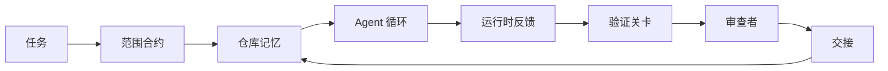

# Agent 工作台工程：为何能力强的模型仍然失败

> 模型能力强是不够的。可靠的 Agent 需要工作台：指令、状态、范围、反馈、验证、审查和交接。去掉这些，即便是最前沿的模型产出的工作结果也不安全，无法交付。

**类型：** 学习 + 构建
**语言：** Python（标准库）
**前置条件：** 第 14 阶段 · 01（Agent 循环）、第 14 阶段 · 26（失败模式）
**时间：** 约 45 分钟

## 学习目标

- 区分模型能力与执行可靠性。
- 说出决定 Agent 是否能交付的七个工作台操作面。
- 在一个小型仓库任务上对比仅提示运行与工作台引导运行。
- 生成一份失败模式报告，将每个缺失的操作面映射到其导致的症状。

## 问题

你将一个前沿模型放入一个真实的仓库，让它添加输入验证。它打开了四个文件，写了一些看起来合理的代码，声明成功，然后停止了。你运行测试。两个失败。一个与验证毫无关系的第三个文件被修改了。没有记录 Agent 假定了什么、它先尝试了什么、还有什么没有完成。

模型不是错在 Python 上。它是错在工作上。它不知道怎样才算完成、它被允许在哪里写代码、哪些测试是权威的、或者下一个会话应该怎样继续。

这不是模型缺陷。这是工作台缺陷。Agent 周围的操作面缺少将一次性生成转变为可靠的、可恢复的工程所必要的那些部分。

## 概念

工作台是在任务期间包裹模型的操作环境。它有七个操作面：

| 操作面 | 它承载什么 | 缺失时的失败 |
|---------|-----------------|----------------------|
| 指令 | 启动规则、禁止操作、完成定义 | Agent 猜测"交付"的含义 |
| 状态 | 当前任务、已修改文件、阻塞项、下一步操作 | 每个会话从零重新开始 |
| 范围 | 允许的文件、禁止的文件、验收标准 | 编辑泄漏到无关代码中 |
| 反馈 | 捕获到循环中的真实命令输出 | Agent 对 400 声明成功 |
| 验证 | 测试、lint、冒烟运行、范围检查 | "看起来不错"进入了主分支 |
| 审查 | 使用不同角色的二次检查 | 构建者批改自己的作业 |
| 交接 | 改了什么、为什么、还有什么没完成 | 下一个会话重新发现一切 |

工作台独立于模型。你可以更换模型而保留这些操作面。你不能更换这些操作面而保留可靠性。



循环在状态文件上闭合，而非聊天历史上。聊天是易失的。仓库是记录系统。

### 工作台 vs 提示工程

提示告诉模型本轮你想要什么。工作台告诉模型如何跨轮次和跨会话进行工作。大多数 Agent 失败故事是穿着提示工程外衣的工作台失败。

### 工作台 vs 框架

框架给你一个运行时（LangGraph、AutoGen、Agents SDK）。工作台给 Agent 一个在该运行时内工作的地方。你需要两者。这个小型轨迹是关于第二个的。

### 从原语推理，而非厂商分类法

目前关于"harness 工程"有很多文章。Addy Osmani、OpenAI、Anthropic、LangChain、Martin Fowler、MongoDB、HumanLayer、Augment Code、Thoughtworks、walkinglabs awesome 列表，以及 Medium 和 Hacker News 上的持续讨论都在携带这一话题。他们对 harness 的边界、什么是范围、以及使用什么词汇存在分歧。我们不需要选边站。七个操作面是 UX 层；在每个工作台之下是支撑任何可靠后端系统的同一套分布式系统原语。

暂时去掉 Agent 标签。一次 Agent 运行是跨越时间、进程和机器的计算。要使其可靠，你需要与任何生产系统相同的原语。

| 原语 | 是什么 | 对 Agent 承载什么 |
|-----------|------------|------------------------------|
| 函数 | 类型化处理程序。尽可能纯。拥有自己的输入和输出。 | 工具调用、规则检查、验证步骤、模型调用 |
| Worker | 拥有一个或多个函数及生命周期的长寿命进程 | 构建者、审查者、验证者、MCP 服务器 |
| 触发器 | 调用函数的事件源 | Agent 循环周期、HTTP 请求、队列消息、定时任务、文件变更、钩子 |
| 运行时 | 决定什么在哪里运行、使用什么超时和资源的边界 | Claude Code 的进程、LangGraph 的运行时、Worker 容器 |
| HTTP / RPC | 调用者与 Worker 之间的连线 | 工具调用协议、MCP 请求、模型 API |
| 队列 | 触发器与 Worker 之间的持久缓冲区；背压、重试、幂等性 | 任务板、反馈日志、审查收件箱 |
| 会话持久性 | 在崩溃、重启、模型切换后存活的状态 | `agent_state.json`、检查点、KV 存储、仓库本身 |
| 授权策略 | 谁可以用什么范围调用什么函数 | 允许/禁止的文件、批准边界、MCP 能力列表 |

现在将七个工作台操作面映射到这些原语上。

- **指令** — 策略 + 函数元数据。规则是检查（函数）。路由器（`AGENTS.md`）是附着在运行时启动上的策略。
- **状态** — 会话持久性。运行时在每一步读取的键值存储。文件、KV 或 DB；持久性语义重要，存储后端不重要。
- **范围** — 每个任务的授权策略。允许/禁止的通配符是 ACL。需要的批准是权限格。
- **反馈** — 写入队列的调用日志。每个 shell 调用是一条记录，持久的，可回放的。
- **验证** — 一个函数。对输入是确定性的。在任务关闭时触发。失败时关闭。
- **审查** — 一个独立的 Worker，对构建者产物具有只读授权，对审查报告具有只写授权。
- **交接** — 由会话结束触发器发出的持久记录。下一个会话的启动触发器读取它。

Agent 循环本身是一个 Worker，它消费事件（用户消息、工具结果、定时器滴答），调用函数（模型，然后是模型选择的工具），写入记录（状态、反馈），并发出触发器（验证、审查、交接）。没有神秘之处；与作业处理器相同的形态。

### 流行模式，翻译为原语

每个流行的 harness 模式都可以还原为这八个原语。翻译表。

| 厂商或社区模式 | 实际是什么 |
|------------------------------|--------------------|
| Ralph Loop（Claude Code、Codex、agentic_harness 书籍）— 当 Agent 试图过早停止时，将原始意图重新注入到新的上下文窗口中 | 一个触发器用干净的上下文重新入队一个任务；会话持久性将目标向前传递 |
| Plan / Execute / Verify（PEV） | 三个 Worker，每个一个角色，通过状态和阶段间的队列通信 |
| Harness-计算分离（OpenAI Agents SDK，2026 年 4 月）— 将控制平面与执行平面分离 | 重新陈述控制平面/数据平面。比 Agent 标签早了几十年 |
| Open Agent Passport（OAP，2026 年 3 月）— 在执行前根据声明式策略签署和审计每个工具调用 | 由预操作 Worker 执行的授权策略，带有签名的审计队列 |
| Guides and Sensors（Birgitta Böckeler / Thoughtworks）— 前馈规则 + 反馈可观测性 | 授权策略 + 验证函数 + 可观测性追踪 |
| 渐进式压缩，5 阶段（Claude Code 逆向工程，2026 年 4 月） | 一个状态管理 Worker，像定时任务一样在会话持久性上运行，使其保持在预算内 |
| Hooks / 中间件（LangChain、Claude Code）— 拦截模型和工具调用 | 包裹在运行时调用路径周围的触发器 + 函数 |
| Skills 即 Markdown 加渐进式披露（Anthropic、Flue） | 一个函数注册表，函数元数据即时加载到上下文中 |
| 沙箱 Agent（Codex、Sandcastle、Vercel Sandbox） | 计算平面：一个具有隔离文件系统、网络和生命周期的运行时 |
| MCP 服务器 | 通过稳定 RPC 暴露函数的 Worker，以能力列表作为授权 |

该表中的每个条目都是 Agent 社区重新发现分布式系统中已有名称的原语，并给它一个新名称。对于营销是有用的标签；作为工程词汇则无用。

### 数据怎么说

harness 优先于模型这个主张现在有了数字支持。值得了解，因为它们也是反对"只等更聪明的模型"的唯一诚实论据。

- Terminal Bench 2.0 — 同一模型，harness 变更使一个编码 Agent 从前 30 名之外上升到第五名（LangChain，*Anatomy of an Agent Harness*）。
- Vercel — 删除了 80% 的 Agent 工具；成功率从 80% 跃升至 100%（MongoDB）。
- Harvey — 法律 Agent 仅通过 harness 优化就将准确率提高了一倍以上（MongoDB）。
- 88% 的企业 AI Agent 项目未能达到生产阶段。失败集中在运行时，而非推理（preprints.org，*Harness Engineering for Language Agents*，2026 年 3 月）。
- 2025 年一项跨三个流行开源框架的基准研究报告了约 50% 的任务完成率；长上下文 WebAgent 在长上下文条件下从 40-50% 跌至 10% 以下，主要是由于无限循环和目标丢失（在 2026 年初的文章中广泛报道）。

结论不是"harness 永远胜出"。模型确实会随着时间的推移吸收 harness 技巧。结论是，今天承重的工程在模型周围，而非模型内部，且承载这种负担的原语是每个生产系统一直需要的那些。

### 厂商文章止步之处

这部分不必客气地说。

- LangChain 的 *Anatomy of an Agent Harness* 列举了十一个组件 — 提示、工具、钩子、沙箱、编排、记忆、技能、子 agent，以及一个运行时"哑循环"。它没有命名队列、作为部署单位的 Worker、触发器语义、会话持久性作为一个独立关注点，或授权策略。它将 harness 视为一个可以配置的对象，而非一个需要部署的系统。
- Addy Osmani 的 *Agent Harness Engineering* 落地了 `Agent = Model + Harness` 框架和棘轮模式，但未说出 harness 是由什么构建的。它读起来像一种立场，而非规范。
- Anthropic 和 OpenAI 在操作面上走得最深，但停留在自己的运行时内部。2026 年 4 月 Agents SDK 中的"harness-计算分离"公告是第一个明确认可控制平面/数据平面分离的厂商文章。这是一个原语思想，不是新的。
- agentic_harness 书籍将 harness 视为一个配置对象（Jaymin West 的 *Agentic Engineering*，第 6 章），其中最有力的一句话是"harness 是 Agentic 系统的主要安全边界"。这只是授权策略的重新陈述。
- Hacker News 上的讨论反复到达同一个地方。2026 年 4 月的帖子 *The agent harness belongs outside the sandbox* 认为 harness 应该"更像一个 hypervisor，位于一切之外，根据上下文和用户对访问进行授权"。这再次是将授权策略视为独立平面。

你不需要反对其中任何一篇才能注意到这个空白。它们是在描述一个已经存在的系统的 UX。我们在构建这个系统。当系统构建正确时，七个操作面从原语中自然涌现。当构建错误时，再多的 `AGENTS.md` 润色也无法修复缺失的队列。

所以当你在别处听到"harness engineering"时，翻译成原语。提示和规则是策略和函数。脚手架是运行时。护栏是授权 + 验证。钩子是触发器。记忆是会话持久性。Ralph Loop 是重新入队。子 Agent 是 Worker。沙箱是计算平面。词汇改变；工程不变。工作台是面向 Agent 的 UX；harness，在能经得起下一次厂商重新定义的层面意义上，是函数、Worker、触发器、运行时、队列、持久性和策略正确连接在一起。

## 构建它

`code/main.py` 对一个小型仓库任务运行两次。首先仅使用提示，然后接入七个操作面。相同的模型，相同的任务。脚本计算失败运行中缺少哪些操作面，并打印一份失败模式报告。

仓库任务故意很小：为一个单文件 FastAPI 风格的处理程序添加输入验证，并编写一个通过的测试。

运行它：

```
python3 code/main.py
```

输出：两次运行的并排日志，一份总结仅提示运行的 `failure_modes.json`，以及工作台运行的单行裁决。

Agent 是一个微型的基于规则的桩；重点在操作面，而非模型。在整个小型轨迹的其余部分，你将每个操作面重建为一个真实的、可复用的产物。

## 使用它

工作台操作面在现实世界中已经存在的三个地方，即使没人这么称呼它们：

- **Claude Code、Codex、Cursor。** `AGENTS.md` 和 `CLAUDE.md` 是指令操作面。斜杠命令是范围。钩子是验证。
- **LangGraph、OpenAI Agents SDK。** 检查点和会话存储是状态操作面。交接是交接操作面。
- **真实仓库上的 CI。** 测试、lint 和类型检查是验证。PR 模板是交接。CODEOWNERS 是审查。

工作台工程是将这些操作面显式化和可复用化的纪律，而不是让每个团队重新发现它们。

## 交付它

`outputs/skill-workbench-audit.md` 是一个可移植技能，审计现有仓库的七个工作台操作面，并报告哪些缺失、哪些部分、哪些健康。放在任何 Agent 设置旁边；它告诉你先修复什么。

## 练习

1. 选择一个你已经在运行 Agent 的仓库。将七个操作面从 0（缺失）到 2（健康）打分。你最薄弱的操作面是什么？
2. 扩展 `main.py`，使仅提示运行也产生虚假的"成功"声明。验证关卡是否本来就能捕获它。
3. 为你自己的产品添加第八个操作面。论证为什么它不能归入现有的七个之中。
4. 用一个幻觉出额外文件写入的不同桩 Agent 重新运行脚本。哪个操作面最先捕获它？
5. 将第 14 阶段 · 26 的五种行业反复出现的失败模式映射到七个操作面上。每个操作面设计用来吸收哪种模式？

## 关键术语

| 术语 | 人们怎么说 | 实际含义 |
|------|----------------|------------------------|
| 工作台 | "设置" | 包裹模型使其工作可靠的工程化操作面 |
| 操作面 | "一份文档"或"一个脚本" | 一个命名的、机器可读的输入，Agent 每轮读取或写入 |
| 记录系统 | "笔记" | 聊天历史消失后 Agent 作为真相对待的文件 |
| 完成定义 | "验收" | Agent 无法伪造的客观的、文件底层的检查清单 |
| 工作台审计 | "仓库就绪检查" | 对七个操作面的扫描，在工作开始前标记缺失的部分 |

## 扩展阅读

将这些作为数据点，而非权威阅读。每篇都是部分分类法。在决定采纳之前，将每个概念翻译回一个原语（函数、Worker、触发器、运行时、HTTP/RPC、队列、持久性、策略）。

厂商框架：

- [Addy Osmani，Agent Harness Engineering](https://addyosmani.com/blog/agent-harness-engineering/) — `Agent = Model + Harness` 和棘轮模式；基础设施方面薄弱
- [LangChain，The Anatomy of an Agent Harness](https://blog.langchain.com/the-anatomy-of-an-agent-harness/) — 十一个组件：提示、工具、钩子、编排、沙箱、记忆、技能、子 agent、运行时；省略了队列、部署、授权
- [OpenAI，Harness engineering: leveraging Codex in an agent-first world](https://openai.com/index/harness-engineering/) — Codex 团队对其运行时周围操作面的看法
- [OpenAI，Unrolling the Codex agent loop](https://openai.com/index/unrolling-the-codex-agent-loop/) — Agent 循环简化为对函数调用的 `while`
- [Anthropic，Effective harnesses for long-running agents](https://www.anthropic.com/engineering/effective-harnesses-for-long-running-agents) — 特定运行时内的长时间操作面
- [Anthropic，Harness design for long-running application development](https://www.anthropic.com/engineering/harness-design-long-running-apps) — 应用设计笔记
- [LangChain Deep Agents harness capabilities](https://docs.langchain.com/oss/python/deepagents/harness) — 运行时配置操作面

有可用细节的实践者文章：

- [Martin Fowler / Birgitta Böckeler，Harness engineering for coding agent users](https://martinfowler.com/articles/harness-engineering.html) — 引导（前馈）+ 传感器（反馈）；最清晰的控制论框架
- [HumanLayer，Skill Issue: Harness Engineering for Coding Agents](https://www.humanlayer.dev/blog/skill-issue-harness-engineering-for-coding-agents) — "这不是模型问题，是配置问题"
- [MongoDB，The Agent Harness: Why the LLM Is the Smallest Part of Your Agent System](https://www.mongodb.com/company/blog/technical/agent-harness-why-llm-is-smallest-part-of-your-agent-system) — 数据：Vercel 80% 到 100%，Harvey 2x 准确率，Terminal Bench 前 30 到前 5
- [Augment Code，Harness Engineering for AI Coding Agents](https://www.augmentcode.com/guides/harness-engineering-ai-coding-agents) — 约束优先的走查
- [Sequoia 播客，Harrison Chase on Context Engineering Long-Horizon Agents](https://sequoiacap.com/podcast/context-engineering-our-way-to-long-horizon-agents-langchains-harrison-chase/) — 运行时关注优于模型关注

书籍、论文和参考实现：

- [Jaymin West，Agentic Engineering — 第 6 章：Harnesses](https://www.jayminwest.com/agentic-engineering-book/6-harnesses) — 全书级处理，将 harness 视为主要安全边界
- [preprints.org，Harness Engineering for Language Agents（2026 年 3 月）](https://www.preprints.org/manuscript/202603.1756) — 学术框架：控制/代理/运行时
- [walkinglabs/awesome-harness-engineering](https://github.com/walkinglabs/awesome-harness-engineering) — 精选阅读列表：上下文、评估、可观测性、编排
- [ai-boost/awesome-harness-engineering](https://github.com/ai-boost/awesome-harness-engineering) — 替代精选列表（工具、评估、记忆、MCP、权限）
- [andrewgarst/agentic_harness](https://github.com/andrewgarst/agentic_harness) — 生产就绪参考实现，带 Redis 后端记忆和评估套件
- [HKUDS/OpenHarness](https://github.com/HKUDS/OpenHarness) — 开源 Agent harness，带内置个人 Agent

值得阅读分歧而非共识的 Hacker News 帖子：

- [HN: Effective harnesses for long-running agents](https://news.ycombinator.com/item?id=46081704)
- [HN: Improving 15 LLMs at Coding in One Afternoon. Only the Harness Changed](https://news.ycombinator.com/item?id=46988596)
- [HN: The agent harness belongs outside the sandbox](https://news.ycombinator.com/item?id=47990675) — 主张将授权视为独立平面

本课程内的交叉引用：

- 第 14 阶段 · 23 — OpenTelemetry GenAI 约定：传感器文献指向的可观测性层
- 第 14 阶段 · 26 — 七个操作面设计用来吸收的失败模式目录
- 第 14 阶段 · 27 — 位于授权策略原语上的提示注入防御
- 第 14 阶段 · 29 — 生产运行时（队列、事件、定时任务）：本课原语在部署中的位置
