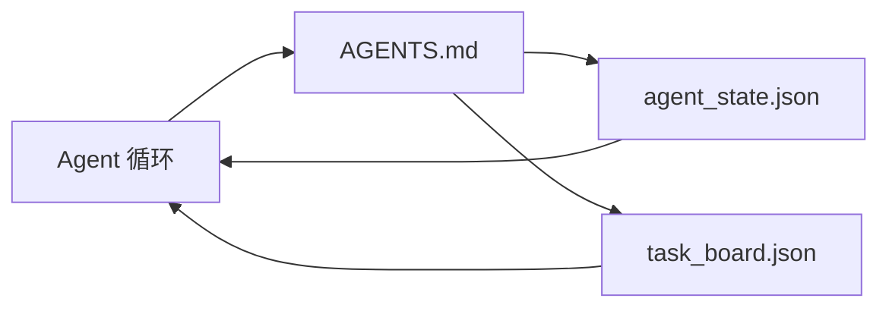

# 最小 Agent 工作台

> 最小有用的工作台是三个文件：一个根指令路由器、一个状态文件和一个任务面板。其他一切都是在上面叠加的。如果一个仓库无法承载这三个文件，没有模型能拯救它。

**类型：** 构建
**语言：** Python（标准库）
**前置条件：** 第 14 阶段 · 31（为何能力强的模型仍然失败）
**时间：** 约 45 分钟

## 学习目标

- 定义构成最小可行工作台的三个文件。
- 解释为何一个简短的根路由器胜过一份冗长的单体 `AGENTS.md`。
- 构建一个 Agent 可以在每一轮读取、在最后写入的状态文件。
- 构建一个能在无聊天历史的情况下跨多会话工作的任务面板。

## 问题

大多数团队通过编写一份 3000 行的 `AGENTS.md` 并说它完成了来开始使用工作台。模型加载它，忽略无法总结的部分，并在相同的问题面上仍然失败。

你需要相反的方案。一个微小的根文件，只在相关时将 Agent 路由到更深层的文件。Agent 在操作前读取并在操作后写入的持久状态。一个说明什么在进行中、什么被阻塞以及下一步是什么的任务面板。

三个文件。每个有一个职责。每个都足够机器可读，以便未来演进为真正的系统。

## 概念



### AGENTS.md 是路由器，不是手册

一个好的 `AGENTS.md` 是简短的。它指向 Agent：

- 状态文件（你在哪里）。
- 任务面板（还有什么没完成）。
- 深层规则（在 `docs/agent-rules.md` 下）。
- 验证命令（如何知道它工作了）。

任何更长的内容放入更深层的文档，仅在需要时加载。长手册被忽略。短路由器被遵循。

### agent_state.json 是记录系统

状态承载：活动任务 ID、已修改文件、已做的假设、阻塞项和下一步操作。Agent 在每一轮读取它。下一个会话读取它而不是回放聊天。

状态存在于一个文件中，因为聊天历史不可靠。会话会消亡。对话被截断。文件不会。

### task_board.json 是队列

任务面板承载每个任务，状态为 `todo | in_progress | done | blocked`。它是 Agent 在状态为空时拉取的队列，也是你想知道 Agent 是否在正轨上时读取的队列。

面板上的一个任务有一个 ID、一个目标、一个所有者（`builder`、`reviewer` 或 `human`）和验收标准。面板故意保持小：当它超出一屏时，你遇到的是规划问题，而非面板问题。

### 三个文件是下限，而非上限

后续课程添加了范围合约、反馈执行器、验证关卡、审查者检查清单和交接包。这里的三个文件是它们全部假设的基础。

## 构建它

`code/main.py` 将最小工作台写入一个空仓库，并演示一个 Agent 轮次：

1. 读取 `agent_state.json`。
2. 如果状态为空，从 `task_board.json` 拉取下一个任务。
3. 在范围内接触一个文件。
4. 写回更新的状态。

运行它：

```
python3 code/main.py
```

脚本在自身旁边创建 `workdir/`，放置三个文件，运行一轮，并打印差异。重新运行它以查看第二轮如何从第一轮离开的地方继续。

## 使用它

在生产 Agent 产品内部，相同的三个文件以不同名称出现：

- **Claude Code：** `AGENTS.md` 或 `CLAUDE.md` 作为路由器，类似 `.claude/state.json` 的存储用于状态，钩子用于面板。
- **Codex / Cursor：** 工作区规则用于路由器，会话记忆用于状态，聊天侧栏中的排队任务用于面板。
- **自定义 Python Agent：** 你刚写的相同文件。

名称不同。形态不变。

## 现网中的生产模式

最小工作台在接触真实的单体仓库后能够存活，当在其之上叠加三种模式时。它们是独立的；选择你的仓库实际需要的那些。

**嵌套 `AGENTS.md` 带最近优先级。** OpenAI 在其主仓库中部署了 88 个 `AGENTS.md` 文件，每个子组件一个。Codex、Cursor、Claude Code 和 Copilot 都从工作文件向仓库根目录遍历，并连接沿途找到的每个 `AGENTS.md`。子目录文件扩展根文件。Codex 添加了 `AGENTS.override.md` 来替换而非扩展；override 机制是 Codex 特有的，对于跨工具工作要避免它。Augment Code 的衡量是关键数据：最好的 `AGENTS.md` 文件带来的质量提升相当于从 Haiku 升级到 Opus；最差的文件使输出比完全没有文件时更差。

**要拒绝的反模式，即使它们看起来像全覆盖。** 冲突的指令会默默地将 Agent 从交互模式降级到贪婪模式（ICLR 2026 AMBIG-SWE：48.8% → 28% 解决率）；使用数字优先级而非扁平堆叠。不可验证的风格规则（"遵循 Google Python Style Guide"）没有执行命令，让 Agent 自行编造合规；将每个风格规则与精确的 lint 命令配对。以风格而非命令为主导会掩埋验证路径；命令在前，风格在后。为人类而非 Agent 写作浪费上下文预算；简洁是特性。

**跨工具符号链接。** 一个带符号链接的根文件（`ln -s AGENTS.md CLAUDE.md`，`ln -s AGENTS.md .github/copilot-instructions.md`，`ln -s AGENTS.md .cursorrules`）使每个编码 Agent 保持在同一真实源上。Nx 的 `nx ai-setup` 通过单个配置在 Claude Code、Cursor、Copilot、Gemini、Codex 和 OpenCode 之间自动化这一点。

## 交付它

`outputs/skill-minimal-workbench.md` 为任何新仓库生成三文件工作台：一个针对项目调优的 `AGENTS.md` 路由器，一个包含正确键值的 `agent_state.json`，和一个以当前待办事项初始化的 `task_board.json`。

## 练习

1. 向 `agent_state.json` 添加 `last_run` 时间戳。如果文件超过 24 小时，拒绝运行，除非操作员确认。
2. 向任务面板添加 `priority` 字段，并将拉取器改为始终选择最高优先级的 `todo`。
3. 将 `task_board.json` 迁移到 JSON Lines，使每个任务占据一行，版本控制中的差异清晰。
4. 编写 `lint_workbench.py`，如果 `AGENTS.md` 超过 80 行或引用不存在的文件则失败。
5. 决定三个文件中哪个丢失造成的伤害最大。为之辩护。

## 关键术语

| 术语 | 人们怎么说 | 实际含义 |
|------|----------------|------------------------|
| 路由器 | `AGENTS.md` | 简短的根文件，指向深层文档和文件 |
| 状态文件 | "笔记" | Agent 位置的机器可读记录，每轮写入 |
| 任务面板 | "待办列表" | 带状态、所有者和验收的工作 JSON 队列 |
| 记录系统 | "真实源" | 聊天消失后工作台视为权威的文件 |

## 扩展阅读

- [agents.md — 开放规范](https://agents.md/) — 被 Cursor、Codex、Claude Code、Copilot、Gemini、OpenCode 采用
- [Augment Code，A good AGENTS.md is a model upgrade. A bad one is worse than no docs at all](https://www.augmentcode.com/blog/how-to-write-good-agents-dot-md-files) — 经过衡量的质量跃升
- [Blake Crosley，AGENTS.md Patterns: What Actually Changes Agent Behavior](https://blakecrosley.com/blog/agents-md-patterns) — 经验上什么有效，什么无效
- [Datadog Frontend，Steering AI Agents in Monorepos with AGENTS.md](https://dev.to/datadog-frontend-dev/steering-ai-agents-in-monorepos-with-agentsmd-13g0) — 实践中的嵌套优先顺序
- [Nx Blog，Teach Your AI Agent How to Work in a Monorepo](https://nx.dev/blog/nx-ai-agent-skills) — 跨六种工具的单源生成
- [The Prompt Shelf，AGENTS.md Best Practices: Structure, Scope, and Real Examples](https://thepromptshelf.dev/blog/agents-md-best-practices/) — 能在审查中存活的章节排序
- [Anthropic，Claude Code subagents and session store](https://docs.anthropic.com/en/docs/agents-and-tools/claude-code/sub-agents)
- 第 14 阶段 · 31 — 此最小方案所吸收的失败模式
- 第 14 阶段 · 34 — 本课预览的持久状态模式
