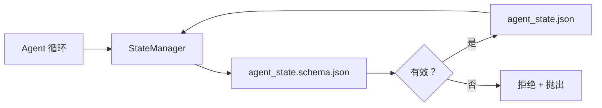

# 仓库记忆与持久状态

> 聊天记录是易失的。仓库是持久的。工作台将 agent 状态存储在带版本控制的文件中，以便下一次会话、下一个 agent 和下一个审查者都从同一个真相来源读取。

**类型：** 构建
**语言：** Python（标准库 + `jsonschema` 可选）
**前置课程：** 第 14 阶段 · 32（最小工作台）
**时间：** 约 60 分钟

## 学习目标

- 定义什么属于仓库记忆，什么属于聊天记录。
- 为 `agent_state.json` 和 `task_board.json` 编写 JSON Schema。
- 构建一个状态管理器，能够加载、验证、变更并以原子方式持久化状态。
- 使用 schema 拒绝错误写入，防止其损坏工作台。

## 问题

Agent 完成了一次会话。聊天关闭。下一次会话打开并询问从哪里开始。模型说"让我检查一下文件"，读取过时的笔记，重新做已经完成的工作。或者更糟，它重写了一个已完成的文件，因为没有人告诉它那个文件已经完成了。

工作台的解决方案是仓库记忆：状态存在于仓库中的 JSON 文件里，按 schema 写入，原子持久化，在代码审查中对 diff 友好。聊天是瞬时的信息流；仓库是记录系统。

## 概念



### 什么属于仓库记忆

| 属于 | 不属于 |
|------|-------|
| 活跃任务 ID | 原始聊天记录 |
| 本次会话涉及的文件 | Token 级别的推理轨迹 |
| Agent 做出的假设 | "用户似乎很沮丧" |
| 开放的阻塞项 | 采样的补全结果 |
| 下一步行动 | 供应商特定的模型 ID |

测试标准是持久性：这个东西三个月后在一次 CI 重运行中还有用吗？如果有用，放进仓库；如果没用，作为遥测记录。

### Schema 优先的状态

JSON Schema 是契约。没有它，每个 agent 都会发明新字段，每个审查者都要学习新结构，每个 CI 脚本都不得不对过去的版本做特殊处理。有了它，一次错误写入就是一次被拒绝的写入。

Schema 覆盖：

- 必需键。
- 允许的 `status` 值。
- 禁止的值（例如数组为 `null`）。
- 模式约束（任务 ID 匹配 `T-\d{3,}`）。
- 用于迁移的版本字段。

### 原子写入

状态写入需要容忍部分失败：写入临时文件，fsync，重命名覆盖目标。状态文件是真相来源；一个写了一半的文件比根本没有文件更糟糕。

### 迁移

当 schema 发生变化时，在 schema 版本号升级旁附带一个迁移脚本。状态文件携带一个 `schema_version` 字段；管理器拒绝加载来自一个它无法迁移的版本的文件。

## 构建

`code/main.py` 实现：

- `agent_state.schema.json` 和 `task_board.schema.json`。
- 一个仅限标准库的验证器（JSON Schema 子集：required、type、enum、pattern、items）。
- `StateManager.load`、`StateManager.update`、`StateManager.commit`，使用原子的临时文件写入加重命名。
- 一个演示：变更状态、持久化、重新加载，并证明往返一致性。

运行：

```
python3 code/main.py
```

脚本会写入 `workdir/agent_state.json` 和 `workdir/task_board.json`，在两次轮次中变更它们，并在每一步打印验证后的状态。

## 真实生产中的模式

四种模式将本课程的最小实现转变为多 agent 单体仓库可以生存的东西。

**原子临时文件加重命名不是可选的。** 2026 年 3 月的 Hive 项目 bug 报告清晰地记录了失败模式：`state.json` 通过 `write_text()` 写入且异常被捕获并静默处理。部分写入导致会话在损坏的状态上恢复运行，没有任何信号。解决方案始终是：在目标所在目录中使用 `tempfile.mkstemp`，写入，`fsync`，`os.replace`（POSIX 和 Windows 上的原子重命名）。本课程的 `atomic_write` 正是这样做的。

**每次非幂等工具调用上的幂等键。** 如果 agent 在调用一个工具之后、检查点记录结果之前崩溃，恢复时会重试该工具调用。对于读取是安全的；对于电子邮件、数据库插入、文件上传是危险的。模式是：在执行之前将每个工具调用 ID 记录到 `pending_calls.jsonl`。在重试时，检查该 ID；如果存在，跳过调用并使用缓存的结果。Anthropic 和 LangChain 都在 2026 年的指南中指出了这一点；LangGraph 的 checkpointer 出于同样的原因持久化待处理的写入。

**将大型产物与状态分离。** 不要在 `agent_state.json` 中存储 CSV、长记录或生成的文件。将产物保存为单独的文件（或上传到对象存储），只在状态中保留路径。检查点保持小而快，产物可以独立增长。

**事件溯源用于审计，快照用于恢复。** 在每次变更时追加到事件日志（`state.events.jsonl`）；定期快照到 `state.json`。恢复时读取快照，然后重放快照时间戳之后的任何事件。这会消耗更多磁盘空间，但让你可以逐字重放 agent 决策——在调试长周期运行时至关重要。与 Postgres 在内部使用 WAL 的模式相同。

**Schema 迁移，否则拒绝加载。** `schema_version` 整数是契约。当管理器加载一个未知版本的文件时，拒绝读取。在 schema 版本号升级旁附带一个迁移脚本；`tools/migrate_state.py` 在每次启动时幂等运行。

## 使用

在生产中：

- **LangGraph checkpointers。** 相同的想法，不同的存储方式。checkpointer 将图状态持久化到 SQLite、Postgres 或自定义后端。本课程教授的 schema 是当 checkpointer 失效且你需要手动读取状态时所用的东西。
- **Letta memory blocks。** 带有结构化 schema 的持久块（第 14 阶段 · 08）。相同的纪律，范围限定为长期运行的人格。
- **OpenAI Agents SDK session store。** 可插拔后端，支持 schema。本课程中的状态文件就是本地文件后端。

## 交付

`outputs/skill-state-schema.md` 生成项目特定的 JSON Schema 对（状态 + 任务板）、一个连接到原子写入的 Python `StateManager` 以及一个迁移脚手架，以便下一次 schema 升级不会破坏工作台。

## 练习

1. 添加一个 `last_human_touch` 时间戳。人类编辑后五秒内拒绝任何 agent 写入。
2. 扩展验证器以支持 `oneOf`，使任务可以是构建任务或审查任务，具有不同的必需字段。
3. 添加一个 `schema_version` 字段，编写从 v1 到 v2 的迁移（将 `blockers` 重命名为 `risks`）。
4. 将存储后端从本地文件迁移到 SQLite。保持 `StateManager` API 完全相同。
5. 运行两个 agent 对同一个状态文件进行 50 毫秒的写入竞争。出了什么问题？原子重命名如何保护你？

## 关键术语

| 术语 | 人们怎么说 | 实际含义 |
|------|-----------|---------|
| 仓库记忆 | "笔记文件" | 在仓库中受跟踪文件里、受 schema 管理的状态 |
| Schema 优先 | "验证输入" | 在写入者之前定义契约，拒绝偏离 |
| 原子写入 | "只是重命名" | 写入临时文件、fsync、重命名，这样部分失败无法损坏数据 |
| 迁移 | "Schema 版本升级" | 一个脚本，将 vN 版本的状态转为 v(N+1) 版本的状态 |
| 记录系统 | "真相来源" | 工作台视为权威的产物 |

## 进一步阅读

- [JSON Schema specification](https://json-schema.org/specification.html)
- [LangGraph checkpointers](https://langchain-ai.github.io/langgraph/concepts/persistence/)
- [Letta memory blocks](https://docs.letta.com/concepts/memory)
- [Fast.io, AI Agent State Checkpointing: A Practical Guide](https://fast.io/resources/ai-agent-state-checkpointing/) — 带有幂等性的 schema 优先检查点
- [Fast.io, AI Agent Workflow State Persistence: Best Practices 2026](https://fast.io/resources/ai-agent-workflow-state-persistence/) — 并发控制、TTL、事件溯源
- [Hive Issue #6263 — 非原子 state.json 写入被静默忽略](https://github.com/aden-hive/hive/issues/6263) — 真实项目中的失败模式
- [eunomia, Checkpoint/Restore Systems: Evolution, Techniques, Applications](https://eunomia.dev/blog/2025/05/11/checkpointrestore-systems-evolution-techniques-and-applications-in-ai-agents/) — 从操作系统历史应用到 agent 的 CR 原语
- [Indium, 7 State Persistence Strategies for Long-Running AI Agents in 2026](https://www.indium.tech/blog/7-state-persistence-strategies-ai-agents-2026/)
- [Microsoft Agent Framework, Compaction](https://learn.microsoft.com/en-us/agent-framework/agents/conversations/compaction) — 供应商检查点管理器
- 第 14 阶段 · 08 — 记忆块与休眠期计算
- 第 14 阶段 · 32 — 本课程将其模式化的三文件最小结构
- 第 14 阶段 · 40 — 从同一 schema 读取的交接数据包
