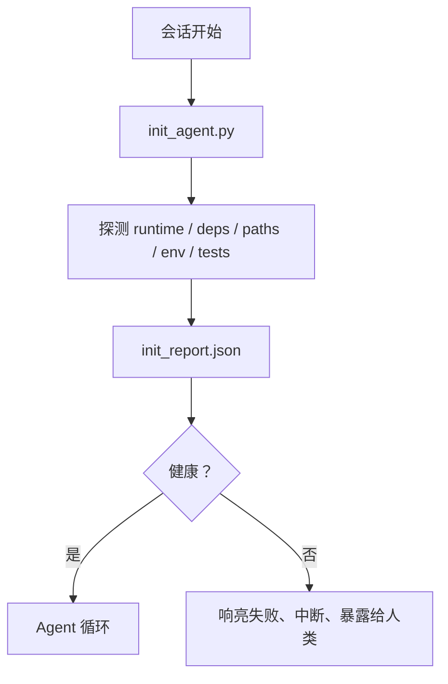

# Agent 初始化脚本

> 每次冷启动的会话都要付出税单。Agent 读取同样的文件，重试同样的探测，并重新发现同样的路径。初始化脚本一次性支付这笔税，并把答案写入状态。

**类型：** 构建
**语言：** Python（标准库）
**前置课程：** 第 14 阶段 · 32（最小工作台）、第 14 阶段 · 34（仓库记忆）
**时间：** 约 45 分钟

## 学习目标

- 识别 agent 永远不应该每次会话重新做的工作。
- 构建一个确定性的初始化脚本，探测运行时、依赖和仓库健康状况。
- 持久化探测结果，以便 agent 读取它而不是重新运行检查。
- 在初始化失败时，响亮地、快速地失败，并且只有一个地方可以查看。

## 问题

打开一次会话。Agent 猜测 Python 版本。猜测测试命令。把仓库根目录列出五次来找到入口点。尝试导入一个未安装的包。询问用户配置文件在哪里。到它做出真正编辑的时候，已经有一万个 token 花在了本应是一个单一脚本的设置工作上。

解决方案是一个初始化脚本，在 agent 做任何其他事情之前运行，并写入一个 `init_report.json`，agent 在启动时读取。

## 概念



### 初始化脚本探测什么

| 探测 | 为什么重要 |
|------|----------|
| 运行时版本 | 错误的 Python 或 Node 版本意味着静默的错版 Bug |
| 依赖可用性 | 缺失的包后期修复成本是现在捕获的十倍 |
| 测试命令 | Agent 必须知道如何验证；如果命令缺失，工作台就是坏的 |
| 仓库路径 | 硬编码的路径会发生偏离；一次性解析并固定 |
| 环境变量 | 缺失 `OPENAI_API_KEY` 是一个故障面，而不是运行时谜题 |
| 状态和任务板新鲜度 | 崩溃会话留下的陈旧状态是一个陷阱 |
| 上一个已知良好的提交 | 会话结束时交接差异的锚点 |

### 响亮、快速、在一个地方失败

探测失败意味着中断并暴露给人类。没有"agent 会自己解决的"。初始化的全部意义就是在工作台损坏时拒绝启动。

### 幂等

连续运行两次。第二次运行除了刷新的时间戳外应该是无操作。幂等性是让你将脚本接入 CI、钩子或任务前斜杠命令的东西。

### 初始化与启动规则

规则（第 14 阶段 · 33）描述行动前必须满足什么。初始化是确立这些规则可以被检查的脚本。没有初始化的规则会变成"要小心"。没有规则的初始化会变成一个精致的失败。

## 构建

`code/main.py` 实现 `init_agent.py`：

- 五个探测：Python 版本、通过 `importlib.util.find_spec` 列出依赖、测试命令可解析性、必需的 env 变量、状态文件新鲜度。
- 每个探测返回 `(name, status, detail)`。
- 脚本写入 `init_report.json`，包含完整的探测集；如果任何 block 严重性的探测失败，则以非零退出。

运行：

```
python3 code/main.py
```

脚本打印探测表、写入 `init_report.json`，在正常路径上以零退出，或在探测失败时以非零退出并列出失败的探测。

## 真实生产中的模式

三种模式区分了一个有用的初始化脚本和一种仪式。

**上一个已知良好提交锚定。** 探测当前提交与一个由上次成功合并写入的 `LKG` 文件进行对比。如果差异超出预算（默认为 50 个文件），拒绝启动并要求人类确认新的基线。这是 Cloudflare AI 代码审查用于限定审查 agent 范围的做法：每次审查会话锚定在同一个上一个已知良好提交上，从不在各会话间累积偏离。

**带 TTL 的锁文件。** 在第一次成功的探测通过后写入一个 `prereqs.lock`。后续运行信任该锁 N 小时（默认 24 小时）并跳过昂贵的探测。初始化脚本首先读取锁文件；如果它是新鲜的且依赖清单的哈希匹配，则短路。这是 Docker 用于层缓存的相同模式：幂等探测 + 内容哈希 = 跳过。

**热路径中没有网络、没有 LLM、没有意外。** 初始化探测是确定性的基础设施。一个调用 LLM 来分类故障或访问外部服务来检查许可证的探测不是探测；它是一个工作流。如果一个探测在干运行中超过三秒，将其视为工作台异味，要么将其移出初始化，要么缓存其结果。

## 使用

在生产中：

- **Claude Code 钩子。** `pre-task` 钩子调用初始化脚本，如果失败则拒绝启动 agent。
- **GitHub Actions。** 一个 `setup-agent` 作业运行初始化脚本；agent 作业依赖它。
- **Docker 入口点。** Agent 容器在 exec 进入 agent 运行时之前运行初始化脚本；失败时输出日志。

初始化脚本是可移植的，因为它不调用任何特定框架。Bash、Make 或任务文件都可以包装它。

## 交付

`outputs/skill-init-script.md` 采访项目，将其设置工作归类为探测，并发出一个项目特定的 `init_agent.py` 以及一个在任何 agent 步骤之前运行它的 CI 工作流。

## 练习

1. 添加一个探测，将当前提交与上一个已知良好提交进行 diff，如果超过 50 个文件发生变化则拒绝启动。
2. 将脚本接入写入 `prereqs.lock` 文件，如果锁文件超过七天则拒绝启动。
3. 添加一个 `--fix` 标志，自动安装缺失的开发依赖，但在没有审批的情况下从不修改运行时依赖。
4. 将探测从硬编码函数迁移到 YAML 注册表。论证这种权衡。
5. 为每个探测添加计时预算。一个运行超过三秒的探测是工作台异味。

## 关键术语

| 术语 | 人们怎么说 | 实际含义 |
|------|-----------|---------|
| 探测 | "一个检查" | 一个返回 `(name, status, detail)` 的确定性函数 |
| 初始化报告 | "设置输出" | 在状态文件旁写入的包含探测结果的 JSON |
| 幂等 | "安全重新运行" | 连续两次运行产生除时间戳外相同的报告 |
| 响亮失败 | "不要吞掉" | 中断并暴露给人类；没有静默回退 |
| 设置税 | "启动成本" | Agent 每次会话用于重新发现显而易见内容的 token |

## 进一步阅读

- [Anthropic, Effective harnesses for long-running agents](https://www.anthropic.com/engineering/effective-harnesses-for-long-running-agents)
- [GitHub Actions, composite actions for setup](https://docs.github.com/en/actions/sharing-automations/creating-actions/creating-a-composite-action)
- [microservices.io, GenAI dev platform: guardrails](https://microservices.io/post/architecture/2026/03/09/genai-development-platform-part-1-development-guardrails.html) — pre-commit + CI 检查作为初始化
- [Augment Code, How to Build Your AGENTS.md (2026)](https://www.augmentcode.com/guides/how-to-build-agents-md) — 初始化期望
- [Codex Blog, Codex CLI Context Compaction](https://codex.danielvaughan.com/2026/03/31/codex-cli-context-compaction-architecture/) — 会话启动作为考虑压缩的初始化
- 第 14 阶段 · 33 — 此脚本所启用的规则集
- 第 14 阶段 · 34 — 此脚本所初始化的状态文件
- 第 14 阶段 · 38 — 初始化脚本所供给的验证门
- 第 14 阶段 · 40 — 消费初始化报告中"上一个已知良好"的交接
