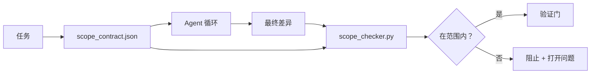

# 范围契约与任务边界

> 模型不知道工作在哪里结束。范围契约是一个按任务的文件，说明工作从哪里开始、在哪里结束，以及如果溢出如何回滚。契约将"保持在范围内"从愿望变成了一项检查。

**类型：** 构建
**语言：** Python（标准库）
**前置课程：** 第 14 阶段 · 32（最小工作台）、第 14 阶段 · 33（规则即约束）
**时间：** 约 50 分钟

## 学习目标

- 编写一份范围契约，agent 在任务开始时读取，验证器在任务结束时读取。
- 指定允许的文件、禁止的文件、验收标准、回滚计划和审批边界。
- 实现一个范围检查器，将差异与契约对比并标记违规。
- 使范围蔓延变得可见、自动且可审查。

## 问题

Agent 会蔓延。任务是"修复登录 bug"。差异涉及登录路由、电子邮件助手、数据库驱动、README 和发布脚本。每一次触及在当时都有合理的理由。但合在一起，它们是一个与审查过的变更不同的变更。

范围蔓延是 agent 工作中最缺乏监控的失败模式，因为 agent 每一步都以善意进行叙述。解决方案不是更严格的提示，而是磁盘上的一份契约，说明承诺了什么，以及一个将结果与承诺对比的检查。

## 概念



### 范围契约中有什么

| 字段 | 目的 |
|------|------|
| `task_id` | 链接到任务板上的任务 |
| `goal` | 审查者可以验证的一句话 |
| `allowed_files` | Agent 可以写入的 Glob 模式 |
| `forbidden_files` | Agent 即使在偶然情况下也绝不能触碰的 Glob 模式 |
| `acceptance_criteria` | 证明完成的测试命令或断言行 |
| `rollback_plan` | 如果需要中断，操作者可以执行的一段回滚方案 |
| `approvals_required` | 需要明确人工签批的范围外行动 |

没有 `forbidden_files` 的契约是不完整的。否定空间是契约的一半。

### Glob 模式，不是原始路径

真实仓库会移动文件。将契约固定到 glob 模式（`app/**/*.py`、`tests/test_signup*.py`），以便会话之间的重构不会使契约失效。

### 回滚是范围的一部分

列出如何回滚强制契约作者思考可能出错的地方。一份你无法从中回滚的契约是一份不应该被批准的契约。

### 范围检查是差异检查

Agent 写出一份差异。检查器读取差异、允许的 glob、禁止的 glob 以及任何已运行的验收命令列表。每个违规都是一个标记的发现，验证门可以拒绝。

### 范围的两个高度：功能列表和任务契约

范围契约界定一个任务。它不界定项目。一个 Agent 可以在登录修复的契约内完全合规，但在下一轮仍然决定项目还需要一个设置页面、一个暗色模式切换和一次路由器的重写。契约从未被询问哪些工作在项目范围内，只被询问哪些文件在任务范围内。

那个第二个高度需要自己的原语：一个 `feature_list.json`，agent 在会话启动时读取。它是项目待办事项列表，作为机器可读、有序的文件。Agent 恰好选取一个 `status` 为 `todo` 的功能，将其 `id` 写入活动范围契约，并被禁止在同一会话中开启第二个功能。"一次一个功能"不再是提示中可以理性忽略的一行，而成为它从磁盘读取的值和一个门强制执行的检查。

```json
{
  "project": "knowledge-base",
  "active": "import-pdf",
  "features": [
    { "id": "import-pdf",   "status": "in_progress", "goal": "将 PDF 导入知识库",        "done_when": "pytest tests/test_import.py && 示例 PDF 出现在知识库视图中" },
    { "id": "full-text-search", "status": "todo",     "goal": "搜索文档文本并对命中排序",   "done_when": "查询返回带有片段排名的结果" },
    { "id": "cite-answers", "status": "todo",         "goal": "答案带有源引用",        "done_when": "每个答案渲染至少一个可点击引用" }
  ]
}
```

| 字段 | 目的 |
|------|------|
| `active` | 当前会话可以触及的唯一功能；空意味着选择一个并设置它 |
| `features[].id` | 范围契约的 `task_id` 指向的稳定短标签 |
| `features[].status` | `todo`、`in_progress`、`done`、`blocked`；一次只能有一个 `in_progress` |
| `features[].goal` | 审查者可以验证的一句话 |
| `features[].done_when` | 将 `in_progress` 翻转为 `done` 的验收行 |

两条规则让列表成为承重的而非装饰性的。首先，"最多一个 `in_progress`"的不变量本身是一个启动检查（第 14 阶段 · 33）：如果列表显示两个，会话拒绝启动，直到人类解决它。其次，功能列表是一个文件，而不是聊天消息，因为聊天内容会滚出上下文而文件在会话和 agent 之间持久。交接（第 14 阶段 · 40）将完成功能的状态写回 `done`，以便下一次会话打开到一个准确的看板，而不是重新推断还剩下什么。

契约和列表通过最小权限组合，与下文描述的合并相同：任务契约的 `allowed_files` 必须位于活动功能可以触及的范围内，绝不能超出。

## 构建

`code/main.py` 实现：

- `scope_contract.json` schema（JSON Schema 子集，glob 数组）。
- 一个差异解析器，将被触及的文件和已运行命令的列表转换为 `RunSummary`。
- 一个 `scope_check`，返回针对契约的 `(violations, in_scope, off_scope)`。
- 两个演示运行：一个保持在范围内，一个蔓延。检查器以确切的文件和原因标记蔓延。

运行：

```
python3 code/main.py
```

输出：契约、两次运行、每次运行的裁决，以及保存的 `scope_report.json`。

## 真实生产中的模式

一位实践者报告"specsmaxxing"（在调用 agent 前用 YAML 编写范围契约）使工作流钻入兔子洞的比率在三周内从 52% 降至 21%，而没有改变 agent。是契约做了工作，而不是模型。三种模式使这种收益持久。

**违规预算，而不是二元失败。** `agent-guardrails`（由 Claude Code、Cursor、Windsurf、Codex 通过 MCP 使用的 OSS 合并门）为每个任务提供 `violationBudget`：预算内的小范围滑移作为警告呈现；只有在超出预算时合并门才拒绝。配合 `violationSeverity: "error" | "warning"` 使用。预算是能被团队接受的合并门和让团队讨厌然后禁用的合并门之间的区别。

**按路径类的严重性不对称。** 对 `docs/**` 的范围外写入通常是 `warn`；对 `scripts/**`、`migrations/**`、`config/prod/**` 的范围外写入始终是 `block`。这种不对称必须存在于契约中，而不是运行时中，因为它是项目特定的并且每个任务不同。

**文件预算旁的时间和网络预算。** `time_budget_minutes` 字段限制墙上时钟；运行时在超出后拒绝继续，除非重新审批。一个对主机名的 `network_egress` 允许列表防止 agent 悄悄访问任务未涉及的某个外部 API。这些也是范围维度；文件 glob 是必要的，但不是充分的。

**多契约合并语义（最小权限）。** 当两个范围契约同时适用（例如，一个项目级契约加一个任务特定契约），合并规则是：**交集** `allowed_files`（两个契约都必须允许路径），**并集** `forbidden_files`（任一可以禁止），`time_budget_minutes` 取最严格的（最小值），`approvals_required` 累积。`network_egress` 为 `None` 时表示不强制执行，`[]` 表示全部禁止，`[...]` 作为允许列表；合并时，`None` 遵从另一方，两个列表取交集，全部禁止保持全部禁止。在契约 schema 中声明这一点，以便合并是机械且可审查的。

## 使用

生产模式：

- **Claude Code 斜杠命令。** `/scope` 命令写入契约并将其作为会话上下文固定。子 agent 在行动前读取契约。
- **GitHub PR。** 将契约作为 JSON 文件推送到 PR 正文中或作为签入产物。CI 对合并差异运行范围检查器。
- **LangGraph interrupts。** 范围违规触发中断；处理程序询问人类契约需要扩大还是 agent 需要退后。

契约随任务一起移动。当任务关闭时，契约归档到 `outputs/scope/closed/` 下。

## 交付

`outputs/skill-scope-contract.md` 为任务描述生成范围契约，以及一个在 CI 中对每次 agent 差异运行的范围感知检查器。

## 练习

1. 添加一个列出允许的外部主机的 `network_egress` 字段。拒绝触及其他主机的运行。
2. 扩展检查器，对 `docs/**` 软失败，对 `scripts/**` 硬失败。论证这种不对称。
3. 使契约使用静态规则集（无 LLM）从 `goal` 字段推导 `allowed_files`。第一个边界情况下会出什么问题？
4. 添加一个 `time_budget_minutes`，在墙上时钟超过它时拒绝继续。
5. 对同一个差异运行两个契约。当两者都适用时，正确的合并语义是什么？

## 关键术语

| 术语 | 人们怎么说 | 实际含义 |
|------|-----------|---------|
| 范围契约 | "任务简报" | 列出允许/禁止文件、验收标准和回滚计划的按任务 JSON |
| 范围蔓延 | "它还触及了……" | 在同一任务中被更改的契约范围外文件 |
| 回滚计划 | "我们可以撤销" | 中断时的单段操作员操作手册 |
| 审批边界 | "需要签批" | 契约中列为需要明确人工审批的行动 |
| 差异检查 | "路径审计" | 将被触及的文件与契约 glob 进行对比 |

## 进一步阅读

- [LangGraph human-in-the-loop interrupts](https://langchain-ai.github.io/langgraph/concepts/human_in_the_loop/)
- [OpenAI Agents SDK tool approval policies](https://platform.openai.com/docs/guides/agents-sdk)
- [logi-cmd/agent-guardrails — 合并门与范围验证](https://github.com/logi-cmd/agent-guardrails) — 违规预算、严重性层级
- [Dev|Journal, Preventing AI Agent Configuration Drift with Agent Contract Testing](https://earezki.com/ai-news/2026-05-05-i-built-a-tiny-ci-tool-to-keep-ai-agent-configs-from-drifting-in-my-repo/) — 没有外部依赖的 `--strict` 模式
- [Agentic Coding Is Not a Trap (生产日志)](https://dev.to/jtorchia/agentic-coding-is-not-a-trap-i-answered-the-viral-hn-post-with-my-own-production-logs-33d9) — 规格最大化效果数据：52% → 21%
- [OpenCode permission globs](https://opencode.ai/docs/agents/) — 细粒度按权限范围
- [Knostic, AI Coding Agent Security: Threat Models and Protection Strategies](https://www.knostic.ai/blog/ai-coding-agent-security) — 范围作为最小权限的一部分
- [Augment Code, AI Spec Template](https://www.augmentcode.com/guides/ai-spec-template) — 三层边界系统（must/ask/never）
- 第 14 阶段 · 27 — 与范围锁配合的提示注入防御
- 第 14 阶段 · 33 — 此契约按任务特化的规则集
- 第 14 阶段 · 38 — 检查器所报告的验证门
