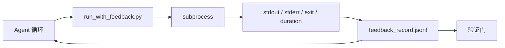

# 运行时反馈回路

> 看不到真实命令输出的 agent 在猜测。反馈运行器捕获 stdout、stderr、退出码和耗时，转化为结构化记录供下一轮读取。然后 agent 对事实作出反应，而不是对自己对事实的预测作出反应。

**类型：** 构建
**语言：** Python（标准库）
**前置课程：** 第 14 阶段 · 32（最小工作台）、第 14 阶段 · 35（初始化脚本）
**时间：** 约 50 分钟

## 学习目标

- 区分运行时反馈与可观测性遥测。
- 构建一个包装 Shell 命令并持久化结构化记录的反馈运行器。
- 确定性地截断大输出，使循环保持在 token 预算内。
- 在反馈缺失时拒绝推进循环。

## 问题

Agent 说"正在运行测试"。下一条消息说"所有测试通过"。现实是根本没有测试运行。Agent 想象了输出，或者它运行了命令但从未读取结果，或者它读取了结果并静默截断了失败行。

反馈运行器消除了这个差距。每个命令都通过运行器。每条记录都携带命令、捕获的 stdout 和 stderr、退出码、墙上时钟耗时，以及一行 agent 注释。Agent 在下一轮读取记录。验证门在任务结束时读取记录。

## 概念



### 反馈记录里有什么

| 字段 | 为什么重要 |
|------|----------|
| `command` | 精确的 argv，没有 shell 扩展意外 |
| `stdout_tail` | 最后 N 行，确定性截断 |
| `stderr_tail` | 最后 N 行，与 stdout 分开 |
| `exit_code` | 明确的成功信号 |
| `duration_ms` | 暴露慢探测和失控进程 |
| `started_at` | 用于重放的时间戳 |
| `agent_note` | Agent 关于它预期结果的一行注释 |

### 截断是确定性的

一个 50 MB 的日志会摧毁循环。运行器用 `...truncated N lines...` 标记截断头部和尾部，是确定性的，这样相同的输出总是产生相同的记录。不是采样；agent 需要看到的部分（最终错误、最终摘要）在尾部。

### 反馈与遥测

遥测（第 14 阶段 · 23，OTel GenAI 约定）是为人类操作者查看跨时间的运行。反馈是为这次运行的下一轮。它们共享字段但存在于不同的文件中，具有不同的保留策略。

### 没有反馈就拒绝推进

如果运行器在捕获退出码之前出错，记录携带 `exit_code: null` 和 `error: <reason>`。Agent 循环必须在 `null` 退出码上拒绝宣称成功。没有退出码，就没有进展。

## 构建

`code/main.py` 实现：

- `run_with_feedback(command, agent_note)`，包装 `subprocess.run`，捕获 stdout/stderr/exit/duration，确定性地截断，追加到 `feedback_record.jsonl`。
- 一个小型加载器，将 JSONL 流式加载到 Python 列表。
- 一个运行三个命令（成功、失败、慢）并打印每个命令最后记录的演示。

运行：

```
python3 code/main.py
```

输出：三个反馈记录追加到 `feedback_record.jsonl`，每个命令的最后一条内联打印。在重复运行时 tail 文件以查看循环的累积情况。

## 真实生产中的模式

三种模式加强了运行器使其达到可交付的级别。

**在写入时脱敏，而不是在读取时。** 任何触及 stdout 或 stderr 的记录都可能泄露秘密。运行器在 JSONL 追加之前部署一个脱敏步骤：剥离匹配 `^Bearer `、`password=`、`api[_-]?key=`、`AKIA[0-9A-Z]{16}`（AWS）、`xox[baprs]-`（Slack）的行。在读取时脱敏是一个陷阱；磁盘上的文件是攻击者会触及的。每季度对照生产运行时观察到的秘密格式审计脱敏模式。

**轮转策略，而不是单个文件。** 将 `feedback_record.jsonl` 上限设为 1 MB/文件；溢出时轮转到 `.1`、`.2`，丢弃 `.5`。Agent 的循环只读取当前文件，因此运行时成本是有界的。CI 产出存储获取完整的轮转集。没有轮转，文件会成为每次加载器调用的瓶颈。

**用于重试链的父命令 ID。** 每个记录获得 `command_id`；重试携带 `parent_command_id` 指向上一次尝试。审查者的"失败尝试"列表（第 14 阶段 · 40）和验证门的审计都遵循这个链条。没有这个链接，重试看起来像独立的成功，审计会隐藏失败历史。

## 使用

生产模式：

- **Claude Code Bash 工具。** 该工具已经捕获 stdout、stderr、exit 和 duration。本课中的运行器是对任何 agent 产品的框架无关等价物。
- **LangGraph 节点。** 将任何 shell 节点包裹在运行器中，使记录在图状态之外持久化。
- **CI 日志。** 将 JSONL 导入你的 CI 产出存储；审查者可以在不重新运行会话的情况下重放任何命令。

运行器是一个薄包装，在每次框架迁移中都能存活，因为它拥有记录的结构。

## 交付

`outputs/skill-feedback-runner.md` 生成项目特定的 `run_with_feedback.py`，带有正确的截断预算、连接到工作台的 JSONL 写入器，以及 agent 在每一轮读取的加载器。

## 练习

1. 为每个记录添加一个 `cwd` 字段，以便从不同目录运行的相同命令是可区分的。
2. 添加一个 `redaction` 步骤，剥离匹配 `^Bearer ` 或 `password=` 的行。在夹具记录上测试。
3. 通过轮转到 `.1`、`.2` 文件将 `feedback_record.jsonl` 总大小上限设为 1 MB。论证轮转策略。
4. 添加一个 `parent_command_id`，使重试链可见：哪个命令产生了下一个命令消费的输入。
5. 将 JSONL 导入一个微型 TUI，高亮显示最新的非零退出码。TUI 要显示才能对审查有用的八个关键特性。

## 关键术语

| 术语 | 人们怎么说 | 实际含义 |
|------|-----------|---------|
| 反馈记录 | "运行日志" | 包含命令、输出、退出码和耗时的结构化 JSONL 条目 |
| 尾部截断 | "裁剪日志" | 确定性头部+尾部捕获，使记录适应 token 预算 |
| 对 null 拒绝 | "对缺失数据阻止" | 当 `exit_code` 为 null 时，循环不得推进 |
| Agent 注释 | "期望标签" | Agent 在读取结果之前写下的一行预测 |
| 遥测分离 | "两个日志文件" | 反馈为下一轮，遥测为操作者 |

## 进一步阅读

- [OpenTelemetry GenAI semantic conventions](https://opentelemetry.io/docs/specs/semconv/gen-ai/)
- [Anthropic, Effective harnesses for long-running agents](https://www.anthropic.com/engineering/effective-harnesses-for-long-running-agents)
- [Guardrails AI x MLflow — 确定性安全、PII、质量验证器](https://guardrailsai.com/blog/guardrails-mlflow) — 作为回归测试的脱敏模式
- [Aport.io, Best AI Agent Guardrails 2026: Pre-Action Authorization Compared](https://aport.io/blog/best-ai-agent-guardrails-2026-pre-action-authorization-compared/) — 工具前/后捕获
- [Andrii Furmanets, AI Agents in 2026: Practical Architecture for Tools, Memory, Evals, Guardrails](https://andriifurmanets.com/blogs/ai-agents-2026-practical-architecture-tools-memory-evals-guardrails) — 可观测性层面
- 第 14 阶段 · 23 — 遥测方面的 OTel GenAI 约定
- 第 14 阶段 · 24 — agent 可观测性平台（Langfuse、Phoenix、Opik）
- 第 14 阶段 · 33 — 要求声明完成前必须有反馈的规则
- 第 14 阶段 · 38 — 读取 JSONL 的验证门
