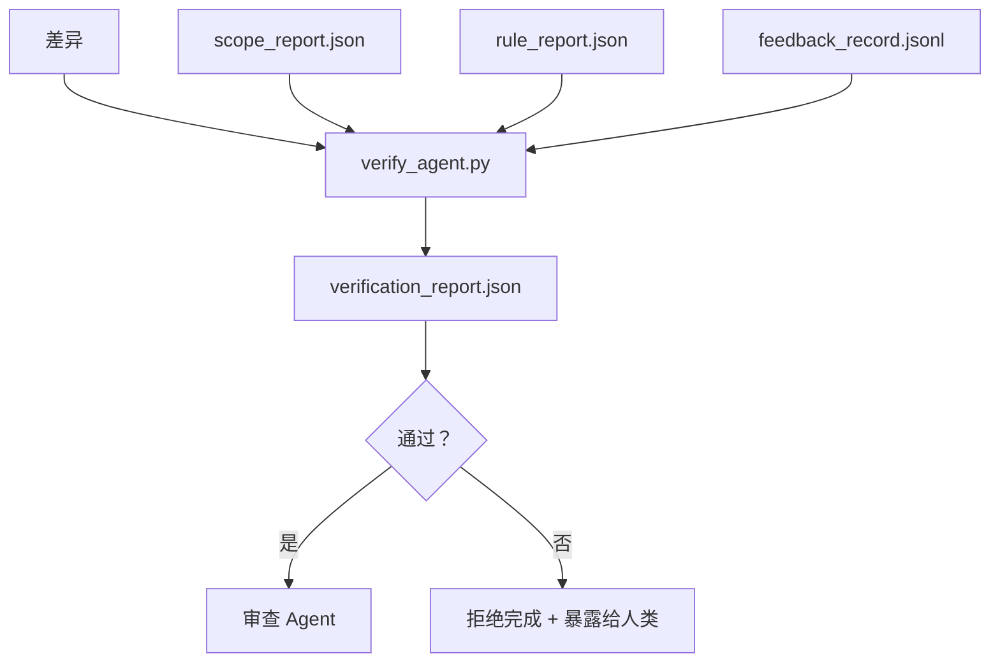

# 验证门

> Agent 不能标记自己的工作为已完成。验证门读取范围契约、反馈日志、规则报告和差异，并回答一个单一的问题：这个任务真的完成了吗？如果门说不，任务就没有完成，不管聊天里怎么说。

**类型：** 构建
**语言：** Python（标准库）
**前置课程：** 第 14 阶段 · 33（规则）、第 14 阶段 · 36（范围）、第 14 阶段 · 37（反馈）
**时间：** 约 55 分钟

## 学习目标

- 将验证门定义为一个基于工作台产物的确定性函数。
- 将规则报告、范围报告、反馈记录和差异合并为单一裁决。
- 发出一份审查 agent 和 CI 都可以读取的 `verification_report.json`。
- 对任何 block 严重性的失败拒绝推进任务，无一例外。

## 问题

Agent 太容易宣称成功。三种失败形态占主导地位：

- "看起来不错。"模型读取了自己的差异并判定它是正确的。
- "测试通过了。"说得很有信心。没有测试实际运行的记录。
- "验收已达成。"验收标准被解释得足够宽松，以至于意味着"任何看起来做完的事情"。

工作台的解决方案是单一的验证门，它读取 agent 已经产生的产物并做出判断。门是确定性的。门在版本控制中。门接入 CI。Agent 无法贿赂它。

## 概念



### 门检查的内容

| 检查 | 源产物 | 严重性 |
|------|-------|-------|
| 所有验收命令已运行 | `feedback_record.jsonl` | block |
| 所有验收命令以零退出 | `feedback_record.jsonl` | block |
| 范围检查没有禁止写入 | `scope_report.json` | block |
| 范围检查没有范围外写入 | `scope_report.json` | block 或 warn |
| 所有 block 严重性规则通过 | `rule_report.json` | block |
| 反馈中没有 `null` 退出码 | `feedback_record.jsonl` | block |
| 触及的文件匹配 `scope.allowed_files` | 两者 | warn |

一个 `warn` 发现会注释裁决；一个 `block` 发现阻止 `passed: true`。

### 确定性，而非概率性

门必须为相同的产物集合每次都产生相同的裁决。没有 LLM 判断。LLM 判断属于审查端（第 14 阶段 · 39），其目标是定性评估，而不是状态。

### 一份报告、一条路径

门在每次任务关闭时发出一份 `verification_report.json`，写入 `outputs/verification/<task_id>.json` 下。CI 消费相同的路径。有不同路径的多个门会分裂真相来源。

### 拒绝，无一例外

Block 严重性发现不能被 agent 覆盖。它们只能被人类覆盖，带有记录的 `override_reason` 和一个 `overridden_by` 用户 ID。覆盖是一个签名变更，而不是 agent 决策。

## 构建

`code/main.py` 实现：

- 每种输入产物的加载器，全部在本地存根，因此课程是自包含的。
- 一个纯函数 `verify(task_id, artifacts) -> VerdictReport`。
- 一个显示每项检查结果和最终通过/失败的打印机。
- 一个包含三个任务场景的演示：干净通过、范围蔓延、缺失验收。

运行：

```
python3 code/main.py
```

输出：三份验证报告，每份保存在脚本旁边。

## 真实生产中的模式

四种模式将门从"另一个 lint 作业"提升为"决定性边界"。

**纵深防御，而非单一门。** Pre-commit hook → CI 状态检查 → 工具前授权 hook → 预合并门。每层都是确定性的，这样一层的失败会被下一层捕获。microservices.io 的 2026 年 3 月攻略是明确的：pre-commit hook 是不可绕过的，因为与模型端技能不同，它不依赖于 agent 遵循指令。验证门位于 CI / 预合并层。

**通过确定性检查防御，模型判断仅用于细微差别。** Anthropic 的 2026 年混合规范配对：可验证奖励（单元测试、schema 检查、退出码）回答"代码是否解决了问题？"——LLM 评分标准回答"代码是否可读、安全、风格一致？"门运行第一类检查；审查者（第 14 阶段 · 39）运行第二类。混合它们会混淆信号。

**签名覆盖日志，而不是 Slack 线程。** 每次覆盖在 `outputs/verification/overrides.jsonl` 中发出一行：时间戳、发现代码、原因、签名用户、当前 HEAD 提交。运行时会拒绝任何缺少签名的覆盖；审计轨迹由 git 跟踪。这是覆盖策略和覆盖空壳之间的界限。

**覆盖率底线作为第一类检查。** `coverage_report.json` 提供 `coverage_floor`（默认 80%）检查。如果实测覆盖率低于底线，或低于之前合并的底线超过 1 个百分点，门就会失败。没有这个检查，agent 会悄悄删除失败的测试，验证报告仍然显示绿色。

**`--strict` 模式将警告提升为 Block。** 对于发布分支、阻止交付的 PR 或事故后分诊，`--strict` 使每个警告变成硬失败。标志是按分支可选的；不是全局默认的，因为对所有事情严格运行会侵蚀日常工作流。

## 使用

生产模式：

- **CI 步骤。** 一个 `verify_agent` 作业对 agent 的最终产物运行门。合并保护在没有 `passed: true` 时拒绝。
- **交接前钩子。** Agent 运行器在生成交接文档前调用门。没有绿色裁决，就没有交接。
- **人工分诊。** 当 agent 宣称成功而人类怀疑时，操作者阅读报告。

门是工作台流程中的决定性边界。每个其他层面都在它的上游。

## 交付

`outputs/skill-verification-gate.md` 将门接入一个特定项目：哪些验收命令提供给它，哪些规则是 block 严重性，哪些范围外写入被容忍，覆盖审计日志如何存储。

## 练习

1. 添加 `coverage_floor` 检查：测试命令必须产生覆盖率至少 80% 的报告。决定哪个产物携带底线值。
2. 支持一个 `--strict` 模式，将每个 `warn` 提升为 `block`。文档化严格模式是正确默认的情况。
3. 让门除了 JSON 之外还产生 Markdown 摘要。论证哪些字段应包含在摘要中。
4. 添加 `time_since_last_human_touch` 检查：在人类击键 60 秒内编辑的任何文件豁免于范围外标记。
5. 对你产品中真实的 agent 差异运行门。有多少发现是真实的，有多少是噪声？门需要在哪里增长？

## 关键术语

| 术语 | 人们怎么说 | 实际含义 |
|------|-----------|---------|
| 验证门 | "阻止事情的检查" | 基于工作台产物产生通过/失败裁决的确定性函数 |
| Block 严重性 | "硬失败" | 阻止 `passed: true` 且需要签名覆盖的发现 |
| 覆盖日志 | "为什么我们让它通过" | 带原因和用户 ID 的签名条目，由审查审计 |
| 验收命令 | "证明" | 其零退出意味着"完成"的 Shell 命令 |
| 一条报告路径 | "真相来源" | `outputs/verification/<task_id>.json`，由 CI 和人类共同消费 |

## 进一步阅读

- [Anthropic, Harness design for long-running application development](https://www.anthropic.com/engineering/harness-design-long-running-apps)
- [OpenAI Agents SDK guardrails](https://platform.openai.com/docs/guides/agents-sdk/guardrails)
- [microservices.io, GenAI dev platform: guardrails](https://microservices.io/post/architecture/2026/03/09/genai-development-platform-part-1-development-guardrails.html) — pre-commit 和 CI 之间的纵深防御
- [ICMD, The 2026 Playbook for Agentic AI Ops](https://icmd.app/article/the-2026-playbook-for-agentic-ai-ops-guardrails-costs-and-reliability-at-scale-1776661990431) — 审批门阶梯（草稿 → 审批 → 阈值下自动）
- [Type-Checked Compliance: Deterministic Guardrails (arXiv 2604.01483)](https://arxiv.org/pdf/2604.01483) — Lean 4 作为确定性门控的上限
- [logi-cmd/agent-guardrails — 合并门规范](https://github.com/logi-cmd/agent-guardrails) — 范围 + 变异测试门
- [Guardrails AI x MLflow](https://guardrailsai.com/blog/guardrails-mlflow) — 作为 CI 评分器的确定性验证器
- [Akira, Real-Time Guardrails for Agentic Systems](https://www.akira.ai/blog/real-time-guardrails-agentic-systems) — 工具前/后门
- 第 14 阶段 · 27 — 提示注入防御（门的对抗伙伴）
- 第 14 阶段 · 36 — 此门强制执行的范围契约
- 第 14 阶段 · 37 — 此门评分的反馈日志
- 第 14 阶段 · 39 — 门移交的审查 agent
