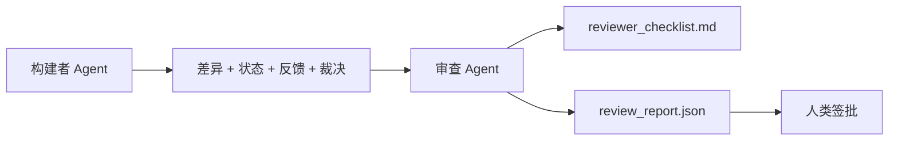

# 审查 Agent：将构建者与评分者分离

> 编写代码的 agent 不能给自己评分。审查者是第二个循环，具有不同的系统提示、不同的目标，以及对构建者产生的一切的只读访问权限。构建者和审查者之间的差距是大多数可靠性所在的地方。

**类型：** 构建
**语言：** Python（标准库）
**前置课程：** 第 14 阶段 · 38（验证门）
**时间：** 约 55 分钟

## 学习目标

- 陈述为什么同一个 agent 不能可靠地审查自己的工作。
- 构建一个消费构建者产物并发出结构化审查报告的审查 agent 循环。
- 撰写一个对具体维度而非感觉评分的审查评分标准。
- 将审查者接入工作台，使人类审查步骤从真实的产出产物开始。

## 问题

你让 agent 修复一个 Bug。它编辑了四个文件，运行了测试，并报告已完成。验证门（第 14 阶段 · 38）确认验收已运行且范围未溢出。门说 `passed: true`。你合并了。两天后你发现修复只解决了 Bug 错误的那一半。

验收是必要的，但不是充分的。审查者询问验收不能问的问题：这个方案解决了正确的问题吗？它是否扩大了范围而未标记？它是否记录了本应被质疑的假设？它是否把工作台留在了下一次会话可以接收的状态？

## 概念



### 审查评分标准

五个维度，每个评分 0 到 2。

| 维度 | 问题 |
|------|------|
| 问题匹配 | 更改是否解决了所述任务，而不是一个相近的任务？ |
| 范围纪律 | 编辑是否限制在契约内，还是契约被刻意扩大了？ |
| 假设 | 所有隐藏假设是否记录在了可审查的地方？ |
| 验证质量 | 验收命令是否真的证明了目标，还是证明了一个较弱的版本？ |
| 交接就绪 | 下一次会话能否从当前状态干净地接手？ |

总分 10 分。7 分以下为软失败；5 分以下为硬失败。

### 审查者是一个单独的角色，而不是一个单独的模型

你可以用与构建者相同的模型运行审查者。规律在于角色分离：不同的系统提示、不同的输入、没有对差异的写入权限。姿态的变化就是信号的变化。

### 审查者不能编辑差异

审查者读取差异、状态、反馈、裁决。它写一份报告。它不修改差异。如果报告说"修复这个"，下一个构建者轮次执行修复；审查者回到审查。混合角色会破坏差距。

### 审查评分标准与验证门

门（第 14 阶段 · 38）检查确定性事实：验收是否运行、规则是否通过、范围是否保持。审查者做出定性判断：这是正确的工作吗？是否文档化了？交接是否可用？两者都是必需的。

## 构建

`code/main.py` 实现：

- 一个 `ReviewerInputs` 数据类，捆绑审查者读取的产物。
- 一个评分标准评分器，每个维度一个函数。每个函数是确定性的，在本课程中为存根级别；实际实现会调用 LLM。
- 一个写入 `review_report.json` 的写入器，包含五个分数、总分和一个裁决（`pass`、`soft_fail`、`hard_fail`）。
- 两个演示案例：一个干净的更改和一个"正确的测试，错误的问题"的更改。

运行：

```
python3 code/main.py
```

输出：写入磁盘的两份审查报告和一个维度分数的控制台表格。

## 真实生产中的模式

数据证明：Cloudflare 2026 年 4 月的 AI 代码审查系统在 30 天内在 5,169 个仓库中对 48,095 个合并请求运行了 131,246 次审查。中位审查在 3 分 39 秒内完成。最多七个专业审查者（安全、性能、代码质量、文档、发布管理、合规、Engineering Codex）在一个审查协调者下并行运行，该协调者去重发现并判断严重性。顶级模型专供协调者使用；专业审查者在较便宜的层上运行。

四种模式使此大规模运作。

**专业池，而不是一个大审查者。** 一个有 5 个维度评分标准的审查者对独立仓库可行。一旦代码库有安全关键、性能关键和文档层面，就拆分为专业审查者，使用更小的提示。协调者进行去重；专业审查者从不需要运行完整评分标准。模型层级的分离随之而来：便宜的专业审查者，昂贵的协调者。

**偏差缓解作为设计要求，而非优化。** LLM 判断显示四种可靠偏差（Adnan Masood，2026 年 4 月）：位置偏差（GPT-4 在 (A,B) 与 (B,A) 排序上约 40% 不一致）、冗长偏差（约 15% 评分膨胀倾向更长的输出）、自我偏好（判断者偏好同模型系列的输出）、权威偏见（判断者会对知名作者的引用打分过高）。缓解措施：评估两种排序，只统计一致获胜；使用明确奖励简洁性的 1-4 分数；跨模型系列轮换判断者；评分前剥离作者名称。

**校准集，而不是感觉。** 一个 10-20 个任务的历史集合，带有已知的正确裁决。在每次提示变更时对它们运行审查者。如果与历史记录的一致性低于 80%，评分标准在审查者交付前需要修订。这是每个团队最终都会重新发现的东西；最好从一开始就有。

**与门的混合规范。** 验证门（第 14 阶段 · 38）处理确定性检查（验收是否运行、测试是否通过、范围是否保持）。审查者处理语义检查（这是正确的工作吗、假设是否记录、交接是否可用）。Anthropic 2026 年指南明确对于这种分离：不要让审查者重新做门已经证明的事情。

## 使用

生产模式：

- **Claude Code 子 agent。** 构建者关闭任务后，审查者子 agent 运行。它在 PR 上发布带有评分标准分数的评论。
- **OpenAI Agents SDK handoffs。** 构建者在任务完成时移交给审查者。审查者可以带着发现列表移交回去，或上传给人类。
- **双模型配对。** 构建者在更快、更便宜的模型上运行。审查者在更强、上下文更小的模型上运行，专注于判断。

审查者是工作台在人类无法亲自审查每个工作时培养出的第二双眼睛。

## 交付

`outputs/skill-reviewer-agent.md` 生成项目特定的审查评分标准、一个连接到构建者产物的审查 agent 存根，以及与验证门的集成，使人类审查从一份书面报告而非空白页开始。

## 练习

1. 添加一个特定于你产品领域的第六维度。论证为什么它不能被现有五个维度吸收。
2. 用两个不同的系统提示（简洁、冗长）运行审查者。哪个产生人类更可能阅读的报告？
3. 添加一个按维度的 `confidence` 字段。当最低维度的置信度低于 0.6 时，拒绝交付报告。
4. 构建一个校准集：10 个历史任务关闭，带有已知的正确裁决。对它们运行审查者。它在哪里与历史记录不一致？
5. 添加一个"请求更多证据"的能力：审查者可以在评分前要求构建者运行一个特定的测试。什么是最合适的回退机制，以避免无限循环？

## 关键术语

| 术语 | 人们怎么说 | 实际含义 |
|------|-----------|---------|
| 审查评分标准 | "检查清单" | 五个维度 0-2 评分，每个维度有书面问题 |
| 软失败 | "需要修订" | 总分低于 7；构建者获得需要处理的发现 |
| 硬失败 | "拒绝" | 总分低于 5 或任何维度为 0；中止并暴露给人类 |
| 角色分离 | "不同的提示" | 同一模型可以担当两种角色；规律在于输入和姿态 |
| 置信底线 | "不交付低信号报告" | 当评分标准不确定时拒绝发出裁决 |

## 进一步阅读

- [OpenAI Agents SDK handoffs](https://platform.openai.com/docs/guides/agents-sdk/handoffs)
- [Anthropic Claude Code subagents](https://docs.anthropic.com/en/docs/agents-and-tools/claude-code/sub-agents)
- [Cloudflare, Orchestrating AI Code Review at Scale](https://blog.cloudflare.com/ai-code-review/) — 7 专业审查者 + 协调者架构，131k 运行 / 30 天
- [Agent-as-a-Judge: Evaluating Agents with Agents (OpenReview / ICLR)](https://openreview.net/forum?id=DeVm3YUnpj) — DevAI 基准，366 层次化解决方案要求
- [Adnan Masood, Rubric-Based Evaluations and LLM-as-a-Judge: Methodologies, Biases, Empirical Validation](https://medium.com/@adnanmasood/rubric-based-evals-llm-as-a-judge-methodologies-and-empirical-validation-in-domain-context-71936b989e80) — 4 种偏差及缓解措施
- [MLflow, LLM-as-a-Judge Evaluation](https://mlflow.org/llm-as-a-judge) — 分离构建者/评估者的生产工具
- [LangChain, How to Calibrate LLM-as-a-Judge with Human Corrections](https://www.langchain.com/articles/llm-as-a-judge) — 校准集工作流
- [Evidently AI, LLM-as-a-judge: a complete guide](https://www.evidentlyai.com/llm-guide/llm-as-a-judge)
- [Arize, LLM as a Judge — Primer and Pre-Built Evaluators](https://arize.com/llm-as-a-judge/)
- 第 14 阶段 · 05 — Self-Refine 和 CRITIC（单 agent 自我审查基线）
- 第 14 阶段 · 30 — 评估驱动的 agent 开发（校准集生成器）
- 第 14 阶段 · 38 — 审查者读取的验证门
- 第 14 阶段 · 40 — 审查报告所供给的交接数据包
