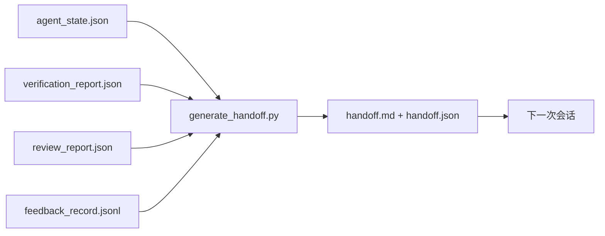

# 多会话交接

> 会话即将结束。工作没有结束。交接数据包是将"agent 工作了一小时"转变为"下一次会话在第一分钟内就高效运转"的产物。有目的地构建它，而不是作为马后炮。

**类型：** 构建
**语言：** Python（标准库）
**前置课程：** 第 14 阶段 · 34（仓库记忆）、第 14 阶段 · 38（验证）、第 14 阶段 · 39（审查者）
**时间：** 约 50 分钟

## 学习目标

- 确定每个交接数据包所需的七个字段。
- 从工作台产物生成交接，无需手写散文。
- 将大型反馈日志裁剪为交接大小的摘要。
- 使下一次会话的第一步行动确定化。

## 问题

会话结束。Agent 说"很好，我们取得了进展。"下一次会话打开。下一个 agent 问"我们上次停在哪里？"第一个 agent 的答案已经消失了。下一个 agent 重新发现、重新运行相同命令、重新向人类问同样的问题，并在恢复上一次会话最后三十秒的工作上烧掉三十分钟。

坏交接的成本在任务的整个生命周期中的每次会话都要支付。解决方案是一个会话结束时自动生成的数据包：做了什么改变、为什么、尝试了什么、什么失败了、还剩下什么、下一次先做什么。

## 概念



### 每个交接携带的七个字段

| 字段 | 回答的问题 |
|------|----------|
| `summary` | 一段做了什么 |
| `changed_files` | 一眼看清差异 |
| `commands_run` | 实际执行了什么 |
| `failed_attempts` | 尝试了什么以及为什么没有成功 |
| `open_risks` | 什么可能在下一次会话中产生影响，带有严重性 |
| `next_action` | 下一次会话采取的第一个具体步骤 |
| `verdict_pointer` | 指向验证 + 审查报告的路径 |

`next_action` 字段是承重的。一份除了 `next_action` 什么都没有的交接是状态报告，不是交接。

### 交接是生成的，不是写的

手写的交接是在艰难的一天会被跳过的交接。生成器读取工作台产物并发出数据包。Agent 的职责是把工作台留在生成器可以总结的状态，而不是写总结。

### 两种形式：人类可读和机器可读

`handoff.md` 是人类读的。`handoff.json` 是下一个 agent 加载的。两者都来自相同的源产物。如果它们分歧，JSON 胜出。

### 反馈日志裁剪

完整的 `feedback_record.jsonl` 可能有数百条目。交接只携带最后 K 条加上每个非零退出的条目。下一次会话在需要时加载完整日志，但数据包保持小巧。

### 留下一个干净的状态

交接描述所做的工作。干净的状态使工作可恢复。它们不是同一回事。一份完美的 `handoff.md` 如果下一次会话打开时面对的是半应用的差异、agent 遗忘的临时文件、游离的分支，以及甚至在运行之前就崩溃的测试，那它就是毫无价值的。下一个 agent 然后会花前十分钟清理上一个 agent 留下的烂摊子而不是构建东西，而且这个成本在任务的整个生命周期中的每次会话都会累积。

所以会话不是在功能奏效时结束的。它是在工作台处于生成器可以总结、下一次会话可以信任的状态时才结束。清理是它自己的阶段，在交接之前运行，而且它是一项检查，而不是一种习惯，因为习惯正是在艰难的一天被跳过的那个东西。

| 检查 | 干净意味着 | 脏会阻止因为 |
|------|----------|-----------|
| 工作树 | 每个更改已提交或显式暂存并有注释 | 半应用的差异在下一个 agent 看来像是有意为之的工作 |
| 临时产物 | 没有 `*.tmp`、草稿目录、调试打印或被注释掉的块残留 | 多余的文件污染了差异和下一个 agent 的心智模型 |
| 测试 | 绿色，或者红色且失败原因在 `open_risks` 中已命名 | 一个沉默的红色测试是下一次会话踩到的陷阱 |
| 功能看板 | `feature_list.json` 状态反映现实（第 14 阶段 · 36） | 一个陈旧的看板把下一次会话导向已完成的工作 |
| 分支 | 在预期分支上，没有分离 HEAD，没有孤立分支 | 错误的分支意味着下一次会话的第一次提交落在错误的地方 |

清理阶段发出一个包含阻塞问题的 `clean_state.json`；空列表是交接生成器在写入数据包前断言的先决条件。建立在脏工作树上的交接不是交接，它是一堆被转发的问题。两个产物配对：清理证明工作台可以安全地离开，交接证明下一次会话知道从哪里开始。

## 构建

`code/main.py` 实现：

- 一个加载器，将状态、裁决、审查和反馈收集到一个 `WorkbenchSnapshot` 中。
- 一个 `generate_handoff(snapshot) -> (markdown, payload)` 函数。
- 一个筛选器，选取最后 K 条反馈条目加上所有非零退出。
- 一个写入 `handoff.md` 和 `handoff.json` 在脚本旁边的演示运行。

运行：

```
python3 code/main.py
```

输出：打印的交接正文，以及磁盘上的两个文件。

## 真实生产中的模式

Codex CLI、Claude Code 和 OpenCode 各提供不同的压缩故事；结构化交接数据包位于三者的上层。

**压缩策略各不相同；数据包 Schema 不变。** Codex CLI 的 POST /v1/responses/compact 是一个服务器端不透明 AES blob（OpenAI 模型的快速路径）；回退是一个本地"交接摘要"追加为 `_summary` 用户角色消息。Claude Code 在 95% 上下文时运行五阶段渐进式压缩。OpenCode 做基于时间戳的消息隐藏加 5 标题 LLM 摘要。三种不同的机制，相同的需求：将压缩过程中存活的序列化为可移植的产物。数据包就是那个产物。

**新会话交接不是压缩。** 压缩延长一个会话；交接干净地关闭一个会话并开始下一个。Hermes Issue #20372 的表述（2026 年 4 月）是正确的：当原地压缩开始退化时，agent 应该写入一个紧凑的交接，结束会话，并在新上下文中恢复。数据包是使这种转换成本低廉的东西。错误是不断压缩直到质量崩溃；解决方案是为一次早期、干净的交接做预算。

**每个分支和主题有一个活跃交接。** 多 agent 协作在陈旧交接上比在坏的模型输出上更容易崩溃。始终包含 `branch`、`last_known_good_commit` 和一个 `status` 为 `active | superseded | archived`。陈旧的交接被归档；只有活跃的交接驱动下一次会话。这是交接作为笔记和交接作为状态之间的区别。

**在 50-75% 上下文时收尾，而不是在墙边上。** 手写模式攻略（CLAUDE.md + HANDOVER.md）报告当会话以 50-75% 的上下文预算而非 95% 结束时效果最好。数据包生成器在压缩产物污染源状态之前干净地运行。当上下文完好时写入便宜；当模型已经在丢失位置时很昂贵。

## 使用

生产模式：

- **会话结束钩子。** 运行时在用户关闭聊天时触发生成器。数据包进入 `outputs/handoff/<session_id>/`。
- **PR 模板。** 生成器的 markdown 也是 PR 正文。审查者无需打开五个其他文件即可阅读它。
- **跨 agent 交接。** 用一个产品构建（Claude Code），用另一个继续（Codex）。数据包是通用语言。

数据包小巧、规律且生产成本低廉。成本节省随每次会话累积。

## 交付

`outputs/skill-handoff-generator.md` 产生一个为项目产物路径调优的生成器、一个运行它的会话结束钩子，以及下一个 agent 在启动时读取的 `handoff.json` schema。

## 练习

1. 添加一个 `assumptions_to_validate` 字段，展示构建者记录的但审查者评分未超过 1 的每个假设。
2. 对失败运行和通过运行不同地修剪反馈摘要。论证这种不对称。
3. 包含一个"对人类的问题"列表。一个问题进入数据包与进入聊天消息的阈值是什么？
4. 使生成器幂等：运行两次产生相同的数据包。需要什么保持稳定才能保持这一点？
5. 添加一个"下一次会话前置条件"部分，列出下一次会话行动前必须加载的确切产物。

## 关键术语

| 术语 | 人们怎么说 | 实际含义 |
|------|-----------|---------|
| 交接数据包 | "会话摘要" | 携带七个字段的生成产物，包含 markdown 和 JSON |
| 下一步行动 | "先做什么" | 启动下一次会话的一个具体步骤 |
| 反馈修剪 | "日志摘要" | 最后 K 条记录加上每个非零退出 |
| 状态报告 | "我们做了什么" | 缺少 `next_action` 的文档；有用，但不是交接 |
| 裁决指针 | "收据" | 指向验证 + 审查报告的路径，用于可追溯性 |

## 进一步阅读

- [Anthropic, Effective harnesses for long-running agents](https://www.anthropic.com/engineering/effective-harnesses-for-long-running-agents)
- [OpenAI Agents SDK handoffs](https://platform.openai.com/docs/guides/agents-sdk/handoffs)
- [Codex Blog, Codex CLI Context Compaction: Architecture, Configuration, Managing Long Sessions](https://codex.danielvaughan.com/2026/03/31/codex-cli-context-compaction-architecture/) — POST /v1/responses/compact 和本地回退
- [Justin3go, Shedding Heavy Memories: Context Compaction in Codex, Claude Code, OpenCode](https://justin3go.com/en/posts/2026/04/09-context-compaction-in-codex-claude-code-and-opencode) — 三个供应商的压缩比较
- [JD Hodges, Claude Handoff Prompt: How to Keep Context Across Sessions (2026)](https://www.jdhodges.com/blog/ai-session-handoffs-keep-context-across-conversations/) — CLAUDE.md + HANDOVER.md，50-75% 上下文预算
- [Mervin Praison, Managing Handoffs in Multi-Agent Coding Sessions: Fresh Context Without Losing Continuity](https://mer.vin/2026/04/managing-handoffs-in-multi-agent-coding-sessions-fresh-context-without-losing-continuity/) — 分布式系统框架
- [Hermes Issue #20372 — 当压缩变得有风险时自动新会话交接](https://github.com/NousResearch/hermes-agent/issues/20372)
- [Hermes Issue #499 — Context Compaction Quality Overhaul](https://github.com/NousResearch/hermes-agent/issues/499) — Codex CLI 中面向交接的提示
- [Microsoft Agent Framework, Compaction](https://learn.microsoft.com/en-us/agent-framework/agents/conversations/compaction)
- [OpenCode, Context Management and Compaction](https://deepwiki.com/sst/opencode/2.4-context-management-and-compaction)
- [LangChain, Context Engineering for Agents](https://www.langchain.com/blog/context-engineering-for-agents)
- 第 14 阶段 · 34 — 生成器读取的状态文件
- 第 14 阶段 · 38 — 数据包指向的验证裁决
- 第 14 阶段 · 39 — 打包到数据包中的审查报告
