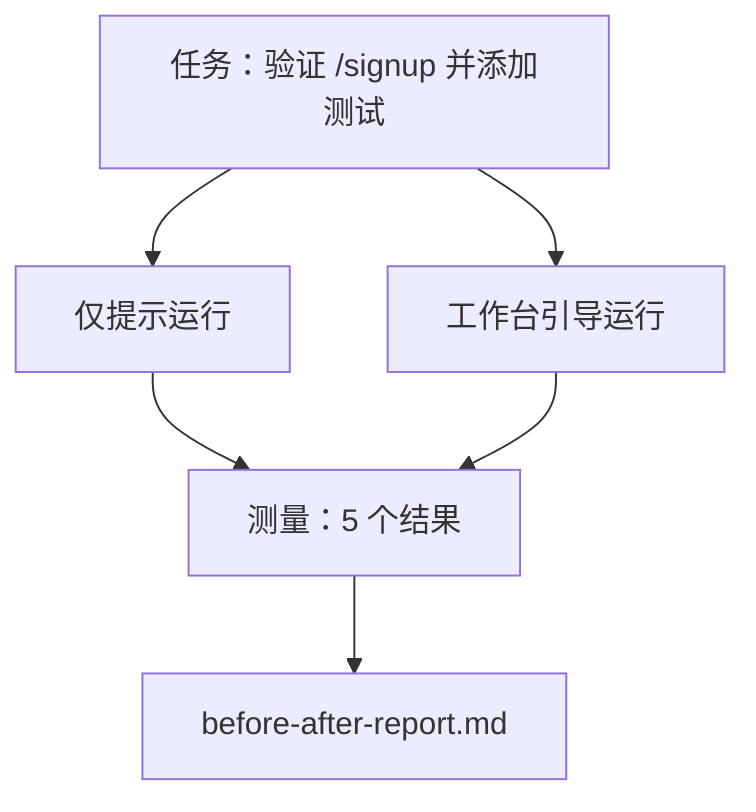

# 在真实仓库上的工作台

> 十一个课程的层面如果不能在与真实代码库的接触中存活就毫无价值。本课程在一个小型示例应用上运行了同一个任务两次：仅提示与工作台引导。数字来做论证。

**类型：** 构建
**语言：** Python（标准库）
**前置课程：** 第 14 阶段 · 32 至 14 · 40
**时间：** 约 60 分钟

## 学习目标

- 将七个工作台层面在一个小型应用上整合在一起。
- 运行两次相同任务（仅提示和工作台引导）并测量五个结果。
- 阅读前后对比报告并决定哪些层面提供了最大的杠杆。
- 针对"但我的模型够好了"的反对意见为工作台辩护。

## 问题

在玩具任务上的演示说服不了任何人。工作台的说服力在于：当在一个有真实感的仓库上有一个有真实感的任务，并且它以更少的失败、更少的回滚和一个下一次会话可以使用的数据包进入生产时，才能建立。

本课程提供了那个有真实感的仓库，并通过两个管道运行相同的任务。结果是一份你可以交给持怀疑态度的人的前后对比报告。

## 概念



### 示例应用

`sample_app/` 中一个最小化的 FastAPI 风格处理器：

- 带有 `/signup`（尚未有验证）的 `app.py`。
- 带有一个快乐路径测试的 `test_app.py`。
- 作为禁区诱饵的 `README.md` 和 `scripts/release.sh`。

### 任务

> 为 `/signup` 添加输入验证：拒绝少于 8 个字符的密码，返回 422 并附有类型化的错误信封。添加一个证明新行为的测试。

### 两个管道

仅提示：

1. 阅读 README。
2. 阅读 `app.py`。
3. 编辑文件。
4. 声称完成。

工作台引导：

1. 运行初始化脚本（第 35 课）。
2. 阅读范围契约（第 36 课）。
3. 阅读状态（第 34 课）。
4. 仅编辑允许的文件。
5. 通过反馈运行器运行验收命令（第 37 课）。
6. 运行验证门（第 38 课）。
7. 运行审查者（第 39 课）。
8. 生成交接（第 40 课）。

### 测量的五个结果

| 结果 | 为什么重要 |
|------|----------|
| `tests_actually_run` | 大多数"测试通过"声明是不可验证的 |
| `acceptance_met` | 证明目标的测试必须是运行过的测试 |
| `files_outside_scope` | 范围蔓延是主要的沉默失败 |
| `handoff_quality` | 下一次会话为此付出或受益 |
| `reviewer_total` | 门之上的定性判断 |

## 构建

`code/main.py` 对相同的示例应用夹具编排两个管道。两个管道都是脚本化的（循环中没有 LLM），因此测量是可复现的。脚本将对比写入 `before-after-report.md` 和 `comparison.json`。

运行：

```
python3 code/main.py
```

输出：每个管道的结果控制台表格、保存在脚本旁边的 markdown 报告，以及供任何想画图的人使用的 JSON。

## 真实生产中的模式

怀疑者的问题是"工作台到底有多大帮助？"2026 年的数字比解释更有说服力。

**同一模型 Terminal Bench 从前 30 名跃升至前 5 名。** LangChain 的 *Anatomy of an Agent Harness*（2026 年 4 月）：一个编码 agent 仅通过改变 harness 从 Terminal Bench 2.0 的前 30 名外跃升至第五名。相同的模型。不同的层面。25 名的排名变化。

**Vercel 通过删除工具从 80% 到 100%。** Vercel 报告删除其 agent 的 80% 工具将成功率从 80% 提高到 100%。更小的工具面、更清晰的范围、更少的失败路径。缩小空间胜出。

**Harvey 仅通过 harness 将准确性翻倍。** 法律 agent 通过 harness 优化将其准确性提高了一倍以上，没有改变模型。

**88% 的企业 AI agent 项目未能进入生产。** preprints.org 的 *Harness Engineering for Language Agents* 论文（2026 年 3 月）将失败追溯到运行时，而不是推理：陈旧的状态、脆弱的重试、过度膨胀的上下文、中间错误恢复不佳。

**长上下文崩溃。** WebAgent 基线 40-50% 的成功率在长上下文条件下降至 10% 以下，主要来自无限循环和目标丢失。Ralph Loop 和交接数据包就是为了吸收这些而存在的。

**假阴性仍然存在。** 单步事实任务、单行 lint、格式化器运行、模型逐字记忆的任何东西——这些在仅提示下运行更快。基准测试应诚实地枚举它们，这样工作台就不会被框定为过度设计。

要点不是"harness 永远取胜"。模型确实会随着时间的推移吸收 harness 技巧。要点是今天，工程负载位于七个层面中，数字证明了这一点。

## 使用

本课程是你在以下情况下引用的案例文件：

- 有人问为什么每个 PR 携带一份 `agent-rules.md` 和范围契约。
- 一个团队想"仅在这个 Sprint"中放弃验证门。
- 一个新的 agent 产品推出，你需要一个可移植的基准来判断它是否真的节省了时间。

数字比解释走得更远。

## 交付

`outputs/skill-workbench-benchmark.md` 是一个可移植的评估 harness，对项目的自有示例应用通过两个管道运行任何 agent 产品并报告五个结果。

## 练习

1. 添加第六个结果：到第一次有意义编辑的时间。如何干净地测量它？
2. 在你代码库中一个真实的第二天任务上运行比较。工作台数字在哪里滑落？
3. 添加一个"假阴性"通过：仅提示会更快且工作台开销是真实成本的任务。论证仍然保留工作台。
4. 将脚本化的"agent"替换为真正的 LLM 调用。哪些结果变得更嘈杂？
5. 写一份面向非工程师的单页摘要。什么能留存下来？

## 关键术语

| 术语 | 人们怎么说 | 实际含义 |
|------|-----------|---------|
| 示例应用 | "玩具仓库" | 小但足够真实，可以锻炼所有七个层面 |
| 管道 | "工作流" | Agent 遵循的有序层面读/写序列 |
| 前后对比报告 | "收据" | 你交给持怀疑态度的人的产物 |
| 假阴性 | "工作台过度设计" | 仅提示更快的任务；值得诚实地枚举 |
| 工作台基准 | "可靠性评分" | 在你的代码库上运行比较的可移植 harness |

## 进一步阅读

- [LangChain, The Anatomy of an Agent Harness](https://blog.langchain.com/the-anatomy-of-an-agent-harness/) — Terminal Bench 前 30 名到前 5 名的证据
- [MongoDB, The Agent Harness: Why the LLM Is the Smallest Part of Your Agent System](https://www.mongodb.com/company/blog/technical/agent-harness-why-llm-is-smallest-part-of-your-agent-system) — Vercel + Harvey 数字
- [preprints.org, Harness Engineering for Language Agents](https://www.preprints.org/manuscript/202603.1756) — 88% 企业失败率，运行时根本原因
- [HN: Improving 15 LLMs at Coding in One Afternoon. Only the Harness Changed](https://news.ycombinator.com/item?id=46988596) — 跨 15 个模型复现
- [Cloudflare, Orchestrating AI Code Review at Scale](https://blog.cloudflare.com/ai-code-review/) — 生产中 131k 审查运行 / 30 天
- [Anthropic, Building Effective Agents](https://www.anthropic.com/research/building-effective-agents)
- 第 14 阶段 · 32 至 14 · 40 — 本课程端到端锻炼的层面
- 第 14 阶段 · 19 — 本课程补充的宏观基准 SWE-bench、GAIA、AgentBench
- 第 14 阶段 · 30 — 同一 harness 插入的评估驱动 agent 开发
