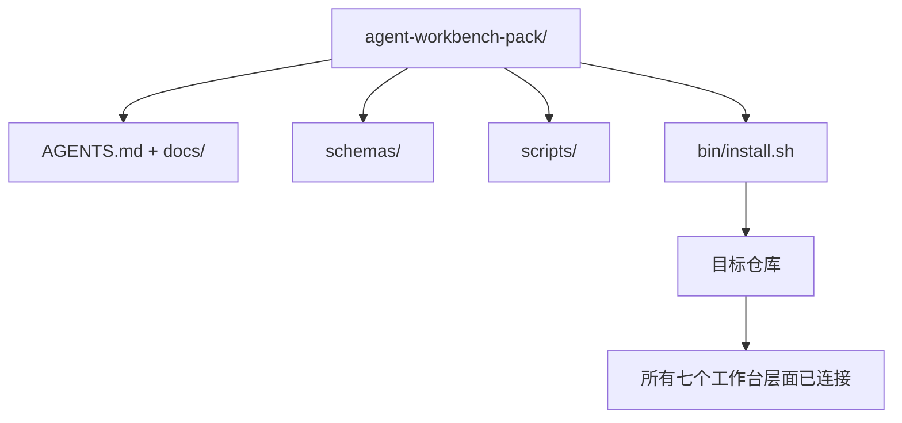

# 顶点项目：交付可复用 Agent 工作台包

> 这个迷你系列以一个你可以放入任何仓库的包结束。十一个课程的层面被压缩到一个你可以 `cp -r` 就用的目录中，第二天早上就能让 agent 可靠工作。顶点项目是本课程所依赖的产物。

**类型：** 构建
**语言：** Python（标准库）
**前置课程：** 第 14 阶段 · 31 至 14 · 41
**时间：** 约 75 分钟

## 学习目标

- 将七个工作台层面打包到一个可直接放入的目录中。
- 固定 schema、脚本和模板，使新仓库获得一个已知良好的基线。
- 添加一个单一的安装脚本，以幂等方式部署该包。
- 决定什么留在包中、什么留在包外，并为每个决策辩护。

## 问题

一个存在于 Google 文档、聊天记录和三个半记得的脚本中的工作台，是每个季度都要重建的工作台。解决办法是一个带版本的包：一个仓库或目录，包含这些层面、schema、脚本，以及一个单命令安装器。

你将结束本课程时，磁盘上交付了 `outputs/agent-workbench-pack/` 和一个能够将其放入任何目标仓库的 `bin/install.sh`。

## 概念



### 包的布局

```
outputs/agent-workbench-pack/
├── AGENTS.md
├── docs/
│   ├── agent-rules.md
│   ├── reliability-policy.md
│   ├── handoff-protocol.md
│   └── reviewer-rubric.md
├── schemas/
│   ├── agent_state.schema.json
│   ├── task_board.schema.json
│   └── scope_contract.schema.json
├── scripts/
│   ├── init_agent.py
│   ├── run_with_feedback.py
│   ├── verify_agent.py
│   └── generate_handoff.py
├── bin/
│   └── install.sh
└── README.md
```

### 什么留在里面，什么留在外面

留在里面：

- 层面 Schema。它们是契约。
- 上述四个脚本。它们是运行时。
- 四个文档。它们是规则和评分标准。

留在外面：

- 项目特定的任务。任务属于目标仓库的看板，不属于包。
- 供应商 SDK 调用。包是框架无关的。
- 入职散文。包位于团队现有入职文档的旁边，而不是里面。

### 安装器

一个简短的 `bin/install.sh`（或 `bin/install.py`）：

1. 在没有 `--force` 的情况下拒绝覆盖现有包。
2. 将包复制到目标仓库。
3. 如果存在 `.github/workflows/`，接入 CI。
4. 打印下一步：填写看板、设置验收命令、运行初始化脚本。

### 版本管理

包携带一个 `VERSION` 文件。需要迁移的 Schema 升级和脚本更改会升级主版本号。纯文档更改升级补丁号。目标仓库的 `agent_state.json` 记录它初始化对应的包版本。

## 构建

`code/main.py` 将包组装到本课程旁的 `outputs/agent-workbench-pack/` 中，使用本迷你系列前面课程中的 schema 和脚本以及你已经编写的文档进行初始化。

运行：

```
python3 code/main.py
```

脚本复制并固定这些层面，写入 README，打印包树，并以零退出。重新运行是幂等的。

## 真实生产中的模式

一个包只有在能够存活于分支、更新和不友好的上游时才是有价值的。四种模式使之可行。

**`VERSION` 是契约，不是营销。** 主版本号升级需要状态迁移。次版本号升级需要重新运行检查器。补丁版本号升级仅限文档更改。安装器在每次安装时将 `.workbench-version` 写入目标仓库；`lint_pack.py` 在目标的锁与包的 `VERSION` 不一致时拒绝交付。这就是 `npm`、`Cargo` 和 `pyproject.toml` 在 10 年变迁中存活的方式；关于 agent 的任何事情都不会改变这些规则。

**跨工具分发的单一来源。** Nx 提供了一个 `nx ai-setup`，从单一配置部署 `AGENTS.md`、`CLAUDE.md`、`.cursor/rules/`、`.github/copilot-instructions.md` 和一个 MCP 服务器。包应该做同样的事；安装器发出符号链接（`ln -s AGENTS.md CLAUDE.md`），使单一真相来源扩展到每个编码 agent。为支持一种工具而分叉包是一种失败模式。

**在非平凡状态上拒绝的 `uninstall.sh`。** 卸载包不得删除用户的 `agent_state.json`、`task_board.json` 或 `outputs/`。卸载器删除 schema、脚本、文档和 `AGENTS.md`（带有 `--keep-agents-md` 选择退出），并在状态文件有任何未提交更改时拒绝继续。状态属于用户；包不拥有它。

**发布为 Skill。SkillKit 风格的发布。** 包作为 SkillKit 技能交付：`skillkit install agent-workbench-pack` 从单一来源部署到 32 个 AI agent 中。包仓库是真相来源；SkillKit 是发布渠道。供应商锁定瓦解；七个层面保持不变。

## 使用

三个包交付的地方：

- **作为你放入仓库的目录。** `cp -r outputs/agent-workbench-pack /path/to/repo`。
- **作为公共模板仓库。** 分叉并自定义，以 `VERSION` 控制偏离。
- **作为 SkillKit 技能。** 连接到你的 agent 产品，使单一命令即可部署。

包是食谱。每次安装是一份成品。

## 交付

`outputs/skill-workbench-pack.md` 生成一个项目调优的包：根据团队历史锐化的规则、匹配仓库的范围 glob、扩展了一个领域特定条目的评分标准维度。

## 练习

1. 决定哪个可选的第五个文档值得晋升到标准包中。辩护这个取舍。
2. 将安装器改写为带有 `--dry-run` 标志的 Python。比较与 bash 人机工程学的优劣。
3. 添加一个 `bin/uninstall.sh`，安全地移除包并在状态文件有非平凡历史时拒绝。什么算作非平凡？
4. 添加一个 `lint_pack.py`，在包偏离 `VERSION` 时失败。将其接入包自身仓库的 CI。
5. 撰写从手工工作台迁移到此包的迁移操作手册。最小化停机时间的操作顺序是什么？

## 关键术语

| 术语 | 人们怎么说 | 实际含义 |
|------|-----------|---------|
| 工作台包 | "入门套件" | 一个带版本控制的目录，携带所有七个层面 |
| 安装器 | "设置脚本" | 以幂等方式部署包的 `bin/install.sh` |
| 包版本 | "VERSION" | Schema/脚本更改升级主版本号，纯文档更改升级补丁号 |
| 可直接放入包 | "cp -r 就能用" | 包在第一天无需按仓库定制即可工作 |
| 可复刻模板 | "GitHub 模板" | GitHub 的"Use this template"可以克隆的公共仓库 |

## 进一步阅读

- 第 14 阶段 · 31 至 14 · 41 — 此包打包的每个层面
- [SkillKit](https://github.com/rohitg00/skillkit) — 跨 32 个 AI agent 安装此技能
- [Nx Blog, Teach Your AI Agent How to Work in a Monorepo](https://nx.dev/blog/nx-ai-agent-skills) — 跨六个工具的单源生成器
- [agents.md — 开放规范](https://agents.md/) — 你的包的路由器必须实现的内容
- [HKUDS/OpenHarness](https://github.com/HKUDS/OpenHarness) — 包等效物的参考实现
- [andrewgarst/agentic_harness](https://github.com/andrewgarst/agentic_harness) — 带评估套件的 Redis 后端参考实现
- [Augment Code, A good AGENTS.md is a model upgrade](https://www.augmentcode.com/blog/how-to-write-good-agents-dot-md-files) — 包文档质量标准
- [Anthropic, Effective harnesses for long-running agents](https://www.anthropic.com/engineering/effective-harnesses-for-long-running-agents)
- [Anthropic, Harness design for long-running application development](https://www.anthropic.com/engineering/harness-design-long-running-apps)
- 第 14 阶段 · 30 — 消费此包验证门的评估驱动 agent 开发
- 第 14 阶段 · 41 — 此包改进的前后对比基准
