# 通信协议

> 不能用同一种语言交流的智能体不是一支团队。它们是向虚空呼喊的陌生人。

**Type:** Build
**Languages:** TypeScript
**Prerequisites:** Phase 14 (Agent Engineering), Lesson 16.01 (Why Multi-Agent)
**Time:** ~120 minutes

## 学习目标

- 实现MCP工具发现和调用，使智能体能够使用外部服务器暴露的工具
- 构建A2A智能体卡片和任务端点，允许一个智能体通过HTTP将工作委派给另一个智能体
- 比较MCP（工具访问）、A2A（智能体对智能体）、ACP（企业审计）和ANP（去中心化信任），解释哪个协议解决什么问题
- 在单一系统中连接多个协议，使智能体通过MCP发现工具并通过A2A委派任务

## 问题

你将系统拆分为多个智能体。研究者、编码者、审阅者。它们在各自的工作上表现出色。但现在你需要它们真正地彼此交谈。

你的第一次尝试是显而易见的：传递字符串。研究者返回一堆文本，编码者以它能做到的任意方式解析。它可以工作，直到编码者误解了一份研究摘要，或者两个智能体在等待彼此中死锁，或者你需要由不同团队构建的智能体进行协作。突然之间"只传递字符串"就崩溃了。

这就是通信协议问题。没有关于智能体如何交换信息的共享契约，多智能体系统是脆弱的、不可审计的，并且无法扩展到超出你亲自编写的少数几个智能体。

AI生态系统用四种协议回应，每种解决问题的不同切片：

- **MCP**用于工具访问
- **A2A**用于智能体对智能体协作
- **ACP**用于企业可审计性
- **ANP**用于去中心化身份和信任

本课深入探讨。你将阅读每个规范的真实线上格式，构建可工作的实现，并将所有四个连接到一个统一系统中。

## 概念

### 协议格局

将这四种协议视为层，每个处理不同的问题：

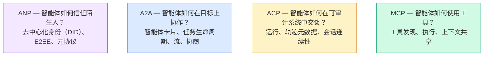

它们不是竞争者。它们在不同层面解决不同问题。

### MCP（回顾）

MCP在第13阶段深入涵盖。快速回顾：MCP标准化了LLM如何连接到外部工具和数据源。它是一个**客户端-服务器**协议，其中智能体（客户端）发现并调用服务器暴露的工具。

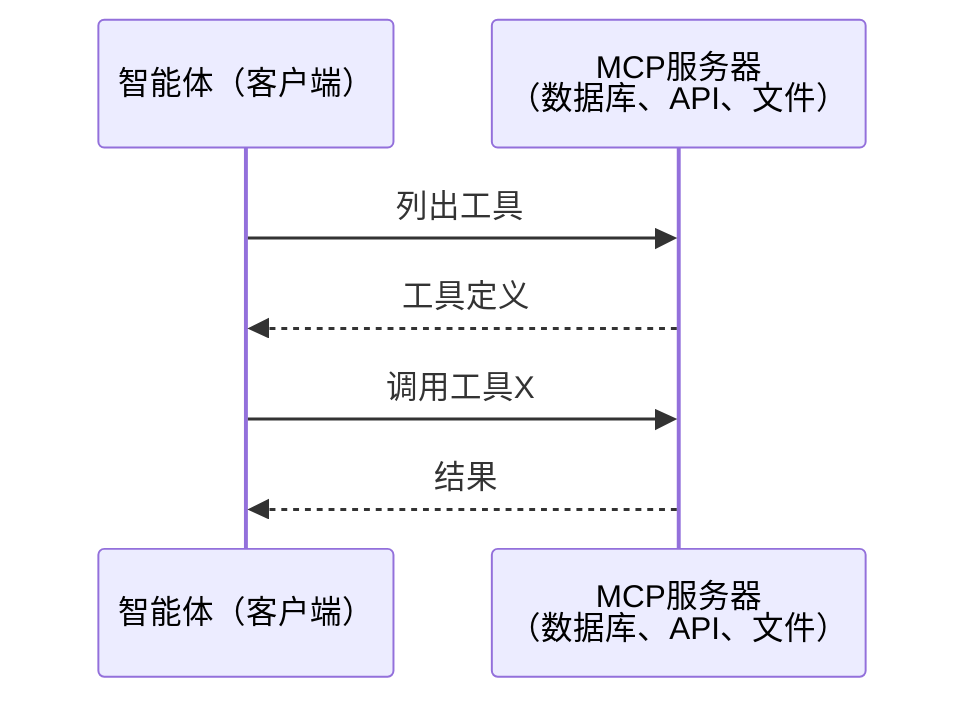

MCP是**智能体到工具**的通信。它不能帮助智能体彼此交谈。

### A2A（Agent2Agent协议）

**创建者：** Google（现在由Linux基金会管理，作为 `lf.a2a.v1`）
**规范版本：** 1.0.0
**问题：** 自主智能体如何协作、协商并向彼此委派任务？

A2A是用于**点对点智能体协作**的协议。MCP将智能体连接到工具，A2A将智能体连接到其他智能体。每个智能体在一个众所周知的URL处发布一份**智能体卡片**，其他智能体发现它、与之协商并向其委派任务。

#### A2A如何工作

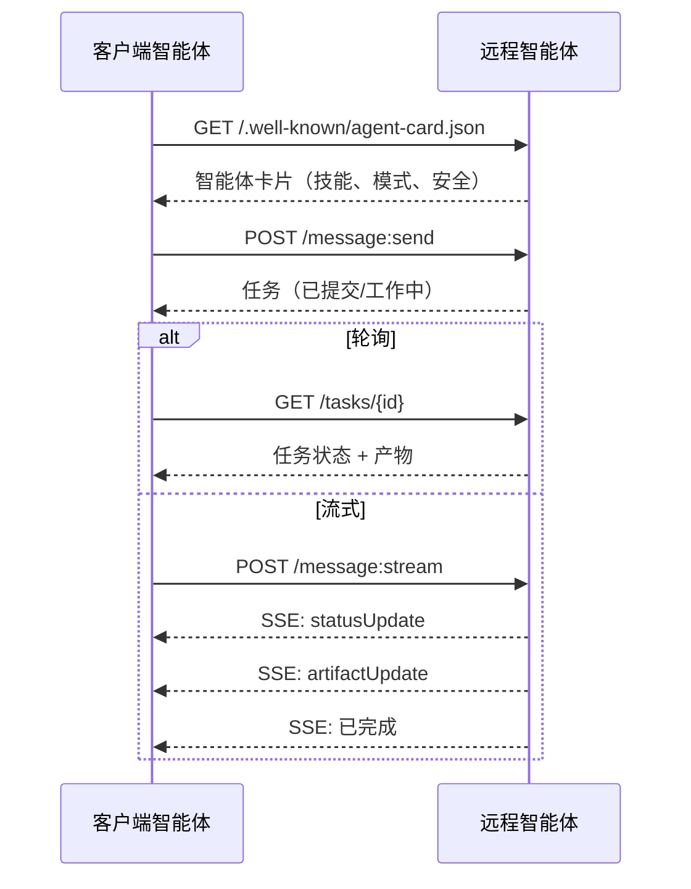

#### 真实的智能体卡片

这是在真实世界中A2A智能体卡片的样子。在 `GET /.well-known/agent-card.json` 提供服务：

```json
{
  "name": "Research Agent",
  "description": "Searches documentation and summarizes findings",
  "version": "1.0.0",
  "supportedInterfaces": [
    {
      "url": "https://research-agent.example.com/a2a/v1",
      "protocolBinding": "JSONRPC",
      "protocolVersion": "1.0"
    },
    {
      "url": "https://research-agent.example.com/a2a/rest",
      "protocolBinding": "HTTP+JSON",
      "protocolVersion": "1.0"
    }
  ],
  "provider": {
    "organization": "Your Company",
    "url": "https://example.com"
  },
  "capabilities": {
    "streaming": true,
    "pushNotifications": false
  },
  "defaultInputModes": ["text/plain", "application/json"],
  "defaultOutputModes": ["text/plain", "application/json"],
  "skills": [
    {
      "id": "web-research",
      "name": "Web Research",
      "description": "Searches the web and synthesizes findings",
      "tags": ["research", "search", "summarization"],
      "examples": ["Research the latest changes in React 19"]
    },
    {
      "id": "doc-analysis",
      "name": "Documentation Analysis",
      "description": "Reads and analyzes technical documentation",
      "tags": ["docs", "analysis"],
      "inputModes": ["text/plain", "application/pdf"],
      "outputModes": ["application/json"]
    }
  ],
  "securitySchemes": {
    "bearer": {
      "httpAuthSecurityScheme": {
        "scheme": "Bearer",
        "bearerFormat": "JWT"
      }
    }
  },
  "security": [{ "bearer": [] }]
}
```

需要注意的关键点：
- **技能**是智能体可以做的事情。每个都有ID、标签和支持的输入/输出MIME类型。这是客户端智能体判断该远程智能体是否能处理其请求的方式。
- **supportedInterfaces**列出多个协议绑定。一个智能体可以同时使用JSON-RPC、REST和gRPC。
- **安全**内建在卡片中。客户端在发出第一个请求之前就知道它需要什么认证。

#### 任务生命周期

任务是A2A中的核心工作单元。它们通过定义的状态移动：

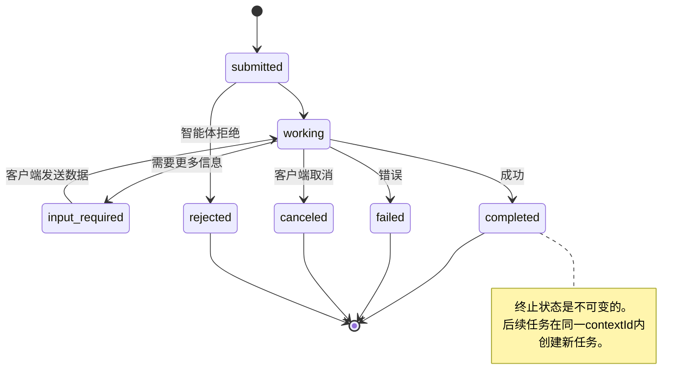

所有8个状态（规范还定义了 `UNSPECIFIED` 作为哨兵值，此处省略）：

| 状态 | 终止？ | 含义 |
|---|---|---|
| `TASK_STATE_SUBMITTED` | 否 | 已确认，尚未开始处理 |
| `TASK_STATE_WORKING` | 否 | 正在主动处理 |
| `TASK_STATE_INPUT_REQUIRED` | 否 | 智能体需要来自客户端的更多信息 |
| `TASK_STATE_AUTH_REQUIRED` | 否 | 需要认证 |
| `TASK_STATE_COMPLETED` | 是 | 成功完成 |
| `TASK_STATE_FAILED` | 是 | 以错误完成 |
| `TASK_STATE_CANCELED` | 是 | 完成前取消 |
| `TASK_STATE_REJECTED` | 是 | 智能体拒绝了任务 |

一旦任务达到终止状态，它就是不可变的。没有进一步的消息。后续任务在同一 `contextId` 内创建新任务。

#### 线上格式

A2A使用JSON-RPC 2.0。以下是真实消息交换的样子：

**客户端发送任务：**
```json
{
  "jsonrpc": "2.0",
  "id": 1,
  "method": "SendMessage",
  "params": {
    "message": {
      "messageId": "msg-001",
      "role": "ROLE_USER",
      "parts": [{ "text": "Research React 19 compiler features" }]
    },
    "configuration": {
      "acceptedOutputModes": ["text/plain", "application/json"],
      "historyLength": 10
    }
  }
}
```

**智能体以任务响应：**
```json
{
  "jsonrpc": "2.0",
  "id": 1,
  "result": {
    "task": {
      "id": "task-abc-123",
      "contextId": "ctx-xyz-789",
      "status": {
        "state": "TASK_STATE_COMPLETED",
        "timestamp": "2026-03-27T10:30:00Z"
      },
      "artifacts": [
        {
          "artifactId": "art-001",
          "name": "research-results",
          "parts": [{
            "data": {
              "findings": [
                "React 19 compiler auto-memoizes components",
                "No more manual useMemo/useCallback needed",
                "Compiler runs at build time, not runtime"
              ]
            },
            "mediaType": "application/json"
          }]
        }
      ]
    }
  }
}
```

**通过SSE流式传输：**
```text
POST /message:stream HTTP/1.1
Content-Type: application/json
A2A-Version: 1.0

data: {"task":{"id":"task-123","status":{"state":"TASK_STATE_WORKING"}}}

data: {"statusUpdate":{"taskId":"task-123","status":{"state":"TASK_STATE_WORKING","message":{"role":"ROLE_AGENT","parts":[{"text":"Searching documentation..."}]}}}}

data: {"artifactUpdate":{"taskId":"task-123","artifact":{"artifactId":"art-1","parts":[{"text":"partial findings..."}]},"append":true,"lastChunk":false}}

data: {"statusUpdate":{"taskId":"task-123","status":{"state":"TASK_STATE_COMPLETED"}}}
```

### ACP（智能体通信协议）

**创建者：** IBM / BeeAI
**规范版本：** 0.2.0（OpenAPI 3.1.1）
**状态：** 正在合并到Linux基金会下的A2A
**问题：** 智能体如何以完全可审计性、会话连续性和轨迹追踪进行通信？

ACP是**企业协议**。与许多摘要声称的不同，ACP**不**使用JSON-LD。它是通过OpenAPI定义的直接REST/JSON API。使其特别的是**TrajectoryMetadata**：每个智能体响应都可以携带生成它的推理步骤和工具调用的详细日志。

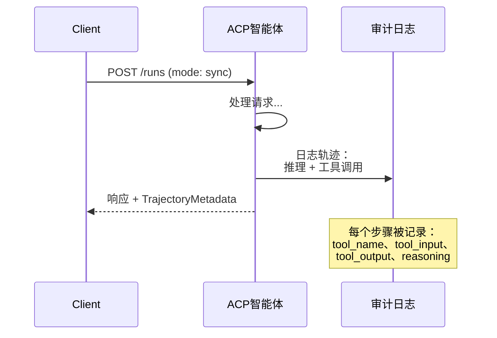

#### ACP中的智能体发现

ACP定义了四种发现方法：

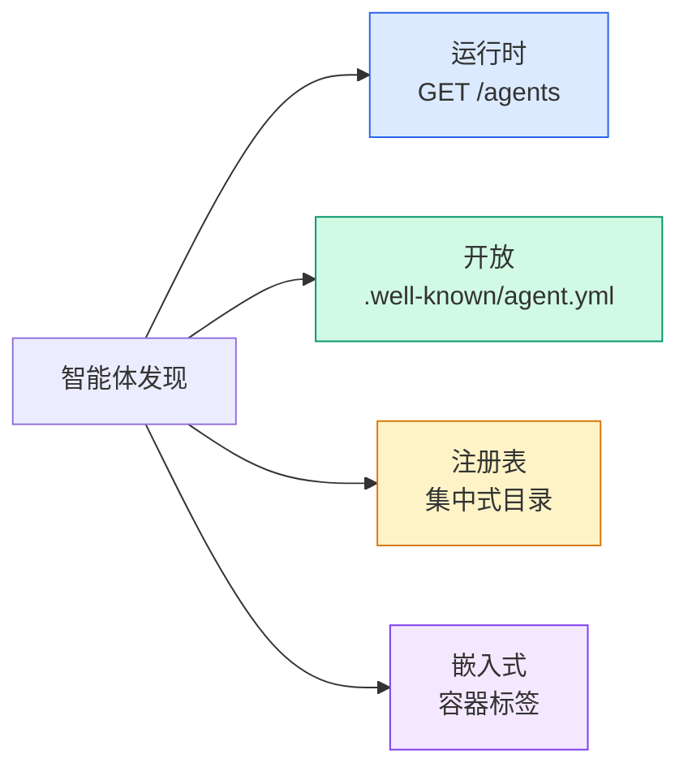

**AgentManifest** 比A2A的智能体卡片更简单：

```json
{
  "name": "summarizer",
  "description": "Summarizes documents with source citations",
  "input_content_types": ["text/plain", "application/pdf"],
  "output_content_types": ["text/plain", "application/json"],
  "metadata": {
    "tags": ["summarization", "RAG"],
    "framework": "BeeAI",
    "capabilities": [
      {
        "name": "Document Summarization",
        "description": "Condenses long documents into key points"
      }
    ],
    "recommended_models": ["llama3.3:70b-instruct-fp16"],
    "license": "Apache-2.0",
    "programming_language": "Python"
  }
}
```

#### 运行生命周期

ACP使用"Runs"而非"Tasks"。一次Run是具有三种模式的智能体执行：

| 模式 | 行为 |
|---|---|
| `sync` | 阻塞。响应包含完整结果。 |
| `async` | 立即返回202。轮询 `GET /runs/{id}` 获取状态。 |
| `stream` | SSE流。智能体工作时事件触发。 |

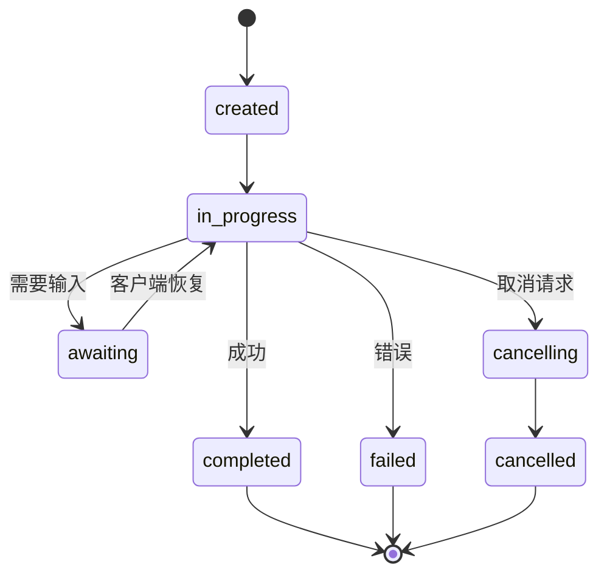

#### TrajectoryMetadata（审计追踪）

这是ACP的关键区别。每个消息部分可以包含元数据，显示智能体确切做了什么：

```json
{
  "role": "agent/researcher",
  "parts": [
    {
      "content_type": "text/plain",
      "content": "The weather in San Francisco is 72F and sunny.",
      "metadata": {
        "kind": "trajectory",
        "message": "I need to check the weather for this location",
        "tool_name": "weather_api",
        "tool_input": { "location": "San Francisco, CA" },
        "tool_output": { "temperature": 72, "condition": "sunny" }
      }
    }
  ]
}
```

对受监管行业来说这是黄金。每个答案都带有可证明的推理链：哪些工具被调用，使用了什么输入，收到了什么输出。没有黑箱。

ACP也支持**CitationMetadata**用于来源归因：

```json
{
  "kind": "citation",
  "start_index": 0,
  "end_index": 47,
  "url": "https://weather.gov/sf",
  "title": "NWS San Francisco Forecast"
}
```

### ANP（智能体网络协议）

**创建者：** 开源社区（由GaoWei Chang创立）
**仓库：** [github.com/agent-network-protocol/AgentNetworkProtocol](https://github.com/agent-network-protocol/AgentNetworkProtocol)
**问题：** 来自不同组织的智能体如何在没有中央权威的情况下彼此信任？

ANP是**去中心化身份协议**。它使用W3C去中心化标识符（DID）和端到端加密构建信任。与A2A通过已知端点发现智能体不同，ANP让智能体以加密方式证明其身份。

ANP有三个层：

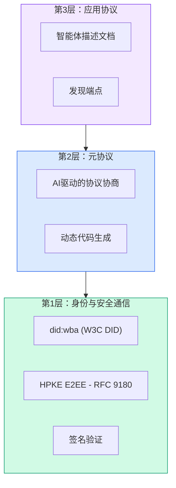

#### DID文档（真实结构）

ANP使用自定义DID方法 `did:wba`（基于Web的智能体）。DID `did:wba:example.com:user:alice` 解析到 `https://example.com/user/alice/did.json`：

```json
{
  "@context": [
    "https://www.w3.org/ns/did/v1",
    "https://w3id.org/security/suites/jws-2020/v1",
    "https://w3id.org/security/suites/secp256k1-2019/v1"
  ],
  "id": "did:wba:example.com:user:alice",
  "verificationMethod": [
    {
      "id": "did:wba:example.com:user:alice#key-1",
      "type": "EcdsaSecp256k1VerificationKey2019",
      "controller": "did:wba:example.com:user:alice",
      "publicKeyJwk": {
        "crv": "secp256k1",
        "x": "NtngWpJUr-rlNNbs0u-Aa8e16OwSJu6UiFf0Rdo1oJ4",
        "y": "qN1jKupJlFsPFc1UkWinqljv4YE0mq_Ickwnjgasvmo",
        "kty": "EC"
      }
    },
    {
      "id": "did:wba:example.com:user:alice#key-x25519-1",
      "type": "X25519KeyAgreementKey2019",
      "controller": "did:wba:example.com:user:alice",
      "publicKeyMultibase": "z9hFgmPVfmBZwRvFEyniQDBkz9LmV7gDEqytWyGZLmDXE"
    }
  ],
  "authentication": [
    "did:wba:example.com:user:alice#key-1"
  ],
  "keyAgreement": [
    "did:wba:example.com:user:alice#key-x25519-1"
  ],
  "humanAuthorization": [
    "did:wba:example.com:user:alice#key-1"
  ],
  "service": [
    {
      "id": "did:wba:example.com:user:alice#agent-description",
      "type": "AgentDescription",
      "serviceEndpoint": "https://example.com/agents/alice/ad.json"
    }
  ]
}
```

需要注意的关键点：
- **密钥分离**是被强制执行的。签名密钥（secp256k1）与加密密钥（X25519）分开。
- **`humanAuthorization`** 是ANP独有的。这些密钥需要显式人工批准（生物识别、密码、HSM）才能使用。高风险操作如资金转移通过此路径。
- **`keyAgreement`** 密钥用于HPKE端到端加密（RFC 9180）。
- **service** 部分链接到智能体描述文档。

#### ANP中信任如何工作

ANP**不**使用信任网或背书图。信任是双向的，按交互验证：

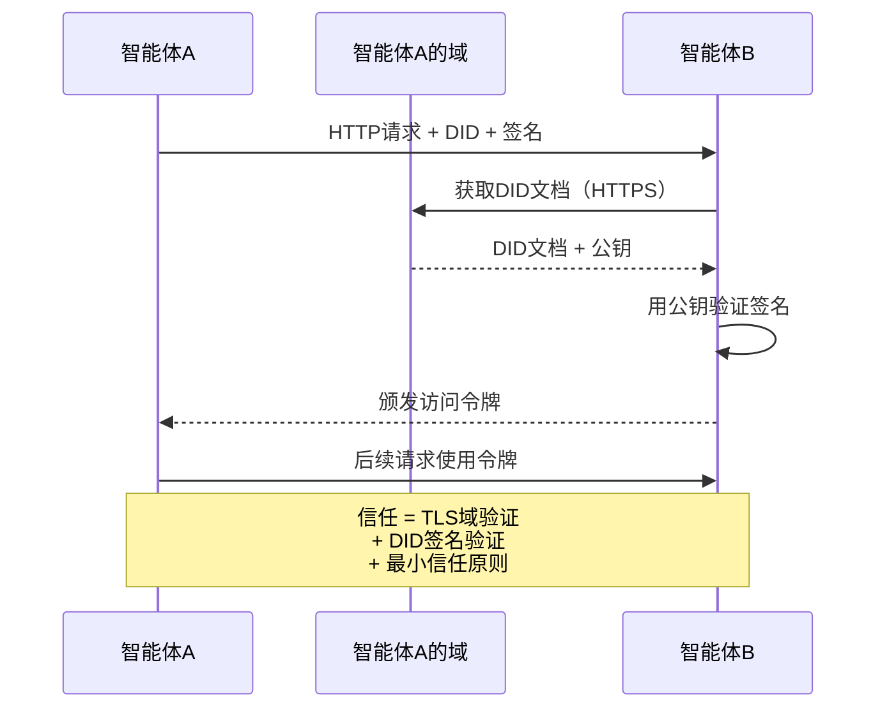

信任来自三个来源：
1. **域级别TLS**验证DID文档主机
2. **DID加密签名**验证智能体的身份
3. **最小信任原则**仅授予最小权限

没有基于流言的信任传播或PageRank评分。你通过其DID直接验证每个智能体。

#### 元协议协商

这是ANP最新颖的功能。当来自不同生态系统的两个智能体相遇时，它们不需要预先同意的数据格式。它们用自然语言协商：

```json
{
  "action": "protocolNegotiation",
  "sequenceId": 0,
  "candidateProtocols": "I can communicate using:\n1. JSON-RPC with hotel booking schema\n2. REST with OpenAPI 3.1 spec\n3. Natural language over HTTP",
  "modificationSummary": "Initial proposal",
  "status": "negotiating"
}
```

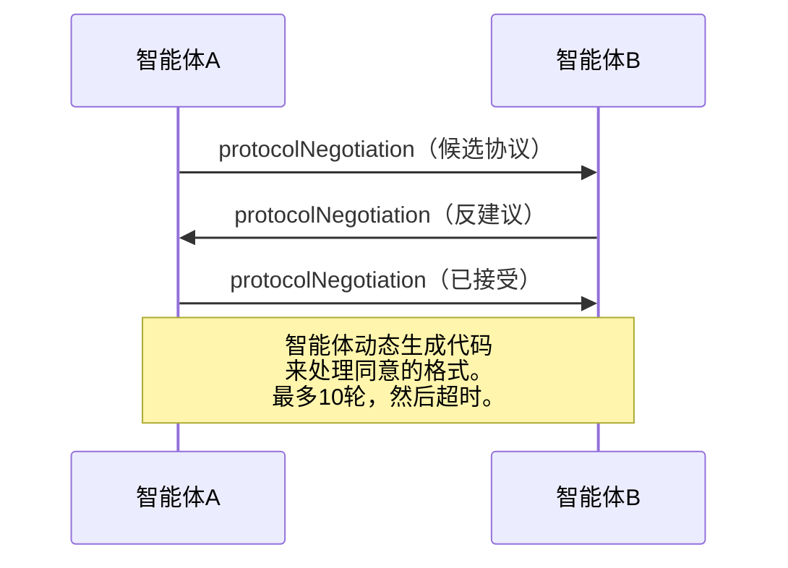

智能体来回协商（最多10轮）直到它们就格式达成一致，然后动态生成代码来处理它。状态值：`negotiating`、`rejected`、`accepted`、`timeout`。

这意味着两个从未见过的智能体可以在没有任何人预定义共享模式的情况下找出如何通信。

### 比较（已修正）

| | MCP | A2A | ACP | ANP |
|---|---|---|---|---|
| **创建者** | Anthropic | Google / Linux基金会 | IBM / BeeAI | 社区 |
| **规范格式** | JSON-RPC | JSON-RPC / REST / gRPC | OpenAPI 3.1 (REST) | JSON-RPC |
| **主要用途** | 智能体到工具 | 智能体到智能体 | 智能体到智能体 | 智能体到智能体 |
| **发现** | 工具列表 | `/.well-known/agent-card.json` | `GET /agents`、`/.well-known/agent.yml` | `/.well-known/agent-descriptions`、DID服务端点 |
| **身份** | 隐式（本地） | 安全方案（OAuth、mTLS） | 服务器级别 | W3C DID (`did:wba`) 带E2EE |
| **审计追踪** | 不适用 | 基础（任务历史） | TrajectoryMetadata（工具调用、推理） | 未正式指定 |
| **状态机** | 不适用 | 9个任务状态 | 7个运行状态 | 不适用 |
| **流式传输** | 不适用 | SSE | SSE | 传输无关 |
| **独特功能** | 工具模式 | 智能体卡片 + 技能 | 轨迹审计追踪 | 元协议协商 |
| **最适合** | 工具和数据 | 动态协作 | 受监管行业 | 跨组织信任 |
| **状态** | 稳定 | 稳定（v1.0） | 合并到A2A | 活跃开发中 |

### 它们如何协同工作

这些协议不是互斥的。一个现实的企业系统使用多个：

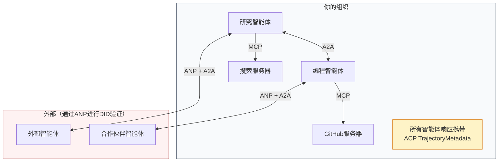

- **MCP**将每个智能体连接到其工具
- **A2A**处理智能体之间的协作（内部和外部）
- **ACP**将响应包装在轨迹元数据中以实现可审计性
- **ANP**为你无法控制的智能体提供身份验证

## 构建它

### 步骤1：核心消息类型

每个多智能体系统从消息格式开始。我们定义映射到真实协议使用的类型：

```typescript
import crypto from "node:crypto";

type MessageRole = "user" | "agent";

type MessagePart =
  | { kind: "text"; text: string }
  | { kind: "data"; data: unknown; mediaType: string }
  | { kind: "file"; name: string; url: string; mediaType: string };

type TrajectoryEntry = {
  reasoning: string;
  toolName?: string;
  toolInput?: unknown;
  toolOutput?: unknown;
  timestamp: number;
};

type AgentMessage = {
  id: string;
  role: MessageRole;
  parts: MessagePart[];
  trajectory?: TrajectoryEntry[];
  replyTo?: string;
  timestamp: number;
};

function createMessage(
  role: MessageRole,
  parts: MessagePart[],
  replyTo?: string
): AgentMessage {
  return {
    id: crypto.randomUUID(),
    role,
    parts,
    replyTo,
    timestamp: Date.now(),
  };
}

function textMessage(role: MessageRole, text: string): AgentMessage {
  return createMessage(role, [{ kind: "text", text }]);
}
```

注意：`MessagePart` 是多模态的（文本、结构化数据、文件），就像真实的A2A和ACP规范。`TrajectoryEntry` 捕获推理链，匹配ACP的TrajectoryMetadata。

### 步骤2：A2A智能体卡片和注册表

构建与真实A2A规范匹配的智能体发现：

```typescript
type Skill = {
  id: string;
  name: string;
  description: string;
  tags: string[];
  inputModes: string[];
  outputModes: string[];
};

type AgentCard = {
  name: string;
  description: string;
  version: string;
  url: string;
  capabilities: {
    streaming: boolean;
    pushNotifications: boolean;
  };
  defaultInputModes: string[];
  defaultOutputModes: string[];
  skills: Skill[];
};

class AgentRegistry {
  private cards: Map<string, AgentCard> = new Map();

  register(card: AgentCard) {
    this.cards.set(card.name, card);
  }

  discoverBySkillTag(tag: string): AgentCard[] {
    return [...this.cards.values()].filter((card) =>
      card.skills.some((skill) => skill.tags.includes(tag))
    );
  }

  discoverByInputMode(mimeType: string): AgentCard[] {
    return [...this.cards.values()].filter(
      (card) =>
        card.defaultInputModes.includes(mimeType) ||
        card.skills.some((skill) => skill.inputModes.includes(mimeType))
    );
  }

  resolve(name: string): AgentCard | undefined {
    return this.cards.get(name);
  }

  listAll(): AgentCard[] {
    return [...this.cards.values()];
  }
}
```

这比简单的名称到能力的映射丰富得多。你可以按技能标签、按输入MIME类型或按名称发现智能体，就像真实A2A规范支持的那样。

### 步骤3：A2A任务生命周期

构建完整的任务状态机：

```typescript
type TaskState =
  | "submitted"
  | "working"
  | "input-required"
  | "auth-required"
  | "completed"
  | "failed"
  | "canceled"
  | "rejected";

const TERMINAL_STATES: TaskState[] = [
  "completed",
  "failed",
  "canceled",
  "rejected",
];

type TaskStatus = {
  state: TaskState;
  message?: AgentMessage;
  timestamp: number;
};

type Artifact = {
  id: string;
  name: string;
  parts: MessagePart[];
};

type Task = {
  id: string;
  contextId: string;
  status: TaskStatus;
  artifacts: Artifact[];
  history: AgentMessage[];
};

type TaskEvent =
  | { kind: "statusUpdate"; taskId: string; status: TaskStatus }
  | {
      kind: "artifactUpdate";
      taskId: string;
      artifact: Artifact;
      append: boolean;
      lastChunk: boolean;
    };

type TaskHandler = (
  task: Task,
  message: AgentMessage
) => AsyncGenerator<TaskEvent>;

class TaskManager {
  private tasks: Map<string, Task> = new Map();
  private handlers: Map<string, TaskHandler> = new Map();
  private listeners: Map<string, ((event: TaskEvent) => void)[]> = new Map();

  registerHandler(agentName: string, handler: TaskHandler) {
    this.handlers.set(agentName, handler);
  }

  subscribe(taskId: string, listener: (event: TaskEvent) => void) {
    const existing = this.listeners.get(taskId) ?? [];
    existing.push(listener);
    this.listeners.set(taskId, existing);
  }

  async sendMessage(
    agentName: string,
    message: AgentMessage,
    contextId?: string
  ): Promise<Task> {
    const handler = this.handlers.get(agentName);
    if (!handler) {
      const task = this.createTask(contextId);
      task.status = {
        state: "rejected",
        timestamp: Date.now(),
        message: textMessage("agent", `No handler for ${agentName}`),
      };
      return task;
    }

    const task = this.createTask(contextId);
    task.history.push(message);
    task.status = { state: "submitted", timestamp: Date.now() };

    this.processTask(task, handler, message).catch((err) => {
      task.status = {
        state: "failed",
        timestamp: Date.now(),
        message: textMessage("agent", String(err)),
      };
    });
    return task;
  }

  getTask(taskId: string): Task | undefined {
    return this.tasks.get(taskId);
  }

  cancelTask(taskId: string): boolean {
    const task = this.tasks.get(taskId);
    if (!task || TERMINAL_STATES.includes(task.status.state)) return false;
    task.status = { state: "canceled", timestamp: Date.now() };
    this.emit(taskId, {
      kind: "statusUpdate",
      taskId,
      status: task.status,
    });
    return true;
  }

  private createTask(contextId?: string): Task {
    const task: Task = {
      id: crypto.randomUUID(),
      contextId: contextId ?? crypto.randomUUID(),
      status: { state: "submitted", timestamp: Date.now() },
      artifacts: [],
      history: [],
    };
    this.tasks.set(task.id, task);
    return task;
  }

  private async processTask(
    task: Task,
    handler: TaskHandler,
    message: AgentMessage
  ) {
    task.status = { state: "working", timestamp: Date.now() };
    this.emit(task.id, {
      kind: "statusUpdate",
      taskId: task.id,
      status: task.status,
    });

    try {
      for await (const event of handler(task, message)) {
        if (TERMINAL_STATES.includes(task.status.state)) break;

        if (event.kind === "statusUpdate") {
          task.status = event.status;
        }
        if (event.kind === "artifactUpdate") {
          const existing = task.artifacts.find(
            (a) => a.id === event.artifact.id
          );
          if (existing && event.append) {
            existing.parts.push(...event.artifact.parts);
          } else {
            task.artifacts.push(event.artifact);
          }
        }
        this.emit(task.id, event);
      }
    } catch (err) {
      task.status = {
        state: "failed",
        timestamp: Date.now(),
        message: textMessage("agent", String(err)),
      };
      this.emit(task.id, {
        kind: "statusUpdate",
        taskId: task.id,
        status: task.status,
      });
    }
  }

  private emit(taskId: string, event: TaskEvent) {
    for (const listener of this.listeners.get(taskId) ?? []) {
      listener(event);
    }
  }
}
```

这实现了真实的A2A任务生命周期：已提交、工作中、需要输入、终止状态。处理程序是产生事件（状态更新和产物块）的异步生成器，匹配SSE流模型。

### 步骤4：ACP风格审计追踪

用轨迹追踪包装通信：

```typescript
type AuditEntry = {
  runId: string;
  agentName: string;
  input: AgentMessage[];
  output: AgentMessage[];
  trajectory: TrajectoryEntry[];
  status: "created" | "in-progress" | "completed" | "failed" | "awaiting";
  startedAt: number;
  completedAt?: number;
  sessionId?: string;
};

class AuditableRunner {
  private log: AuditEntry[] = [];
  private handlers: Map<
    string,
    (input: AgentMessage[]) => Promise<{
      output: AgentMessage[];
      trajectory: TrajectoryEntry[];
    }>
  > = new Map();

  registerAgent(
    name: string,
    handler: (input: AgentMessage[]) => Promise<{
      output: AgentMessage[];
      trajectory: TrajectoryEntry[];
    }>
  ) {
    this.handlers.set(name, handler);
  }

  async run(
    agentName: string,
    input: AgentMessage[],
    sessionId?: string
  ): Promise<AuditEntry> {
    const entry: AuditEntry = {
      runId: crypto.randomUUID(),
      agentName,
      input: structuredClone(input),
      output: [],
      trajectory: [],
      status: "created",
      startedAt: Date.now(),
      sessionId,
    };
    this.log.push(entry);

    const handler = this.handlers.get(agentName);
    if (!handler) {
      entry.status = "failed";
      return entry;
    }

    entry.status = "in-progress";
    try {
      const result = await handler(input);
      entry.output = structuredClone(result.output);
      entry.trajectory = structuredClone(result.trajectory);
      entry.status = "completed";
      entry.completedAt = Date.now();
    } catch (err) {
      entry.status = "failed";
      entry.trajectory.push({
        reasoning: `Error: ${String(err)}`,
        timestamp: Date.now(),
      });
      entry.completedAt = Date.now();
    }
    return entry;
  }

  getFullAuditLog(): AuditEntry[] {
    return structuredClone(this.log);
  }

  getAuditLogForAgent(agentName: string): AuditEntry[] {
    return structuredClone(
      this.log.filter((e) => e.agentName === agentName)
    );
  }

  getAuditLogForSession(sessionId: string): AuditEntry[] {
    return structuredClone(
      this.log.filter((e) => e.sessionId === sessionId)
    );
  }

  getTrajectoryForRun(runId: string): TrajectoryEntry[] {
    const entry = this.log.find((e) => e.runId === runId);
    return entry ? structuredClone(entry.trajectory) : [];
  }
}
```

每次智能体执行产生一个完整的审计条目：什么输入、什么输出以及两者之间工具调用和推理步骤的完整轨迹。你可以按智能体、按会话或按单独运行查询。

### 步骤5：ANP风格身份验证

构建基于DID的身份和验证：

```typescript
type VerificationMethod = {
  id: string;
  type: string;
  controller: string;
  publicKeyDer: string;
};

type DIDDocument = {
  id: string;
  verificationMethod: VerificationMethod[];
  authentication: string[];
  keyAgreement: string[];
  humanAuthorization: string[];
  service: { id: string; type: string; serviceEndpoint: string }[];
};

type AgentIdentity = {
  did: string;
  document: DIDDocument;
  privateKey: crypto.KeyObject;
  publicKey: crypto.KeyObject;
};

class IdentityRegistry {
  private documents: Map<string, DIDDocument> = new Map();

  publish(doc: DIDDocument) {
    this.documents.set(doc.id, doc);
  }

  resolve(did: string): DIDDocument | undefined {
    return this.documents.get(did);
  }

  verify(did: string, signature: string, payload: string): boolean {
    const doc = this.documents.get(did);
    if (!doc) return false;

    const authKeyIds = doc.authentication;
    const authKeys = doc.verificationMethod.filter((vm) =>
      authKeyIds.includes(vm.id)
    );

    for (const key of authKeys) {
      const publicKey = crypto.createPublicKey({
        key: Buffer.from(key.publicKeyDer, "base64"),
        format: "der",
        type: "spki",
      });
      const isValid = crypto.verify(
        null,
        Buffer.from(payload),
        publicKey,
        Buffer.from(signature, "hex")
      );
      if (isValid) return true;
    }
    return false;
  }

  requiresHumanAuth(did: string, operationKeyId: string): boolean {
    const doc = this.documents.get(did);
    if (!doc) return false;
    return doc.humanAuthorization.includes(operationKeyId);
  }
}

function createIdentity(domain: string, agentName: string): AgentIdentity {
  const did = `did:wba:${domain}:agent:${agentName}`;
  const { publicKey, privateKey } = crypto.generateKeyPairSync("ed25519");

  const publicKeyDer = publicKey
    .export({ format: "der", type: "spki" })
    .toString("base64");

  const keyId = `${did}#key-1`;
  const encKeyId = `${did}#key-x25519-1`;

  const document: DIDDocument = {
    id: did,
    verificationMethod: [
      {
        id: keyId,
        type: "Ed25519VerificationKey2020",
        controller: did,
        publicKeyDer,
      },
      {
        id: encKeyId,
        type: "X25519KeyAgreementKey2019",
        controller: did,
        publicKeyDer,
      },
    ],
    authentication: [keyId],
    keyAgreement: [encKeyId],
    humanAuthorization: [],
    service: [
      {
        id: `${did}#agent-description`,
        type: "AgentDescription",
        serviceEndpoint: `https://${domain}/agents/${agentName}/ad.json`,
      },
    ],
  };

  return { did, document, privateKey, publicKey };
}

function signPayload(identity: AgentIdentity, payload: string): string {
  return crypto
    .sign(null, Buffer.from(payload), identity.privateKey)
    .toString("hex");
}
```

这镜像了真实的ANP身份模型：智能体拥有带有单独认证、密钥协议和人工授权密钥的DID文档。`IdentityRegistry` 模拟DID解析（在生产中这应是对智能体域名的HTTP获取）。

### 步骤6：协议网关

将所有四个协议连接到一个统一系统中：

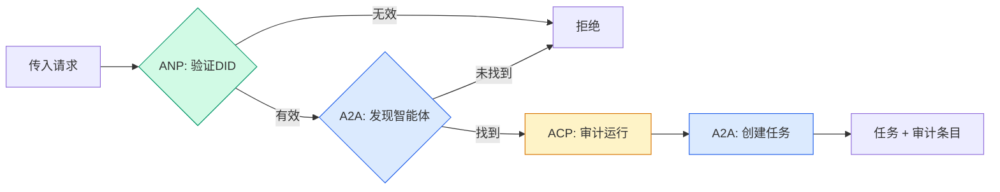

```typescript
class ProtocolGateway {
  private registry: AgentRegistry;
  private taskManager: TaskManager;
  private auditRunner: AuditableRunner;
  private identityRegistry: IdentityRegistry;

  constructor(
    registry: AgentRegistry,
    taskManager: TaskManager,
    auditRunner: AuditableRunner,
    identityRegistry: IdentityRegistry
  ) {
    this.registry = registry;
    this.taskManager = taskManager;
    this.auditRunner = auditRunner;
    this.identityRegistry = identityRegistry;
  }

  async delegateTask(
    fromDid: string,
    signature: string,
    targetAgent: string,
    message: AgentMessage,
    sessionId?: string
  ): Promise<{ task: Task; audit: AuditEntry } | { error: string }> {
    if (!this.identityRegistry.verify(fromDid, signature, message.id)) {
      return { error: "Identity verification failed" };
    }

    const card = this.registry.resolve(targetAgent);
    if (!card) {
      return { error: `Agent ${targetAgent} not found in registry` };
    }

    const audit = await this.auditRunner.run(
      targetAgent,
      [message],
      sessionId
    );
    const task = await this.taskManager.sendMessage(targetAgent, message);

    return { task, audit };
  }

  discoverAndDelegate(
    fromDid: string,
    signature: string,
    skillTag: string,
    message: AgentMessage
  ): Promise<{ task: Task; audit: AuditEntry } | { error: string }> {
    const candidates = this.registry.discoverBySkillTag(skillTag);
    if (candidates.length === 0) {
      return Promise.resolve({
        error: `No agents found with skill tag: ${skillTag}`,
      });
    }
    return this.delegateTask(
      fromDid,
      signature,
      candidates[0].name,
      message
    );
  }
}
```

网关一次调用做四件事：
1. **ANP**：通过DID签名验证调用者身份
2. **A2A**：发现目标智能体并检查能力
3. **ACP**：将执行包装在带有轨迹的审计追踪中
4. **A2A**：创建一个具有完整生命周期追踪的任务

### 步骤7：将所有连接在一起

```typescript
async function protocolDemo() {
  const registry = new AgentRegistry();
  registry.register({
    name: "researcher",
    description: "Searches and summarizes findings",
    version: "1.0.0",
    url: "https://researcher.local/a2a/v1",
    capabilities: { streaming: true, pushNotifications: false },
    defaultInputModes: ["text/plain"],
    defaultOutputModes: ["text/plain", "application/json"],
    skills: [
      {
        id: "web-research",
        name: "Web Research",
        description: "Searches the web",
        tags: ["research", "search", "summarization"],
        inputModes: ["text/plain"],
        outputModes: ["application/json"],
      },
    ],
  });
  registry.register({
    name: "coder",
    description: "Writes code from specs",
    version: "1.0.0",
    url: "https://coder.local/a2a/v1",
    capabilities: { streaming: false, pushNotifications: false },
    defaultInputModes: ["text/plain", "application/json"],
    defaultOutputModes: ["text/plain"],
    skills: [
      {
        id: "code-gen",
        name: "Code Generation",
        description: "Generates code",
        tags: ["coding", "generation"],
        inputModes: ["text/plain", "application/json"],
        outputModes: ["text/plain"],
      },
    ],
  });

  const taskManager = new TaskManager();
  const auditRunner = new AuditableRunner();

  const researchTrajectory: TrajectoryEntry[] = [];

  taskManager.registerHandler(
    "researcher",
    async function* (task, message) {
      yield {
        kind: "statusUpdate" as const,
        taskId: task.id,
        status: { state: "working" as const, timestamp: Date.now() },
      };

      researchTrajectory.push({
        reasoning: "Searching for React 19 documentation",
        toolName: "web_search",
        toolInput: { query: "React 19 compiler features" },
        toolOutput: {
          results: ["react.dev/blog/react-19", "github.com/react/react"],
        },
        timestamp: Date.now(),
      });

      researchTrajectory.push({
        reasoning: "Extracting key findings from search results",
        toolName: "doc_analysis",
        toolInput: { url: "react.dev/blog/react-19" },
        toolOutput: {
          summary:
            "React 19 compiler auto-memoizes, no manual useMemo needed",
        },
        timestamp: Date.now(),
      });

      yield {
        kind: "artifactUpdate" as const,
        taskId: task.id,
        artifact: {
          id: crypto.randomUUID(),
          name: "research-results",
          parts: [
            {
              kind: "data" as const,
              data: {
                findings: [
                  "React 19 compiler auto-memoizes components",
                  "No more manual useMemo/useCallback needed",
                  "Compiler runs at build time, not runtime",
                ],
                sources: ["react.dev/blog/react-19"],
              },
              mediaType: "application/json",
            },
          ],
        },
        append: false,
        lastChunk: true,
      };

      yield {
        kind: "statusUpdate" as const,
        taskId: task.id,
        status: { state: "completed" as const, timestamp: Date.now() },
      };
    }
  );

  auditRunner.registerAgent("researcher", async () => ({
    output: [
      textMessage("agent", "React 19 compiler auto-memoizes components"),
    ],
    trajectory: researchTrajectory,
  }));

  const identityRegistry = new IdentityRegistry();

  const coderIdentity = createIdentity("coder.local", "coder");
  const researcherIdentity = createIdentity("researcher.local", "researcher");

  identityRegistry.publish(coderIdentity.document);
  identityRegistry.publish(researcherIdentity.document);

  const gateway = new ProtocolGateway(
    registry,
    taskManager,
    auditRunner,
    identityRegistry
  );

  console.log("=== Protocol Demo ===\n");

  console.log("1. Agent Discovery (A2A)");
  const researchAgents = registry.discoverBySkillTag("research");
  console.log(
    `   Found ${researchAgents.length} agent(s):`,
    researchAgents.map((a) => a.name)
  );

  console.log("\n2. Identity Verification (ANP)");
  const message = textMessage("user", "Research React 19 compiler features");
  const signature = signPayload(coderIdentity, message.id);
  const verified = identityRegistry.verify(
    coderIdentity.did,
    signature,
    message.id
  );
  console.log(`   Coder DID: ${coderIdentity.did}`);
  console.log(`   Signature verified: ${verified}`);

  console.log("\n3. Task Delegation (A2A + ACP + ANP)");
  const result = await gateway.delegateTask(
    coderIdentity.did,
    signature,
    "researcher",
    message,
    "session-001"
  );

  if ("error" in result) {
    console.log(`   Error: ${result.error}`);
    return;
  }

  console.log(`   Task ID: ${result.task.id}`);
  console.log(`   Task state: ${result.task.status.state}`);
  console.log(`   Artifacts: ${result.task.artifacts.length}`);

  console.log("\n4. Audit Trail (ACP)");
  console.log(`   Run ID: ${result.audit.runId}`);
  console.log(`   Status: ${result.audit.status}`);
  console.log(`   Trajectory steps: ${result.audit.trajectory.length}`);
  for (const step of result.audit.trajectory) {
    console.log(`     - ${step.reasoning}`);
    if (step.toolName) {
      console.log(`       Tool: ${step.toolName}`);
    }
  }

  console.log("\n5. Full Audit Log");
  const fullLog = auditRunner.getFullAuditLog();
  console.log(`   Total runs: ${fullLog.length}`);
  for (const entry of fullLog) {
    const duration = entry.completedAt
      ? `${entry.completedAt - entry.startedAt}ms`
      : "in-progress";
    console.log(`   ${entry.agentName}: ${entry.status} (${duration})`);
  }
}

protocolDemo().catch((err) => {
  console.error("Protocol demo failed:", err);
  process.exitCode = 1;
});
```

## 什么会出错

协议解决了最佳情况路径。以下是在生产中会出问题的地方：

**模式漂移。** 智能体A发布一个广告 `application/json` 输出的智能体卡片。但JSON模式在版本之间变化。智能体B解析旧格式得到垃圾。修复：为你的技能和输出模式进行版本控制。A2A规范为此原因支持智能体卡片上的 `version`。

**状态机违规。** 智能体处理程序产生 `completed` 事件后，试图产生更多产物。任务是不可变的。你的代码静默丢弃更新或抛出。修复：在产生之前检查终止状态。上述 `TaskManager` 通过在终止状态后 `break` 来强制执行这一点。

**信任解析失败。** 智能体A试图验证智能体B的DID，但智能体B的域名宕机。DID文档无法获取。你是故障开放（接受未验证的智能体）还是故障关闭（拒绝一切）？ANP建议以最小信任原则故障关闭。

**轨迹膨胀。** ACP轨迹日志功能强大但昂贵。每次运行产生200次工具调用的复杂智能体生成巨大的审计条目。修复：以可配置的详细级别记录轨迹。记录工具名称和输入输���用于合规，对非受监管工作负载跳过推理步骤。

**发现惊群。** 50个智能体同时在启动时查询 `GET /agents`。修复：使用TTL缓存智能体卡片，错开发现间隔，或使用基于推送的注册替代轮询。

## 运用

### 真实实现

**A2A**是最成熟的。Google的[官方规范](https://github.com/google/A2A)在Linux基金会下开源。Python和TypeScript的SDK。如果你的智能体需要动态发现和协作，从这里开始。

**ACP**正在合并到A2A。IBM的[BeeAI项目](https://github.com/i-am-bee/acp)将ACP创建为REST优先的替代方案，但轨迹元数据概念正在被吸收到A2A生态系统中。即使你使用A2A作为传输，也使用ACP模式（轨迹日志、运行生命周期）。

**ANP**是最具实验性的。[社区仓库](https://github.com/agent-network-protocol/AgentNetworkProtocol)有一个Python SDK（AgentConnect）。元协议协商概念是真正新颖的。值得关注跨组织智能体部署。

**MCP**已在第13阶段涵盖。如果你想让智能体使用工具，MCP是标准。

### 选择正确的协议

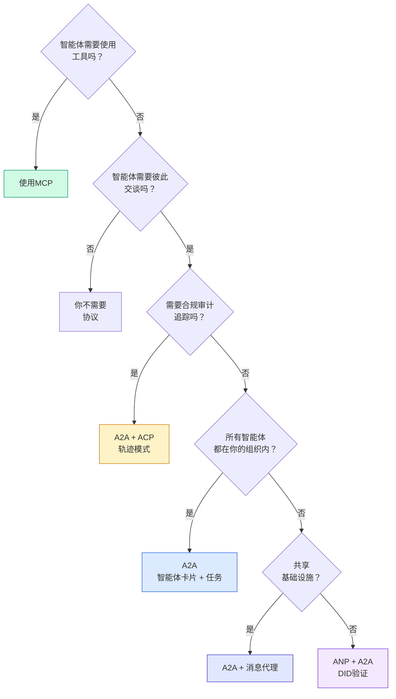

## 交付物

本课产生：
- `code/main.ts` -- 所有四种协议模式的完整实现
- `outputs/prompt-protocol-selector.md` -- 帮助你为系统选择协议的提示

## 练习

1. **多跳任务委派。** 扩展 `TaskManager`，使智能体处理程序可以将子任务委派给其他智能体。研究者接收任务，将"搜索"和"摘要"子任务委派给两个专家智能体，等待两者完成，然后将结果合并到自己的产物中。

2. **流式审计追踪。** 修改 `AuditableRunner` 以支持流模式。不等待完整结果，而是在轨迹条目被添加���实时产生 `AuditEntry` 更新。使用产生审计快照的异步生成器。

3. **DID轮换。** 在 `IdentityRegistry` 中添加密钥轮换。智能体应能发布带有更新密钥的新DID文档，同时维护 `previousDid` 引用。验证者应在宽限期内接受来自当前和先前密钥的签名。

4. **协议协商。** 实现ANP的元协议概念。两个智能体交换带有候选格式（例如"我能说JSON-RPC" vs "我更喜欢REST"）的 `protocolNegotiation` 消息。最多3轮后，它们就格式达成一致或超时。达成一致的格式决定它们使用哪个 `TaskManager` 或 `AuditableRunner`。

5. **速率限制发现。** 添加一个 `RateLimitedRegistry` 包装器，使用可配置的TTL缓存智能体卡片查找，并限制每个智能体每秒的发现查询次数。模拟100个智能体在启动时相互发现的惊群现象并测量差异。

## 关键术语

| 术语 | 人们常说的 | 实际含义 |
|------|----------------|----------------------|
| MCP | "AI工具的协议" | 一个客户端-服务器协议，让智能体发现和使用工具。智能体到工具，而非智能体到智能体。 |
| A2A | "Google的智能体协议" | Linux基金会下的一个点对点智能体协作协议。通过智能体卡片发现，9种状态任务生命周期，通过SSE流式传输。支持JSON-RPC、REST和gRPC绑定。 |
| ACP | "企业智能体消息" | IBM/BeeAI的用于带TrajectoryMetadata的智能体运行的REST API：每个响应携带推理和工具调用的完整链。正在合并到A2A。 |
| ANP | "去中心化智能体身份" | 一个社区协议，使用 `did:wba`（DID）进行加密身份验证，HPKE用于E2EE，AI驱动的元协议协商用于从未见过的智能体。 |
| 智能体卡片 | "智能体的名片" | 位于 `/.well-known/agent-card.json` 的JSON文档，描述技能、支持的MIME类型、安全方案和协议绑定。 |
| DID | "去中心化ID" | W3C标准，用于托管在智能体自己域上的加密可验证身份。ANP使用 `did:wba` 方法。 |
| TrajectoryMetadata | "审计收据" | ACP的机制，用于将推理步骤、工具调用及其输入/输出附加到每个智能体响应。 |
| 元协议 | "智能体协商如何交谈" | ANP的方法，智能体使用自然语言动态就数据格式达成一致，然后生成代码来处理它们。 |
| 任务 | "一个工作单元" | A2A的有状态对象，跟踪从提交到完成的工作。一旦终止即不可变。 |

## 进一步阅读

- [Google A2A specification](https://github.com/google/A2A) -- 官方规范和SDK（v1.0.0，Linux基金会）
- [IBM/BeeAI ACP specification](https://github.com/i-am-bee/acp) -- 智能体运行和轨迹元数据的OpenAPI 3.1规范
- [Agent Network Protocol](https://github.com/agent-network-protocol/AgentNetworkProtocol) -- 基于DID的身份、E2EE、元协议协商
- [Model Context Protocol docs](https://modelcontextprotocol.io/) -- Anthropic的MCP规范（第13阶段涵盖）
- [W3C Decentralized Identifiers](https://www.w3.org/TR/did-core/) -- 支撑ANP的身份标准
- [RFC 9180 (HPKE)](https://www.rfc-editor.org/rfc/rfc9180) -- ANP用于E2EE的加密方案
- [FIPA Agent Communication Language](http://www.fipa.org/specs/fipa00061/SC00061G.html) -- 现代智能体协议的学术前身
