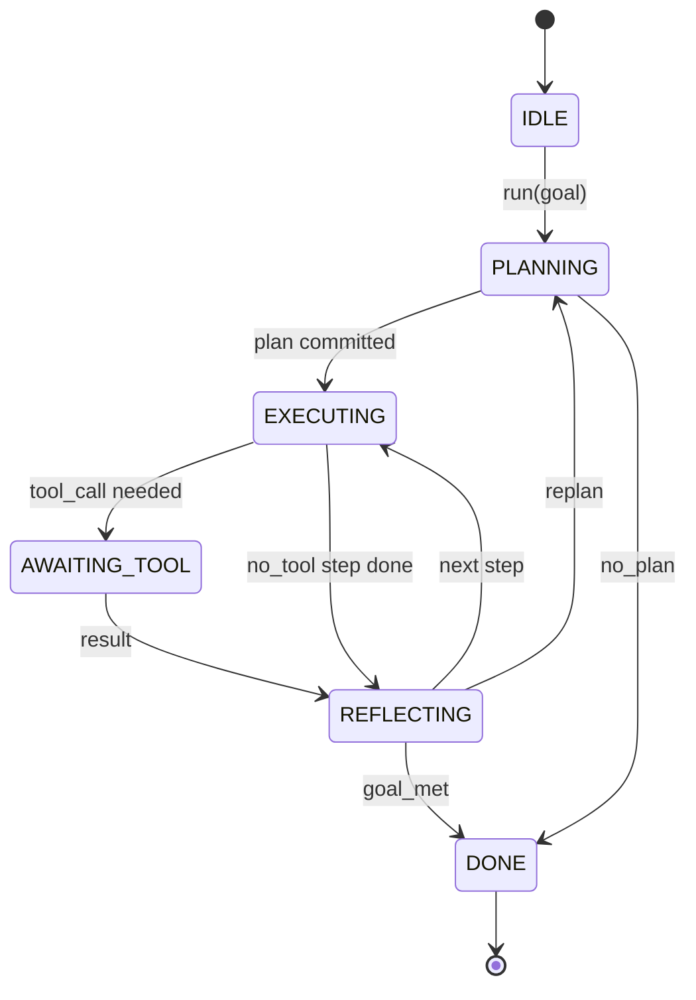

# 智能体控制框架循环契约

> 控制框架才是智能体。模型是协处理器。本节课冻结你任何模型都可以接入的循环契约。

**类型:** 构建
**语言:** Python
**前置条件:** 阶段 13 课程 01-07，阶段 14 课程 01
**时间:** 约 90 分钟

## 学习目标
- 将智能体控制框架循环指定为一个具有显式转换的确定性状态机。
- 实现十个生命周期钩子主题，操作者将策略、遥测和护栏连接其中。
- 定义两个拉取点，在此控制循环将控制权交还给调用者，并在新输入到来时恢复。
- 强制执行每个会话的预算（轮次、工具调用、墙钟时间），在超出时不泄漏部分状态。
- 发出十一种事件类型的带类型流，以便下游 UI 和追踪器可以订阅，而无需直接检查循环。

## 框架

一个无人值守运行四十轮的编程智能体不是一个聊天循环。它是一个状态机，操作者可以拦截其节点，审计其边。一旦你把契约写下来，交换模型、工具或策略就不再是重构，而是一个注册调用。

本节课构建那个契约。我们命名了六个状态、十个钩子主题、两个拉取点、十一种事件类型和一个预算包络。控制框架中的其他一切（工具注册中心、JSON-RPC 传输、调度器、计划器）都插入这个形状。

## 状态

循环有六个状态。五个是活跃的。一个是终态的。



`IDLE` 是唯一合法的入口点。`DONE` 是唯一合法的出口。`AWAITING_TOOL` 是唯一产生拉取点的状态。每个其他转换都是内部的。

状态机是确定性的。给定相同的事件日志，控制框架重新进入相同的状态。这一属性让你可以重放会话进行调试，而无需重新调用模型。

## 钩子主题

钩子是操作者切入循环的接口。控制框架触发十个主题。每个主题接受任意数量的订阅者。订阅者按注册顺序触发。订阅者可以变异载荷、引发异常以中止该轮，或返回一个哨兵值以跳过下一步。

```text
before_plan         after_plan
before_tool_call    after_tool_call
before_step         after_step
on_error
on_pause
on_budget_exceeded
on_complete
```

其形状反映了 Claude Code、Cursor 和 OpenCode 在 2025 年中都收敛到的形态。名称是功能性的，不是品牌化的。阻止 `rm -rf` 的钩子位于 `before_tool_call` 中。发送 OpenTelemetry span 的钩子位于 `after_step` 中。在暂停的会话上恢复的钩子位于 `on_pause` 中。

## 拉取点

循环交还控制权两次。第一次在 `AWAITING_TOOL` 上，当没有工具结果就无法取得进展时。第二次在 `on_pause` 上，当预算耗尽或钩子明确请求人工审查时。

拉取点不是异常。它是一个返回。调用者检查控制框架状态，获取控制框架请求的任何内容，并调用 `resume(payload)`。控制框架从停止的地方继续。这与 Python 生成器的形状相同。通过拉取点的传输由你选择。在 TUI 中，它是按键。通过 MCP，它是 `tools/call`。通过队列，它是作业轮询。

## 事件流

循环在契约中的特定点将事件附加到一个带类型的流中。该流是追加式的，订阅者可以从任意偏移量重放。实现的十一种事件类型是：

- `session.start` — 在调用 `run(goal)` 时发出一次
- `plan.draft` — 在计划器返回草稿计划时发出
- `plan.commit` — 在草稿被提交为活跃计划后发出
- `step.start` — 在每个执行步骤开始时发出
- `step.end` — 在每个执行步骤结尾时发出
- `tool.call` — 当需要工具的步骤将控制权交给调用者时发出
- `tool.result` — 在带有工具结果恢复时发出
- `tool.error` — 在带有错误恢复或钩子中止调用时发出
- `budget.warn` — 在达到预算限制时发出
- `session.pause` — 当循环在暂停（预算或钩子）上让出时发出
- `session.complete` — 当循环到达 `DONE` 时发出一次

事件不重复钩子载荷。钩子是命令式的（变异、中止）。事件是观察性的（记录、发送）。将它们视为正交的。

## 预算包络

会话带有三个限制：轮次计数、工具调用计数和墙钟秒数。每轮将轮次增加一。每个工具调用将工具调用增加一。墙钟时间在每个状态转换时检查。当达到任何限制时，循环触发 `on_budget_exceeded`，发出 `budget.warn`，然后在下一个拉取点转换为带有预算超出原因的 `IDLE`。

预算不是杀开关。它是一个让出。调用者决定是扩展预算并恢复，还是关闭会话。

## 本节课不做什么

它不调用模型。它不注册真实工具。它不实现传输。这些是接下来四节课的内容。本节课钉住契约，以便接下来的四节课可以插入它而无需重写。

`main.py` 中的确定性计划器是一个占位符。它返回一个包含三个步骤的硬编码计划，其中两个需要工具结果。重点在于循环，而不是计划。

## 如何阅读代码

`HarnessLoop` 是主类。它持有状态、触发钩子、发出事件。`Budget` 追踪限制。`Event` 是流上的带类型包络。`HookRegistry` 是调度表。`_transition` 是唯一改变状态的函数，因此状态机不变量存在于一个地方。

自上而下阅读 `main.py`。然后阅读 `code/tests/test_loop.py`。测试固定每个转换和每个钩子触发顺序。

## 进一步探索

在生产中构建控制框架的最难部分不是状态机，而是使契约可执行。契约必须能够在计划器热重载中存活。它必须能够在返回格式错误的 JSON 的工具中存活。它必须能够在四十轮会话的三分之二处，在 `before_tool_call` 中引发异常的钩子中存活。本节课的测试运用了这些故障模式。运行它们。打破它们。添加案例。

下一节课添加工具注册中心。之后是 JSON-RPC 传输。之后是调度器。到第二十四节课时，本文件中的循环将针对真实工具运行真实计划，有真实预算强制执行。
