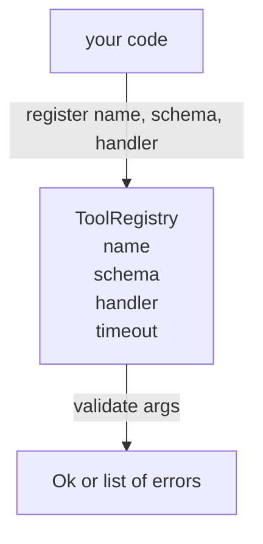

# 带模式验证的工具注册中心

> 智能体无法验证的工具就是智能体无法调用的工具。先构建注册中心和模式检查器，再构建工具。

**类型:** 构建
**语言:** Python
**前置条件:** 阶段 13 课程 01-07，阶段 14 课程 01
**时间:** 约 90 分钟

## 学习目标
- 持有类型化的工具名称 → 模式 → 处理器的注册中心，调度器可以查询一次并在此后信任。
- 实现一个 JSON Schema 2020-12 子集，涵盖百分之九十的工具调用实际使用的关键字。
- 返回精确的、json-pointer 形状的错误路径，以便模型可以在一次往返中自我纠正。
- 拒绝在没有显式覆写的情况下重新注册，因为静默覆盖是生产工具目录漂移的方式。
- 保持验证器纯净（无 I/O、无时间、无全局变量），以便可以在重放日志上重新运行。

## 为什么注册中心出现在工具之前

2026 年的编程智能体注册的工具比模型能在单个上下文窗口中容纳的更多。一个重要的控制框架将注册两百个工具，并在任意给定的轮次中展示十到四十个。注册中心是关于"存在什么工具"、"它们的参数是什么形状"以及"我调用什么处理器"的真实来源。一旦这三个答案被固定下来，控制框架的其他部分就可以停止猜测。

我们要避免的错误是发布没有模式的处理程序，或者发布没有验证的模式。这两种情况都很常见。两者都将下一层（第二十三课中的调度器）变成一个猜测游戏，其中唯一的故障模式是处理程序中的堆栈跟踪。

## 工具记录长什么样

```text
ToolRecord
  name        : str          (unique, lowercase alphanumeric and underscore segments separated by dots, e.g., snake_case.segment.case)
  description : str          (one line, shown to the model)
  schema      : dict         (JSON Schema 2020-12 subset)
  handler     : Callable     (async or sync, returns Any)
  idempotent  : bool         (dispatcher uses this for retry decisions)
  timeout_ms  : int          (override per-tool dispatcher default)
```

模式是验证器唯一接触的字段。处理程序对它是不透明的。我们有意将它们分开。模式是数据。处理程序是代码。将它们混合起来会诱使你将验证逻辑放在处理程序内部，这正是我们要阻止的错误。

## JSON Schema 2020-12 子集

完整的 2020-12 规范是一篇论文。我们需要八个关键字。

```text
type           string / number / integer / boolean / object / array / null
properties     map of property name -> schema
required       list of property names
enum           list of allowed primitive values
minLength      integer, applies to strings
maxLength      integer, applies to strings
pattern        ECMA-262-compatible regex, applies to strings
items          schema applied to every array element
```

这足以涵盖工具 API 实际需要的内容。我们不添加的关键字（oneOf、anyOf、allOf、$ref、条件）在生产模式中是有效的，但会将验证器变成一个带有循环的树遍历器。我们正在构建注册中心，而不是 JSON Schema 引擎。

## Json pointer 错误路径

当验证失败时，验证器返回一个错误列表。每个错误携带一个指向输入的 json-pointer 路径。指针是一个以斜杠为前缀的属性名称和数组索引序列。

```text
{"a": {"b": [1, 2, "x"]}}
                    ^
                    /a/b/2
```

模型读取错误路径比读取句子更好。如果模式要求 `args.user.email` 而模型传递了一个整数，那么错误应该是 `/user/email` 带有 `expected_type: string`。模型在下次调用中就会修复，无需自然语言的来回。

## 注册和覆写

`register(name, schema, handler, **opts)` 默认拒绝重新注册。调用者必须传递 `override=True` 来替换。这是运维卫生。代码库的两个部分静默注册相同的工具名称是属于在生产中需要一周才能找到的那种错误。

注册中心暴露三个读取方法。`get(name)` 返回记录或引发异常。`validate(name, args)` 返回 `Ok` 或错误列表。`names()` 按注册顺序返回工具名称。

## 验证器是什么和不是什么

它是对模式树的单次遍历，递归。它是纯净的。它不调用处理程序。它不强制类型转换（字符串 `"42"` 不通过数字模式）。它不静默截断。

它不是一个安全边界。验证通过后，恶意处理程序仍然可以行为不端。第二十三课中的调度器添加了超时和沙箱层。注册中心添加了形状。

## 形状



## 如何阅读代码

`code/main.py` 定义了 `ToolRegistry`、`ToolRecord`、`ValidationError` 和八个验证器函数。验证器根据 `schema["type"]` 进行分发（或将带有 `enum` 的模式视为无类型的枚举检查）。每个类型验证器返回空列表或一个 `ValidationError` 列表。顶级遍历器串联错误，并在下降时添加路径段。

`code/tests/test_registry.py` 涵盖了注册、覆写、验证成功、带路径的验证失败以及子集中的每个关键字。

## 进一步探索

这节课落地后你需要的两个扩展是针对本地 definitions 块的 `$ref` 解析，以及用于严格形状的 `additionalProperties: false`。两者都很小。当工具目录增长到超过五十个工具时，两者都很常见。我们将它们从课程中排除，以使文件保持在一次阅读内。

下一节课（第二十二课）构建将本注册中心暴露给模型客户端的 JSON-RPC stdio 传输。下一节课之后（第二十三课）将两者包装在带有超时和重试的调度器后面。
