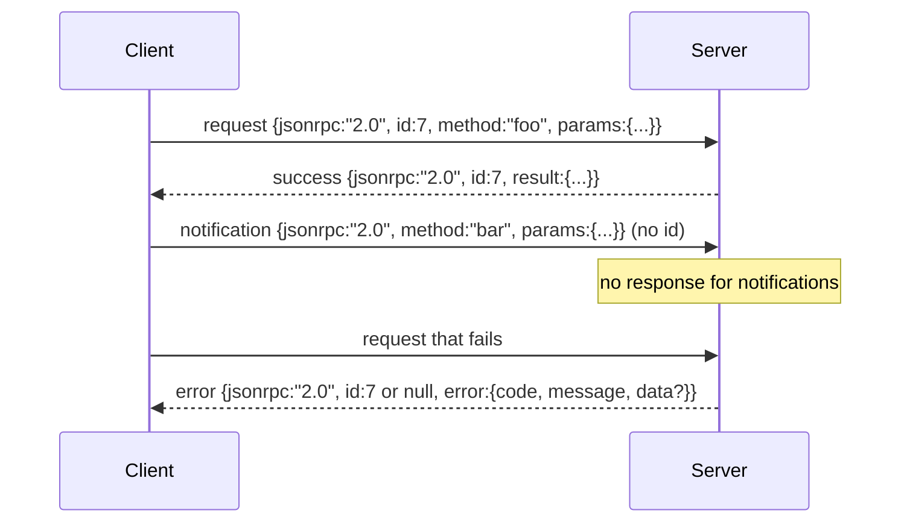

# 基于换行分隔 Stdio 的 JSON-RPC 2.0

> 模型客户端和工具服务器之间的传输是 JSON-RPC over stdio。手写一次，你就能理解每个框架层在为什么付出代价。

**类型:** 构建
**语言:** Python
**前置条件:** 阶段 13 课程 01-07，阶段 14 课程 01
**时间:** 约 90 分钟

## 学习目标
- 使用 JSON-RPC 2.0，以换行分隔的 JSON 在 stdin 和 stdout 上进行框架。
- 映射五个标准错误代码（-32700、-32600、-32601、-32602、-32603），并用正确的语义展示它们。
- 区分请求、响应、通知和批处理，而不发明新的包络键。
- 处理每行一个解析错误，而不毒化流的其余部分。
- 使用 io.BytesIO 构建一个自终止演示，使课程无需生成子进程即可运行。

## 为什么 JSON-RPC 一直是通用语言

2026 年的编程智能体在单个会话中与大约十二个工具服务器通信。每个服务器是一个单独的进程或远程端点。自 2013 年以来，线格式一直相同。JSON-RPC 2.0 是一份两页的规范。它之所以存活下来，是因为替代方案（gRPC、每次调用 HTTP、自定义二进制格式）都施加了 JSON-RPC 所没有的权衡：它们要么选择流式传输，要么选择批处理，要么选择传输耦合。JSON-RPC 在 stdio、套接字、websocket 和 HTTP 上都是对称的，如果客户端和服务器都遵守规范，客户端可以驱动一个它从未见过的服务器。

这节课构建 stdio 变体。换行分隔的 JSON。每个请求是一行。每个响应是一行。传输边界是 `\n`。

## 线形状

存在四种包络形状。两种由客户端说出。两种由服务器说出。



通知没有 `id`。服务器不能响应它。如果服务器返回对通知的响应，客户端无法将其附加到调用站点。这一条规则使框架数学保持简单。

批处理是请求或通知的 JSON 数组。服务器以任何顺序回复一个响应数组，每个非通知条目一个。如果批处理中的每个条目都是通知，服务器什么也不返回。

## 五个错误代码

```text
-32700  Parse error      JSON could not be parsed
-32600  Invalid Request  Envelope shape is wrong
-32601  Method not found
-32602  Invalid params
-32603  Internal error
```

-32000 到 -32099 之间的代码保留用于服务器定义的错误。其他所有都是应用定义的。课程坚持使用这五个。如果你的处理程序引发异常，传输将其包装为 -32603，并在 `data.exception` 中包含异常类名。

解析错误有一个特殊规则。响应中的 `id` 是 `null`，因为请求从未解析到足以提取 id。

## 换行框架和 BytesIO 演示

传输每次读取一行。一行是直到并包括 `\n` 的字节。如果一行无法解析，传输写入一个带有 `id: null` 的 -32700 响应并继续。流没有被毒化。下一行被全新解析。

对于课程，我们将一个 `io.BytesIO` 对包装为 stdin 和 stdout。服务器读取请求直到 EOF，为每个写入响应，然后返回。客户端读回响应。不生成进程。没有超时。传输行为与真实子进程管道相同，因为 Python 的 `io` 接口呈现了相同的 `.readline()` 和 `.write()` 契约。

## 方法调度

传输不知道存在哪些方法。它将控制权交给控制框架提供的可调用对象 `handler(method, params)`。处理程序返回结果或引发异常。三个异常类展示特定的错误代码。

```text
MethodNotFound -> -32601
InvalidParams  -> -32602
Anything else  -> -32603 with exception name in data
```

传输从未看到工具注册中心。注册中心位于处理程序后面。这就是我们想要的分层。传输使用 JSON-RPC。注册中心使用工具形状。调度器（第二十三课）将它们缝合在一起。

## 错误时的流行为

```text
client writes              server reads             server writes
---------------            -----------              -------------
{...valid request...}      parses ok                {...response, id matches...}
{...broken json...         parse fails              {id:null, error: -32700}
{...valid request...}      parses ok                {...response, id matches...}
{...missing method...}     invalid envelope         {id:X, error: -32600}
```

一行损坏的 JSON 不会停止循环。缺少 `method` 字段不会停止循环。处理程序异常不会停止循环。传输一直读取直到 EOF。

## 通知和非对称流

通知是即发即忘的。控制框架使用通知进行进度事件、取消信号和日志行。通知是长时间运行的工具如何流式传输状态更新而不为每个更新进行往返的方式。

课程实现了一个出站通知辅助函数 `write_notification`。服务器使用它在请求飞行时发出进度。演示展示了该模式：请求到达，处理程序发出两个进度通知，然后写入最终响应。

## 如何阅读代码

`code/main.py` 定义了 `StdioTransport`、解析辅助函数（`parse_request`）、三个写入辅助函数（`write_response`、`write_error`、`write_notification`）以及调度循环 `serve`。错误代码常量位于模块作用域。

`code/tests/test_transport.py` 涵盖了五个错误代码、通知（不写入响应）、批处理（数组输入、数组输出、跳过通知）、损坏的 JSON（解析错误然后继续），以及处理程序在调用中写入通知的非对称流。

## 进一步探索

这个传输对于后续课程足够了。生产传输增加了三样东西。一个在转发中存活的关联 id 字段（你的 `id` 已经是这个，但在网格中你还需要一个外部追踪 id）。一个取消通道（像 `$/cancelRequest` 这样的通知，带有飞行中调用的 id）。以及一个内容类型协商握手，以便同一个套接字可以同时使用 JSON-RPC 和 Streamable HTTP。这些都改变不改变线格式。它们添加了元数据。
