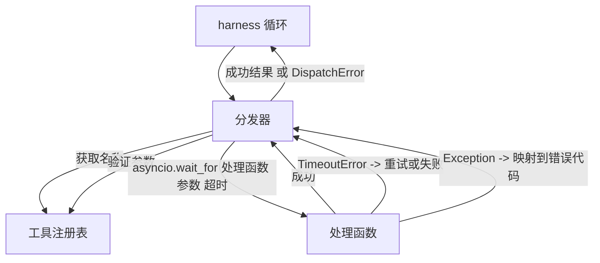
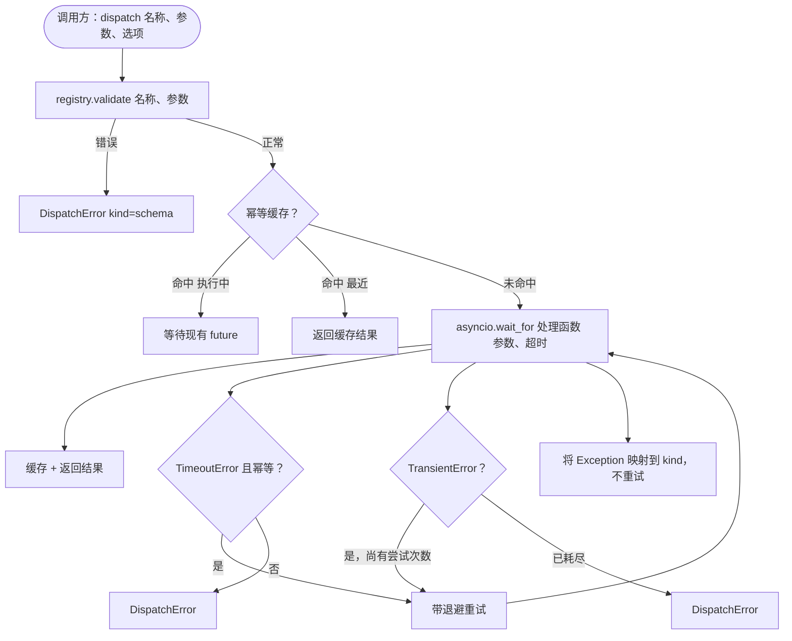

# 函数调用分发器

> 分发器是 harness 为 schema 所做的每一个承诺付出代价的地方。超时、重试、去重、错误映射。全部在一个接缝上。

**类型：** 构建
**语言：** Python
**前置条件：** 第 13 阶段第 01-07 课，第 14 阶段第 01 课
**时间：** ~90 分钟

## 学习目标
- 用每次调用的超时来封装工具处理函数，超时时返回类型化错误而不是挂起循环。
- 应用带抖动的指数退避重试机制，设置最大尝试次数。
- 在幂等键上对重试进行去重，使得与缓慢的原始调用发生竞争的重试不会执行两次。
- 将处理函数异常和传输故障映射到 harness 循环已经理解的单一错误信封上。
- 用并发限制来约束并行分发，使得四十个工具调用的扇出不会耗尽事件循环。

## 分发器的位置

位于 harness 循环（第二十课）和工具注册表（第二十一课）之间。传输层（第二十二课）为循环提供数据。循环将工具调用交给分发器。分发器调用注册表，运行处理函数，并返回结果或 JSON-RPC 形状的错误信封。



分发器是唯一了解定时器、重试和幂等性的层。循环不知道。注册表不知道。处理函数不知道。这种隔离正是其意义所在。

## 超时

每个工具都有一个默认超时。注册表记录携带 `timeout_ms`。当 harness 传递每次调用覆盖时，分发器会覆盖它。我们使用 `asyncio.wait_for`。超时时，处理函数任务被取消，分发器返回 `DispatchError(kind="timeout")`。

对于非幂等工具，超时默认不是可重试的错误。一个已超时的 `db.write` 可能已经或尚未提交。重试会重复执行写入操作。分发器遵循注册表记录中的 `idempotent` 标志。幂等工具可重试。非幂等工具不可重试。

## 带指数退避的重试

重试策略最多三次尝试。退避是指数级的并带有抖动。

```text
attempt 1  -> delay 0
attempt 2  -> delay 0.1s * (1 + random[0..0.5])
attempt 3  -> delay 0.4s * (1 + random[0..0.5])
```

只有 `timeout` 和 `transient` 错误可重试。`schema` 错误、`not_found` 或 `internal` 错误不重试。Schema 错误是确定性的。重试不会改变结果，只会消耗预算。

重试循环遵循 harness 中的预算。如果调用方的预算剩余零次工具调用，分发器在第一次尝试时快速失败并返回 `kind="budget_exceeded"`。

## 幂等键去重

在原始调用仍在执行时触发的重试是一个真实的生产环境 bug。第一次调用在四点九秒时挂起（刚好在超时之前）。重试在五秒时触发。现在两个请求竞争同一个后端。如果工具是 `payments.charge`，你就收费了两次。

分发器接受一个可选的 `idempotency_key`。如果在调用到达时有相同键正在执行中，分发器会等待正在执行中的 future 并返回其结果。缓存在完成后保留六十秒的键，以吸收延迟的重试。

键是调用方的责任。harness 从规划器中派生它：`f"{step_id}:{tool_name}:{hash(args)}"`。分发器不会发明键，因为仅从参数派生键会使两个语义不同的调用看起来相同。

## 错误信封

失败的分发返回单一形状。

```text
DispatchError
  kind        : "timeout" | "transient" | "schema" | "not_found" | "internal" | "budget_exceeded"
  message     : str
  attempts    : int
  jsonrpc_code: int   (下列之一：-32601、-32602、-32603)
```

harness 循环将 `kind` 映射到下一个状态。`schema` 和 `not_found` 进入 `on_error` 并触发重新规划。`timeout` 和 `transient` 进入 `on_error`，根据尝试次数可能重新规划也可能不重新规划。`budget_exceeded` 触发 `on_budget_exceeded`。

## 扇出时的并发限制

`gather(*calls)` 同时运行所有协程。四十个工具调用就是四十个打开的套接字或四十个子进程管道。大多数后端不喜欢来自一个客户端的四十个并行连接。

分发器用信号量来包装 `gather`。默认并发限制为八。每个调用在分发前获取信号量，完成后释放。调用方看到 `gather` 形状的输出，但实际的调度是受限的。

## 一次调用的流程



## 如何阅读代码

`code/main.py` 定义了 `Dispatcher`、`DispatchError` 和 `TransientError`。分发器在构造时接受注册表。异步的 `dispatch(name, args, ...)` 是唯一的入口点。每次尝试的超时在 `_run_with_retries` 内部使用 `asyncio.wait_for` 内联应用。`gather_bounded(calls)` 以并发限制运行多个 dispatch 调用。

`code/tests/test_dispatcher.py` 涵盖了超时触发、瞬态错误重试、schema 错误不重试、幂等去重（两个具有相同键的并发调用合并为一次处理函数调用）以及并发限制（信号量实际生效）。

测试使用 `asyncio.sleep(0)` 和确定性的基于 `Counter` 的处理函数，因此它们在毫秒内完成，不依赖于墙上时钟计时。

## 进阶

生产环境分发器添加的两个扩展。首先，在每个转换点记录结构化日志（harness 循环的事件流已经提供，但分发器还应发出 `dispatch.attempt` 和 `dispatch.retry` 事件）。其次，断路器：在一个窗口内发生 N 次失败后，工具进入冷却期，在此期间分发调用立即返回 `kind="circuit_open"` 而不是尝试处理函数。两者都可以在此分发器之上添加，而无需更改合约。

第二十四课将分发器粘合到规划-执行智能体上，这样你就能看到所有四个部分协同工作。
