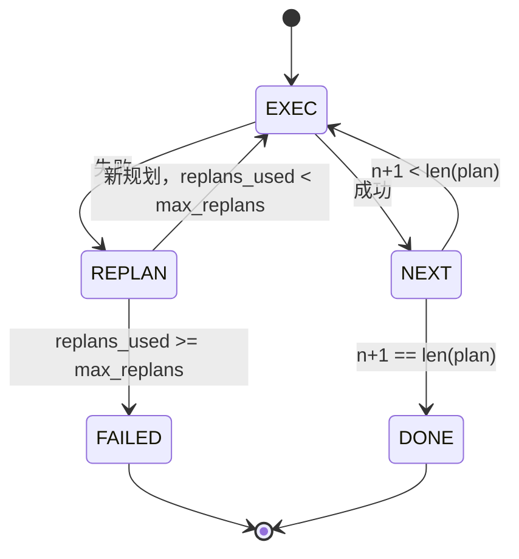

# 规划-执行控制流

> 一个无法承受失败的规划只是一个脚本。一个可以重新规划的脚本才是一个智能体。先构建重新规划器。

**类型：** 构建
**语言：** Python
**前置条件：** 第 13 阶段第 01-07 课，第 14 阶段第 01 课
**时间：** ~90 分钟

## 学习目标
- 将规划表示为一个有序的类型化步骤列表，使执行器能够对进度和结果进行推理。
- 按顺序执行步骤，在控制失败时移交回规划器。
- 从当前光标位置重新规划，将之前的错误包含在上下文中，使下一个规划具有信息性。
- 在每次修订时发出规划差异，以便下游的追踪器或 UI 能够显示规划更改的原因。
- 强制执行两个预算：一个硬性步骤上限和一个硬性重新规划上限。

## 规划与执行，而非思维链

思维链智能体发出 token 并让循环猜测工具调用结束的位置。规划-执行智能体首先发出结构化规划，然后确定性地执行每个步骤。规划是 harness 可以内省的数据。执行是 harness 通过分发器运行这些数据。

两个部分。一个产生规划的规划器。一个运行规划的执行器。有趣的工作发生在执行器遇到失败时。三种选择：

```text
1. 中止（返回失败，暴露错误）
2. 跳过（标记步骤失败，继续执行其余步骤）
3. 重新规划（将错误交给规划器，从光标位置获取新规划）
```

重新规划是将脚本转变为智能体的那一种。

## Step 形状

```text
Step
  id              : int           （在规划修订中单调递增）
  tool_name       : str
  args            : dict
  expected_outcome: str           （规划器声明的成功条件）
  result          : Any | None
  error           : str | None
```

`expected_outcome` 是规划器随步骤发出的简短句子。执行器不强制执行它。它用于两个目的：重新规划器在修订规划时读取它；事件流发出它，以便追踪器可以显示"这个步骤本应执行 X"。

## Planner 形状

```python
def planner(goal: str, history: list[Step], last_error: str | None) -> list[Step]:
    ...
```

一个纯函数。`goal` 是用户目标。`history` 是已执行的步骤（结果和错误已填入）。`last_error` 在第一次调用时为 None，在后续每次调用时为最近的失败消息。规划器返回从光标位置开始的下一个规划。

规划器不知道执行器的存在。它不知道重试。它不知道超时。它产生一个规划。仅此而已。

## Executor

执行器是一个小型状态机。每个步骤通过分发器运行。结果是三种情况之一：成功、可重新规划的失败、致命失败。可重新规划的失败交回给规划器。致命失败（预算超出、重新规划上限达到）返回 `FAILED` 会话结果。



## 修订时的规划差异

当规划器在失败后返回新规划时，执行器发出一个带有三个字段的 `plan.diff` 事件。

```text
removed: 旧规划中存在但新规划中不存在的步骤 ID 列表
added  : 新规划中存在但旧规划中不存在的步骤 ID 列表
revised: tool_name 或 args 发生变化的步骤 ID 列表
```

追踪器或 UI 可以将其渲染为对被删除步骤的删除线和对新增步骤的高亮。关键不在于差异格式，而在于修订是一个可见事件，而不是无声的重写。

## 两个预算，均为硬性

`max_steps` 限制整个会话中的总步骤执行次数，包括重新规划。默认值为十二。一个五步的线性规划如果重新规划两次、每次都增加三个步骤，则会达到十六次执行并将超出预算。执行器将拒绝重新规划并返回 FAILED。

`max_replans` 限制在第一个规划之后调用规划器的次数。默认值为五。这是更重要的限制。一个连续五次返回相同错误规划的规划器，否则将一直循环直到步骤预算捕获它。限制重新规划次数使失败更快、原因更清晰。

## 本课中的确定性规划器

本课不调用模型。本课提供一个确定性规划器，根据 `last_error` 选择规划。

```text
last_error 为 None    -> 发出一个四步规划
last_error 匹配 X      -> 发出一个绕过 X 的三步规划
last_error 匹配 Y      -> 发出一个优雅放弃的两步规划
otherwise             -> 返回 []（表示无需重新规划）
```

这足以测试执行器在每种转换路径上的行为：成功、重新规划一次、重新规划两次、重新规划耗尽和步骤预算耗尽。

## Result 形状

```text
SessionResult
  status      : "completed" | "failed"
  reason      : str     （"goal_met" | "step_budget" | "replan_budget" | "no_plan"）
  history     : list[Step]
  revisions   : list[PlanDiff]
  events      : list[Event]
```

来自第二十课的 harness 循环可以直接读取此结果。来自第二十三课的分发器负责执行每个步骤。来自第二十一课的注册表验证每个步骤的参数。来自第二十二课的传输层将通过 JSON-RPC 将整个流程暴露给模型客户端。

## 如何阅读代码

`code/main.py` 定义了 `PlanExecuteAgent`、`Step`、`PlanDiff`、`SessionResult` 和确定性规划器。执行器是一个单一的 `run(goal)` 方法，返回 `SessionResult`。规划差异通过比较步骤 ID 和 `(tool_name, args)` 元组来计算。

`code/tests/test_agent.py` 涵盖线性成功、中间规划失败并重新规划一次、重新规划耗尽返回 `failed:replan_budget`、步骤预算耗尽以及规划差异事件格式。

## 进阶

当你将其连接到真实模型时，会需要两个扩展。首先，部分规划缓存：当一个规划的六步中的前三步成功后再失败，你不会想重新运行前三步。执行器已保存历史记录；规划器只需要读取它。其次，并行分支：当前的执行器是严格顺序的。一个发出独立分支的规划器（`gather_step` 而不是 `next_step`）可以通过分发器并发运行两个工具调用。

两者都增加了真正的复杂性。一旦线性执行器固定下来，两者都更容易添加。这就是本课所做的。
