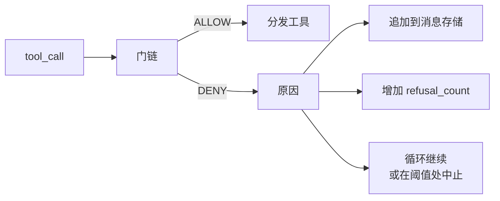
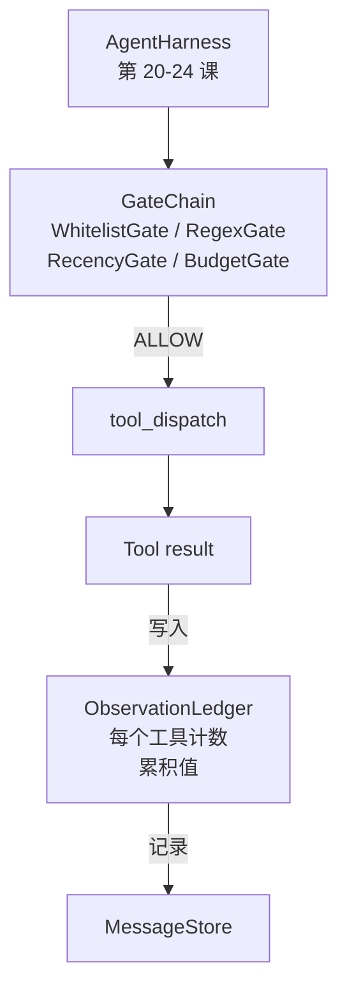

# 综合项目第 25 课：验证门和观察预算

> 一个没有验证层的智能体 harness 就像披着风衣的幻想。本课构建确定性门链，决定工具调用是否被允许执行、智能体可以查看其输出的多少内容，以及当智能体读取过多时循环必须停止的时刻。这条链由小型命名门和观察账本组成，账本追踪模型被展示的每个 token。

**类型：** 构建
**语言：** Python（标准库）
**前置条件：** 第 19 阶段 · 20-24（轨道 A1：智能体循环、工具注册表、消息存储、提示构建器、模型路由器），第 14 阶段 · 33（指令作为约束），第 14 阶段 · 36（作用域合约），第 14 阶段 · 38（验证门）
**时间：** ~90 分钟

## 学习目标

- 使用确定性的 `evaluate(call)` 方法构建 `VerificationGate` 协议。
- 将预算门、时效门、白名单门和正则表达式门组合成具有短路语义的链。
- 通过按工具和轮次索引的 `ObservationLedger` 追踪每次观察。
- 当累积的观察预算将被超出时，拒绝工具调用。
- 输出一个结构化的 `GateDecision` 记录，供下游的可观测性系统接收。

## 问题

当智能体 harness 允许模型自由调用工具时，在实际使用的第一个小时内会出现三类 bug。

第一类是无限制的观察。在一个 20 万行的仓库上执行 grep，会将五十万个 token 的输出倾倒入下一个轮次。模型每千字节看到一个匹配，其余上下文都被浪费了。token 账单庞大，智能体在任务上的表现更差而非更好。

第二类是过时的时效性。一个长时间运行的任务积累了五十次工具调用。模型重读第三轮的第一次 `read_file`，仿佛它是实时状态。第四十七轮所做的编辑从未出现，因为提示构建器最早序列化了最早的观察。

第三类是权限蔓延。一个研究任务以调用 `web_search` 开始，然后不知何故以运行 `shell` 结束，因为模型发明了一个工具名称而 harness 默认是宽松的。当有人阅读追踪记录时，一个垃圾文件已存在于 /tmp 中，并且一个 curl 已对私有 API 执行。

验证门是 harness 中说"不"的组件。它不是一个模型。它不是一个评判者。它是 `(call, history, ledger)` 的一个确定性函数，返回 ALLOW 或 DENY 并附上原因。原因被记录。模型被告知。循环继续或中止。

## 概念



门是任何具有 `evaluate(call, ctx) -> GateDecision` 方法的东西。链是一个有序列表。评估在第一个拒绝处短路。顺序很重要：廉价的结构门在昂贵的 token 计数门之前运行。

本课提供四个门：

- `WhitelistGate`。允许的工具名称是一个显式集合。之外的任何内容都被拒绝。这是最廉价的门，最先运行。
- `RegexGate`。工具参数与正则表达式匹配。用于拒绝包含 `rm -rf` 的 shell 调用，或针对内部 IP 的 HTTP 调用。纯粹基于调用负载。
- `RecencyGate`。模型只能看到最近 N 轮的观察。更早的观察被屏蔽。该门拒绝其结果将扩展已过期观察窗口的工具调用。
- `BudgetGate`。模型在会话中读取的累积 token 数有一个上限。当账本显示已达到上限时，每个进一步的工具调用都被拒绝。

观察账本是记账。每个成功的工具调用写入一行：工具名称、轮次、发出的 token、累计值。账本回答两个问题：模型总计看到了多少，以及它对工具 X 看到了多少。预算门读取第一个。你将作为练习编写的每个工具的预算门读取第二个。

## 架构



harness 询问链。链要么点头，要么拒绝。如果它点头，工具运行，账本滴答，结果追加到消息存储。如果它拒绝，模型以系统消息的形式收到拒绝，循环决定是重试还是中止。

## 你将构建的内容

实现是一个单一的 `main.py` 加上测试。

1. `Observation` 和 `ToolCall` 数据类定义了传输形状。
2. `ObservationLedger` 记录 `(turn, tool, tokens)` 行，并回答 `cumulative()` 和 `per_tool(name)`。
3. `GateDecision` 携带 `(allow, reason, gate_name)`。
4. `VerificationGate` 是协议。每个门实现 `evaluate(call, ctx)`。
5. `GateChain` 包装一个有序列表。它调用每个门，返回第一个拒绝，或者如果每个门都通过则返回允许。
6. 演示运行一个微小的综合智能体循环。三轮。第三轮触发预算门，循环报告一个干净的拒绝，且拒绝计数非零。

token 计数器故意是一个简陋的 `len(text) // 4` 启发式方法。本课的重点是门的管道，而不是 tokenizer。在生产环境中替换为真正的 tokenizer。

## 为什么链的顺序很重要

拒绝比允许更廉价。`WhitelistGate` 以 O(1) 哈希查找运行。`RegexGate` 以 O(pattern * argv) 运行。`RecencyGate` 读取消息存储的一个小切片。`BudgetGate` 读取整个账本。你按成本递增的顺序排列它们，这样被拒绝的调用在执行昂贵工作之前就短路了。

你还按影响范围来排列它们。白名单是最强的主张：这个工具不在合约中。正则门次之：这个参数不在合约中。时效性门紧随其后：harness 仍然在意，但该调用在结构上是合法的。预算门排在最后，因为根据定义，它只在其他所有门都通过后才触发。

## 这与轨道 A 的其余部分如何组合

前面的课给了你循环、工具注册表、消息存储、提示构建器和模型路由器。本课添加了模型和工具之间的层。第 26 课提供沙箱，一旦门链说 ALLOW，分发器就将工具调用交给沙箱。第 27 课提供评估 harness，将拒绝计数记录为质量信号。第 28 课将门决策连接到 OpenTelemetry span。第 29 课将所有内容拼接成一个可工作的编码智能体。

## 运行它

```bash
cd phases/19-capstone-projects/25-verification-gates-observation-budget
python3 code/main.py
python3 -m pytest code/tests/ -v
```

演示打印每轮追踪，包括每个门决策，并以零退出。测试涵盖账本、每个门的独立测试、链短路和综合循环的端到端测试。
