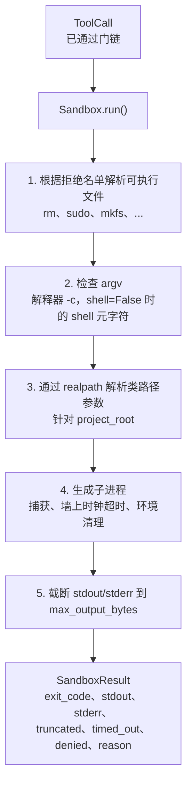
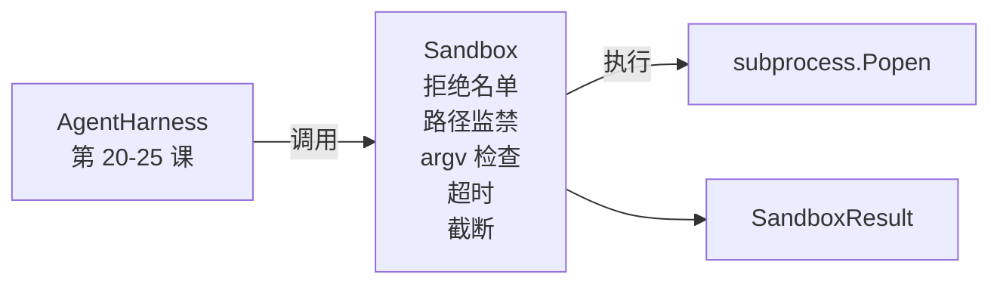

# 综合项目第 26 课：带拒绝名单和路径监禁的沙箱运行器

> 验证门决定工具调用是否应该运行。沙箱决定当它运行时会发生什么。本课提供一个子进程运行器，拒绝危险的执行文件、拒绝危险的 argv 形状、将每个文件路径监禁到项目根目录、截断过大的输出，并在墙上时钟超时时杀死失控的进程。它是位于模型和操作系统之间的两个层中的第二层。

**类型：** 构建
**语言：** Python（标准库）
**前置条件：** 第 19 阶段 · 25（验证门和观察预算），第 14 阶段 · 33（指令作为约束），第 14 阶段 · 38（验证门）
**时间：** ~90 分钟

## 学习目标

- 构建一个 `Sandbox` 类，包装 `subprocess.run`，具有超时、捕获和截断功能。
- 根据拒绝名单按名称拒绝命令，以及通过 argv 检查器按结构拒绝命令。
- 拒绝任何解析到声明的项目根目录之外的路径参数。
- 在 shell 模式关闭时拒绝 shell 元字符。
- 返回一个结构化的 `SandboxResult`，供下游可观测性系统和评估 harness 接收。

## 问题

一个可以执行 shell 的编码智能体可以在单轮中安装后门、泄露密钥、毁坏开发者笔记本电脑并产生云账单。成本最低的防御措施是不给它 shell。成本第二低的是一个沙箱，对一组精确的模式说不。

在智能体追踪记录中反复出现三类失败。

第一类是危险的执行文件。一个在修复路径问题的压力下的模型会尝试 `sudo`、`chmod -R 777`、`rm -rf`、`mkfs`、`dd`。这些都不应该出现在智能体运行中。拒绝名单按名称和别名捕获它们。

第二类是 argv 技巧。一个被告知没有 shell 的模型会通过解释器传递攻击：`python3 -c "import os; os.system('rm -rf /')"`、`bash -c '...'`、`node -e '...'`、`perl -e '...'`。沙箱需要知道任何带 `-c` 风格标志的解释器运行只是带有额外步骤的 shell 调用。

第三类是路径逃逸。模型被告知读取 `./src/main.py`，却读取了 `../../etc/passwd`。沙箱通过 `os.path.realpath` 解析每个路径参数并断言前缀，来监禁每个路径参数。

沙箱不是操作系统意义上的安全边界。一个拥有代码执行能力的坚定攻击者仍然可以突破。沙箱是一个开发时护栏：它使常见的失败模式变得可见，并阻止智能体因纯粹的无能而造成损害。

## 概念



沙箱有四个拒绝轴：名称、argv、路径、结构。每个轴都是调用的纯函数，尚未涉及子进程。子进程仅在每个轴都通过后才生成。

`SandboxResult` 退出代码是常规的：0 成功，非零失败，加上三个哨兵代码表示被拒绝（-100）、超时（-101）和截断（退出代码是真实的，带有一个设置的标志）。下游课程读取此结构化结果，而不是解析 stderr。

## 架构



拒绝名单是一个可执行文件基本名称的 frozenset。别名（`/bin/rm`、`/usr/bin/rm`）都解析为相同的基本名称。argv 检查器了解解释器形状：任何 argv 中 argv[0] 是解释器且任何后续参数以 `-c` 或 `-e` 开头的都被拒绝。Shell 元字符（`;`、`|`、`&`、`>`、`<`、反引号、`$()`）在调用未显式请求 shell 时导致拒绝。

路径监禁是最微妙的部分。沙箱在构造时接受一个 `project_root`。任何看起来像路径的参数（包含 `/` 或匹配现有文件）通过 `os.path.realpath` 标准化，然后与项目根目录的 realpath 进行对比。如果解析的目标不在根目录下，则拒绝。符号链接逃逸尝试（项目根目录中指向外部的符号链接）通过检查 realpath 而不是字面路径来阻止。

## 你将构建的内容

实现是 `main.py` 加上一个测试目录。

1. `SandboxResult` 数据类：exit_code、stdout、stderr、truncated、timed_out、denied、reason、duration_ms。
2. `SandboxConfig` 数据类：project_root、max_output_bytes、timeout_seconds、denylist、interpreter_block。
3. `Sandbox` 类：`run(argv, *, shell=False, cwd=None)` 返回 `SandboxResult`。
4. 内部拒绝辅助函数：`_check_executable_denylist`、`_check_argv_interpreter`、`_check_shell_metachars`、`_check_path_jail`。
5. 输出截断，带有明确的 `truncated` 标志和捕获流中的标记行。
6. 底部演示：一系列合法和对抗性调用。每个调用及其结果被显示。

沙箱默认使用 `subprocess.run` 且 `shell=False`、`capture_output=True`。墙上时钟超时使用 `timeout` 参数；在 `TimeoutExpired` 时，沙箱杀死进程组并合成一个 SandboxResult。

## 为什么这不是真正的沙箱

本课沙箱不使用命名空间、cgroups、seccomp、gVisor、Firecracker 或任何内核级隔离。子进程能做的任何事，沙箱都能做。保护是结构性的：智能体被拒绝最常见的危险调用，响亮的拒绝进入可观测性系统而不是悄悄运行。

对于生产环境智能体，你需要在上面叠加：在非特权 Docker 容器内运行，在 microVM 内运行，降低权限，将项目根目录挂载为只读、scratch 目录挂载为读写，对内存和 CPU 设置 ulimit，将环境清理到已知安全的白名单。第 29 课做了其中一些。操作系统隔离不在本课范围内。

## 运行它

```bash
cd phases/19-capstone-projects/26-sandbox-runner-denylist
python3 code/main.py
python3 -m pytest code/tests/ -v
```

演示创建一个临时目录，在其中放入一个干净文件，然后运行一系列调用。合法调用成功。被拒绝的调用返回带有 `denied=True` 和原因的 SandboxResult。超时返回 `timed_out=True`。截断设置 `truncated=True`。演示打印结果的 JSON 表格并以零退出。

## 这与轨道 A 的其余部分如何组合

第 25 课产生了门链。第 26 课是在门 ALLOW 之后运行的执行器。第 27 课的评估 harness 将沙箱结果与每个任务的预期退出代码进行比较。第 28 课在每次 `Sandbox.run` 调用周围发出 `gen_ai.tool.execution` span。第 29 课的端到端演示将真正的编码智能体通过这两层连接起来。
