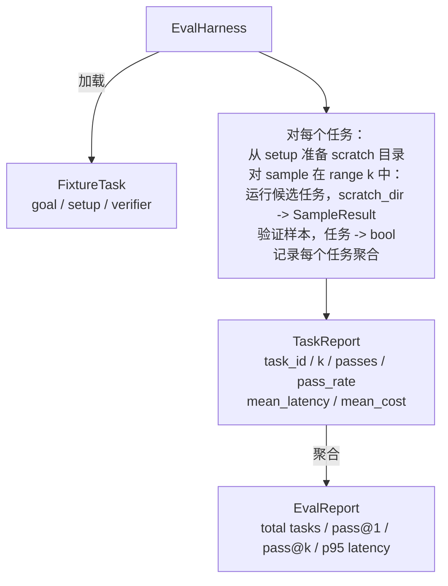

# 综合项目第 27 课：带固定任务夹具的评估 Harness

> 一个编码智能体的好坏取决于你衡量它的任务套件。本课构建一个评估 harness，接受一个固定任务夹具文件夹，通过候选智能体运行每个任务，通过确定性验证器评分通过或失败，并将结果聚合为 pass@1、pass@k、平均延迟和平均成本。该 harness 是让你区分回归和重构的真理来源。

**类型：** 构建
**语言：** Python（标准库）
**前置条件：** 第 19 阶段 · 25（验证门），第 19 阶段 · 26（沙箱运行器），第 14 阶段 · 30（评估驱动的智能体开发），第 14 阶段 · 19（SWE-bench 和 GAIA 基准测试）
**时间：** ~90 分钟

## 学习目标

- 将固定任务夹具定义为目标、设置和验证器的三元组。
- 对每个任务多次采样运行进行评分，并计算 pass@1 和 pass@k。
- 将延迟和成本聚合为平均值和 95 百分位指标。
- 将确定性验证器（文件差异、退出代码、正则表达式匹配）连接为可复用函数。
- 发出一个结构化的 JSON 报告，供回归追踪脚本接收。

## 问题

在没有评估 harness 的情况下构建的智能体基准测试存在三种失败模式。

第一种是未经验证的通过。智能体说它修复了 bug，人类扫了一眼差异，套件被标记为绿色，三周后回归测试暴露出相同的 bug。智能体在没有实际修复任何东西的情况下进行了合理的推理。

第二种是未被检测的回归。提示模板的更改使智能体在显眼任务上提高了 4%，在安静任务上降低了 14%。没有黄金集和每个任务的评分，回归进入主分支，仅在客户投诉时才被发现。

第三种是每个任务的漂移。评估在周一用 100 个任务运行，周五用 95 个任务运行，因为有人重命名了五个夹具。通过率看起来像 5% 的改进。其实不是。

harness 是将这些失败转化为事实的程序。它每次运行每个夹具，以可重现的顺序，针对返回真或假的确定性检查的验证器。

## 概念

```mermaid
flowchart LR
  F1[fixtures/task_001/<br/>task.json + expected/] --> Harness
  F2[fixtures/task_002/<br/>...] --> Harness
  Harness[Harness<br/>对每个任务：<br/>setup / 运行智能体 k 个样本 /<br/>验证每个样本 /<br/>记录延迟、成本]
  Harness --> Report[EvalReport<br/>pass@1 / pass@k<br/>平均 ms / p95 ms<br/>平均成本]
```

`FixtureTask` 是一个小的 JSON 文件加上一个可选的 `expected/` 目录。JSON 声明一个 `id`、一个 `goal`（输入给智能体的提示）、一个 `setup` 块（放入 scratch 目录的文件）和一个 `verifier` 块。验证器块命名 harness 验证器注册表中的函数并提供其参数。

三种验证器形状覆盖了大多数有用的任务。

第一种是 `file_equals`。在智能体运行后，将命名文件与预期内容进行比较。这捕获了"以这种确切方式修复此 bug"任务。

第二种是 `regex_match`。命名文件的内容与正则表达式进行匹配。这捕获了"函数必须存在并返回 X"任务，其中存在许多可接受的解决方案。

第三种是 `shell_exit_zero`。Harness 运行一个 shell 命令（通过第 26 课的沙箱），仅在命令以零退出时才通过任务。这捕获了"测试必须通过"任务。

Harness 对每个任务运行 `k` 次。Pass@k 是 `1 - (1 - p)^k`，其中 p 是经验通过率；harness 还报告原始计数以便你发现方差。延迟是每个样本的墙上时钟时间。成本是智能体自我报告的任何内容（token 计数、USD 或两者）；harness 在样本间累加它，并呈现每个任务和聚合的数字。

```figure
pass-at-k
```

## 架构



候选者是一个可调用对象：`Callable[[FixtureTask, str], SampleResult]`。Harness 通过 `tempfile.mkdtemp()` 创建 scratch 目录并将其路径作为普通字符串传递。Harness 不关心候选者如何工作。候选者可以是确定性补丁应用器（对于 harness 自测有用）、真正的 LLM 智能体或模糊器。合约是 SampleResult。

## 你将构建的内容

`main.py` 提供：

1. `FixtureTask` 数据类。
2. `SampleResult` 数据类：success_self_reported、latency_ms、cost_units、edits。
3. `TaskReport`、`EvalReport` 数据类，具有 `to_dict()`。
4. `VerifierRegistry` 将验证器名称映射到函数。内置验证器：file_equals、regex_match、shell_exit_zero。
5. `EvalHarness` 类。对候选者运行任务目录。返回 EvalReport。
6. 捆绑在 `tasks/` 中的五个固定任务夹具：
   - `fizzbuzz` 中的差一错误
   - `factorial` 中缺少 return
   - 错误消息中的拼写错误
   - 空函数体
   - 链表遍历中的差一错误
7. 一个确定性参考候选者（`apply_known_fixes`），harness 用它来演示干净的 pass@1 为 1.0。
8. 演示打印 EvalReport JSON 并以零退出。

固定任务夹具作为 JSON 文件捆绑在 `tasks/` 中，配对的源文件在 `tasks/<id>/buggy/` 和 `tasks/<id>/expected/` 中。Harness 将 buggy 复制到 scratch 目录，将其交给候选者，并根据 expected 进行验证。

## 为什么是 pass@k 而不仅仅是 pass@1

真正的 LLM 智能体是随机的。0.6 的 pass@1 看起来像失败。0.95 的 pass@5 表示智能体大多数时候得到正确答案，但在早期样本上选择了错误的答案。解决方法是采样和排序，而不总是更多的训练。Pass@k 使这变得可见。

Pass@k 与 pass@1 一起报告，因为 pass@k 掩盖了一个真正的失败：如果模型在二十次尝试中只得到一次正确答案，你就没有一个有用的智能体。Harness 展示两者。

## 这与轨道 A 的其余部分如何组合

第 25 课产生了门链。第 26 课产生了沙箱。Harness 对任何 `shell_exit_zero` 验证器使用沙箱。第 28 课将每次 harness 运行包装在 OTel 追踪中。第 29 课针对一个捆绑的夹具运行端到端演示，并断言参考候选者的 pass@1 = 1.0。

## 运行它

```bash
cd phases/19-capstone-projects/27-eval-harness-fixture-tasks
python3 code/main.py
python3 -m pytest code/tests/ -v
```

演示以 JSON 格式打印 EvalReport，包括 pass@1、pass@5、平均延迟和每个任务的细分。退出代码为零。测试涵盖验证器函数、pass@k 数学、夹具加载以及针对捆绑参考候选者的 harness 端到端测试。
