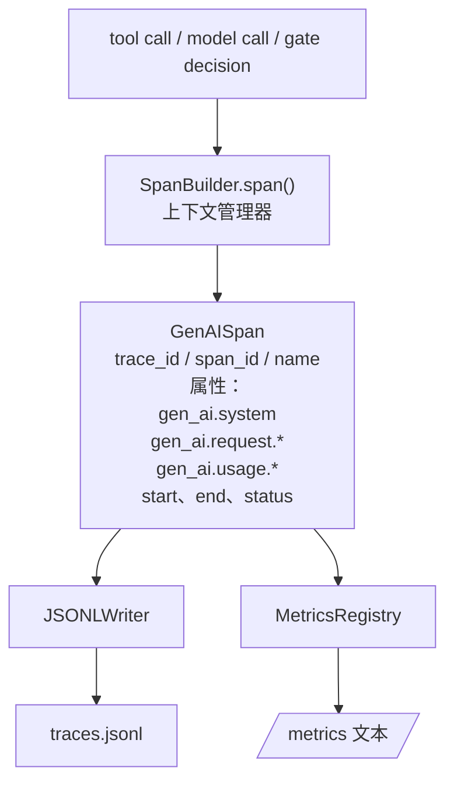
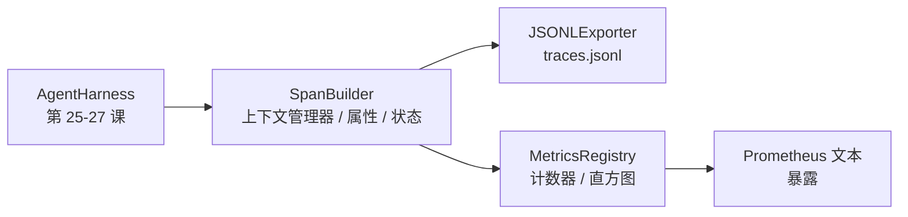

# 综合项目第 28 课：使用 OTel GenAI Span 和 Prometheus 指标的可观测性

> 一个没有可观测性的智能体 harness 是一个花钱的黑盒子。本课手工构建一个 span 构建器，发出符合 OpenTelemetry GenAI 语义约定的记录，将它们写入每行一个 span 的 JSON-Lines 文件，并以 Prometheus 文本格式暴露计数器和直方图。整个东西是 Python 标准库，离线运行。

**类型：** 构建
**语言：** Python（标准库）
**前置条件：** 第 19 阶段 · 25（验证门），第 19 阶段 · 26（沙箱），第 19 阶段 · 27（评估 harness），第 13 阶段 · 20（OpenTelemetry GenAI），第 14 阶段 · 23（OTel GenAI 约定）
**时间：** ~90 分钟

## 学习目标

- 构建一个符合 OpenTelemetry GenAI 语义约定形状的 span 数据类。
- 实现一个 JSONL 导出器，每行写入一个自包含的 span。
- 构建带有标签的计数器和直方图以及 Prometheus 文本格式的暴露。
- 将任何可调用对象包装在记录持续时间、状态和异常的 span 上下文管理器中。
- 验证发出的 span 通过 `json.loads` 往返并匹配规范形状。

## 问题

生产环境中的编码智能体每轮产生三类工件：模型调用、工具执行和验证门决策。如果没有结构化遥测数据，这些都毫无用处。

第一种失败模式是缺失的追踪。周二出了点问题，但唯一的记录是一个 500 行的聊天日志。没有记录哪个工具运行了、花了多长时间、提示中输入了多少 token，或者门是否拒绝了任何内容。智能体作者必须猜测。

第二种失败模式是无法解析的追踪。Harness 写了 span，但使用了自己的临时字段名。Grafana、Honeycomb、Jaeger 或本地 CLI 中没有任何东西可以读取它们。团队技术栈中存在的任何工具都被浪费了，因为 span 是非标准的。

第三种失败模式是无法聚合的指标。你可以在追踪中看到一个慢的工具调用，但你无法回答"过去一小时内 read_file 调用的 p95 延迟是多少？"，因为没有指标，只有追踪。

OpenTelemetry GenAI 语义约定正是为此而存在的。它们定义了一小组标准属性，跨 LLM 框架的 span 发射器共享。如果你的 harness 写入这些属性，每个与 OTel 兼容的后端都可以读取它们。

## 概念



Harness 中的每个操作产生一个 span。一个 span 有一个 trace id（整个智能体调用）、一个 span id（这一个操作）、一个名称（例如 `gen_ai.chat`、`gen_ai.tool.execution`）、遵循 GenAI 约定的属性、开始和结束时间以及状态。

GenAI 约定标准化了这些属性键：`gen_ai.system`（哪个提供商，例如 `anthropic`、`openai`）、`gen_ai.request.model`（模型 id）、`gen_ai.request.max_tokens`、`gen_ai.usage.input_tokens`、`gen_ai.usage.output_tokens`、`gen_ai.response.model`、`gen_ai.response.id`、`gen_ai.operation.name`，加上工具特定的键 `gen_ai.tool.name` 和 `gen_ai.tool.call.id`。

导出器写入 JSONL。每行一个 JSON 对象。这是下游工具可以流式处理、grep 和导入的最简单的可能格式。真正的 OTel 导出器会说 OTLP gRPC；本课的 JSONL 导出器是离线等效物，在每个工作站上以零退出。

指标位于追踪旁边。一个计数器在每次工具调用时递增：`tools_called_total{tool="read_file"}`。一个直方图记录观察到的延迟：`tool_latency_ms{tool="read_file"}`。两者都序列化为 Prometheus 文本暴露格式，这是基于拉取的指标的事实标准。

```figure
trace-spans
```

## 架构



span 构建器是一个小类，具有返回上下文管理器的 `span(name, attrs)` 方法。上下文管理器在进入时记录开始时间，在退出时记录结束时间，如果引发了异常则附加异常，并将最终确定的 span 推送到导出器。

指标注册表是两个字典。计数器是 `{(name, frozen_labels): int}`。直方图将原始样本保存在列表中，并在暴露时序列化为 Prometheus 直方图桶。

## 你将构建的内容

`main.py` 提供：

1. `GenAISpan` 数据类：trace_id、span_id、parent_span_id、name、attributes、start_unix_nano、end_unix_nano、status、status_message、events。
2. `SpanBuilder` 类，具有 `span(name, attrs, parent=None)` 上下文管理器。
3. `JSONLExporter` 类，具有追加一行的 `export(span)` 方法。
4. `Counter` 和 `Histogram` 类加上 `MetricsRegistry`。
5. 生成文本格式输出的 `prometheus_exposition(registry)`。
6. 发射 span 并更新指标的 `wrap_tool_call(name)` 装饰器。
7. 演示：合成一个完整的智能体调用（gen_ai.chat span 围绕工具 span），写入 traces.jsonl，打印 Prometheus 暴露，以零退出。

span id 和 trace id 是 16 字节十六进制字符串，从 `os.urandom` 生成。这与 OTel 的 W3C 追踪上下文匹配。导出器从不抛出异常；IO 错误被暴露，但 harness 继续运行。

直方图具有固定的桶集（以毫秒为单位的延迟的 OTel 默认值：5、10、25、50、100、250、500、1000、2500、5000、10000、+Inf）。样本存储为列表；暴露时按需计算每个桶的计数。

## 为什么手工构建而不是使用 opentelemetry-sdk

OTel Python SDK 是一个真实的依赖项。它也是几千行代码、用于 OTLP 导出器的多个进程，以及会压倒课程预算的运行时成本。手工构建的版本教授了传输格式。在生产环境中，你将相同的属性接入真正的 SDK，免费获得 OTLP 导出器、批处理和资源检测。

约定是稳定的。本课发出的传输格式将持续解析到 2030 年，因为 OTel 从不破坏 GenAI 属性名称；它们只会添加新的。

## 这与轨道 A 的其余部分如何组合

第 25 课产生了门链。第 26 课产生了沙箱。第 27 课产生了评估 harness。第 28 课使这三者变得可观测。第 29 课将端到端演示的每个步骤包装在 span 中，并在最后打印 Prometheus 文本。

## 运行它

```bash
cd phases/19-capstone-projects/28-observability-otel-traces
python3 code/main.py
python3 -m pytest code/tests/ -v
```

演示在课程的工作目录中发出一个 `traces.jsonl`（最后清理），然后打印三个 span 的样本，接着打印计数器和直方图的 Prometheus 暴露。测试验证 span 序列化的往返、规范 GenAI 属性存在、计数器正确递增，以及直方图暴露包含预期的桶计数。
