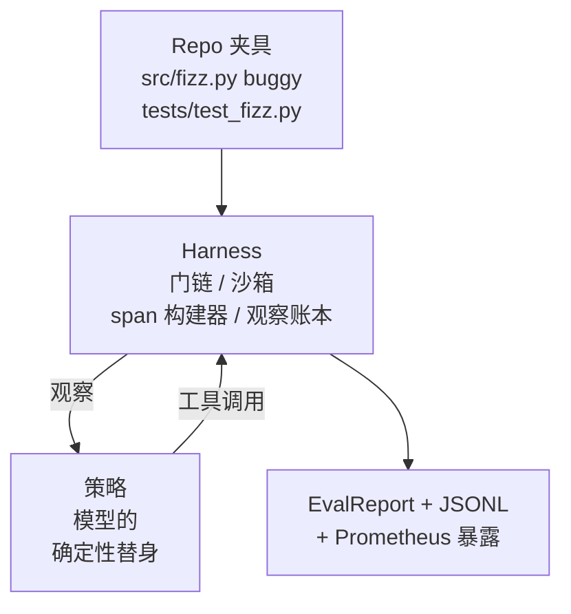
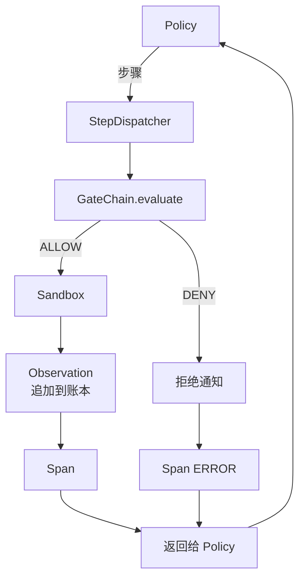

# 综合项目第 29 课：Harness 上的端到端编码智能体

> 轨道 A 的回报。本课将门链、沙箱、评估 harness 和 OTel span 拼接成一个工作的编码智能体，修复多文件 Python 项目中的一个真实的（小型的，夹具级别）bug。智能体是一个确定性策略，而不是 LLM；这种替换使本课可重现，并表明 harness 一直是有趣的部分。合约是相同的：真实模型在策略接缝处插入。

**类型：** 构建
**语言：** Python（标准库）
**前置条件：** 第 19 阶段 · 25（验证门），第 19 阶段 · 26（沙箱），第 19 阶段 · 27（评估 harness），第 19 阶段 · 28（可观测性），第 14 阶段 · 38（验证门），第 14 阶段 · 41（真实仓库的工作台），第 14 阶段 · 42（智能体工作台综合项目）
**时间：** ~90 分钟

## 学习目标

- 将门链、沙箱、评估 harness 和 span 构建器组合成一个单一的智能体循环。
- 实现一个确定性策略，使用 read_file、run_tests 和 write_file 来修复一个夹具 bug。
- 在端到端运行中强制执行全局步骤预算加上观察 token 预算。
- 为完整运行发出完整的 OTel GenAI 追踪和 Prometheus 指标。
- 验证智能体在少于 12 步内解决夹具，且合法工具的零门触发。

## 问题

大多数智能体演示独立工作：一个独立的沙箱、一个独立的评估 harness、一个独立的 span 发射器。它们看起来不错。将它们组合起来，接缝就显现了。

门链说 ALLOW，但沙箱因链未预料到的原因而拒绝。评估 harness 记录通过，但 OTel span 说门拒绝了智能体声称使用的工具。Prometheus 计数器在应该递增一次时递增了两次。观察预算被超出，但智能体继续运行，因为预算在链中被追踪，而沙箱不知道。

本课是整个轨道的集成测试。智能体必须按顺序做四件事：读取项目、运行测试、从测试失败中识别 bug、编写修复、重新运行测试、然后停止。每个操作都通过门链。每个工具执行都通过沙箱。每一步都包装在 span 中。评估 harness 在最后对整个事情进行评分。

## 概念



智能体的策略是一个状态机。五种状态。

`SURVEY`：智能体读取项目列表。下一个状态是 RUN_TESTS。

`RUN_TESTS`：智能体运行测试命令。如果测试通过，状态机以成功停止。否则下一个状态是 INSPECT。

`INSPECT`：智能体读取失败的源文件。下一个状态是 FIX。

`FIX`：智能体写入修复后的文件。下一个状态是 VERIFY。

`VERIFY`：智能体再次运行测试命令。如果测试通过，以成功停止。否则以失败停止。

每个状态对应一个工具调用。每个工具调用通过门链。如果工具调用被拒绝，智能体在追踪中报告拒绝并停止。

夹具 bug 是 `fizz.py` 中的一个差一错误。确定性策略通过正则表达式从测试失败消息中检测 bug，并发出修复后的文件。用 LLM 替换策略不会改变 harness 合约。

## 架构



本课是自包含的。每个前一课的原语在 `main.py` 中以最小规模重新实现（门、沙箱、账本、span），因此本课运行无需导入兄弟课程。名称与第 25-28 课完全匹配，因此概念映射是明确的。

## 你将构建的内容

`main.py` 提供：

1. 最小化的 harness 原语，使用与第 25-28 课相同的名称复制：`GateChain`、`Sandbox`、`ObservationLedger`、`SpanBuilder`、`MetricsRegistry`。
2. `CodingAgentPolicy` 类：具有五种状态的状态机。
3. `Repo` 辅助函数：准备带有捆绑 buggy 夹具的 scratch 目录。
4. `AgentRun` 类：驱动策略，通过 harness 分发，返回 `AgentRunReport`。
5. 一个捆绑的夹具（`fixture_repo/`），包含 src/fizz.py、tests/test_fizz.py 和一个供评估 harness 使用的 expected/ 树。
6. 演示：端到端运行策略，打印逐步追踪，断言通过，打印指标。

捆绑的夹具与第 27 课的任务结构形状相同：一个 buggy 文件和一个测试文件。测试失败消息包含足够的信息，使确定性策略能够识别修复。真实的 LLM 会做同样的工作，更慢且具有更广泛的回忆，但它不会改变 harness 的期望。

## 为什么策略不是 LLM

真实的 LLM 需要 API 密钥、网络调用和不可验证的随机性。Harness 是本课关注的部分。用确定性策略代替，使本课可以在任何开发者笔记本电脑上运行，没有外部依赖，并让测试套件断言精确的步骤计数。

本课的策略是 LLM 智能体所做工作的严格子集。策略读取仓库、看到失败的测试、识别行并发出修复。LLM 通过相同的循环使用相同的 harness 合约；记账是相同的。

## 演示断言的内容

端到端演示在退出时断言五件事，测试套件以编程方式重新断言它们。

策略在少于 12 步内解决了夹具。

观察预算从未被超出。

合法工具上的零门拒绝触发。（智能体从未发明被拒绝的工具名称。）

每一步在 traces.jsonl 中都有对应的 span。

Prometheus 暴露包含 `tools_called_total{tool="read_file"}` 条目和一个 `tool_latency_ms` 直方图。

## 这与轨道 A 的其余部分如何组合

本课是集成。第 25 课编写了门链。第 26 课编写了沙箱。第 27 课编写了评估 harness。第 28 课编写了可观测性。第 29 课证明它们作为一个系统工作。真正的智能体 harness 从这里扩展：将确定性策略替换为模型，将捆绑的夹具替换为真实仓库任务，将 JSONL 导出器替换为 OTLP。

## 运行它

```bash
cd phases/19-capstone-projects/29-end-to-end-coding-task-demo
python3 code/main.py
python3 -m pytest code/tests/ -v
```

演示打印每步追踪、最终评估报告和 Prometheus 暴露。退出代码为零。测试涵盖策略状态转换、对综合工具调用的门拒绝、捆绑夹具上的端到端运行以及步骤预算不变量。
