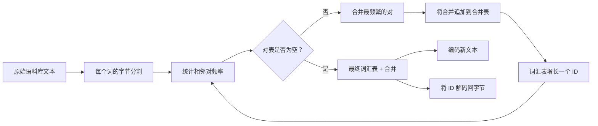
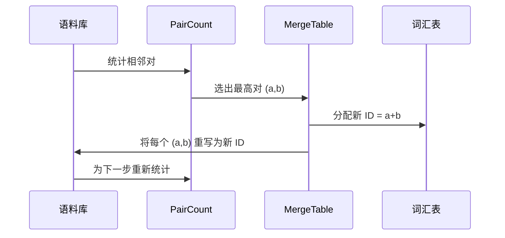

# 从零构建 BPE 分词器

> 字节进，ID 出，ID 回到相同的字节。构建每个现代文本模型仍然以此为起点的分词器。

**类型：** 构建
**语言：** Python
**前置条件：** 第 04 阶段课程，第 07 阶段 transformer 课程
**时间：** ~90 分钟

## 学习目标
- 通过重复合并最频繁出现的相邻符号对，从原始文本语料库训练字节对编码词汇表。
- 实现一个确定性合并表，并将其应用于新文本以生成子词 ID 流。
- 将任意 UTF-8 输入往返转换为 ID 并返回，无信息损失。
- 保留和保护特殊 token（`<|endoftext|>`、`<|pad|>`），使它们在训练和解码过程中得以保留。
- 推理为什么字节级字母表是通用分词器的正确基础。

## 框架

语言模型从不看文本。它看整数。从字符串到整数列表并返回的映射就是分词器。如果这一层搞错了，训练运行中的每条损失曲线都在衡量错误的东西。

通用文本模型的子词分词器主要家族是字节对编码。其思想很简单。从一个已知的字母表开始。找出训练语料库中出现最频繁的相邻符号对。将其合并为一个新符号。重复直到词汇表达到目标大小。编码新文本以相同顺序重用相同的合并列表。

我们将构建字节级变体。字母表是 256 个原始字节，而不是 Unicode 码点。这一选择使得分词器能够处理任何 UTF-8 输入而无需回退到未知 token。

## 流水线

训练端和推理端共享合并表。这种共享是合约。如果在推理时更改合并顺序，你将解码出不同的 ID 流。

## 字节字母表

前 256 个 ID 保留给原始字节 0x00 到 0xFF。这保证了每个输入字符串在任何合并发生之前都可以在词汇表中表达。在字节块之后，我们为特殊 token 保留一小段范围。训练循环从不将这些 ID 作为合并目标，因为我们完全将它们排除在预分词流之外。

预分词器在训练看到语料库之前，按空格和标点符号边界分割语料库。如果没有这种分割，BPE 合并步骤将愉快地学习跨越词边界的合并，词汇表将填满整个常见短语。有了分割，合并保持在词内，结果具有泛化能力。

## 训练循环

对于每个训练步骤，循环做三件事。它遍历语料库中的每个词，统计每个相邻当前符号对出现的频次，按该词本身出现的频次加权。它选出计数最高的对。它将每一处该对的出现重写为一个新的符号，其 ID 是词汇表中的下一个空闲槽位。然后它记录该合并。

每一步的成本与以符号序列列表表示的语料库大小成线性关系。对于一百万个词和一万个 ID 的目标词汇表，循环在几秒钟内运行完成，因为符号序列随着合并落地而缩小。

## 编码新文本

推理不调用合并计数器。它按学习时的相同顺序应用合并表。对于一个新词，编码器从字节分割开始。它扫描当前序列以寻找最低排名的合并（最早适用的那个）。它执行该合并。它再次扫描。当表中没有合并适用于当前序列时，循环结束。

按排名排序是使编码具有确定性并匹配相同输入上的训练行为的属性。先学习的合并位于表顶，最先被应用。如果两个合并可以在同一位置应用，排名更低的那个胜出。

## 特殊 token

特殊 token 是字节流永远无法生成的 ID。我们手动保留它们。本课两个就足够了。

- `<|endoftext|>` 在预训练期间分隔文档。它告诉模型"一个新文档从这里开始，不要让前一个文档的上下文泄漏进来。"
- `<|pad|>` 填充短序列，使批次可以是矩形张量。损失掩码在训练期间隐藏它。

编码器接受一个标志以允许输入中的特殊 token。标志关闭时，字符串 `<|endoftext|>` 和 `<|pad|>` 被分词为拼出它们的字节。标志开启时，字面字符串被映射到其保留的 ID，不经过任何合并。

## 往返保证

编码然后解码必须精确返回输入字节。解码器按顺序连接每个 ID 的字节展开。由于每个 ID 要么是一个原始字节，要么是两个先前已知 ID 的连接，递归展开总是在原始字节处终止。解码然后返回这些字节所拼出的 UTF-8 字符串。

本课的测试套件在未见过的句子、包含 Unicode 表情符号的句子以及包含字面 `<|endoftext|>` token 的句子上检查此属性。

## 本课不做什么

它不构建最大生产分词器风格的基于正则表达式的预分词器。这里的预分词器是一个小的空格和标点分割。这足以在一个小的训练语料库上产生合理的合并，并且与课程链其余部分的合约保持不变。下一课将分词器视为黑盒，并在其之上构建滑动窗口数据集。

它不并行化对计数器。在 Python 中循环遍历几千个词的语料库在远不到一秒内完成。对于更大的语料库，显而易见的做法是按词并行统计对并归约。

## 如何阅读代码

`main.py` 定义了四个对象。`BPETokenizer` 持有词汇表、合并表和特殊 token 表。`train` 是训练循环。`encode` 是推理路径。`decode` 是字节连接。底部演示在内置语料库上训练一个小分词器，编码一个保留的句子，将 ID 解码回，并打印两者。`code/tests/test_bpe.py` 中的测试锁定了往返属性、特殊 token 保留和合并排序。

运行演示。然后将演示中的目标词汇表大小从 300 改为 600，观察保留句子的编码长度如何下降。该曲线就是 BPE 压缩曲线。
