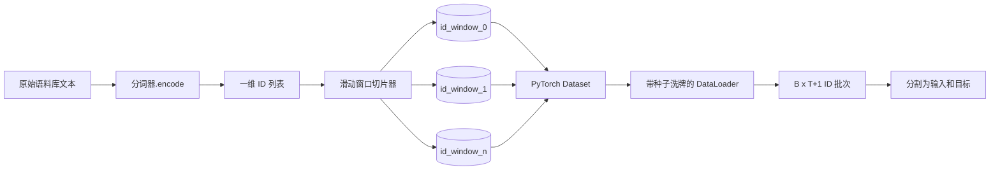
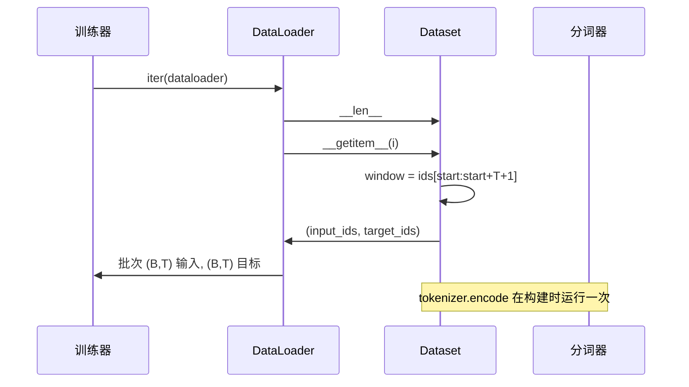

# 带滑动窗口的分词数据集

> 预训练运行是从 token ID 到梯度的函数。本课构建输送 ID 的传送带。

**类型：** 构建
**语言：** Python
**前置条件：** 第 04 阶段课程，第 07 阶段 transformer 课程，本阶段第 30 课
**时间：** ~90 分钟

## 学习目标
- 通过调用一次分词器将原始语料库转换为 token ID 流。
- 将 ID 流切片为固定长度的窗口，使用可配置的重叠步幅。
- 构建一个 PyTorch Dataset，返回用于下一个 token 预测的输入和目标张量。
- 将数据集包装在 DataLoader 中，使用每个 epoch 种子的确定性洗牌。
- 推理步幅、冗余和有效数据集大小之间的权衡。

## 框架

预训练运行一次读取一个批次的 token ID 并更新模型。每个批次的形状由训练合约固定。对于因果语言模型，批次持有 `(B, T)` 输入 ID 和 `(B, T)` 目标 ID，其中目标是输入向左移动一位。数据流水线的工作是按需产生该合约，以确定性和可重现的方式，来自可能是几个 GB 原始文本的语料库。

本课构建该流水线。前一课的分词器将文本转换为一个长的一维 ID 列表。滑动窗口将该列表切片为训练示例。自定义 Dataset 将示例暴露为张量。DataLoader 对它们进行批处理并使用已知种子对它们进行洗牌。

## 形状合约

因果语言模型消费形状为 `(B, T)` 的 ID，其中 `B` 是批大小，`T` 是上下文长度。位置 `t` 的目标是位置 `t+1` 的输入。这意味着每个训练示例覆盖 `T+1` 个原始 ID。窗口步幅控制连续示例之间有多少重叠。

切片器永不与语料库边界重叠。如果最后一个窗口没有足够的 ID 来填充 `T+1` 个位置，切片器会丢弃它。用 `<|pad|>` 填充尾部也是一个有效的选择，但它会使损失掩码复杂化。本课我们选择丢弃。

## 为什么使用滑动窗口

预训练语料库是一个长 ID 流。如果模型只看到不重叠的窗口，每个训练示例都会教它相同的 `T` 个边界。调整步幅会移动这些边界，使模型看到更多样化的"预测下一个 token"任务。

`T` 的步幅产生不重叠的窗口。`T // 2` 的步幅产生百分之五十的重叠，并将有效数据集翻倍。`1` 的步幅产生最大重叠，并将数据集增加 `T` 倍。代价是每个 epoch 更多的计算。收益是更多的边界多样性。大多数预训练运行使用等于上下文长度的步幅，因为语料库已经远大于模型在一个 epoch 内可以完成的量，所以边界多样性论点较弱。

## Dataset 类

PyTorch Dataset 有两个必需的方法。`__len__` 返回示例数量。`__getitem__` 返回一个作为张量对的示例。我们的 Dataset 存储编码的 ID 流和步幅。索引进去时即时计算窗口的起始位置，因此无论步幅产生多少示例，内存成本只是一份 ID 流的副本。

偏移一位发生在 `__getitem__` 内部。Dataset 返回 `(input, target)`，其中 `input = window[:-1]`，`target = window[1:]`。两者都是 PyTorch long 张量。训练循环将它们视为真实值。

## 确定性洗牌

`shuffle=True` 的 DataLoader 从 PyTorch 随机生成器读取。通过传递每个 epoch 种子的显式 `torch.Generator`，我们每次重新启动运行时都会得到相同的洗牌顺序。当你想要比较仅在单个超参数上不同的两次运行时，这一属性很重要。没有种子，两次运行会以不同顺序看到数据，损失曲线会因为与更改无关的原因而发散。

本课的种子合约很简单。`epoch_seed = base_seed + epoch_index`。基本种子在构造时传递。epoch 索引在每次 epoch 开始时由训练器递增。使用相同基本种子的重新运行始终在每个 epoch 中看到相同的顺序。

## 批次采样器

PyTorch 中的默认采样器以放回方式均匀随机选择索引，不放回。这正是预训练所需要的。对于在小数据集上的微调，合约是相同的。DataLoader 通过调用 `B` 次 `__getitem__` 并堆叠结果来组装一个批次。由于每个示例构造时都是相同的长度，不需要填充逻辑。

为简单起见，本课保持 `num_workers=0`。在生产运行中，工作进程并行化 `__getitem__` 调用。在我们的流水线中，这几乎是一个空操作，因为工作只是对内存中张量的一个切片，但相同的 Dataset API 干净地支持工作进程。

## 计算示例数量

对于长度为 `N` 的 ID 流、上下文长度 `T` 和步幅 `S`，示例数量为 `max(0, 1 + (N - (T + 1)) // S)`。本课将该计算暴露为 Dataset 上的静态方法，以便训练器可以在不迭代的情况下计算每个 epoch 的总步数。

## 本课不做什么

它不从磁盘流式传输。语料库完全在内存中编码，并作为单个张量持有。对于几百万个 ID 的语料库，这远低于一百兆字节，对本课来说是正确的形状。磁盘流式传输是一个可以通过替换存储来插入的独立关注点，但保持 Dataset 合约不变。

它不处理多个文档。语料库被视为一个连续的 ID 流。当语料库由多个文档构建时，通过插入 `<|endoftext|>` ID 来编码下一个文档边界。模型学习围绕边界进行预测。

## 如何阅读代码

`main.py` 定义了两个类和一个辅助函数。`SlidingWindowDataset` 是 PyTorch Dataset。`make_dataloader` 返回一个带有种子生成器配置的 DataLoader。`_encode_corpus_to_ids` 是一次性分词器调用。底部演示在进程中构建一个小分词器，编码内置语料库，构造数据集和 DataLoader，打印一个批次，并断言形状合约。`code/tests/test_dataset.py` 中的测试锁定了窗口计数公式、偏移一位属性、确定性洗牌和步幅权衡。

运行演示。然后将上下文长度从 16 改为 32，观察每个 epoch 的示例数量如何下降。该数字就是你的每 epoch 步数预算。
