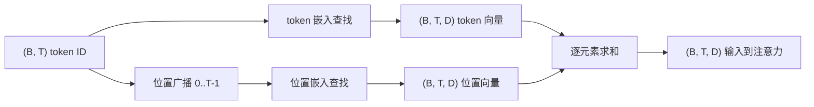
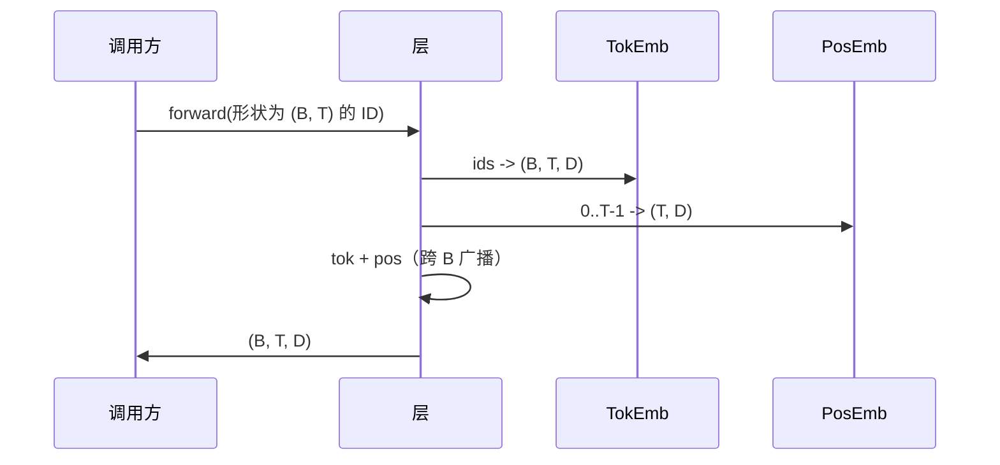

# Token 和位置嵌入

> ID 是整数。模型想要向量。两个查找表位于它们之间，位置查找表的选择塑造了模型可以学习的内容。

**类型：** 构建
**语言：** Python
**前置条件：** 第 04 阶段课程，第 07 阶段 transformer 课程，本阶段第 30 和 31 课
**时间：** ~90 分钟

## 学习目标
- 构建一个 token 嵌入查找表，将词汇表 ID 映射到稠密向量。
- 构建一个学习的位置嵌入查找表，按位置索引。
- 构建一个固定的正弦位置嵌入，按位置索引，无参数。
- 将 token 嵌入和位置嵌入组合成 transformer 块的单一输入。
- 对比学习和正弦嵌入在长度泛化和参数数量上的表现。

## 框架

模型与 token ID 的第一次接触是在 token 嵌入矩阵中的行查找。矩阵每词汇表 ID 一行，每模型维度一列。查找返回一个向量，模型的其余部分将其视为该 ID 的含义。反向传播更新在前向传递中被使用的行。在训练过程中，这些行的几何学学会了在方向上编码相似性。

仅有 token ID 没有顺序。模型需要第二个信号，告诉它位置一与位置十七不同。该信号的两种主流选择是学习的位置嵌入（第二个查找表，每位置一行）和固定的正弦位置嵌入（无参数的数学公式）。这一选择会产生后果。学习表是一个参数，受限于模型训练时的最大上下文长度。正弦表在理论上无参数且公式可扩展到任意位置，但本课的 `SinusoidalPositionalEmbedding` 在 `max_context_length` 处预计算固定表，其 `forward` 超过该限制会报错；因此两个模块在这里都强制执行最大上下文长度。即使表大到足以索引，模型在超过其训练长度后仍可能困难。

本课构建两者，并将它们与 token 嵌入组合成下一课注意力块的单一输入。

## 形状合约

嵌入阶段的输入是形状为 `(B, T)` 的 token ID 批次。输出是形状为 `(B, T, D)` 的张量，其中 `D` 是模型维度。每个批次元素具有相同的上下文长度 `T`。每个位置具有相同的向量维度 `D`。



组合是求和，而不是拼接。求和使 `D` 在整个网络中保持恒定，并让模型在每个特征基础上决定 token 含义还是位置在每一层中占主导地位。

## Token 嵌入矩阵

Token 嵌入是形状为 `(V, D)` 的参数张量，其中 `V` 是词汇表大小。PyTorch 将其暴露为 `nn.Embedding(V, D)`。初始化时，条目从一个小的高斯分布中抽取，传统上对于 transformer 规模的模型，均值为零，标准差约为 `0.02`。确切的初始化不如跨运行保持一致重要。

前向传递是单次索引操作。PyTorch 通过收集行将 `(B, T)` int64 ID 映射到 `(B, T, D)` 浮点数。反向传递仅在前向传递中被触及的行上累积梯度。在该步骤的批次中从未出现的两行在该步骤上获得零梯度。

一个微妙的细节。模型末尾的 token 嵌入和输出投影通常共享权重（权重绑定）。当发生这种情况时，每次反向传递通过输出端触及嵌入的每一行。这里的课程将两者暴露为独立模块，但在完整模型中，同一矩阵可以扮演两个角色。

## 学习的位置嵌入

学习的位置嵌入是第二个 `nn.Embedding`，形状为 `(max_context_length, D)`。查找由位置 ID `0，1，2，...，T-1` 索引。前向传递将该位置向量广播跨批次维度。

学习表的缺点是，如果模型仅在最多 `T-1` 的位置上训练，则无法在位置 `T` 处查询。该行不存在。使用此方案的生产解码器专用模型将最大上下文长度融入架构中，并拒绝处理更长的输入。

## 正弦位置嵌入

正弦位置嵌入是从位置到向量的函数。位置 `p` 和特征 `i` 产生

```python
angle = p / (10000 ** (2 * (i // 2) / D))
emb[p, 2k]     = sin(angle)
emb[p, 2k + 1] = cos(angle)
```

该函数没有参数。每个位置有一个唯一的向量。波长在特征维度上呈几何变化，因此较低维度编码粗略位置，较高维度编码精细位置。

从一起选择 `sin` 和 `cos` 得出的属性是，位置 `p + k` 的向量是位置 `p` 的向量的线性函数。这给注意力层提供了一个学习相对位置偏移的简单路径。模型不需要单独的参数来表达"往回看五个 token"。

本课在构造时计算完整的正弦表，并在前向时索引进去。

## 组合

输入流水线按顺序做三件事。读取 token ID。查找 token 向量。添加位置向量。返回求和结果。



求和步骤中的广播沿批次维度复制 `(T, D)` 位置张量。PyTorch 自动处理此操作，因为位置张量在 unsqueeze 后具有形状 `(1, T, D)`。

## 对比分析

本课在相同输入上运行两种变体并打印两种诊断信息。

第一个是参数数量。学习变体在 token 嵌入之上增加 `max_context_length * D` 个参数。正弦变体增加零。

第二个是相邻位置嵌入之间的余弦相似度。正弦变体具有平滑且可预测的衰减，因为函数是连续的。学习变体在初始化时具有近似随机的相似度，因为各行是独立抽取的。在训练之后，学习变体通常发展出类似的平滑结构，但它必须从数据中发现该结构。

## 本课不做什么

它不构建旋转位置编码（RoPE）或 AliBi。这些是生产 transformer 中的现代选择。它们都遵循与此处嵌入相同的形状合约（对形状为 `(B, T, D)` 的向量应用位置相关的变换），但它们在注意力投影步骤而不是在输入处应用。下一课构建注意力块，可选扩展之一是在那里的查询-键投影中融合旋转编码。

它不训练嵌入。训练需要损失，这需要模型输出，这需要注意力和 LM 头。那是下一课和下下一课的内容。

## 如何阅读代码

`main.py` 定义了三个模块。`TokenEmbedding` 包装 `nn.Embedding(V, D)`。`LearnedPositionalEmbedding` 包装 `nn.Embedding(L, D)`。`SinusoidalPositionalEmbedding` 预计算表并将其暴露为缓冲区。`EmbeddingComposer` 将一个 token 嵌入和一个位置嵌入绑定在一起。底部演示打印形状、参数计数和相邻位置相似度诊断。`code/tests/test_embeddings.py` 中的测试锁定了形状、广播行为、参数计数和正弦公式。

运行演示。然后将模型维度 `D` 从 64 改为 32，观察正弦波长带如何变化。
