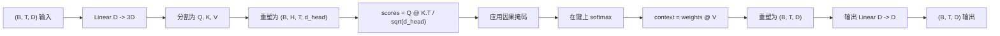
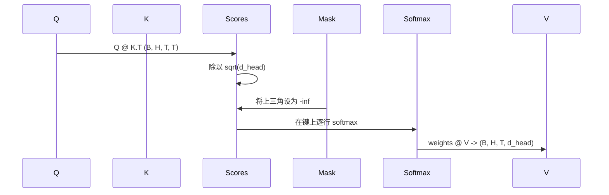

# 多头自注意力

> 一个线性投影，三个视图，H 个并行头，一个掩码。模型实际使用的注意力块。

**类型：** 构建
**语言：** Python
**前置条件：** 第 04 阶段课程，第 07 阶段 transformer 课程，本阶段第 30 到 32 课
**时间：** ~90 分钟

## 学习目标
- 将批量查询/键/值投影实现为单个线性层，分割为 H 个头。
- 计算缩放点积注意力，使用正确的归一化和 dtype 处理。
- 应用因果掩码，防止某个位置关注未来的位置。
- 检查固定输入的每头注意力权重，并推理每个头关注什么。
- 在一个玩具任务上训练一个小的注意力块，并观察随着头部分专业化损失如何下降。

## 框架

注意力是一个函数，它让一个 token 的表示从同一序列中的其他 token 提取信息。自注意力意味着查询、键和值都来自相同的输入。多头意味着投影被分割为 H 个并行的注意力问题，其输出被拼接并投影回来。

高效的实现模式是一个线性层，从 `D` 投影到 `3 * D`，被切片为三个视图，然后重塑为每个大小为 `D // H` 的 H 个头。矩阵乘法、softmax 和加权求和作为批量张量运算进行，因此头在加速器上并行运行。

本课构建该块。它还添加了因果掩码，使相同的代码可以作为解码器专用语言模型中的注意力层工作。下一课将该块堆叠为完整的 transformer，下下一课训练它。

## 形状合约

输入是 `(B, T, D)`。输出是 `(B, T, D)`。掩码是 `(T, T)` 或可广播到该形状。在块内部，中间张量具有形状 `(B, H, T, d_head)`，其中 `d_head = D // H`。约束是 `D % H == 0`。

两个线性层（QKV 投影和输出投影）是块中唯一的参数。掩码、softmax、矩阵乘法和重塑都是无参数的。

## QKV 分割

天真的实现有三个独立的线性层，分别用于 Q、K 和 V。高效的实现有一个输出 `3 * D` 特征的单一层，并分割结果。两者在数学上是等价的，因为三个独立的 `(D, D)` 权重矩阵乘法恰好是一个由它们堆叠而成的 `(3D, D)` 权重矩阵乘法。

高效版本更快，因为加速器启动一个而不是三个矩阵乘法。它也更容易初始化，因为三个子矩阵存在于相同的参数张量中，可以一起初始化。

## 头重塑

分割后，Q、K、V 各自是 `(B, T, D)`。要将其转换为 H 个并行的注意力问题，我们重塑为 `(B, T, H, d_head)` 并转置为 `(B, H, T, d_head)`。头维度现在位于批次维度旁边，因此 PyTorch 将每头的注意力视为跨 `B * H` 个独立实例的批量运算。

d_head 维度保持在最后，以便分数矩阵乘法 `Q @ K.transpose(-2, -1)` 对其做收缩。结果是 `(B, H, T, T)` 每头注意力分数。

## 缩放

分数在 softmax 之前除以 `sqrt(d_head)`。没有这种缩放，点积随 `d_head` 增长而增长，并将 softmax 推入一个状态：其中一个条目拥有几乎所有的质量，而其他条目小到可以忽略不计。该状态下的梯度极小，学习停滞。除以 `sqrt(d_head)` 使分数的方差在头大小上保持大致恒定。

## 因果掩码

解码器专用语言模型在预测下一个 token 时只能以前文为条件。掩码强制执行这一点。具体地说，在 softmax 之前，`(T, T)` 分数矩阵对角线以上的每个条目被替换为负无穷。在 softmax 之后，这些位置获得权重零。

我们在构造时将掩码注册为缓冲区，因此它与模型存在于相同的设备上，并且不是梯度图的一部分。掩码覆盖该块将看到的最大上下文长度。在前向时，我们切片左上角的 `(T, T)` 角。

## 输出投影

在每头上下文向量 `(B, H, T, d_head)` 之后，我们转置回 `(B, T, H, d_head)`，重塑为 `(B, T, D)`，并应用最终的 `(D, D)` 线性投影。输出投影让模型混合头。没有它，H 个头只能通过后续层重新组合，该块将被人为约束。

## 注意力权重检查

本课在前向传递中暴露一个 `return_weights=True` 标志。设置后，该块返回形状为 `(B, H, T, T)` 的每头注意力权重以及输出。演示在短输入上打印一个头的注意力权重热图，以便你可以看到因果三角结构和每个位置的焦点。

在训练好的模型中，不同的头学习不同的模式。有些头关注紧接的前一个 token。有些头关注序列的开头。有些头几乎均匀地分散注意力。检查钩子是这种可解释性工作的入口点。

## 训练演示

`main.py` 底部的演示将注意力块连接到一个微小的 LM 头，并在一个重复任务上训练整个东西。输入的每一行是在上下文中复制的单个随机 ID。目标是输入偏移一位，因此模型必须学习下一个 token 与前一个 token 相同。损失是交叉熵。在 H=4、D=32、T=12 和 64 的词汇表下，损失从随机（约 `log(64) ~ 4.16`）在 CPU 上经过三个 epoch 下降到远低于 `1.0`。

演示的目的不是训练一个有用的模型。目的是确认梯度流过块的每一部分，并且头在答案显而易见的问题上学习到了一些东西。

## 本课不做什么

它不添加前馈块。真实模型中的 transformer 层是注意力后面跟着一个两层 MLP，每个周围都有残差连接和层归一化。下一课添加这些。

它不实现旋转位置编码或 AliBi 位置编码。两者在相同块的 QKV 投影步骤中应用，但它们是单独的教学单元。这里构建的块通过在矩阵乘法之前变换 Q 和 K，与两者兼容。

它不实现推理用的 KV 缓存。跨前向传递缓存键和值是使自回归解码快速的优化。它改变了 K 和 V 张量上的形状合约，但不改变 Q。它属于推理课程。

## 如何阅读代码

`main.py` 定义了 `MultiHeadSelfAttention`。该类持有两个线性层和一个注册的掩码缓冲区。前向传递投影、重塑、评分、掩码、softmax、加权、重塑并再次投影。底部演示构建一个小模型，用 token 和位置嵌入以及一个 LM 头包装注意力，在一个复制任务上训练三个 epoch，并打印损失曲线和每头注意力热图。`code/tests/test_attention.py` 中的测试锁定了形状合约、因果属性、softmax 属性、头分割属性和梯度流。

运行演示。然后将 `n_heads` 从 4 增加到 8（保持 `d_model=32`，因此 `d_head=4`），观察热图如何变化。
