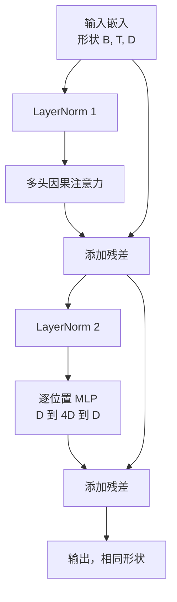
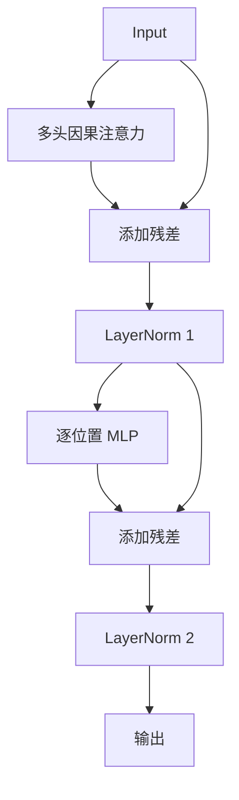

# 从零构建 Transformer 块

> 一个块是每个现代解码器 LLM 的单元。层归一化、多头注意力、残差、MLP、残差。pre-LN 变体在没有预热的情况下稳定训练。post-LN 变体是原始论文提供的。本课并排构建两者，并展示哪一个能在常见学习率下存活的 12 层堆叠。

**类型：** 构建
**语言：** Python
**前置条件：** 第 19 阶段第 30 到 33 课（分词器、嵌入、注意力数学、批量数据加载器）
**时间：** ~90 分钟

## 学习目标

- 从四个可移动部分在 PyTorch 中构建一个 transformer 块：LayerNorm、多头因果注意力、残差连接、逐位置 MLP。
- 将 LayerNorm 放置在两种配置中（pre-LN 和 post-LN），并解释为什么一种在没有预热的情况下稳定训练。
- 在多头注意力内部实现因果掩码，使得 token `i` 看不到 token `j > i`。
- 在 12 层堆叠上追踪两种变体的梯度流，并读取结果而不凭空猜测。
- 当下一课组装 1.24 亿参数的 GPT 时，将该块作为可直接使用的单元重用。

## 问题

Transformer 是重复的一个块。把块搞错一次，重复十二次，你就会提供一个在第一个 epoch 发散或之后需要预热技巧的模型。你将在本课中看到的两种失败模式并不奇特。它们在学习者天真地堆叠块时首次出现。一个是注意力层关注未来。另一个是 LayerNorm 放置在无法驯服深度残差信号的地方。

一旦你看到，修复是机械的。该块恰好有两条残差路径和两个归一化位置。正确选择位置，其余堆叠只是记账。

## 概念

每个解码器专用 transformer 块是一个函数，接受形状为 `(batch, sequence, embedding)` 的张量并返回相同形状的张量。内部，两个子层完成工作。



这是 pre-LN 变体。LayerNorm 位于残差分支内部，在子层之前。残差连接将未归一化的信号向前传递。

post-LN 变体将 LayerNorm 移动到残差加法之后。



形状相同。训练行为不同。使用 post-LN，通过残差路径向回流动的梯度必须通过 LayerNorm。在深度十二和学习率 `3e-4` 时，该梯度缩小得足够快以至于需要预热计划。Pre-LN 使残差路径保持不归一化，因此梯度干净地传播到嵌入层。Pre-LN 是 GPT-2 及以上版本出于此原因提供的配置。

### 因果多头注意力

注意力子层以三种方式投影输入到查询、键、值张量。每个从 `(B, T, D)` 重塑为 `(B, H, T, D/H)`，其中 `H` 是头数。缩放点积注意力按头计算 `softmax(Q K^T / sqrt(d_k))`，将上三角掩码到负无穷，通过 softmax 应用掩码，然后乘以 `V`。头被拼接回单个 `(B, T, D)` 张量并再次投影。掩码是使模型具有因果性的唯一部分。忘记掩码，你训练的就是一个作弊的模型。

### MLP

逐位置 MLP 将相同的两层网络独立应用于每个 token。隐藏宽度是嵌入宽度的四倍，激活函数是 GELU，dropout 跟随第二个线性层。MLP 内部没有 token 互相通信。所有 token 混合发生在注意力中。

### 残差连接做两件事

它们使梯度路径在深度上是加性的，这使梯度范数在十二层中保持在规模内。它们还让每个块学习对运行表示的加法更新而不是完全替换。这两种效果是该块可扩展的原因。

## 构建它

`code/main.py` 实现：

- `class LayerNorm` 带有可学习的缩放和偏移，有偏的 epsilon，按 token 向量应用。
- `class MultiHeadAttention` 带有 `num_heads`，`head_dim = d_model // num_heads`，融合的 QKV 投影，注册的因果掩码，注意力和残差 dropout。
- `class FeedForward` 带有两个线性层，GELU 激活，dropout。
- `class TransformerBlock` 带有一个 `pre_ln` 标志，在两种变体之间切换。
- 演示：构建一个 6 层 pre-LN 堆叠和一个 6 层 post-LN 堆叠，使用相同的输入，并打印 (a) 输出形状，(b) 一次反向传递后嵌入处的梯度范数。

运行它：

```bash
python3 code/main.py
```

输出：对两个堆叠的形状检查，并排的梯度范数。在相同学习率下，pre-LN 堆叠的嵌入梯度比 post-LN 堆叠大一个数量级，这是 pre-LN 无需预热就能训练的经验信号。

## 技术栈

- `torch` 用于张量数学、自动微分和 `nn.Module` 管道。
- 没有 `transformers`，没有预训练权重。该块从原语实现。

## 现实中的生产模式

三种模式将教科书块变成可以交付的东西。

**融合 QKV 投影。** 三个独立的线性层需要三次内核启动和三次矩阵乘法。一个宽度为 `3 * d_model` 的线性层在一次启动中完成相同工作，然后沿最后一个轴分割输出。融合路径在每个加速器上更快，并且匹配 GPT-2、LLaMA 和 Mistral 的参考实现。

**注册的因果掩码缓冲区。** 掩码仅依赖于最大上下文长度。在构造时用 `register_buffer` 分配一次，每次前向传递切出活动窗口，跳过每次调用的分配。忘记这点会将掩码变成长上下文时的分配器热点。

**在两个地方使用 Dropout，而不是三个。** Dropout 属于注意力 softmax 之后（注意力 dropout）和 MLP 的第二个线性层之后（残差 dropout）。在残差本身上的 dropout 会破坏让梯度在深度处流动的加法恒等性。一些早期实现搞错了这一点，并为此付出了脆弱训练的代价。

## 用它

- 本课中的块直接插入第 35 课的 GPT 组装中，无需修改。
- Pre-LN 变体是每个现代开放权重 LLM 所使用的。Post-LN 变体是原始 2017 年注意力论文所使用的。了解两者足以阅读你将遇到的任何解码器架构。
- 将 GELU 换为 SiLU，你就得到了 LLaMA 家族的激活函数。将 LayerNorm 换为 RMSNorm，你就得到了 LLaMA 家族的归一化。相同的骨架。

## 练习

1. 为块中的每个线性层添加一个 `bias=False` 标志。现代开放权重 LLM 在线性层上不提供偏置。测量你在一个 12 层 768 维模型中节省了多少参数。
2. 用手工构建的 RMSNorm 替换 `nn.LayerNorm` 并验证输出形状不变。
3. 添加一个标志，将第一个头的注意力权重作为 `(B, T, T)` 张量返回。绘制上三角以确认 softmax 后它为零。
4. 构建一个健全性检查，将一个 `(2, 16, 384)` 张量以 `H=6` 通过两种变体，并在权重相同初始化且 dropout 设置为零时断言前向输出不同（例如，`not torch.allclose`）。

## 关键术语

| 术语 | 人们的说法 | 实际含义 |
|------|-----------------|------------------------|
| Pre-LN | "前归一化" | LayerNorm 在残差分支内，在每个子层之前；残差携带未归一化的信号 |
| Post-LN | "后归一化" | LayerNorm 在残差加法之后；2017 年论文提供的，且需要预热 |
| 因果掩码 | "三角掩码" | 注意力 logits 的上三角设为负无穷，使得 token i 无法读取 token j，当 j > i 时 |
| 融合 QKV | "组合投影" | 一个宽度为 3D 的线性层而不是三个宽度为 D 的线性层；一个内核，一次矩阵乘法 |
| 残差流 | "跳跃连接" | 未归一化的张量，从上到下流过每个块；每个块向其添加内容 |

## 进一步阅读

- 第 7 阶段第 02 课（从零构建自注意力）了解此块之下的注意力数学。
- 第 7 阶段第 05 课（完整 transformer）了解相同骨架的编码器解码器版本。
- 第 10 阶段第 04 课（预训练迷你 GPT）了解此块插入的训练过程。
- 第 19 阶段第 35 课（此轨道），将十二个这样的块堆叠成一个 GPT 模型。
