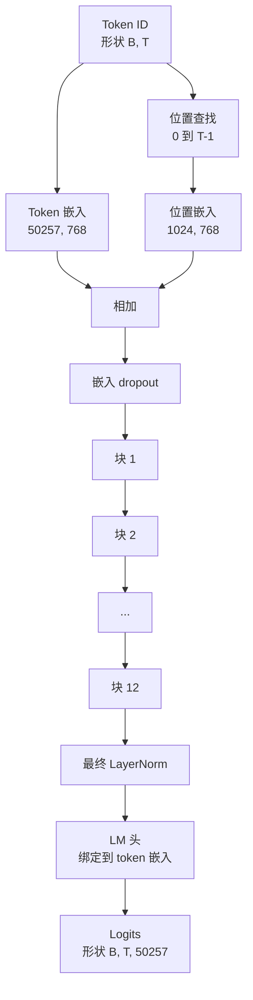
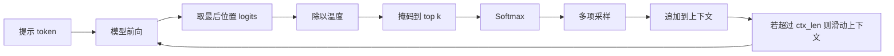

# GPT 模型组装

> 十二个块堆叠，一个 token 嵌入，一个学习的位置嵌入，一个最终的 LayerNorm，以及一个绑定的语言模型头。这就是完整的 1.24 亿参数 GPT 模型。本课将这些部分组装成一个工作的类，统计参数以确认模型匹配参考的 124M 形状，并使用多项采样、温度和 top-k 生成文本。

**类型：** 构建
**语言：** Python
**前置条件：** 第 19 阶段第 30 到 34 课
**时间：** ~90 分钟

## 学习目标

- 将第 34 课的 transformer 块组装成完整的 GPT 模型：token 嵌入、位置嵌入、N 个块、最终 LayerNorm、语言模型头。
- 复现 1.24 亿参数配置：词汇表 50257、上下文 1024、嵌入 768、十二个头、十二层。
- 将语言模型头权重绑定到 token 嵌入，并解释为什么在此规模下可节省约 3800 万参数。
- 从提示中生成文本，使用多项采样、温度缩放和 top-k 截断，以滑动窗口保持上下文长度。
- 针对 124M 目标测量参数计数和前向传递成本。

## 问题

一个 transformer 块本身什么都不做。你需要将 token ID 转换为向量，混入位置信息，将它们通过堆叠运行，并投影回词汇表 logits。忘记这四个步骤中的任何一个，模型要么无法前向传递，要么在位置信息上漂移，要么无法说话。

模型的形状也很重要。参考 GPT-2 small 在上述确切配置下是 1.24 亿参数。这些数字不是魔法。词汇表 50257 乘以嵌入 768 是 token 表。位置 1024 乘以 768 是位置表。十二个块每个大约 700 万参数，总计 8400 万。最终头通过权重绑定重用 token 表。将各部分相加，你得到 1.24 亿。构建一个其参数计数与参考不匹配的模型表明你某处接错了线。

## 概念



Token ID 变成 token 向量。位置 ID 变成位置向量。两者相加并通过堆叠发送。最终 LayerNorm 是块之外的一个部分，在每个现代变体中保留。LM 头重用 token 嵌入矩阵，这就是权重绑定的含义。

### 权重绑定

Token 嵌入的形状为 `(vocab, d_model)`。语言模型头需要从 `d_model` 投影回 `vocab`。两者互为转置。绑定两者意味着字面上相同的参数张量，使用两次。在词汇表 50257 和 d_model 768 下，该矩阵为 3800 万参数。不绑定时，你为其付费两次。绑定时，你为其付费一次，并且你还会获得稍微更干净的梯度信号，因为嵌入和头一起更新。

### 位置嵌入是学习的，而非正弦的

GPT-2 提供学习的位置嵌入。位置表是一个形状为 `(1024, 768)` 的参数张量。模型在每次前向时查找位置 0 到 T-1，并将查找结果添加到 token 嵌入。这是位置方案中最简单的一种（RoPE、ALiBi、T5 相对偏置是替代方案），也是 124M 参考所使用的。

### 生成：温度、top-k、多项采样

生成是自回归的。在每一步，模型返回每个位置上整个词汇表的 logits。你只取最后一个位置，除以温度，可选地将除 top k 外的所有 logits 掩码到负无穷，通过 softmax 获得概率，并从结果分布中采样一个 token。



三个旋钮，三种不同的行为。温度接近零时坍缩为贪心。温度为一时匹配模型的自然分布。Top-k 为一就是贪心。Top-k 四十过滤长尾。组合很重要；下一课关于训练的课使用生成作为定性评估信号。

## 构建它

`code/main.py` 实现：

- `class GPTConfig` 数据类，具有 124M 默认值：`vocab_size=50257`、`context_length=1024`、`d_model=768`、`num_heads=12`、`num_layers=12`、`mlp_expansion=4`、`dropout=0.1`、`use_bias=True`、`weight_tying=True`。
- `class GPTModel` 具有 token 嵌入、位置嵌入、嵌入 dropout、十二个 `TransformerBlock`、最终 LayerNorm，以及一个在标志设置时绑定到 token 嵌入的 `lm_head`。
- 一个 `count_parameters` 辅助函数，返回唯一参数计数（因此权重绑定在计数中得到体现）。
- 一个 `generate` 函数，执行温度、top-k、多项采样和滑动窗口上下文。
- 演示：构建模型，在参考 124M 旁边打印参数计数，从固定提示生成一个短序列以展示端到端流水线。

运行它：

```bash
python3 code/main.py
```

输出：与 124M 参考并排的参数计数，来自随机提示的生成 token ID，以及当绑定开启时 LM 头和 token 嵌入共享存储的确认。

为使演示快速，脚本还端到端运行一个小配置（`d_model=64`、`num_layers=2`）并内联打印生成的 token 序列。124M 配置被构建，但仅执行其参数计数和一次前向传递。

## 技术栈

- `torch` 用于张量数学、自动微分和模块管道。
- `code/main.py` 在本地重新实现了来自第 34 课的相同块模式。

## 现实中的生产模式

三种模式区分了能运行的模型和能交付的模型。

**将残差投影初始化为小值。** 注意力的输出投影和 MLP 的第二个线性层都直接馈入残差加法。以与每个其他线性层相同的标准差初始化它们，会使残差流随深度增长，并将最终 LayerNorm 推入热状态。对这两个投影将标准差缩放 `1 / sqrt(2 * num_layers)`；残差流在十二层中保持合理范围。

**缓存位置 ID 张量，不要重新计算。** `torch.arange(T)` 在每次前向时分配新内存。在 `__init__` 中为最大上下文分配一次，每次调用切片前 T 个条目，跳过分配器往返。

**在参数级别绑定权重，而不仅仅是复制。** 设置 `lm_head.weight = token_embedding.weight` 共享张量；复制则不会。优化器需要更新一个参数，自动求导图需要一个累积。如果复制，头会偏离嵌入，权重绑定对你没有好处。

## 用它

- 本课中的模型类与下一课训练的模型形状相同。
- 将学习的位置嵌入替换为 RoPE，无需触及块或头，即可获得 LLaMA 家族。
- 将 GELU 替换为 SiLU，将 LayerNorm 替换为 RMSNorm，即可获得其余的 LLaMA 家族更改。
- 生成函数适用于任何 logits 来源，而不仅仅是此模型。你可以在第 37 课中从预训练 GPT-2 文件中提取 logits，并重用相同的生成循环。

## 练习

1. 将 LM 头从 token 嵌入解绑并重新统计参数。验证差值为 50257 乘以 768 = 3800 万。
2. 将学习的位置嵌入替换为在构造时计算的正弦表。确认模型仍然能前向传递，且参数计数下降 786,432。
3. 为生成添加一个 `greedy=True` 标志，跳过采样并选择 argmax。确认序列跨运行是确定性的。
4. 添加一个 `repetition_penalty` 旋钮，将提示或生成历史中任何 token 的 logit 在 softmax 之前除以一个常数。在固定提示上显示大于 1 的值减少输出中的重复计数。
5. 在 `top_k` 旁边添加 `top_p`（核）采样。两行检查保留 token 的概率之和超过 `top_p`。

## 关键术语

| 术语 | 人们的说法 | 实际含义 |
|------|-----------------|------------------------|
| 权重绑定 | "绑定嵌入" | LM 头和 token 嵌入共享相同的参数张量；节省 vocab 乘以 d_model 个参数并匹配 GPT-2 参考 |
| 位置嵌入 | "学习的位置" | 一个单独的表格，形状为 (context length, d_model)，添加到 token 向量；端到端学习 |
| 滑动窗口上下文 | "上下文上限" | 当提示加生成的 token 超过上下文长度时，丢弃最旧的 token 使活动窗口适合 |
| Top-k 采样 | "K 截断" | 保留具有最高值的 K 个 logits，将其余掩码到负无穷，对剩余的做 softmax |
| 温度 | "采样温度" | 在 softmax 之前将 logits 除以 T；T 小于 1 锐化，T 等于 1 保持自然分布，T 大于 1 展平 |

## 进一步阅读

- 第 19 阶段第 34 课了解此模型堆叠的块。
- 第 19 阶段第 36 课了解以交叉熵损失驱动此模型的训练循环。
- 第 19 阶段第 37 课了解将预训练 GPT-2 权重加载到此确切架构中。
- 第 7 阶段第 07 课（GPT 因果语言建模）了解下一个 token 预测的数学。
- 第 10 阶段第 04 课（预训练迷你 GPT）了解相同架构上的原始训练过程。
