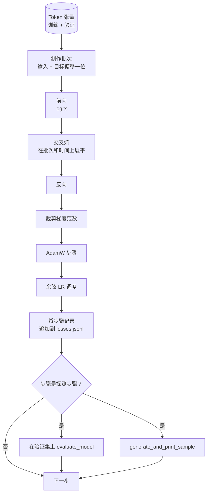

# 训练循环与评估

> 一个不度量的循环是一个说谎的循环。本课构建驱动 GPT 模型的训练循环：具有权重衰减分割的 AdamW、预热加余弦学习率调度、一个 `calc_loss_batch` 辅助函数、在保留数据上的 `evaluate_model` 传递、每 K 步的 `generate_and_print_sample` 定性探测，以及一个你可以后续绘图的损失 JSONL 日志。相同的骨架训练你将构建的每一个解码器 LLM。

**类型：** 构建
**语言：** Python
**前置条件：** 第 19 阶段第 30 到 35 课
**时间：** ~90 分钟

## 学习目标

- 构建一个训练循环，针对下一个 token 预测计算具有正确输入和目标对齐的交叉熵损失。
- 配置 AdamW，将权重衰减应用于权重张量，而不是 LayerNorm 或偏置张量。
- 实现具有线性预热和余弦衰减的学习率调度，并读取随时间的结果 LR。
- 使用 `evaluate_model` 在保留分割上评估，使评估损失跨运行可比。
- 每 K 步使用 `generate_and_print_sample` 生成定性样本，以在损失曲线之前捕获发散。
- 将每步损失持久化到 JSONL，以便你可以重新加载、绘图并将训练日志作为交付物交付。

## 问题

一个只打印损失而其他什么都不做的训练脚本以三种方式失败。它无法告诉你损失是否因正确原因而下降（模型可能过拟合训练集而从未学习）。它无法告诉你发散是否正在开始（损失可能在一个步上飙升而恢复，或飙升并崩溃）。它无法告诉你模型学到了什么（损失是一个标量；生成的样本是一个段落）。除非循环进行度量，否则所有三种失败都会隐藏。

本课中的循环以三种方式度量。每一步训练批次上的损失。每 K 步保留批次上的损失。每 K 步来自固定提示的生成续写。训练日志落入 JSONL，因此工件是循环的证词。

## 概念



两个非显而易见的部分是损失对齐和 AdamW 衰减分割。

### 损失对齐

模型在每个位置预测下一个 token。如果输入批次是 token `[t0, t1, t2, t3]`，目标批次必须是 `[t1, t2, t3, t4]`。交叉熵在展平形状 `(batch * seq, vocab)` 上针对展平目标 `(batch * seq,)` 计算。忘记偏移，你训练的模型预测自己，这收敛到零损失但学不到任何有用的东西。

### AdamW 衰减分割

权重衰减正则化权重张量但不正则化归一化缩放或偏置。在 LayerNorm 缩放上放置衰减会慢慢将缩放驱动到零并破坏归一化。在偏置上放置衰减在数学上无害但浪费周期。标准分割是：矩阵形状的张量（线性权重、嵌入表）获得衰减，任何看起来像缩放或偏移的东西则不获得。

### 预热加余弦调度

预热在几百步内将学习率从零提升到目标，以便优化器状态有时间填充。余弦衰减在剩余步数内将学习率降回零附近的，以便最终阶段以小步长微调权重。该组合是开放权重 LLM 训练中最常见的调度，因为它在第一千步和倒数一千步中消除了大多数脆弱时刻。

### 保留评估

`evaluate_model` 从验证分割运行固定数量的批次，累积损失，除以批次计数，然后返回。无梯度。无 dropout。在相同种子和相同分割下，该数字跨运行可重现。在训练损失旁边报告保留损失是你发现过拟合的方式。

### 定性采样作为早期信号

一个训练损失良好下降但生成样本全是相同 token 的模型是坏的。一个损失曲线看起来平坦但生成样本锐化为连贯词语的模型在学习。定性探测比阅读完整曲线运行更快，并捕获标量遗漏的状态。

## 构建它

`code/main.py` 实现：

- `make_batches(token_ids, batch_size, context_length)` 将一个长 token 张量切片为输入和目标对。
- `calc_loss_batch(model, inputs, targets)` 前向传递、展平并返回标量交叉熵。
- `evaluate_model(model, val_loader, max_batches)` 在没有梯度的情况下迭代固定数量的验证批次并返回平均损失。
- `generate_and_print_sample(model, prompt, max_new_tokens)` 在固定提示上运行第 35 课的生成函数并打印结果。
- `build_param_groups(model, weight_decay)` 生成两组 AdamW 参数列表。
- `cosine_with_warmup(step, warmup_steps, total_steps, max_lr, min_lr)` 返回给定步骤的 LR。
- `train(...)` 运行循环，持久化 `outputs/losses.jsonl`，并在每个 `eval_every` 步打印评估损失和一个样本。
- 演示：在合成数据上训练一个小模型少量步骤，写入 JSONL 日志，并在探测点打印评估损失和样本。演示在 CPU 上远不到一分钟内运行完成。

运行它：

```bash
python3 code/main.py
```

输出：每步损失行，每个探测步的评估损失，每个探测步的生成样本，以及一个最终的 `outputs/losses.jsonl`，你可以使用每行 `json.loads` 加载。

## 技术栈

- `torch` 用于自动微分、优化器和模块。
- `main.py` 在本地重新实现第 35 课的 `GPTModel` 和支持模块。

## 现实中的生产模式

三种模式将教科书循环变成你可以放置过夜运行的东西。

**梯度范数裁剪是不可协商的。** 一个坏批次（异常数据、LR 飙升、数值边界情况）产生一个巨大的梯度，抹去数小时的训练。`backward` 之后、`step` 之前的 `torch.nn.utils.clip_grad_norm_(params, max_norm=1.0)` 使优化器保持在安全范围内。裁剪值是一个自由参数；1 是大多数设置中幸存的默认值。

**可恢复的 JSONL 日志，而非序列化状态。** 作为 JSONL 行 `{"step": int, "train_loss": float, "lr": float}` 的每步损失记录是持久的：任何崩溃留下可读工件，你可以 grep，你可以用三十行 Python 绘图，并且你可以通过读取最后一步来恢复训练。序列化状态将你绑定到产生文件的确切模块布局，这在跨重构时很脆弱。

**从固定切片中抽取评估批次。** 验证 token 在脚本开始时被切片为批次，而不是动态切片。可重现性取决于评估批次从运行到运行完全相同；否则比较两次运行之间的评估损失，衡量的既是批次洗牌，也是模型。

## 用它

- 本课中的循环是在真实数据上训练 124M 模型的相同骨架。将合成 token 张量替换为 `datasets` 样式的加载器，循环不变地运行。
- JSONL 日志是将训练运行转化为证据的交付物。下一课使用它来比较新训练的检查点与预训练检查点。
- 定性样本探测是标量损失无法替代的包罗万象的探测。

## 练习

1. 添加 `weight_decay_groups()` 单元测试，确认缩放和偏置参数落在无衰减组中，而线性和嵌入权重落在衰减组中。
2. 将合成随机 token 替换为来自小文本文件的字节，使演示在可读的内容上训练。验证生成的样本使用文件中存在的字符。
3. 向余弦添加一个 `max_lr` 的 10% 的 `min_lr` 底限并重新绘图。
4. 在每个 `eval_every` 步保存一个检查点以及 JSONL 日志。添加一个 `resume_from` 标志，重新加载模型状态和优化器状态。
5. 在损失旁边记录每步吞吐量（每秒 token 数），并确认它保持在稳定范围内。

## 关键术语

| 术语 | 人们的说法 | 实际含义 |
|------|-----------------|------------------------|
| 损失对齐 | "偏移一位" | 输入 token 在位置 0..T-1，目标 token 在位置 1..T；交叉熵在展平形状上计算 |
| 衰减分割 | "两组" | AdamW 接收矩阵形状的张量有权重衰减，缩放或偏置张量则没有 |
| 预热 | "缓慢启动" | 学习率在固定步数内从零攀升到目标，以便优化器状态可以填充 |
| 评估批次 | "保留批次" | 验证 token 张量的固定切片，在脚本开始时切片一次，每次探测相同使用 |
| 定性探测 | "样本打印" | 每 K 步打印来自固定提示的短生成，以捕获仅靠损失隐藏的失败模式 |

## 进一步阅读

- 第 19 阶段第 35 课了解循环驱动的模型。
- 第 19 阶段第 37 课了解将预训练权重加载到相同模型中。
- 第 10 阶段第 04 课（预训练迷你 GPT）了解在真实数据上的过程。
- 第 10 阶段第 10 课（评估）了解交叉熵损失之外的更广泛评估面。
