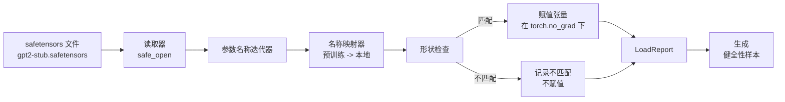

# 加载预训练权重

> 从零训练一个 1.24 亿参数模型是一个预算决策；加载已发布的检查点是一个平凡的周二。本课将预训练的 GPT-2 风格权重从一个 safetensors 文件加载到第 35 课的确切架构中，逐步走过参数名称映射，并做推理生成续写以证明加载成功。不需要网络，不需要第三方加载器，没有不透明的魔法。

**类型：** 构建
**语言：** Python
**前置条件：** 第 19 阶段第 30 到 36 课
**时间：** ~90 分钟

## 学习目标

- 使用 `safetensors` Python 库读取 safetensors 文件并检查张量名称和形状。
- 将每个预训练参数名称映射到第 35 课 GPT 模型内部的参数。
- 处理已发布 GPT-2 权重和此轨道中模型之间的两个命名约定差异：`wte/wpe/h.N.attn.c_attn/c_proj` 和 `mlp.c_fc/c_proj` 对比本地命名的 `tok_embed/pos_embed/blocks.N.attn.qkv/out_proj` 和 `mlp.fc1/fc2`。
- 在任何权重赋值发生之前，以清晰的错误检测并拒绝形状不匹配。
- 使用加载的权重生成一个短续写，并确认 token 来自加载的分布，而不是随机初始化的分布。

## 问题

已发布的权重不是为你的架构打包的。它们带有原始实现使用的名称。预训练文件有 `transformer.h.0.attn.c_attn.weight`，形状为 `(2304, 768)`；你的模型期望 `blocks.0.attn.qkv.weight`，形状为 `(2304, 768)`（这是不同布局约定中的相同矩阵），或者你的模型使用 `nn.Linear`，它以转置形式存储矩阵。相同的参数以三种微妙不同的身份出现（名称、形状、字节布局），加载器必须调和所有三个。

一个盲目复制的加载器将正确的张量放在错误的位置，你得到一个生成胡言乱语的模型。一个在形状不同时拒绝复制但什么也不记录的加载器，让你猜测哪个张量未能加载。本课中的加载器是显式的：每个赋值都被记录，每个形状都被检查，并且一个 `LoadReport` 总结命中、未命中和形状不匹配，以便你可以阅读发生的情况。

## 概念



名称映射器只是一个从字符串到字符串的函数。形状检查是一个 if。赋值在 `torch.no_grad()` 内部发生，因此自动求导不追踪加载。报告持有每个名称的结果。

### GPT-2 命名约定

已发布的 GPT-2 权重存在于如下名称下：

| 预训练名称 | 形状 | 含义 |
|-----------------|-------|---------|
| `wte.weight` | (50257, 768) | Token 嵌入 |
| `wpe.weight` | (1024, 768) | 位置嵌入 |
| `h.N.ln_1.weight` | (768,) | 块 N 的 LayerNorm 1 缩放 |
| `h.N.ln_1.bias` | (768,) | 块 N 的 LayerNorm 1 偏移 |
| `h.N.attn.c_attn.weight` | (768, 2304) | 融合的 QKV 线性权重 |
| `h.N.attn.c_attn.bias` | (2304,) | 融合的 QKV 线性偏置 |
| `h.N.attn.c_proj.weight` | (768, 768) | 注意力输出投影 |
| `h.N.attn.c_proj.bias` | (768,) | 注意力输出投影偏置 |
| `h.N.ln_2.weight` | (768,) | LayerNorm 2 缩放 |
| `h.N.ln_2.bias` | (768,) | LayerNorm 2 偏移 |
| `h.N.mlp.c_fc.weight` | (768, 3072) | MLP fc1 权重 |
| `h.N.mlp.c_fc.bias` | (3072,) | MLP fc1 偏置 |
| `h.N.mlp.c_proj.weight` | (3072, 768) | MLP fc2 权重 |
| `h.N.mlp.c_proj.bias` | (768,) | MLP fc2 偏置 |
| `ln_f.weight` | (768,) | 最终 LayerNorm 缩放 |
| `ln_f.bias` | (768,) | 最终 LayerNorm 偏移 |

需要计划的两种意外情况。`c_attn`、`c_proj`、`c_fc` 线性层存储时矩阵相对于 `nn.Linear.weight` 期望的进行了转置。加载器在赋值期间进行转置。LM 头根本不在文件中；模型依赖与 `wte` 的权重绑定，因此一旦 `wte` 落地，头通过别名设置。

### 本地命名约定

此轨道中的模型使用描述性名称：

| 本地名称 | 含义 |
|------------|---------|
| `tok_embed.weight` | Token 嵌入 |
| `pos_embed.weight` | 位置嵌入 |
| `blocks.N.ln1.scale` | 块 N 的 LayerNorm 1 缩放 |
| `blocks.N.ln1.shift` | 块 N 的 LayerNorm 1 偏移 |
| `blocks.N.attn.qkv.weight` | 融合的 QKV |
| `blocks.N.attn.qkv.bias` | 融合的 QKV 偏置 |
| `blocks.N.attn.out_proj.weight` | 注意力输出投影 |
| `blocks.N.attn.out_proj.bias` | 输出投影偏置 |
| `blocks.N.ln2.scale` | LayerNorm 2 缩放 |
| `blocks.N.ln2.shift` | LayerNorm 2 偏移 |
| `blocks.N.mlp.fc1.weight` | MLP fc1 |
| `blocks.N.mlp.fc1.bias` | MLP fc1 偏置 |
| `blocks.N.mlp.fc2.weight` | MLP fc2 |
| `blocks.N.mlp.fc2.bias` | MLP fc2 偏置 |
| `final_ln.scale` | 最终 LayerNorm 缩放 |
| `final_ln.shift` | 最终 LayerNorm 偏移 |

映射是一个固定函数。本课将其作为一个字典提供，加载器对其进行迭代。

### 存根夹具

真实的 GPT-2 权重是 0.5 GB。演示不下载它们；它在首次运行时生成一个小型 safetensors 夹具，具有确切的 GPT-2 命名约定和适合 12 块模型 d_model 192 而不是 768 的形状。该夹具具有正确的结构，可以测试加载器中的每个代码路径。将夹具替换为真实文件，加载器无需修改即可工作。

## 构建它

`code/main.py` 实现：

- 第 35 课 `GPTModel` 的一个小复制品，使本课自包含。
- `make_pretrained_to_local(num_layers)` 展开每层条目。
- `load_safetensors(model, path)` 迭代名称，映射它们，检查形状，转置 conv1d 风格的权重，并在 `torch.no_grad()` 下赋值。返回一个 `LoadReport`。
- `make_stub_safetensors(path, cfg)` 生成一个具有确切预训练命名约定的夹具文件。
- 演示：在首次运行时创建 `outputs/gpt2-stub.safetensors`，构建一个新鲜模型，从随机初始化捕获一个生成的续写，加载存根，捕获另一个续写，打印两者，并验证两者不同（加载实际改变了模型）。

运行它：

```bash
python3 code/main.py
```

输出：夹具路径、每个名称的加载日志、`LoadReport` 总结、加载前的续写、加载后的续写，以及注入到夹具中的一个故意的坏张量上的形状不匹配，因此失败路径被测试。

## 技术栈

- `safetensors` 用于磁盘格式和流式读取器。
- `torch` 用于模型和赋值数学。
- 没有 `transformers`，没有 `huggingface_hub`，没有网络调用。

## 现实中的生产模式

三种模式使加载器在与不是你创建的权重接触时幸存。

**在任何赋值之前始终验证文件。** 打开文件，列出每个张量名称及其 dtype 和形状，运行完整的带有形状检查的映射，仅在成功时开始赋值。半加载模型是无声的故障机器。

**记录每一次赋值，包含源名称和目标名称。** 当某些东西看起来不对劲时，日志告诉你哪个张量落到了哪里；替代方案是阅读 hexdump。本课中的 `LoadReport` 数据类追踪 `loaded`、`missing`、`unexpected` 和 `shape_mismatch` 列表，并在末尾打印总结。

**LM 头是权重绑定别名，而不是单独的副本。** 在加载 `tok_embed` 后设置 `model.lm_head.weight = model.tok_embed.weight` 是规范模式。将嵌入矩阵复制到一个新的 `lm_head.weight` 参数中会破坏绑定，并悄悄将参数计数翻倍。

## 用它

- 加载器适用于使用预训练命名约定的任何 safetensors 文件。真实的 GPT-2 文件（small / medium / large / xl）无需代码更改即可工作；只有模型配置不同。
- 相同的模式在你更新名称映射后扩展到 LLaMA、Mistral、Qwen 权重。形状检查和报告保持不变。
- 加载后的健全性生成是一个快速门：如果加载后样本看起来像加载前样本，则加载未改变模型，这意味着映射默默错过了每个张量。

## 练习

1. 为加载器添加一个 `dtype` 参数，在赋值期间将每个张量转换为目标 dtype（`bfloat16`、`float16`、`float32`）。确认一个 `float32` 模型可以降级到 `bfloat16` 且仍然能生成。
2. 添加一个 `expected_layers` 参数，拒绝加载其 `h.N` 索引与模型的 `num_layers` 不匹配的检查点。
3. 将加载器插入第 35 课的生成函数，并生成两个并排的样本：一个来自随机初始化，一个来自加载的夹具。
4. 添加导出路径：使用预训练命名约定将当前模型状态写入一个新的 safetensors 文件。往返加载器并确认报告具有零形状不匹配。
5. 扩展 `NAME_MAP` 以处理 LLaMA 命名约定（无偏置、RMSNorm、融合的 qkv 布局），并对你生成的存根 LLaMA 夹具重新运行加载器。

## 关键术语

| 术语 | 人们的说法 | 实际含义 |
|------|-----------------|------------------------|
| 名称映射 | "键重新映射" | 从预训练张量名称到本地参数名称的函数；通常是一个字面字典，每层索引一个条目，在循环上展开 |
| 形状不匹配 | "坏形状" | 预训练张量在映射的名称下存在，但其维度与本地参数不一致；加载器拒绝赋值并记录该对 |
| 加载时转置 | "Conv1d 布局" | 已发布的 GPT-2 以 nn.Linear 期望的转置形式存储注意力和 MLP 投影；加载器在赋值期间进行转置 |
| 权重绑定别名 | "共享的 LM 头" | 设置 model.lm_head.weight = model.tok_embed.weight 使头和嵌入共享存储；因此头不在文件中 |
| 加载报告 | "覆盖率总结" | 一个追踪 loaded、missing、unexpected 和 shape_mismatch 列表的小数据类；打印它是你判断加载是否成功的方式 |

## 进一步阅读

- 第 19 阶段第 35 课了解接收权重的架构。
- 第 19 阶段第 36 课了解产生相同形状检查点的训练循环。
- 第 10 阶段第 11 课（量化）了解内存紧张时对加载权重的处理。
- 第 10 阶段第 13 课（构建完整的 LLM 流水线）了解围绕加载和推理的完整生命周期。
