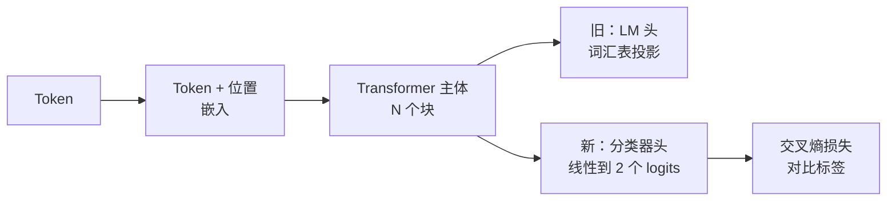
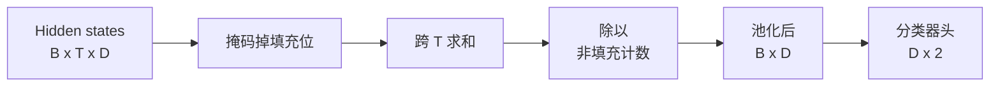
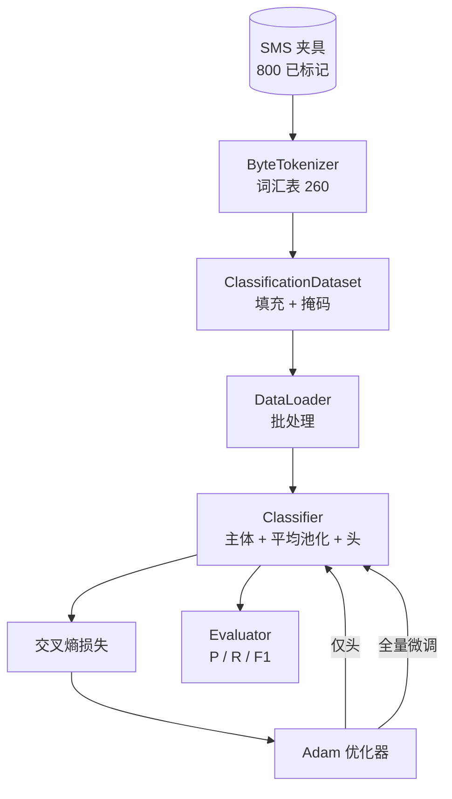

# 综合项目第 38 课：通过换头进行分类器微调

> 轨道 B 的第一个综合项目。一个预训练语言模型是一个以 token 预测头结尾的自注意力块堆叠。当你想做垃圾邮件 vs 正常邮件的分类时，头是错误的，但主体大部分是正确的。本课将头拆除，将一个二类线性层粘接到池化表示上，并以两种不同方式训练分类器：仅最后一层和全量微调。评估是在保留分割上的精确率、召回率和 F1。你学习了每种策略为你买到了什么以及它的成本。

**类型：** 构建
**语言：** Python（torch, numpy）
**前置条件：** 第 19 阶段第 30-37 课（NLP LLM 轨道：分词器、嵌入表、注意力块、transformer 主体、预训练循环、检查点、生成、困惑度）
**时间：** ~90 分钟

## 学习目标

- 在不重新初始化主体的情况下，将语言模型头替换为分类头。
- 实现两种训练制度：冻结主体（仅头）和全量微调，共享一个训练循环。
- 构建一个感知分词器的数据流水线，进行填充、掩码填充和池化注意力输出。
- 从原始 logits 计算精确率、召回率、F1 和混淆矩阵。
- 推理参数数量、训练时间和上限空间之间的权衡。

## 问题

你在通用语料库上预训练了一个小 transformer。输出头将最后一个隐藏状态投影到 1000 token 的词汇表。你现在有 800 条标记为垃圾邮件或正常邮件的短信，你想做一个二分类器。存在三个选项。

错误的选项是在 800 个示例上从头训练一个新分类器。预训练模型的主体已经编码了有用的结构：词标识、位置、简单的共现。丢弃它浪费了构建它的计算。

两个正确的选项是换头且主体冻结，以及换头且主体可训练。仅头训练快速，内存几乎不花费，并且在这种少量数据上很少过拟合。全量微调较慢，在少量数据上可能过拟合，但在下游领域偏离预训练语料库时可达到更高的准确率。

本课构建两者，因此你可以在相同夹具上比较它们。

## 概念

模型是一个函数 `f_theta(tokens) -> hidden_states`。头是一个函数 `g_phi(hidden) -> logits`。换头意味着保留 `theta` 并替换 `g_phi`。主体的参数是昂贵的部分。头是一个单一的线性层。

两个可训练的参数集重要：

- `theta`（主体）：每个注意力块数万个权重。
- `phi`（头）：`hidden_dim * num_classes` 个权重加上一个偏置。

在仅头训练中，你针对 `phi` 计算梯度，并针对 `theta` 将其置零。PyTorch 允许你通过将主体参数上的 `requires_grad=False` 来实现这一点。优化器然后只看到头，主体保持冻结。

在全量微调中，你让梯度通过整个堆叠流回。主体的权重漂移以适应分类目标。风险是在少量数据上的灾难性遗忘：主体的预训练被过拟合噪声冲散。

## 池化问题

一个分类器需要每个序列一个向量，而不是每个 token 一个向量。三种常见选择：

- **平均池化**：跨序列平均隐藏状态，由注意力掩码加权。
- **CLS 池化**：前置一个特殊 token 并仅使用其输出。这就是 BERT 所做的。
- **最后 token 池化**：使用最后一个非填充 token。这就是 GPT 类分类器所做的。

本课使用具有显式注意力掩码加权的平均池化。它是最简单的，跨序列长度给出稳定信号，并且不需要预训练 CLS token。

## 数据

八百条短信，平衡为 400 条垃圾邮件和 400 条正常邮件，在 `code/main.py` 中确定性生成。生成器使用固定种子，选择模板并替换槽填充器，发出 5 到 25 个 token 长的消息。真实数据集有本夹具没有的噪声。夹具的意义是可重现性。

数据以 80/20 分割：640 训练，160 测试。分割是分层的，以便测试集保持 50/50 的平衡。具有已知平衡的保留集使得精确率和召回率可以作为诚实的数字来阅读。

## 指标

二分类以类 1 为正类（垃圾邮件）。计数是：

- `TP`：预测为垃圾邮件，是垃圾邮件。
- `FP`：预测为垃圾邮件，是正常邮件。
- `FN`：预测为正常邮件，是垃圾邮件。
- `TN`：预测为正常邮件，是正常邮件。

三个主要指标：

- `precision = TP / (TP + FP)`。在被标记为垃圾邮件的消息中，实际有多少比例是垃圾邮件？
- `recall = TP / (TP + FN)`。在实际的垃圾邮件中，模型标记了多少比例？
- `F1 = 2 * P * R / (P + R)`。两者的调和平均数。

混淆矩阵将四个计数打印为 2x2 网格。演示对两种训练制度都将此写入 stdout。

## 架构

主体是一个故意很小的 transformer：词汇表 260，隐藏 64，4 个头，2 个块，最大序列 32。它足够小，可以在 CPU 上九十秒内将两种制度训练到收敛。它不在本课中预训练；相反，`pretrain_quick` 辅助函数在相同夹具的文本上做五个 epoch 的 LM 训练，为主体提供一个非平凡起点。这保持了本课的自包含性。

## 你将构建的内容

实现是一个 `main.py` 加上一个测试模块（`code/tests/test_main.py`）。

1. `ByteTokenizer`：将字节映射到 ID，保留一个填充 ID。
2. `Block`：带有自注意力和前馈层的 transformer 块。Pre-norm。
3. `LMBody`：token + 位置嵌入加上块的堆叠。返回隐藏状态。
4. `MeanPool`：在序列轴上做掩码加权平均。
5. `Classifier`：主体、池化、线性头。主体在制度间是相同实例。
6. `freeze_body` 和 `unfreeze_body`：在主体参数上切换 `requires_grad`。
7. `train_classifier`：一个共享循环。接受模型和一个为任何可训练参数组配置的优化器。
8. `evaluate`：运行测试集并返回 `Metrics(precision, recall, f1, confusion)`。
9. `run_demo`：短暂预训练主体，然后训练和评估仅头，然后全量微调，打印两份报告，以零退出。

## 为什么比较很重要

仅头制度通常训练更快且欠拟合更优雅。在此夹具上，经过二十次仅头训练 epoch 后，你通常看到精确率接近 0.9，召回率接近 0.85。全量微调大约慢三倍，并且根据随机种子，在下上几个百分点之间。本课不选出赢家。它教你阅读数字和成本。在 800 个示例和一个微小主体上，仅头是正确的选择。在 80,000 个示例和更大的主体上，全量微调开始有回报。你从本课带走的合约是 API：相同的 `train_classifier` 函数处理两者，切换是一次调用。

## 扩展目标

- 添加第三种制度，仅解冻最后一个块。这有时称为部分微调。它的成本低于全量微调，但比仅头学到更多。
- 添加学习率调度器。头上的余弦调度加上主体上较小的恒定学习率是一个常见的生产设置。
- 将平均池化替换为学习的注意力池化：一个带有一个学习查询的小注意力层。这在较长序列上通常胜过平均池化。

实现给了你钩子。测试锁定了合约。数字由你来推动。
