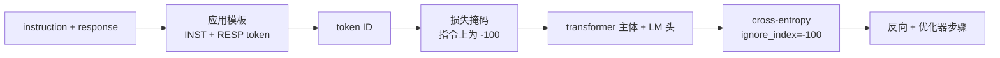
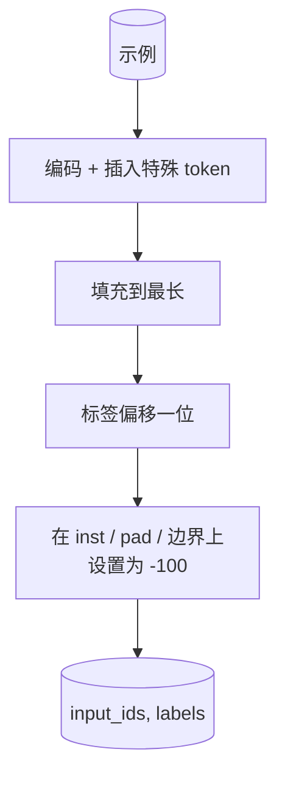
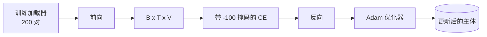

# 综合项目第 39 课：通过监督微调进行指令调优

> 一个预训练的基础模型可以扩展一个序列，但不能遵循指令。监督微调是修复此问题的最小更改：向模型输入指令和期望响应的配对示例，并训练主体预测响应 token。诀窍在于你只希望损失计入响应，而不是指令。本课构建一个 Alpaca 风格的 SFT 循环，使用自定义整理函数以 `ignore_index=-100` 掩码指令 token，在 200 个指令-响应对上训练，并在保留分割上使用精确匹配进行评估。

**类型：** 构建
**语言：** Python（torch, numpy）
**前置条件：** 第 19 阶段第 30-37 课（NLP LLM 轨道：分词器、嵌入表、注意力块、transformer 主体、预训练循环、检查点、生成、困惑度）
**时间：** ~90 分钟

## 学习目标

- 将配对的指令-响应数据格式化为具有显式边界 token 的单一因果序列。
- 构建一个整理函数，掩码指令 token，使得交叉熵仅计入响应 token。
- 在 SFT 目标下训练一个微型 transformer 主体，并观察评估指标移动。
- 实现尊重响应起始边界的贪心和温度采样生成。
- 在生成的完成上计算保留精确匹配。

## 问题

在下一个 token 预测上训练的基础模型不知道什么是指令。向它展示字符串 `"What is the capital of France?"`，它将继续问句或发明一个新句子。模型有语言但没有格式合约。

SFT 合约是一个字符串模板。每个训练示例变成具有三个区域的单一序列：

```text
<INST> What is the capital of France? <RESP> The capital of France is Paris.
```

边界 token 是在训练时保留的特殊 token。模型学习到 `<RESP>` 之后的所有内容都是响应，响应是被评分的内容。基础模型的下一个 token 目标仍然适用；它只是在一个每个示例都具有此形状的语料库上训练。

但有一个陷阱。如果你将整个序列输入到一个普通的交叉熵损失中，你就是在训练模型也预测指令 token。指令是给定的。你想要在这些位置上零梯度。修复方法是掩码。

## 概念



`ignore_index` 是 `torch.nn.functional.cross_entropy` 的一个特性。任何等于 `ignore_index` 的目标位置贡献零损失和零梯度。PyTorch 中的约定是 `-100`。整理函数为每个示例构建两个张量：`input_ids`（完整序列）和 `labels`（`input_ids` 的副本，指令位置覆盖为 `-100`）。

模型在前向传递期间看到整个序列；注意力可以关注指令。损失仅计入响应 token。这正是你想要的：以指令为条件，预测响应。

## 数据

在 `main.py` 中确定性生成两百个指令-响应对。它们覆盖六种任务类型：

- 事实性单次（X 的首都）
- 算术
- 列表提取
- 一句话摘要
- 代码（打印、排序）
- 定义

每个任务有一个模板化指令和一个确定性响应。这故意很简单。精确匹配是脆弱的，本课使用一个正确答案是一个特定字符串的夹具。真实的 SFT 数据集需要模糊指标；原则是相同的。

分割为 160 训练，40 测试。测试集覆盖所有六种任务类型，因此可以报告每个类别的精确匹配。

## 分词和填充

分词器是字节级的，具有三个保留的特殊 token：

- `INST_ID = 256`：标记指令区域的开始。
- `RESP_ID = 257`：标记指令和响应之间的边界。
- `PAD_ID = 258`：用于可变长度批次的填充。

序列是 `[INST] inst_bytes [RESP] resp_bytes [PAD]*`。整理函数：

1. 对每个示例进行分词。
2. 将批次中的每个示例填充到批次中最长的序列。
3. 构建 `labels` = 偏移一位的 `input_ids`（因果 LM 目标），其中：
   - 指令区域替换为 `-100`。
   - 填充区域替换为 `-100`。
   - `RESP_ID` 边界位置本身替换为 `-100`（你不训练模型预测边界 token；它预测后面的内容）。



偏移是标准的因果技巧：`input_ids` 的位置 `i` 预测位置 `i+1`，因此 `labels[i] = input_ids[i+1]`（最后一个位置从输入中丢弃，第一个从目标中丢弃）。掩码在偏移之后应用，以落在正确的位置上。

## 训练



循环是标准的 PyTorch SFT 循环。Adam，学习率约在 3e-4 到 1e-3，在此夹具上训练十到二十个 epoch，无需调度器。模型足够小（隐藏 96，2 个块，最大长度 64）以在 CPU 上两分钟内训练到收敛。

每第五个 epoch 循环在保留集上运行一个微型评估传递，并打印精确匹配。观察精确匹配从 epoch 一的 0.0 到 epoch 十五左右类似 0.85 的过程，是本课的回报：你可以看到模型同时在学习格式和答案。

## 生成

在评估时，模型获取指令前缀 `[INST] inst_bytes [RESP]` 并生成 token，直到满足以下条件之一：

- 序列达到 `max_len`，或者
- 模型发出一个特殊的停止启发式：两个连续的句子结束字节（`.`、`!`、`?`）。

本课提供贪心解码加上一个可选的温度采样器。精确匹配使用贪心，因为温度会使指标随机。真实系统通常采样，然后模糊判断；该流水线是第 41 课。

## 精确匹配评估

精确匹配是最严格的文本指标。预测的响应字符串被标准化（小写、去除空格、合并双空格），并与参考响应以相同的方式标准化后进行比较。每个示例指标为 1 或 0。聚合是平均值。

真实的 SFT 流水线以 token 级别 F1（第 41 课）和评判模型来补充精确匹配。精确匹配仍然有用，因为它是明确的；如果它说 0.7，恰好 70% 的测试指令产生了字符对字符的金色响应。

## 你将构建的内容

实现是一个 `main.py` 加上测试。

1. `InstructionTokenizer`：字节级编码器，具有保留的特殊 token。编码指令前缀或完整对。
2. `make_dataset`：使用固定种子生成跨六种任务类型的 200 对。
3. `SFTDataset`：每个示例返回 `(input_ids, labels)`，已预先准备掩码。
4. `sft_collate`：动态填充，构建批次张量，在指令和填充位置上设置 `-100`。
5. `TinyGPT`：transformer 主体加上绑定或未绑定的 LM 头。
6. `train_sft`：SFT 循环，具有每个 epoch 的评估钩子。
7. `generate`：从前缀进行因果解码，贪心或采样，带有停止启发式。
8. `exact_match`：标准化字符串比较，返回 `[0, 1]` 范围内的浮点数。
9. `run_demo`：构建数据，训练二十个 epoch，评估，打印每个类别细分，成功时以零退出。

## 为什么掩码很重要

没有掩码，损失将指令 token 视作目标。模型学习预测指令。这是一个不同的目标，并以两种方式产生更差的模型。首先，模型容量被浪费在重建用户始终提供的输入上。其次，响应损失在梯度和中较小，因为在大多数批次中指令 token 数量超过响应 token；优化器在你关心的部分上的有效学习率低于你的预期。掩码不是打磨；它就是目标。

## 扩展目标

- 添加一个学习率预热后跟余弦衰减。SFT 比预训练对 LR 更敏感。
- 添加每个 token 的损失日志，并在训练过程中绘制损失曲线。注意早期 epoch 由模板 token（`<RESP>`，常见前缀）主导，后期 epoch 由实际答案 token 主导。
- 将评估扩展到 BLEU-1 或 chrF。精确匹配低估了生成具有相同答案的释义的模型。
- 添加一个具有多轮格式的聊天模板，并在包含追问的夹具上训练。

实现给了你格式合约、掩码和循环。从基础模型到指令跟随者的目标更改是一个整理函数。
