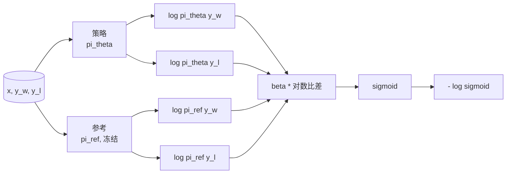
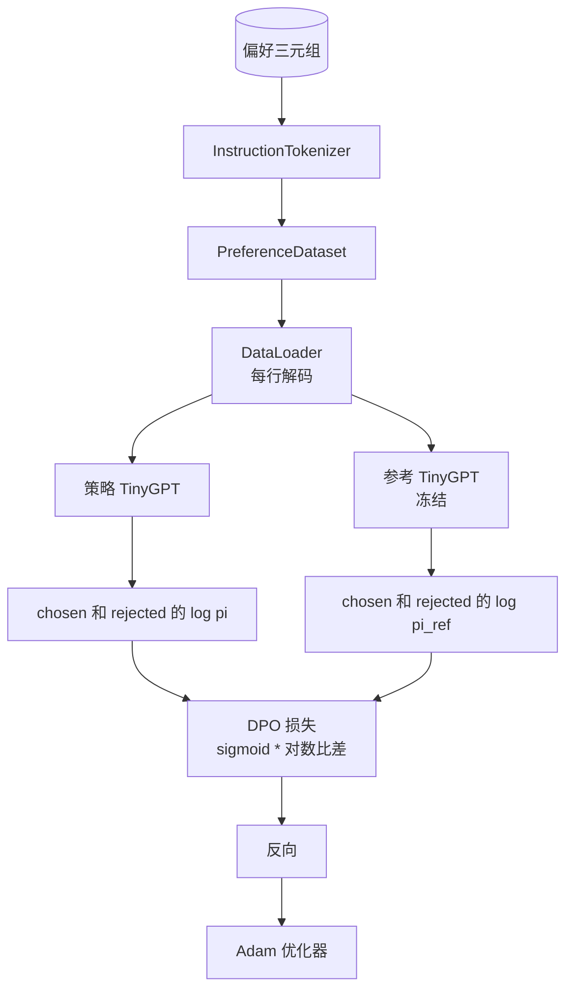

# 综合项目第 40 课：从零构建直接偏好优化

> 奖励模型和 PPO 是经典的 RLHF 技术栈。DPO 将该技术栈折叠为一个单一的监督损失，直接针对偏好对拟合策略。本课从奖励差异恒等式推导 DPO 损失，提供一个工作的参考模型加策略模型，计算每个 token 的对数概率，并在选择的与被拒绝的完成的偏好夹具上训练一个微型 transformer。测试锁定损失数学和梯度方向，确保实现与论文匹配。

**类型：** 构建
**语言：** Python（torch, numpy）
**前置条件：** 第 19 阶段第 30-37 课（NLP LLM 轨道：分词器、嵌入表、注意力块、transformer 主体、预训练循环、检查点、生成、困惑度）
**时间：** ~90 分钟

## 学习目标

- 将 DPO 损失推导为缩放对数比差上的 sigmoid，并将其连接到隐式奖励。
- 构建一个参考模型 + 策略模型对，参考模型冻结、策略模型可训练。
- 在两个模型下计算序列级别的对数概率，掩码提示 token。
- 在 `(prompt, chosen, rejected)` 三元组上训练策略，并观察 chosen 的对数概率相对于 rejected 上升。
- 通过损失数学、梯度符号和参考不变性的测试锁定行为。

## 问题

你有一个 SFT 模型。它遵循指令，但其输出不均匀；有些完成清晰，有些冗长或错误。你还有一个小的偏好对数据集：对于相同的提示，人工标记一个完成为 chosen，另一个为 rejected。

经典的 RLHF 答案是一个两阶段流水线。在偏好上训练一个奖励模型。使用 PPO 针对奖励优化策略。这工作但昂贵：PPO 期间内存中有两个模型，KL 控制以保持策略接近参考，当奖励模型脆弱时的奖励黑客攻击。

DPO 用一个单一的监督损失替换了两个阶段。奖励模型从未显式存在。策略直接在偏好对上训练，带有朝 SFT 参考的显式 KL 惩罚。在 Bradley-Terry 偏好模型下的相同最优解，代码少得多。

## 概念

从 Bradley-Terry 模型开始。给定一个提示 `x` 和两个完成 `y_w`（chosen）和 `y_l`（rejected），人类偏好 `y_w` 的概率是

```text
P(y_w > y_l | x) = sigmoid( r(x, y_w) - r(x, y_l) )
```

其中 `r` 是某个潜在奖励函数。RLHF 首先从偏好中拟合 `r`，然后训练策略 `pi` 以最大化 `r`，带有 KL 锚定：

```text
max_pi   E_{x, y~pi} [ r(x, y) ] - beta * KL(pi || pi_ref)
```

DPO 推导观察到，此目标下的最优策略 `pi*` 在以 `r` 表示时具有封闭形式：

```text
pi*(y | x) = (1/Z(x)) * pi_ref(y | x) * exp( r(x, y) / beta )
```

对 `r` 重新排列：

```text
r(x, y) = beta * ( log pi*(y | x) - log pi_ref(y | x) ) + beta * log Z(x)
```

`log Z(x)` 项对 `y_w` 和 `y_l` 相同（它依赖于 `x`，不是 `y`），因此当计算偏好差时它抵消了：

```text
r(x, y_w) - r(x, y_l) = beta * ( log pi_theta(y_w|x) - log pi_ref(y_w|x)
                                - log pi_theta(y_l|x) + log pi_ref(y_l|x) )
```

代入 Bradley-Terry sigmoid 并取偏好对上的负对数似然：

```text
L_DPO(theta) = - E_{(x, y_w, y_l)} [
  log sigmoid( beta * ( log pi_theta(y_w|x) - log pi_ref(y_w|x)
                       - log pi_theta(y_l|x) + log pi_ref(y_l|x) ) )
]
```

这就是损失。它是每个示例单个标量上的 sigmoid，从四个对数概率计算。没有单独的奖励模型。没有 PPO。损失中没有 KL 项；KL 约束被烘焙到封闭式推导中。



## 梯度的符号

在任何训练运行之前的一个有用的健全性检查。对 `log pi_theta(y_w | x)` 取梯度：

```text
d L_DPO / d log pi_theta(y_w | x) = - beta * (1 - sigmoid(z))
```

其中 `z` 是 sigmoid 的参数。这对所有 `z` 都是负的，这意味着：增加策略在 chosen 完成上的对数概率减小了损失。对称地，对 `log pi_theta(y_l | x)` 的梯度是正的：增加 rejected 的对数概率增加了损失。训练推动 chosen 上升和 rejected 下降。参考模型是冻结的；它不移动。

## 数据

本课提供十二个偏好三元组。每个是 `(prompt, chosen, rejected)`。chosen 完成短且精确。rejected 是冗长的、离题的或错误的。这些对覆盖了与第 39 课相同的任务家族（首都是什么、算术、列表），因此从 SFT 基础开始的策略具有一个合理的起点。

夹具故意很小。在生产中 DPO 在数万对上工作；在这里，重点是损失数学和循环在微小的数据集上端到端运行，并且 chosen vs rejected 对数概率差距明显增长。

## 参考不变性

一个 DPO 实现必须小心处理参考模型。参考是就地冻结的 SFT 模型。必须保持三个属性：

- 参考参数永不接收梯度。
- 参考对数概率跨 epoch 永不改变。
- 策略从与参考相同的权重开始。（最优 `theta` 是参考加上一个学习的更新；将策略初始化为参考的副本是明确定义的起点。）

实现通过以下方式强制执行这些：

- 在前向传递期间用 `torch.no_grad()` 包装参考。
- 在每个参考参数上设置 `requires_grad=False`。
- 在参考构建后通过 `policy.load_state_dict(reference.state_dict())` 构造策略。

## 架构



模型是第 39 课使用的相同 TinyGPT（解码器专用、因果、字节分词器）。参考和策略共享架构；策略的权重在训练下从参考漂移，而参考保持固定。

## 你将构建的内容

实现是一个 `main.py` 加上测试。

1. `InstructionTokenizer`：字节分词器，具有 `INST` 和 `RESP` 特殊 token。与第 39 课相同的形状。
2. `TinyGPT`：解码器专用 transformer。与第 39 课相同的形状，因此即使你跳过了第 39 课，本课也是自包含的。
3. `make_preferences`：返回十二个 `(prompt, chosen, rejected)` 三元组。
4. `sequence_log_prob`：给定模型、提示前缀和完成，返回在完成上的下一个 token 对数概率之和（没有提示位置的贡献）。
5. `dpo_loss`：接受四个对数概率和 `beta`，返回每个示例的损失张量和用于日志记录的隐式奖励差值。
6. `train_dpo`：每个 epoch 的循环，在策略和参考下计算 chosen 和 rejected 的对数概率，应用损失，并执行 Adam 步骤。
7. `evaluate_margins`：在任何点返回策略下平均的 chosen-rejected 对数概率边界。
8. `run_demo`：从小型预热预训练构建参考和策略，复制权重，训练三十步，打印每步损失和边界，并在成功时以零退出。

## 为什么 DPO 有效

DPO 在 Bradley-Terry 偏好模型下数学上等价于 RLHF，直到奖励的参数化。隐式奖励 `r(x, y) = beta * (log pi(y|x) - log pi_ref(y|x))` 在偏好中是可达的，直到一个 `x` 的函数，这在差值中抵消。封闭式策略允许你跳过显式奖励模型。KL 约束被结构性地执行：`pi` 从 `pi_ref` 的任何偏离使对数比更大，sigmoid 饱和，当策略移动太远时这抑制了梯度。参考模型是你的安全网。

## 扩展目标

- 为对数概率和添加长度归一化：除以完成长度。长度偏差是一个已知的 DPO 失败模式，模型优先选择较短的完成，因为它们的对数概率在绝对值上更大。
- 添加损失的 IPO 变体：将 sigmoid + log 替换为 `(z - 1)^2`。比较在夹具上的收敛。
- 添加一个标签平滑参数，在硬性 chosen-rejected 标签和均匀 0.5 之间插值。
- 将参考替换为一个更小更便宜的模型（知识蒸馏风味）。

实现给了你损失、参考不变性和训练循环。数学是本课。代码使数学具体化。
