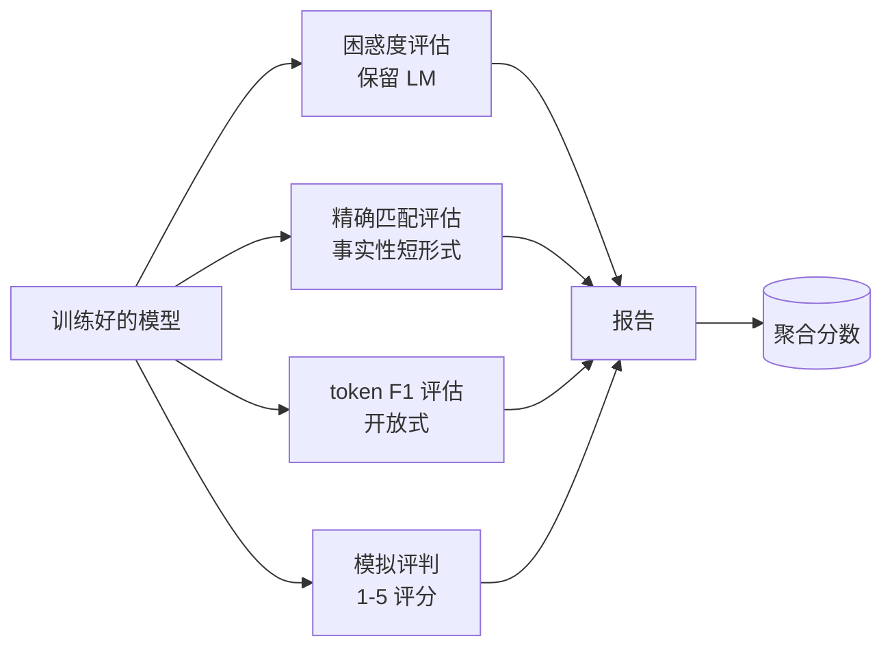
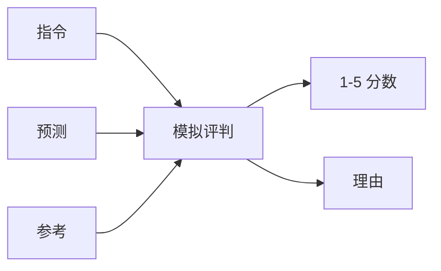
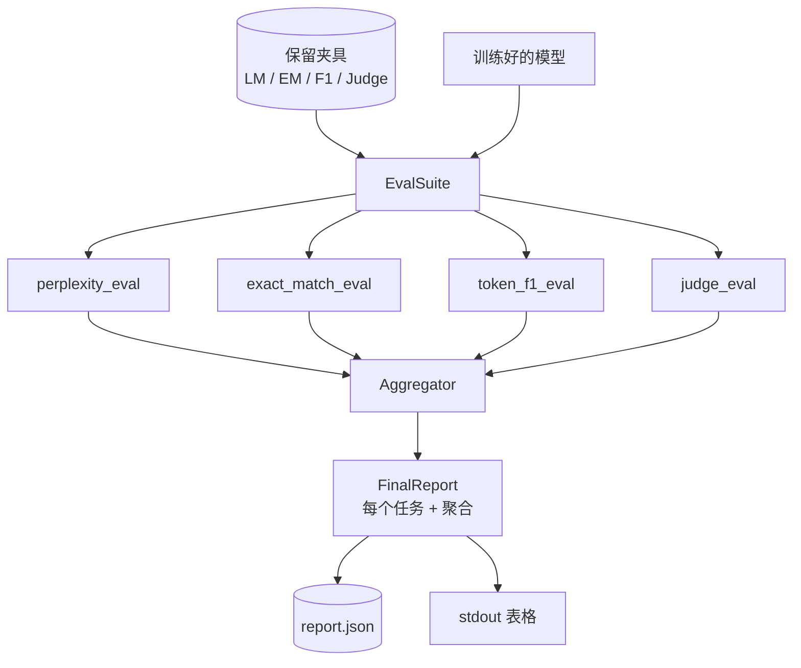

# 综合项目第 41 课：完整评估流水线

> 训练是你可以用损失曲线监控的部分。评估是你必须设计的部分。本课构建一个统一的评估流水线，接受任何训练好的语言模型，在其上运行四个异构评估，将结果聚合成每个任务的报告，并提供一个本地模拟 LLM-as-judge，使循环无需网络即可运行。四个评估覆盖每个交付模型需要的维度：语言建模（困惑度）、短形式正确性（精确匹配）、开放形式相似性（token F1）和定性评分（评判）。

**类型：** 构建
**语言：** Python（torch, numpy）
**前置条件：** 第 19 阶段第 30-37 课（NLP LLM 轨道：分词器、嵌入表、注意力块、transformer 主体、预训练循环、检查点、生成、困惑度）
**时间：** ~90 分钟

## 学习目标

- 在微型 transformer 上使用掩码 token 计数计算保留困惑度。
- 在短形式事实性提示上运行精确匹配评估。
- 以标准化计算预测和参考字符串之间的 token 级 F1。
- 构建一个本地模拟 LLM-as-judge，以 1-5 的尺度对模型输出评分。
- 将四个评估聚合成一个带有每个任务细分的加权单一报告。

## 问题

单一指标永远无法描述一个语言模型。困惑度表示模型适应语言分布的程度，但不表示它是否回答问题。精确匹配表示模型是否产生金色字符串，但惩罚正确的释义。Token F1 容忍释义，但被与错误内容的词汇重叠所欺骗。LLM-as-judge 捕获定性维度，但昂贵且随机。

你实际想要的流水线拥有所有四个。每个评估覆盖其他评估遗漏的一个维度。每个评估在为此指标塑造的保留数据的不同子集上运行。最终报告并排显示每个任务的数字和聚合分数，以便审查者可以一眼看到模型正在做出的权衡。

本课在一个文件中端到端构建该流水线。

## 概念

每个评估是从 `(model, dataset) -> EvalResult` 的函数。结果携带指标值、用于检查的每个示例详情，以及用于聚合的名称。流水线使用一个说明要运行哪些评估以及如何加权它们的配置来组合它们。

## 困惑度，正确计数

困惑度是 `exp(每个 token 的平均负对数似然)`。实现有两个陷阱：

- 平均值必须在实际 token 位置上计算，而不是在 batch * sequence 上计算。填充 token 必须从分母中排除，否则困惑度看起来会比实际更好。
- 模型预测下一个 token，因此位置 `i` 的 logits 预测位置 `i+1` 的 token。这里的差一错误是沉默的：损失仍然训练，但指标变得无意义。

评估计算每个批次的非填充位置上 `-log p(token)` 的和以及每个批次的 token 计数，然后在最后相除。这在数值上比平均每个批次的困惑度更安全（后者对短序列权重不足），并且匹配教科书定义。

## 精确匹配，带标准化

Harness 在比较之前对预测和参考都进行标准化：

- 小写。
- 去除周围空格。
- 将内部空格运行折叠为单个空格。
- 如果双方仅在标点符号上不同，则丢弃尾部的终端标点（`.`、`!`、`?`）。

标准化使精确匹配在实践中变得有用。一个说 `"Paris"` 的模型是正确的；一个说 `"Paris."` 的模型也是正确的；一个说 `"  paris  "` 的模型也是正确的。该指标仍然要求标准化后答案为相同的字符串。

## Token F1，正确的方式

Token F1 是在词袋上计算的精确率和召回率的调和平均数。步骤：

1. 标准化预测和参考（与精确匹配相同的规则）。
2. 将每个分割为 token 列表（空格分词）。
3. 统计多重集交集。
4. 精确率 = `intersection_count / len(pred_tokens)`。召回率 = `intersection_count / len(ref_tokens)`。F1 = 调和平均数。

如果预测和参考都为空，F1 为 1（空真匹配）。如果只有一方为空，F1 为 0。此模式匹配 SQuAD 评估参考，并在释义之间产生稳定的数字。

## 本地模拟 LLM-as-Judge

一个真正的评判是一个 API 背后的前沿模型。对于本课，评判必须离线运行。模拟评判是一个确定性评分器，接受指令、模型的预测和参考，并返回 `{1, 2, 3, 4, 5}` 中的一个分数加上一行理由。评分规则是显式的：

- 5 如果标准化预测等于标准化参考。
- 4 如果预测和参考之间的 token F1 至少为 0.8。
- 3 如果 token F1 在 `[0.5, 0.8)` 中。
- 2 如果 token F1 在 `[0.2, 0.5)` 中。
- 1 其他情况。

这不是一个真正的评判，但它具有正确的接口。稍后通过更改一个函数替换为真正的模型。流水线不在乎。

## 聚合

聚合分数是标准化评估分数的加权平均值。每个评估报告自己在 `[0, 1]` 范围内的数字：

- 困惑度：标准化为 `1 / (1 + log(perplexity))`。困惑度为 1 映射到 1，无穷大映射到 0。
- 精确匹配：已在 `[0, 1]` 中。
- Token F1：已在 `[0, 1]` 中。
- 评判：除以 5。

权重是可配置的。默认组合是 0.2 困惑度、0.3 精确匹配、0.3 token F1、0.2 评判。权重的选择是一个产品决策；本课暴露了旋钮以便你可以实验。

## 架构

`EvalSuite` 是一个薄的编排器。每个独立评估是一个自由函数，接受 `(model, tokenizer, dataset, config)` 并返回 `EvalResult`。`Aggregator` 收集结果并生成最终报告。演示打印表格并写入一个下游 CI 可以接收的 JSON 副本。

## 你将构建的内容

实现是一个 `main.py` 加上测试。

1. `TinyGPT`：第 38-40 课使用的相同解码器专用架构，包含在内使本课独立。
2. `InstructionTokenizer`：字节分词器，具有 INST / RESP / PAD 特殊 token。
3. 四个夹具：一个 LM 语料库、一个 EM 集、一个 F1 集和一个评判集。每个二十个示例，确定性的。
4. `perplexity_eval`：返回带有困惑度值和每个 token 损失直方图的 `EvalResult`。
5. `exact_match_eval`：返回平均 EM 和每个示例记录。
6. `token_f1_eval`：返回平均 token F1 和每个示例记录。
7. `mock_judge` 和 `judge_eval`：每个示例的分数和理由，跨集合的平均分数。
8. `Aggregator.normalise`：每个评估的标准化规则。
9. `Aggregator.aggregate`：加权平均和组装的报告。
10. `run_demo`：短暂训练一个微型模型，运行所有四个评估，打印报告表格并写入 JSON，成功时以零退出。

## 阅读报告

报告有三层。顶部是聚合分数。其下是四个每个评估的数字。其下是用于诊断的每个示例细分。失败的 CI 运行通常想要聚合分数，但追踪回归的审查者想要每个示例的细分，以查看模型在哪些输入上搞错了。

JSON 转储使用稳定的键，以便 CI 仪表板可以跨版本绘制趋势线。漂亮打印的表格适用于在训练运行后盯着终端的人类。

## 扩展目标

- 添加一个校准评估：模型的 softmax 概率与其准确率匹配吗？按置信度分桶预测，并报告每个桶的经验准确率。
- 添加一个鲁棒性评估：用扰动（拼写错误、释义、混淆项）标记每个示例，并报告每个扰动的指标下降。
- 将模拟评判替换为 HTTP 调用背后的真实模型。函数签名不改变。
- 添加每个任务的权重学习：而不是固定权重，将权重拟合到模型上的目标偏好顺序。

实现给了你四个评估、聚合器和报告。真实的评估流水线在上面叠加更多维度；模式保持不变：每个评估一个函数，一个聚合器，一份报告。
