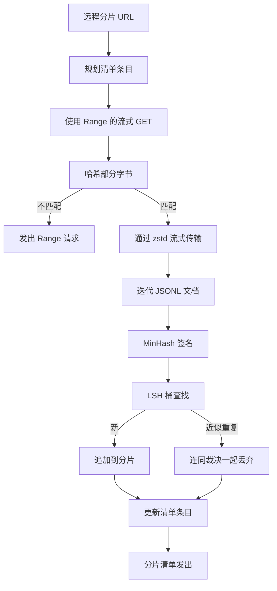

# 大型语料库下载器

> 训练一个语言模型早在第一次前向传递之前就开始了。语料库必须落地到磁盘，解压，去重，并且可寻址，恢复方案要在网络在 4% 处断开之前就已经制定好。本课构建一个流式下载器，拉取压缩分片，使用 Zstandard 即时解压，通过 MinHash 加上局部敏感哈希指纹识别近似重复，并写入流水线其余部分可以信任的分片清单。

**类型：** 构建
**语言：** Python
**前置条件：** 第 19 阶段第 30-37 课
**时间：** ~90 分钟

## 学习目标

- 使用 `urllib` 流式传输远程分片，并使用 `zstandard` 解压，而无需将整个文件缓冲到内存中。
- 通过针对已验证的字节偏移发出 HTTP `Range` 请求来恢复部分下载。
- 为每个文档构建 MinHash 签名，并使用 LSH 对其进行桶化，使近似重复发生碰撞。
- 发出一个带有内容哈希、字节大小、文档计数和去重裁决的分片清单。

## 问题

你第一次在 200 GB 语料库上训练时，网络在 41% 处断开，脚本以 `urllib` 异常退出。第二次在 78% 处断开。到 99% 时你已经把循环重写了三次。你必须从第一分钟就设计好的两类故障是部分下载恢复和重复文档移除。两者都有众所周知的解决方案；两者都因为流水线最初是一个后来长出了牙齿的单行 `requests.get` 调用而经常被跳过。

恢复是一个 HTTP 问题。服务器必须兑现 `Range`，客户端必须根据磁盘记录追踪已验证的偏移，并且已验证的偏移必须在进程死亡后仍然存活。如果偏移和文件相差哪怕一个字节，恢复的下载写入垃圾数据，语料库以一种仅在分词时才会显现的方式被损坏。

去重是一个签名问题。精确哈希去重会漏掉近似重复：相同的维基百科文章带有三个不同的样板脚注，相同的代码文件带有不同的许可证头，相同的博客文章每个链接上带有追踪参数。MinHash 加上 LSH 以亚线性成本捕获这些。成本是每个文档一个签名，每个签名一次桶查找。

## 概念



### 使用 `urllib` 流式传输

标准库的 `urllib.request.urlopen` 返回一个类文件对象。将其包装在 `zstandard.ZstdDecompressor().stream_reader` 中，字节从网络通过解压器流入文档迭代器，而从未将压缩分片或解压分片加载到内存中。唯一的内存成本是行缓冲区、当前文档的 MinHash 签名和 LSH 索引。

### 使用 `Range` 恢复

下载器为每个分片写入两个文件：分片本身和一个 `.partial.json` 检查点。检查点记录 `verified_bytes`、`expected_size`、`sha256_prefix`（在第一个 `verified_bytes` 字节上计算）和源 URL。启动时下载器读取检查点，对磁盘上的字节重新计算 `sha256_prefix`，并且仅在重新计算的哈希匹配时才恢复。如果哈希错误，部分文件被丢弃，下载从零字节重新开始。静默损坏是不可能的，因为已验证的字节被检查，而不是假设。

### MinHash 加上 LSH

MinHash 在固定空间中估算两个集合的 Jaccard 相似度。对于文档，集合是其文本的 shingles（重叠的 n-gram）。签名是每个独立哈希函数一个最小哈希值的 `k` 个分量。Jaccard 相似度为 `s` 的两个文档在签名的任何单个分量上达成一致的概率为 `s`。

LSH 然后将 `k` 个分量分组为 `b` 个带，每个带 `r` 行，其中 `k = b * r`。两个文档在至少一个带中碰撞的概率为 `1 - (1 - s^r)^b`，这是围绕你所调谐 `(b, r)` 的 `s` 值的一个尖锐阈值。典型语料库去重的阈值是 `s = 0.8`，LSH 研究文献通过 `k = 128`、`b = 32`、`r = 4` 达到该阈值。

### 分片清单作为合约

下载器唯一的持久输出是清单。清单为每个分片持有 URL、解压后的字节计数、文档计数、去重后的唯一文档计数以及最终分片文件的 sha256。下游分词读取清单，而不是目录列表。如果分片缺失或其 sha256 错误，清单告诉下一个阶段拒绝启动。清单是"数据已下载"和"数据已下载且可验证"之间的决定性边界。

## 构建它

`code/main.py` 实现：

- `ShardPlanner` - 读取分片 URL 列表并生成计划的清单条目。
- `StreamingDownloader` - 打开一个带有可选 `Range` 的 `urllib` 流，写入临时文件，在每个块上更新 `.partial.json` 检查点，并在恢复时验证 sha256 前缀。
- `ZstdDocIterator` - 将类文件流包装在 `zstandard.ZstdDecompressor` 中，并每行输出一个文档。
- `MinHasher` - 使用固定的哈希种子族为字符串生成 `k` 分量签名。
- `LSHIndex` - 按带桶化签名并报告碰撞。
- `Dedup` - 组合哈希器和索引，将每个文档标记为 `keep` 或 `near_duplicate` 以及匹配的分片 ID。
- `ManifestWriter` - 收集每个分片的统计信息并写入 `manifest.json`。

文件底部的演示在磁盘上构建一个小型合成语料库，使用 `zstandard` 压缩，通过 `file://` URL 下载，去重，并打印清单。

运行它：

```bash
python3 code/main.py
```

脚本以零退出并打印清单摘要。

## 生产模式

四种模式将本课扩展到真实语料库。

**先检查点再写入。** `.partial.json` 必须在字节追加到分片之前 `fsync`。否则断电会颠倒顺序：分片字节在磁盘上，检查点没有它们，下次恢复认为它拥有比实际更少的已验证字节，重复的后缀字节损坏文件。先检查点，然后写入。这与预写日志是相同的纪律。

**分片 LSH 索引。** 整个语料库上的单一 LSH 索引在 200 GB 规模下不适合 RAM。按第一个带哈希分区 LSH 索引，将分区存储在磁盘上，并仅查询新签名将落在的分区。成本是每个文档一次额外的磁盘读取；好处是 LSH 索引不再是硬性内存上限。

**墓碑，而非删除。** 被丢弃的重复在清单中记录为裁决 `near_duplicate` 及其碰撞的文档的分片 ID。删除它们会丢失重复及其保管者之间的链接。墓碑化保留了审计追踪，并允许下游传递更改其对阈值的决定。

**清单中每个分片的 sha256，外加清单 sha256。** 清单本身获得内容哈希。下游阶段在信任每个分片条目之前验证清单哈希。没有这个，清单是沉默的攻击面：一个可以编辑单个文件的攻击者可以损坏整个流水线。

## 用它

生产模式：

- **在每次 CI 运行上恢复。** CI 运行器是短暂的。下载器必须假设每次运行都是全新磁盘，并从缓存或远程恢复。`--cache-dir` 是一流标志。
- **在分词前去重。** 分词是昂贵的。在相同文档上运行两次是对相同损失曲线的双倍成本。去重在分词的上游，而不是下游。
- **清单作为合并门。** 训练运行从固定提交中读取清单 sha256。新的数据集版本需要新的清单提交。代码和数据之间的链接是 git，而不是传说。

## 交付它

`outputs/skill-corpus-downloader.md` 在一个真实项目上会描述哪些 URL 馈送下载器、检查点目录如何布局、去重使用的 shingle 宽度和 `(k, b, r)` 三元组是什么，以及清单在版本控制中位于何处。本课交付了引擎。

## 练习

1. 添加一个 `--shingle-width` 标志，并测量去重裁决在宽度 3、5、9 下如何变化。为选定的默认值辩护。
2. 通过嗅探魔术字节在 zstd 旁边添加 gzip 支持。下载器不应该要求调用者指定编解码器。
3. 添加一个 `--resume-only` 模式，如果没有找到检查点则拒绝启动新下载。在 CI 中有用，以防止一次运行意外重新拉取 200 GB。
4. 将 LSH 索引移动到 shelf 或 sqlite 文件，并测量与内存中变体的吞吐量对比。
5. 在启动时添加清单 sha256 检查。如果磁盘上的清单与 `manifest.lock` 中的清单哈希不一致，下载器应该关闭失败。

## 关键术语

| 术语 | 人们的说法 | 实际含义 |
|------|-----------------|------------------------|
| 分片 | "一个文件" | 语料库的一个自包含切片，具有自己的 sha256，用作恢复和去重的单元 |
| MinHash 签名 | "指纹" | 集合的 `k` 分量草图，每个分量是集合上一个独立哈希的最小值 |
| LSH 带 | "桶" | 用作单个桶键以进行碰撞检测的 `r` 个签名分量的一组 |
| 已验证字节 | "恢复偏移" | 磁盘上其 sha256 前缀与检查点匹配的字节；恢复的唯一安全偏移 |
| 清单 | "索引" | 下载器所生成内容的单一持久记录，包括内容哈希 |

## 进一步阅读

- [RFC 7233](https://datatracker.ietf.org/doc/html/rfc7233) - HTTP Range 请求，恢复协议
- [Zstandard 格式规范](https://datatracker.ietf.org/doc/html/rfc8478) - 使流式解压安全的帧格式
- [MinHash](https://en.wikipedia.org/wiki/MinHash) - 本课使用的签名家族
- [局部敏感哈希](https://en.wikipedia.org/wiki/Locality-sensitive_hashing) - 去重阈值背后的带化方案
- 第 19 阶段 · 43 - 下载器馈送的 HDF5 分词语料库
- 第 19 阶段 · 44 - 在语料库上训练的余弦调度
- 第 19 阶段 · 45 - 消费该调度的 AMP 循环
