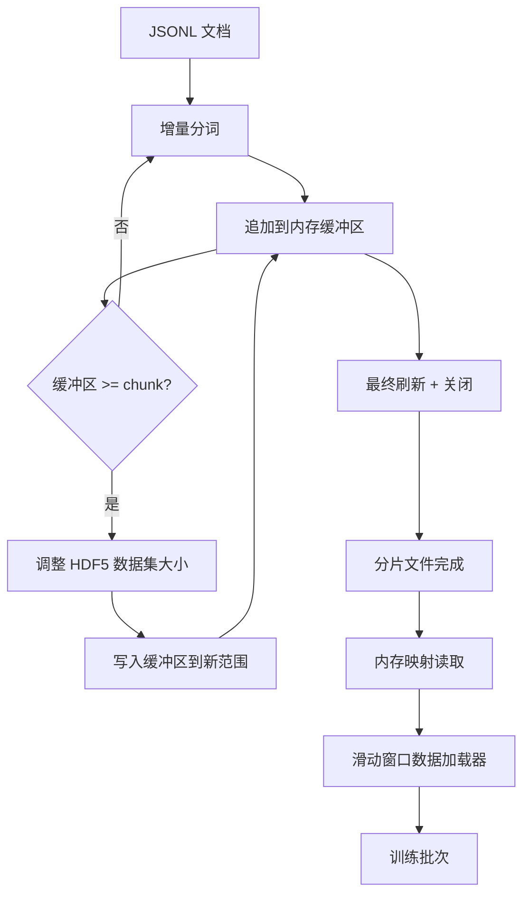

# HDF5 分词语料库

> 下载的语料库必须落地到一个训练器可以以线性速度从中流式读取的布局。磁盘上的 JSONL 在 16 个数据加载器工作进程下无法生存。具有可调整大小、分块整数数据集的 HDF5 可以。本课构建将流式分词写入可调整大小的 HDF5 数据集，跨多个文件的分片写入，训练时的内存映射读取，以及产生具有正确打包的固定长度序列的滑动窗口数据加载器。

**类型：** 构建
**语言：** Python
**前置条件：** 第 19 阶段第 30-37 课
**时间：** ~90 分钟

## 学习目标

- 将文档流式传输到具有确定性分块的可调整大小的 HDF5 整数数据集中。
- 将写入跨多个 HDF5 文件分片，使故障受限且并行成为可能。
- 通过 HDF5 的页面缓存支持的分块布局读回 token，使数据加载器仅在批次时间复制到批次缓冲区。
- 实现一个发出具有显式打包规则的固定长度训练序列的滑动窗口数据加载器。

## 问题

现代语言模型训练运行以每秒数十万个样本的速度跨数十个工作进程读取 token。磁盘上的 JSONL 在第一次冷缓存页面故障时死亡：JSON 解析器慢，文档边界不可寻址，寻址到"样本 4,217,884"需要扫描文件。即使是压缩良好的 Parquet 也是一个糟糕的选择，因为训练器不想要列；它想要具有 O(1) 随机访问的平坦 token 流。

HDF5 适合，因为它提供一个分块的、可调整大小的、仅整数的数据集，其块在读取时对页面缓存友好。训练器要求一个 `tokens[3,200,000 : 3,200,8192]` 的切片，HDF5 将请求的超切片从页面缓存复制到一个新分配的 NumPy 数组中。成本是每个工作进程一个打开的文件句柄和一个块大小的页面缓存占用，与解码 JSONL 的成本相比可以忽略不计。

构建问题在于使写入侧诚实。可调整大小的数据集容易被误用：一次写入一个文档，HDF5 文件碎片化到无法使用。一次调整大小写入所有文档，进程死亡会丢失整个分片。正确的纪律是缓冲区然后扩展，缓冲区大小匹配块大小，分片写入将工作量跨文件分割，使得崩溃最多丢失一个分片。

## 概念



### 正确完成的可调整大小的 HDF5

Token 数据集使用 `maxshape=(None,)` 和固定的 `chunks=(chunk_size,)` 创建。写入通过将 token 缓冲在长度为 `chunk_size` 的 NumPy 数组中进行。当缓冲区填满时，数据集恰好扩展 `chunk_size`，缓冲区写入新范围。在分片结束时，残余缓冲区写入一个最终的部分范围。每次写入都是连续的并且块对齐的，除了最后一次写入，读取器被告知在分片的 HDF5 属性中记录的 `token_count` 处截断。

### 分片写入

单个 HDF5 文件是单点故障。流水线并行写入分片：来自第 19 阶段第 42 课的每个输入分片产生一个 HDF5 输出分片。`shards.json` 索引为每个分片记录文件路径、token 计数、文档计数以及 token 上的 sha256。训练器读取 `shards.json` 以计算全局偏移并验证语料库。

### 内存映射读取

在训练时，每个工作进程以 `swmr=True` 模式打开其份额的 HDF5 文件，并要求 `tokens[start:stop]`。HDF5 的分块布局使得一旦块变热，这就是一个页面缓存支持的读取。工作进程从不加载整个文件：切片被复制到数据加载器的批次缓冲区，在批次时间数据加载器然后将其复制到固定内存训练张量中。热路径每次块转换有一次系统调用；其他一切都是 RAM 访问。

### 滑动窗口数据加载器

数据加载器是唯一知道训练序列长度的阶段。它在全局 token 流中挑选一个随机起始索引，读取 `window_size + 1` 个 token，并返回 `(input, target) = (tokens[:-1], tokens[1:])`。文档边界不被强制执行：一个窗口可能跨越两个文档，它们之间有一个显式的 `boundary_token_id`，以便模型学习使用分隔符。这是标准的打包规则；这也是初学者忘记的规则，最终得到一个 8% 训练边界 token、92% 自然文本的语料库。

## 构建它

`code/main.py` 实现：

- `Tokenizer` - 一个对演示够用的字节级确定性分词器。接口是 `encode(text) -> list[int]` 和 `vocab_size`。
- `HDF5ShardWriter` - 打开一个可调整大小的整数数据集，将 token 缓冲到块大小，以固定大小的步幅调整大小和写入，在关闭时将 `token_count` 和 `sha256` 记录为 HDF5 属性。
- `ShardedTokenizationPipeline` - 迭代输入文档，将它们路由到写入器，并发出 `shards.json` 索引。
- `MmapTokenStore` - 为内存映射读取打开分片文件，计算全局偏移，暴露单一的 `get_slice(start, stop)` API。
- `SlidingWindowDataloader` - 从全局流中随机挑选窗口，并产出 `(input_ids, target_ids)` NumPy 数组。

文件底部的演示构建一个微型内存中语料库，分词到两个分片中，通过内存映射打开它们，运行数据加载器 10 个批次，并打印每个批次形状和校验和。

运行它：

```bash
python3 code/main.py
```

脚本以零退出并打印批次校验和。

## 生产模式

四种模式将本课扩展到真实训练运行。

**块大小等于典型读取。** 训练器每个样本读取 `window_size + 1` 个 token。将 HDF5 块设置为 `window_size` 的倍数，读取是页面缓存对齐的。不匹配的块使吞吐量减半，因为每个样本触及两个块。

**Token 计数在属性中，不在数据集中。** 数据集的后部切片可能部分填充，因为块大小不能整除文档边界。将真实的 `token_count` 存储为数据集上的 HDF5 属性，并让读取器在该值处截断。没有这个，读取器遍历末尾进入零填充的 token，模型学习预测零。

**分片 sha256 与并行验证。** 每个分片在 token 字节上有自己的 sha256。训练器可以在训练开始前并行验证所有分片。错误的 sha256 使运行早期失败，而不是在十六小时后的第三个 epoch。

**两侧都 `swmr=True`，写入器使用 `libver="latest"`。** 单写入器多读取器模式要求写入器使用 `libver="latest"` 打开，预先创建每个数据集，然后设置 `file.swmr_mode = True`。之后写入器必须在每次调整大小后调用 `dataset.flush()`，以便读取器工作进程（使用 `swmr=True` 打开）看到一致的数据。跳过 `libver="latest"` 或在结构更改后启用 SWMR 是"文件已锁定"故障的常见来源。

## 用它

生产模式：

- **每个源分片一个 HDF5。** 下载器（第 42 课）每个 URL 发出一个分片；分词（本课）每个源分片发出一个 HDF5。1:1 映射使恢复和部分故障恢复变得简单。
- **边界 token ID。** 边界 token 是分词器词汇表的一部分，也是数据加载器注入的唯一一个 token。如果模型应该忽略边界 token，训练损失会掩码它；否则它学习将其用作序列分隔符。
- **`shards.json` 作为真理来源。** 添加新分片意味着写入 HDF5，计算其 sha256，并追加一个条目。训练器在启动时读取一次文件，从不触及目录列表。

## 交付它

`outputs/skill-hdf5-tokenized-corpus.md` 在一个真实项目上会描述哪个分词器馈送流水线、什么块大小匹配训练器的窗口、`shards.json` 在版本控制中位于何处，以及数据加载器工作进程如何跨文件分片。本课交付了引擎。

## 练习

1. 为 HDF5 写入器添加一个 `--compression gzip` 标志，并在演示语料库上测量吞吐量成本。为选定的默认值辩护。
2. 为滑动窗口数据加载器添加一个确定性种子，并验证使用相同种子的两次运行产生相同的批次。
3. 添加一个 `--validate` 模式，读取每个分片，对其 token 重新计算 sha256，并与 `shards.json` 进行比较。CI 应该在训练开始前运行此操作。
4. 在等于、一半和两倍窗口大小的块大小下比较数据加载器吞吐量。报告页面缓存效果。
5. 添加一个 `--max-document-tokens` 标志，在写入时截断非常长的文档。为与读取时决定之间的权衡辩护。

## 关键术语

| 术语 | 人们的说法 | 实际含义 |
|------|-----------------|------------------------|
| 可调整大小的数据集 | "仅追加" | 具有 `maxshape=(None,)` 的 HDF5 数据集，通过块大小步幅的 `resize` 调用增长 |
| 分块布局 | "HDF5 存储方式" | 内核可以内存映射且数据加载器可以连续读取的固定大小磁盘页面 |
| `swmr` 模式 | "读时写" | 单写入器多读取器模式，允许数据加载器工作进程安全地共享文件 |
| 分片索引 | "shards.json" | 所有 token 分片的持久索引，带有偏移和内容哈希 |
| 滑动窗口 | "训练样本" | 全局 token 流的固定长度切片，训练器将其与偏移一位的目标配对 |

## 进一步阅读

- [HDF5 分块文档](https://docs.hdfgroup.org/hdf5/v1_14/) - 本课使用的分块、可调整大小的数据集布局
- [h5py 用户指南](https://docs.h5py.org/en/stable/) - HDF5 的 Python 绑定
- [NumPy 内存映射](https://numpy.org/doc/stable/reference/generated/numpy.memmap.html) - HDF5 通过 h5py 暴露的读取侧原语
- 第 19 阶段 · 42 - 本课对其输出进行分词的下载器
- 第 19 阶段 · 44 - 消费此数据加载器的余弦调度
- 第 19 阶段 · 45 - 包装训练步骤的 AMP 循环
