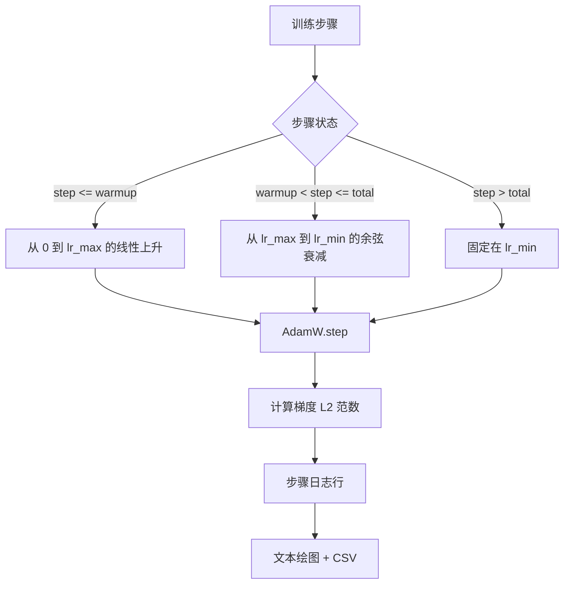

# 带线性预热的余弦学习率

> 学习率调度是继损失函数之后第二重要的决策。具有余弦衰减和线性预热的 AdamW 是语言模型训练的现代默认值，因为它让模型在脆弱的前一千次更新中看到较小的有效步长，上升到配置的峰值，并平滑衰减回零附近。本课构建该调度，在训练步骤上绘制曲线，在调度旁边记录梯度范数，并证明调度兑现了预热、峰值和衰减边界。

**类型：** 构建
**语言：** Python
**前置条件：** 第 19 阶段第 30-37 课
**时间：** ~90 分钟

## 学习目标

- 实现一个连接到具有线性预热的余弦学习率调度的 AdamW 优化器。
- 在任何步骤计算调度的精确值，跨运行无浮点漂移。
- 在学习率旁边记录梯度 L2 范数，使训练健康可见。
- 将调度渲染为眼睛可读的文本绘图和任何工具可消费的 CSV。

## 问题

前一千次训练更新是最嘈杂的。模型的权重仍然接近初始化。优化器的运行二阶矩估计尚未稳定。梯度范数大且嘈杂。如果学习率在这些更新期间处于峰值，模型要么直接发散，要么沉入一个永远无法逃脱的损失平台。两种众所周知的修复方法是梯度裁剪（第 19 阶段第 45 课的主题）和一个从小开始并上升的学习率调度。

余弦带预热调度有三个区域。从步骤零到步骤 `warmup_steps`，学习率从零线性缩放至配置的峰值 `lr_max`。从步骤 `warmup_steps` 到步骤 `total_steps`，学习率遵循余弦曲线的上半部分，从 `lr_max` 衰减到 `lr_min`。在 `total_steps` 之后，学习率固定在 `lr_min`，因此配置错误的训练器如果超步不会悄悄退出调度。

构建问题是调度容易差一错误。差一错误在训练运行六小时后显现为一个学习率在模型开始过拟合的时刻高或低了 1%，这是不可见的，除非调度在边界处被穷举测试。

## 概念



### 预热公式

对于在 `[0, warmup_steps]` 中的 `step`，`warmup_steps > 0`，学习率为 `lr_max * step / warmup_steps`。退化的 `warmup_steps = 0` 情况被视为"无预热"：调度在步骤零直接从 `lr_max` 开始，立即进入余弦衰减。一些测试 harness 传递 `warmup_steps = 0` 以检查调度仍然产生可用曲线。

### 余弦公式

对于在 `(warmup_steps, total_steps]` 中的 `step`，学习率为 `lr_min + 0.5 * (lr_max - lr_min) * (1 + cos(pi * progress))`，其中 `progress = (step - warmup_steps) / max(1, total_steps - warmup_steps)`。在 `step = warmup_steps` 处，余弦评估为 `cos(0) = 1`，给出 `lr_max`，精确匹配预热终点。在 `step = total_steps` 处，余弦评估为 `cos(pi) = -1`，给出 `lr_min`，精确匹配衰减终点。

两个端点处的连续性不是偶然的。这就是调度实现为 `step` 上的单一函数，而不是粘合在一起的三个不同函数的原因。粘合的调度在第一次更改 `lr_max` 时丢失一个边界。

### 总步数后的底限

对于 `step > total_steps`，学习率保持在 `lr_min`。合约是显式的：调度不报错也不外推；它固定在底限处，让训练器记录警告。需要扩展训练的训练器更改调度的 `total_steps`，而不是循环。

### 在率旁边记录梯度范数

调度是训练健康的一半。梯度范数是另一半。训练循环每步记录两者。发散的训练运行在损失之前显示梯度范数飙升；良好调谐的预热保持范数随着率线性上升；过于激进的峰值显示为预热后保持高位的范数。磁盘上的数据集是 `step, lr, grad_l2_norm, loss`。CSV 是唯一持久的记录。

## 构建它

`code/main.py` 实现：

- `CosineWithWarmup` - 在配置的调度上的无状态函数 `lr(step) -> float`。
- `TrainState` - 将模型、`AdamW` 优化器和调度包装为单一步骤函数。
- `TrainState.step` - 运行一次前向传递、一次反向传递，记录梯度 L2 范数，并将 `lr(step)` 应用于优化器。
- `plot_schedule_ascii` - 将调度渲染为眼睛可读的文本绘图。
- `write_schedule_csv` - 每步发出一行，带有学习率。

文件底部的演示构建一个微小的 `nn.Linear` 模型，在固定输入批次上训练 20 步，并打印每步学习率、梯度范数和损失。调度也渲染为文本绘图用于视觉健全性检查。

运行它：

```bash
python3 code/main.py
```

脚本以零退出并打印每步训练日志加上调度绘图。

## 生产模式

四种模式将调度提升为生产工件。

**调度存在于配置中，不在代码中。** 训练器从提交到 git 的 YAML 或 JSON 配置中读取 `warmup_steps`、`total_steps`、`lr_max`、`lr_min`。调度是可重现的，因为配置是内容寻址的；调度是可审计的，因为配置是 PR diff 的一部分。

**步骤计数器是单调的并与 epoch 解耦。** 一些框架在数据集分片或数据加载器重启时混淆步骤和 epoch。调度从训练器的检查点读取 `global_step`，而不是从本地计数器。恢复的运行在正确的调度位置继续，因为步骤计数器是持久轴。

**运行目录中的调度绘图。** 每次训练运行将 `outputs/lr_schedule.png`（或在本课中为文本绘图）写入其运行目录。浏览目录的审查者可以在不重新运行任何东西的情况下对调度进行健全性检查。这在 PR 时捕获了配置错误的调度类 bug。

**日志行模式是固定的。** `step, lr, grad_l2_norm, loss` 按此顺序。下游笔记本或仪表板读取模式；在不提升版本的情况下重命名列会使每个现有仪表板无效。

## 用它

生产模式：

- **在扫其他任何东西之前扫峰值。** `lr_max` 是最敏感的旋钮。首先在小模型上扫它；最优 `lr_max` 随模型大小弱缩放，因此小模型扫描是一个强先验。
- **预热是总步数的分数，而不是绝对计数。** 一个 2 亿步的运行有 2,000 预热步几乎立即从峰值开始；具有相同数字的 20,000 步运行预热 10%。将预热配置为分数（典型：1-3%）使调度随训练持续时间缩放。
- **`lr_min` 故意非零。** `lr_max` 的 10% 的底限使优化器在长尾期间保持学习。`lr_min = 0` 调度产生在绘图上看起来很棒的训练曲线和一个实际上没有完成训练的模型。

## 交付它

`outputs/skill-cosine-warmup.md` 在一个真实项目上会描述哪个配置携带调度、从哪个训练器步骤读取全局计数器，以及哪个 `lr_max` 扫描产生了部署的值。本课交付了引擎。

## 练习

1. 添加调度的反平方根变体，并在 200 步玩具训练运行上比较它。哪条曲线产生更低的最终损失？
2. 添加一个 `--restart` 标志，在 `total_steps / 2` 处添加第二次预热。为热重启在玩具运行上是改善还是损害辩护。
3. 添加一个调度在端点处连续的单元测试：对于 `[0, total_steps]` 中的每一步，差值 `|lr(step+1) - lr(step)|` 受限于 `lr_max / warmup_steps`。
4. 将调度连接到 `torch.optim.lr_scheduler.LambdaLR` 中，使其与框架代码组合。本课使用普通的步骤函数；包装器改变了什么？
5. 添加一个 `--plot-png` 标志，通过 `matplotlib` 写入真实绘图。为本课的文本绘图或 PNG 哪个是 CI 运行的更好默认值辩护。

## 关键术语

| 术语 | 人们的说法 | 实际含义 |
|------|-----------------|------------------------|
| 预热 | "缓慢启动" | 在前 `warmup_steps` 次更新期间从零到 `lr_max` 的线性上升 |
| 余弦衰减 | "平滑下降" | 在剩余步骤上从 `lr_max` 到 `lr_min` 的上半余弦曲线 |
| 底限 | "训练后" | 调度在超过 `total_steps` 后固定在的 `lr_min` 值 |
| 梯度范数 | "梯度的 L2" | 连接的梯度向量的欧几里得范数，每步记录 |
| 全局步骤 | "调度轴" | 一个单调的步骤计数器，在重启后仍然存在，驱动调度 |

## 进一步阅读

- [Loshchilov 和 Hutter, SGDR: 带热重启的随机梯度下降 (arXiv 1608.03983)](https://arxiv.org/abs/1608.03983) - 余弦调度的参考论文
- [Loshchilov 和 Hutter, 解耦权重衰减正则化 (arXiv 1711.05101)](https://arxiv.org/abs/1711.05101) - AdamW 的参考论文
- [PyTorch torch.optim.lr_scheduler](https://docs.pytorch.org/docs/stable/optim.html#how-to-adjust-learning-rate) - 步骤函数如何与框架调度器组合
- 第 19 阶段 · 42 - 此调度所消费语料库的下载器
- 第 19 阶段 · 43 - 此调度与之共同进化的数据加载器
- 第 19 阶段 · 45 - 梯度裁剪和 AMP，循环中的下一层
