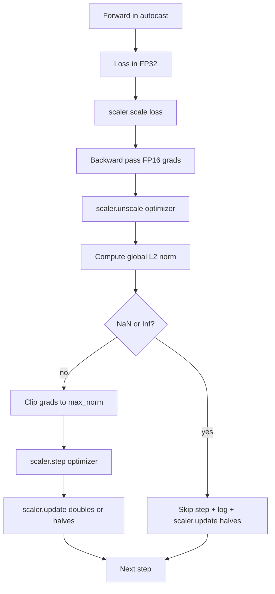

# 梯度裁剪与混合精度

> 上一课的优化器和调度器假设梯度是正常的。它们通常不是。一个坏批次就能让梯度范数飙升三个数量级。混合精度训练加剧了这个问题，因为它在损失端引入了 FP16 溢出。本课构建生产训练不可或缺的两条安全带：对配置的全局 L2 范数进行梯度裁剪，以及带有 autocast 和 GradScaler 的混合精度循环，它能检测 NaN 和 Inf，干净地跳过步骤，并记录缩放因子以供取证。

**Type:** Build
**Languages:** Python
**Prerequisites:** Phase 19 lessons 30-37
**Time:** ~90 minutes

## Learning Objectives

- 计算所有参数梯度的全局 L2 范数，并在超过配置阈值时原地裁剪。
- 将训练步骤包装在 autocast 和 GradScaler 中，使 FP16 的前向和后向传播能够避免溢出。
- 检测损失或梯度中的 NaN 和 Inf，跳过优化器步骤，并记录跳过信息。
- 每个步骤报告 GradScaler 的缩放因子，以便长时间连续跳过的情况能立即被发现。

## The Problem

一个昨天还正常运行到第 8217 步的训练，损失曲线突然垂直上升。罪魁祸首是一个梯度范数为 4200 的批次——是之前峰值的二十倍。如果不裁剪，优化器应用的一步将重置模型在前一小时内学到的所有内容。如果使用最大范数 1.0 的全局 L2 裁剪，同一个批次贡献的将是一个单位范数的更新；损失保持在其趋势线上，运行得以继续。

混合精度训练通过以 FP16 计算前向传播和大部分后向传播，将吞吐量提高了 2-3 倍。代价是 FP16 的指数范围很窄。一个典型的梯度在 FP16 中溢出为 Inf，然后通过后续层传播为 NaN，在下一次优化器步骤中将所有权重设为 NaN。PyTorch 的 GradScaler 通过在反向传播前将损失乘以一个大的缩放因子，并在优化器步骤前将梯度除以相同的因子来解决此问题。如果在反缩放时任何梯度为 Inf 或 NaN，缩放器将跳过该步骤并将缩放因子减半；如果前 N 步都是干净的，缩放器将因子加倍。在训练过程中，因子会找到 FP16 范围所允许的最高值。

构建问题在于正确地连接这两者。在反缩放之前裁剪，阈值作用在缩放后的梯度上；在反缩放之后裁剪，则 GradScaler 上的操作顺序很重要。正确的顺序是：`scaler.scale(loss).backward()`，然后 `scaler.unscale_(optimizer)`，然后 `clip_grad_norm_`，然后 `scaler.step(optimizer)`，然后 `scaler.update()`。任何其他顺序都会产生一个默默损坏的循环。

## The Concept



### Global L2 norm

全局 L2 范数是拼接后梯度向量的欧几里德范数，而不是每个参数的范数。PyTorch 将其实现为 `torch.nn.utils.clip_grad_norm_(parameters, max_norm)`。该函数返回裁剪前的范数，因此本课可以同时记录原始值和裁剪后的值，这对于诊断"每一步都在裁剪"是必要的。

### autocast and GradScaler

`torch.amp.autocast(device_type)` 是一个上下文管理器，选择性地以 FP16 运行符合条件的操作（大多数 matmul 类操作）。`torch.amp.GradScaler(device_type)` 是一个辅助工具，在反向传播前缩放损失，在优化器步骤前反向缩放梯度。这两者被设计为一起使用；仅使用其中一个是配置错误，测试应该捕获到这一点。

本课使用 CPU autocast，因为这是在 CI 中运行的内容；相同的模式通过将 `device_type="cpu"` 改为 `device_type="cuda"` 即可逐字转移到 CUDA。CPU 上的 GradScaler 是一个存根（CPU autocast 默认已使用 BF16，不需要损失缩放），但本课包含调用点，以便与 GPU 循环的接线完全一致。

### NaN and Inf detection

检测发生在两个地方。首先，损失本身在反向传播前用 `torch.isfinite` 检查；Inf 或 NaN 损失不会产生有用的梯度，因此跳过而不进入优化器。其次，在 `scaler.unscale_(optimizer)` 之后，本课用 `has_non_finite_grad(...)` 扫描反缩放后的梯度，并将任何 Inf 或 NaN 视为跳过。这两项检查共同覆盖了前向传播和后向传播的故障模式。

### Scaling factor diagnostics

缩放因子是 GradScaler 的内部状态。每一步，本课读取 `scaler.get_scale()` 并将其与学习率和梯度范数一起记录。健康的运行显示缩放因子以 2 的幂次攀升，直到在 `2^17` 或 `2^18` 附近饱和。不正常的运行显示因子在高值和低值之间振荡，这是模型的梯度有时在范围内、有时不在的信号。没有日志记录，这种诊断是不可见的。

## Build It

`code/main.py` implements:

- `clip_global_l2_norm` - 一个围绕 `torch.nn.utils.clip_grad_norm_` 的包装器，返回裁剪前和裁剪后的范数。
- `has_non_finite_grad` - 一个扫描梯度以查找 NaN 和 Inf 的辅助函数。
- `AmpTrainState` - 包装了一个模型、一个 `AdamW` 优化器、一个 GradScaler 和一个 autocast 设备。暴露一个 `step(inputs, targets)`，运行完整的裁剪、缩放和 NaN 跳过流水线。
- `StepLog` and `SkipLog` - 结构化的每步记录。
- 一个演示，训练一个小型 `nn.Linear` 模型 20 步，在第 5 步向梯度中注入 Inf 以测试跳过路径，并打印结果日志。

运行它：

```bash
python3 code/main.py
```

脚本以零退出并打印每步日志，每行标记为 `STEP` 或 `SKIP`；至少有一行是 `SKIP`。

## Production Patterns

四个模式将循环提升为生产级训练步骤。

**Skip counter as an alert, not a log line.** 每次训练运行跳过几步是健康的。每个 epoch 跳过数百次是一个硬警报：模型处于 FP16 无法承载的状态，循环正在默默失败。本课追踪 1000 步的滚动跳过率，并在生产中，跳过率超过 5% 时会告警。

**Clip threshold lives in the config.** `max_norm = 1.0` 是语言模型训练的现代默认值。先在小型模型上扫描它；更大的阈值让模型能从真正困难的批次中恢复；更小的阈值在最坏情况下限制了上限，代价是噪音更大的损失曲线。该阈值应与第 44 课中的调度器放在同一个 YAML 或 JSON 配置中。

**Norm log goes to a CSV with the schedule.** CSV 列是 `step, lr, grad_l2_pre_clip, grad_l2_post_clip, loss, skipped, skip_reason, scaler_scale`。打开文件的审阅者可以在同一行中看到调度器、梯度故事、缩放因子和跳过结果（及其原因）。将列分散到不同文件中是导致分析不对齐的根源。

**`scaler.update()` runs every step, even on skip.** 在干净的步骤上，缩放器读取其无 inf 计数器，递增它，并可能将因子加倍。在跳过的步骤上，缩放器将因子减半并重置计数器。在跳过路径上忘记 `update()` 是导致"缩放因子从未改变"的 bug。

## Use It

生产模式：

- **Autocast device matches optimizer device.** 用于 GPU 训练时 `torch.amp.autocast(device_type="cuda")`；用于 CPU 时 `torch.amp.autocast(device_type="cpu")`。混合设备会产生一个默默的类型错误，表现为损失曲线看起来正常但模型没有学习。
- **Loss check before backward.** `torch.isfinite(loss).all()` 是一次张量归约；其成本可忽略不计，而在 NaN 损失上节省的是整个训练步骤。始终运行它。
- **`set_to_none=True` in `zero_grad`.** 将梯度设置为 `None` 而不是零，这让优化器跳过不受影响的参数组的计算。该设置是免费的吞吐量提升和轻微的 bug 表面减少。

## Ship It

`outputs/skill-clip-amp.md` 在实际项目中会描述训练步骤使用的裁剪阈值和 autocast 设备、每步 CSV 在版本控制中的位置，以及生产跳过率警报阈值的设置。本课交付的是引擎。

## Exercises

1. 将合成的 Inf 注入替换为真实的损失尖峰（将一个批次的目标乘以 1e8），并验证跳过路径被触发。
2. 添加一个 `--bf16` 模式，将 autocast 切换为 BF16 而不是 FP16。BF16 的指数范围比 FP16 更宽，很少需要损失缩放；验证在相同的演示下跳过率降为零。
3. 添加一个单元测试，验证在不发生裁剪时梯度裁剪包装器正确返回裁剪前和裁剪后的范数。
4. 添加滚动窗口跳过率计算和一个 CLI 标志，如果跳过率在连续 100 步中超过配置的阈值，则使运行失败。
5. 将循环连接起来以写入规范的 CSV（`step, lr, grad_l2_pre_clip, grad_l2_post_clip, loss, skipped, skip_reason, scaler_scale`），并通过每行后刷新来确认文件在 Ctrl-C 后能保留下来。

## Key Terms

| Term | What people say | What it actually means |
|------|-----------------|------------------------|
| Global L2 norm | "Clip target" | 拼接后梯度向量在所有可训练参数上的欧几里德范数 |
| autocast | "Mixed precision" | 在 `with` 块内选择性以 FP16（或 BF16）执行符合条件的操作 |
| GradScaler | "Loss scaler" | 在反向传播前乘以损失、在优化器步骤前反向缩放梯度的辅助工具 |
| Skip | "Bad step" | 因为梯度或损失为非有限值而拒绝的优化器步骤；缩放器将因子减半 |
| Scaling factor | "Scaler state" | GradScaler 当前的乘数；在连续干净步骤后加倍，在每次跳过时减半 |

## Further Reading

- [Micikevicius et al., Mixed Precision Training (arXiv 1710.03740)](https://arxiv.org/abs/1710.03740) - 原始损失缩放提案
- [Pascanu, Mikolov, Bengio, On the difficulty of training recurrent neural networks (arXiv 1211.5063)](https://arxiv.org/abs/1211.5063) - 梯度裁剪参考论文
- [PyTorch torch.amp.GradScaler](https://docs.pytorch.org/docs/stable/amp.html) - 本课包装的缩放器 API
- [PyTorch torch.nn.utils.clip_grad_norm_](https://docs.pytorch.org/docs/stable/generated/torch.nn.utils.clip_grad_norm_.html) - 本课使用的裁剪原语
- Phase 19 · 42 - 为循环提供语料库的下载器
- Phase 19 · 43 - 循环消费的数据加载器
- Phase 19 · 44 - 本循环与之组合的调度器
