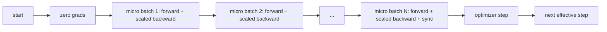
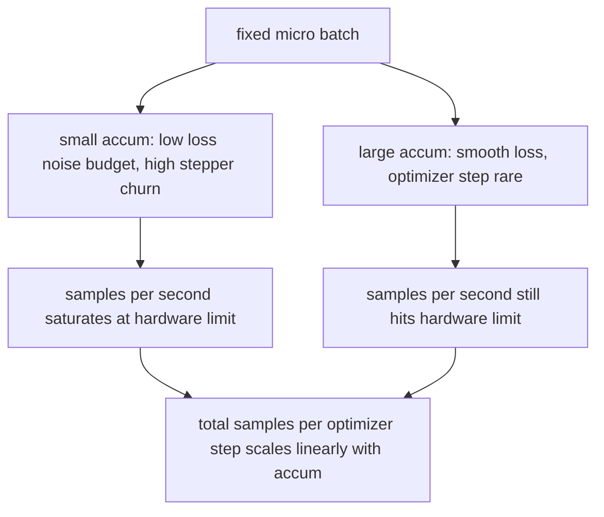

# 梯度累积

> 以你负担不起的有效批量进行训练，一次一个微批次。缩放损失，暂缓优化器步骤，让梯度堆积起来。

**Type:** Build
**Languages:** Python
**Prerequisites:** Phase 19 lessons 42 to 45
**Time:** ~90 minutes

## Learning Objectives

- 推导有效批量的恒等式：`effective_batch = micro_batch * accum_steps`。
- 实现每个微批次的损失缩放，使累积后的梯度与单次全批量反向传播相匹配。
- 跳过优化器同步直到最后一个微批次（sync-on-last-step）。
- 读取吞吐量相对有效批量的曲线，并解释其递减收益。

## The Problem

你想以有效批量 512 进行训练，因为在这种规模下损失曲线更平滑，优化器步骤也更有意义。桌上的加速器在内存耗尽前只能容纳 32 个样本。加倍批量不是选项。减半模型也不是选项。这个领域在 2017 年找到并从未停止使用的技巧是运行 16 次反向传播，让梯度在参数缓冲区中累积，只有在计数达到目标时才执行优化器步骤。

风险在于损失不再是它在更大批量下的那个数字。16 个迷你批次的交叉熵天真地求和是单个全批次损失的 16 倍。如果不缩放，梯度方向是正确的，但幅度是错误的，优化器步骤也大 16 倍。解决方案是一次除法。这个解决方案也很容易忘记。

## The Concept



合约很简短：

- 每个微批次的损失在 `backward()` 之前除以 `accum_steps`。PyTorch 默认将梯度累积到 `param.grad` 中；除法将运行总和推回到正确的尺度。
- 优化器步骤每个有效批次触发一次，在最后一个微批次的反向传播之后。在累积过程中执行步骤会扭曲运行其余部分所依赖的每个参数。
- 优化器的状态（动量缓冲区、Adam 矩）每个有效步骤推进一次，而不是每个微批次一次。否则，指数移动平均会看到错误的频率并消耗掉调度器。
- 在单个设备上，这是簿记。在多 rank 集群上，相同的模式将非最终的微批次包装在 `no_sync` 上下文中，跳过梯度 all-reduce；最后一个微批次在一次遍历中归约完整的累积梯度，而不是支付 N 次网络成本。

### 代码中的等价性证明

```python
loss = criterion(model(x_full), y_full)
loss.backward()
opt.step()
```

等价于

```python
for x, y in chunks(x_full, y_full, n):
    scaled = criterion(model(x), y) / n
    scaled.backward()
opt.step()
```

在不考虑浮点求和顺序的误差范围内。循环结束时的累积梯度缓冲区与单次全批量反向传播产生的张量相同。课程代码在 `equivalence_check` 中通过最大绝对差小于 1e-4 来断言这一点。

### 成本去了哪里

每个微批次消耗一次前向和一次后向。通过累积，你用内存换时间。`outputs/accum-curve.json` 中的吞吐量曲线显示了当有效批量在固定微批次下增长时会发生什么：



没有免费的午餐。将 `accum_steps` 加倍会使每个优化器步骤的墙钟时间翻倍。改变的是梯度估计的方差：在相同的墙钟预算下，你执行的优化器步骤更少，但每一步都在更多样本上进行平均。文献将大批量和小批量视为不同的优化问题；本课的关注点是机械层面，而非统计层面。

## Build It

`code/main.py` 是可运行的产出物。它做三件事。

### Step 1: equivalence check

`equivalence_check()` 以相同种子构建相同网络的两个副本。一个在单次前向传播中看到 16 样本的批次。另一个以损失除以四的方式看到四个 4 样本的块。函数比较优化器步骤前的梯度缓冲区和之后的参数。断言是 `max_abs_diff < 1e-4`。

### Step 2: sync-on-last-step pattern

`train_one_optimizer_step` 遍历微批次。对于除最后一个之外的每个微批次，它进入 `no_sync_context(model)`。在单进程上，该上下文是无操作；在 DDP 上，这是跳过梯度 all-reduce 的地方。簿记是相同的。一个 `sync_counter` 记录我们离开 no_sync 作用域的次数；对于 N 个微批次，每次有效步骤计数为一，而不是 N。

### Step 3: the throughput curve

`sweep_effective_batches` 以固定微批次和一系列累积步骤运行相同的模型。对于每种设置，它记录：

- `samples_per_sec`: 总样本数除以墙钟时间
- `median_step_ms`: 每个有效步骤的第 50 百分位数
- `sync_calls`: 执行的集合通信点
- `avg_loss`: 扫描过程中优化器步骤的平均值

输出存放到 `outputs/accum-curve.json`，可在 notebook 中重用。

运行它：

```bash
python3 code/main.py
```

脚本打印等价的差异，然后打印扫描表，然后是 JSON 路径。退出码为零。

## Use It

在生产训练中，梯度累积藏在一个旋钮后面。PyTorch 的模式是 `accumulation_steps = effective_batch // (micro_batch * world_size)`。这里不允许使用的框架包装了相同的循环，但步骤是相同的：缩放损失，在非最终微批次上跳过同步，累积，执行一步。

三个实际模式：

- 微批量大小被选择为填满设备内存。任何更小的都会浪费加速器周期。任何更大的都会崩溃。
- 有效批量从学习率调度器中选取。大的有效批量需要缩放的学习率和预热；这是自 2017 年以来讨论的线性缩放规则。
- 累积计数是这两者之间的桥梁，也是你在运行时无需重写数据加载器即可自由调整的唯一旋钮。

## Ship It

`outputs/skill-gradient-accumulation.md` 捕获了配方，以便同事可以将其放入新的仓库：将损失按 `accum_steps` 缩放，在非最终微批次上跳过优化器同步，每个有效批次执行一次优化器步骤，将吞吐量相对有效批量记录为 JSON，以便可见其权衡。

## Exercises

1. 使用 `--num-steps 100` 重新运行扫描，并绘制每秒样本数相对有效批量的曲线。曲线在哪里变平？
2. 添加一个错误缩放变体（不进行除法），并展示在第 1 步时与参考的参数差异。
3. 将 SGD 替换为 AdamW，并确认优化器状态每个有效步骤推进一次，而不是每个微批次一次。
4. 引入真正的 `DistributedDataParallel` 包装器，并将 `no_sync_context` 路由到其方法。确认 sync_calls 每次有效批量减少 N-1 次。
5. 修改等价性检查以比较两种不同的微批次划分（2 个 8 vs 4 个 4），并解释你需要放宽的任何容差。

## Key Terms

| Term | What people say | What it actually means |
|------|-----------------|------------------------|
| Micro batch | The batch you forward | 在一次前向传播中适合内存的切片 |
| Accum steps | Backward passes per step | 在一个优化器步骤之前求和的反向传播次数 |
| Effective batch | The batch | 微批量乘以累积步数乘以数据并行 world size |
| Loss scaling | Divide by N | 每个微批次除以 N，使求和后的梯度匹配全批量 |
| Sync on last | Skip the rest | 仅在窗口内的最后一个反向传播上运行梯度集合通信 |

## Further Reading

- PyTorch docs on `DistributedDataParallel.no_sync` for the production version of the sync-on-last-step trick.
- Goyal et al., 2017, on linear scaling for large batch training, the canonical reason to care about effective batch.
- PyTorch issue tracker on gradient accumulation interactions with mixed precision unscaling.
- Phase 19 lessons 42 to 45 cover the model, data loader, optimizer, and trainer scaffolding this lesson assumes.
- Phase 19 lesson 47 covers checkpoint and resume so a long accumulation run survives a wallclock cap.
