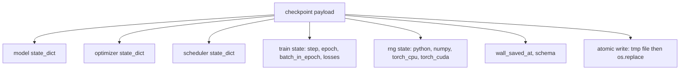
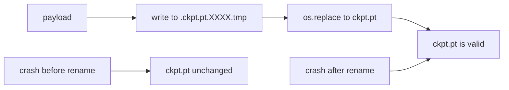
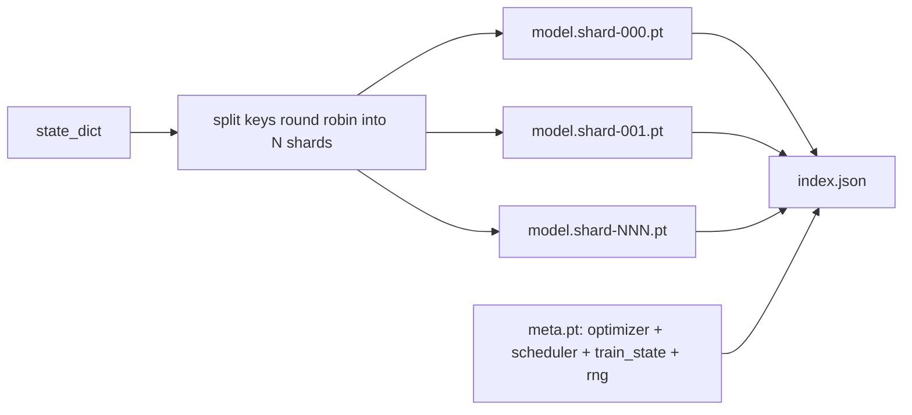

# 检查点保存与恢复

> 训练中断会杀死运行；检查点让它们能够继续。原子性地保存模型、优化器、调度器、损失历史、步数计数器和 RNG 状态，确保在任何时刻被杀死时磁盘上都留下一个有效文件。

**Type:** Build
**Languages:** Python
**Prerequisites:** Phase 19 lessons 42 to 45
**Time:** ~90 minutes

## Learning Objectives

- 将完整训练状态捕获到一个可以重新加载到新进程中的单一有效载荷中。
- 实现原子保存：先写入临时文件再重命名，确保崩溃永远不会留下半写入的文件。
- 恢复 Python、NumPy 和 PyTorch 的 RNG 状态，使恢复后的损失与不中断的基线匹配。
- 为不再适合单个文件的模型构建分片检查点布局，包含哈希验证的分片和 JSON 索引。

## The Problem

你设置了一个 18 小时的训练作业。墙钟上限是 4 小时。集群在第 11 小时重启，因为比你高一级的人批准了内核升级。没有检查点，你只能从头开始。没有恢复，你还会丢失优化器花了前 11 个小时学到的状态，所以即使模型权重保存了下来，AdamW 的矩也消失了，下一步会向训练轨迹已经走过的方向猛冲。

正确的产出物是一个保存了继续所需一切内容的单一文件：模型参数、优化器状态、调度器状态、用于绘图的历史损失、当前步数以及 epoch 和 epoch 内批次的计数器，还有每个随机源的 RNG 状态。没有 RNG 状态，恢复后的损失曲线是不同的曲线。相同的模型、相同的数据、不同的洗牌、不同的 dropout 掩码、仪表盘上不同的数字。

原子保存是合约的另一半。直接写入最终文件名意味着写入中途的崩溃会留下损坏的文件；恢复会读到垃圾。写入同一目录中的临时文件然后重命名，意味着写入中途的崩溃会让之前的完好文件保持不变。在 POSIX 文件系统上，重命名是原子的。

## The Concept



### 五个状态桶

| 桶 | 为什么重要 |
|--------|----------------|
| Model | 权重和缓冲区；模型是什么。 |
| Optimizer | 动量和自适应矩；没有这些，下一步是不同的优化问题。 |
| Scheduler | 学习率在其曲线上处于什么位置；特别是余弦调度器很敏感。 |
| Train counters | 步数、epoch、epoch 内批次，以及绘制仪表盘所需的损失历史。 |
| RNG state | dropout、数据洗牌和模型内任何采样的确定性。 |

### 原子保存



两条规则。首先，临时文件与目标文件在同一目录中，因此重命名保持在相同的文件系统内；跨设备重命名不是原子的。其次，临时名称每次尝试都是唯一的，因此两个写入者不会互相覆盖。

### 分片检查点

当模型变得很大时，单文件有效载荷变得太大而无法快速加载，太大而无法检查，并且在网络共享中途卡顿时太痛苦。解决方案是将参数状态分成多个分片，并编写一个小型索引将它们联系在一起。



索引记录分片数量、每个分片的 sha256 以及元文件的 sha256。任何哈希不匹配时，加载器会响亮地失败。分片可以落在不同的物理磁盘上；元数据很小，先读取。

### 恢复在 epoch 中间继续

跳到下一个 epoch 开始的恢复会浪费几分钟到一天的时间。解决方案是 `(epoch, batch_in_epoch)` 加上 RNG 状态。加载后，训练循环将随机数生成器快进，跳过当前 epoch 中已经消耗的批次，从 `batch_in_epoch` 继续。课程代码精确地做到了这一点；断言是恢复后的损失轨迹在 1e-4 范围内与不中断的基线匹配。

## Build It

`code/main.py` provides four primitives and a demo driver.

### Step 1: capture and restore RNG state

`capture_rng_state` returns a dict with Python's `random.getstate`, NumPy's `np.random.get_state`, and PyTorch CPU and CUDA RNG bytes. `restore_rng_state` reverses it. The CPU tensor is a uint8 byte buffer that PyTorch's RNG knows how to consume.

### Step 2: atomic save

`atomic_save` writes the payload to a temp file in the target directory, then `os.replace` swaps it into the final name. `atomic_write_json` does the same for the sharded index.

### Step 3: full checkpoint round trip

`save_checkpoint` packages the model, optimizer, scheduler, train state, and RNG into one dict. `load_checkpoint` reverses it and returns a `TrainState`. The schema field is the upgrade hook: future format changes bump the version string and the loader dispatches.

### Step 4: sharded variant

`save_sharded_checkpoint` round-robins the parameter keys across N shards, writes each shard with its own atomic save, writes a meta file with optimizer and scheduler and train state, and writes the JSON index with shard sha256s. `load_sharded_checkpoint` verifies every shard before merging.

### Step 5: resume demo

`run_resume_demo` trains a small model for `total_steps`, saves a checkpoint at `interrupt_at`, then continues. A second process restores the checkpoint and runs the remaining steps. The function returns the max absolute difference between the two loss trajectories after the interruption point. With RNG restored, the difference is zero or floating-point noise.

Run it:

```bash
python3 code/main.py
```

The single-file and sharded demos both assert max-diff under 1e-4. The summary lands in `outputs/resume-demo.json`.

## Use It

Production training stacks ship checkpointing as part of the trainer. The shape is the same: model + optimizer + scheduler + counters + RNG, written atomically, named by step so the latest is easy to find. Sharded layouts power large model loading with parallel reads; the index.json is what makes that work.

Three patterns to enforce:

- **Schema is a string in the payload.** Migrations branch on it. Without it you cannot evolve the format without breaking old runs.
- **Sha256 every shard.** A silently truncated download is the worst kind of bug; the loader fails fast or it fails late.
- **Keep checkpoint cadence honest.** Save every N steps and every wallclock-minute, whichever is shorter. Otherwise the long step that crashes wastes a full window of work.

## Ship It

`outputs/skill-checkpoint-save-resume.md` is the recipe for any new training script: payload shape, atomic write, RNG capture, sharded index. Drop the skill into a repo, wire `save_checkpoint` at the periodic save site, wire `load_checkpoint` at startup, and the run survives kills.

## Exercises

1. Replace round-robin sharding with sharding by parameter group (layers ending in `.weight` vs `.bias`). When is each layout preferable?
2. Extend the save loop to keep the last K checkpoints and prune older ones. What is the right K when the disk is small?
3. Add a `--ckpt-every-seconds` flag that triggers a save on a wallclock interval, not just step count.
4. Add a checksum verification path that runs at startup, scans every checkpoint in the directory, and reports which ones are corrupt.
5. Implement a `migrate_v1_to_v2` function that adds a new field to the payload and bumps the schema string. Make load tolerate both versions.

## Key Terms

| Term | What people say | What it actually means |
|------|-----------------|------------------------|
| Atomic save | "Write and pray" | 写入同目录下的临时文件，然后 os.replace 覆盖到目标文件名 |
| State dict | "The weights" | 按参数名称索引的模型参数和缓冲区 |
| Sharded checkpoint | "Big model file" | 多个文件，每个分片一个，加上元文件和带 sha256 的 JSON 索引 |
| RNG state | "Random seed" | 为 python random、numpy、torch CPU、torch CUDA 捕获的状态；不仅仅是种子 |
| Mid-epoch resume | "Restart" | 快进 RNG 并从同一 epoch 的下一个批次继续 |

## Further Reading

- POSIX `rename` semantics for the atomicity claim that `os.replace` relies on.
- PyTorch documentation on `torch.save` and `torch.load`, including `map_location` for cross-device restores.
- Phase 19 lesson 46 covers the gradient accumulation that this lesson's checkpoint payload survives across.
- Phase 19 lesson 48 covers the distributed wrappers whose state dict format this scheme accommodates.
- The Linux kernel `fsync` documentation for the durability guarantee behind atomic rename.
