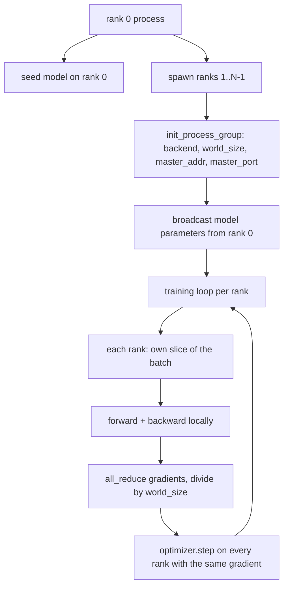
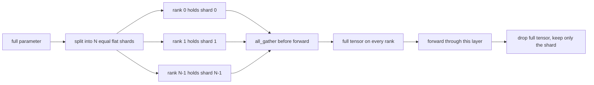

# 分布式数据并行与 FSDP 从零实现

> 多 rank 训练就是两个集合通信操作和一条规则。启动时广播参数，反向传播后平均梯度，永远不要让 rank 对其所处的步骤有异议。

**Type:** Build
**Languages:** Python
**Prerequisites:** Phase 19 lessons 42 to 45
**Time:** ~90 minutes

## Learning Objectives

- 使用 `gloo` 后端在 N 个 rank 上启动一个进程组，无需特殊硬件。
- 实现一个最小 DDP 包装器，在构造时广播参数，在反向传播后 all-reduce 梯度。
- 证明各 rank 梯度的 all-reduce 与拼接输入上的单进程梯度相匹配。
- 勾勒 FSDP 参数分片：每个 rank 持有一个切片，在前向传播中收集完整张量并在之后丢弃。

## The Problem

模型适合一个设备。数据集不适合。优化预算说你想在每墙钟秒内看到 N 倍的样本。第一个杠杆是数据并行：每个 rank 在不同批次切片上运行相同的模型，然后在优化器步骤前平均梯度。第二个杠杆是 FSDP：模型也不适合一个设备，因此每个 rank 持有每个参数的一部分，并在前向传播中逐层重建完整张量。

痛苦在于簿记。如果参数在各 rank 之间漂移，运行将在默默中损坏。如果你平均梯度但不平均损失，仪表盘就在说谎。如果集合通信后端不能就拓扑达成一致，运行将永远挂起。解决方案是手动编写一次集合通信，永远不信任你无法重现的包装器。

本课在 CPU 上运行。不假设 CUDA。`gloo` 后端随每个 PyTorch 构建一起提供，并接受 `torch.multiprocessing` 工作进程；相同的代码在多 GPU 节点上切换到 `nccl`，无需更改结构。

## The Concept



### 两个重要的集合通信操作

| Collective | What it does | When |
|------------|--------------|------|
| `broadcast` | 将张量从一个 rank 复制到所有其他 rank | 参数初始化、调度器状态、任何一对全同步 |
| `all_reduce` | 在所有 rank 上对张量求和（或均值、或最大值），每个 rank 得到结果 | 反向传播后的梯度平均 |
| `all_gather` | 每个 rank 贡献一个张量，每个 rank 获得拼接结果 | Logits 收集、FSDP 参数反分片 |

DDP 合约是在构造时进行 `broadcast`，在反向传播后进行 `all_reduce`。FSDP 草图在每层前向传播前添加 `all_gather`。

### 梯度平均与单进程梯度匹配

在 N 个 rank 上以 B 个样本的批次训练的模型，必须产生与以 N*B 个样本的批次训练的单进程相同的梯度。技巧是将各 rank 的梯度求和并除以 N，得到平均损失梯度，这正是带均值归约的交叉熵在全批量上产生的。课程代码通过手动 all-reduce 梯度与参考单进程梯度之间的 `max-abs-diff < 1e-3` 来断言这一点。

### FSDP 草图



内存收益是精确的：每个参数的每个 rank 内存下降到 1/N。代价是 gather，每次前向传播都要支付。生产级 FSDP 将 gather 与上一层的计算重叠，因此墙钟成本远小于简单计算所预测的。本课对每个参数做完整往返，并断言重建与原始逐位相等。

### CPU 与 gloo 后端

CUDA 是生产目标，但相同的代码路径在 CPU 上也存在。`gloo` 是 CPU 的集合通信后端。它在 GPU 上比 `nccl` 慢数个数量级，但 API 表面是相同的。本课的进程组用 `backend="gloo"` 初始化，rank 用 `torch.multiprocessing` 而不是 `torchrun` 启动；两者最终都落在相同的 `torch.distributed` 调用上。在多 GPU 节点上，唯一的更改是 `backend="nccl"`、设备张量和 `torchrun` 启动。

## Build It

`code/main.py` is the runnable artifact.

### Step 1: bring up the process group

```python
os.environ["MASTER_ADDR"] = "127.0.0.1"
os.environ["MASTER_PORT"] = str(port)
dist.init_process_group(backend="gloo", rank=rank, world_size=world_size)
```

`MASTER_ADDR` 和 `MASTER_PORT` 是集合点：每个 rank 拨号到相同主机的相同端口。本课通过 bind-and-close 技巧选择一个空闲端口，以避免多次运行共享一台机器时的冲突。

### Step 2: broadcast at construction

`MinimalDDP.__init__` 遍历每个参数和缓冲区并调用 `dist.broadcast(tensor, src=0)`。Rank 0 的值成为规范化的初始值。如果不这样做，每个 rank 都以自己的种子初始化，各 rank 从第一步开始就会偏离。

### Step 3: all-reduce gradients after backward

```python
def all_reduce_grads_(module, world_size):
    for p in module.parameters():
        if p.grad is None:
            p.grad = torch.zeros_like(p.data)
        dist.all_reduce(p.grad.data, op=dist.ReduceOp.SUM)
        p.grad.data.div_(world_size)
```

每个 rank 最终得到相同的平均梯度。优化器步骤现在是每个 rank 上相同输入的函数，这就是为什么参数在运行期间保持同步。

### Step 4: prove the equivalence

`manual_all_reduce_matches_single_process` 在 rank 0 上构建相同模型，并将 all-reduce 后的梯度与单进程在拼接输入上计算的梯度进行比较。最大绝对差约为 1e-8。

### Step 5: FSDP round trip

`fsdp_round_trip_sketch` 展平每个参数，填充到 `world_size` 的倍数，切片，all-gather，然后去掉填充。每个 rank 的重建与原始相等。这是反分片步骤；其逆操作（前向传播后重新分片）是从收集的张量中取一个切片。

Run it:

```bash
python3 code/main.py
```

Default world size is 2. Two CPU processes spawn, talk to each other through `gloo`, and exit zero. The output `outputs/ddp-demo.json` captures parameter sums per rank, the gradient norm after all-reduce, the FSDP round-trip result, and the manual-vs-reference gradient diff.

## Use It

Production training stacks call the same primitives. PyTorch's `DistributedDataParallel` adds: post-backward gradient hooks that overlap all-reduce with backward, bucketed all-reduce that combines several small gradients into one collective, and the `no_sync` context lesson 46 used.

PyTorch's FSDP adds: a flat parameter view per layer so each rank holds one contiguous buffer, overlap of the next layer's unshard with the current layer's compute, and optional CPU offload for the shards.

The shape stays the same: broadcast at startup, reduce after backward, shard parameters when they no longer fit.

## Ship It

`outputs/skill-distributed-fsdp-ddp.md` carries the recipe for a new training script: spin up the process group with `gloo` for CPU and `nccl` for GPU, wrap the model in a DDP shell that broadcasts at construction and reduces after backward, optionally shard parameters with the all_gather pattern from the FSDP sketch.

## Exercises

1. Run with `--world-size 4` and confirm the param spread stays under 1e-3 across the run.
2. Replace the manual averaging with `dist.all_reduce(op=dist.ReduceOp.AVG)` and time the difference.
3. Add a post-backward hook to the DDP wrapper so the all-reduce overlaps with the rest of the backward; measure the wallclock improvement.
4. Implement the FSDP re-shard step: after the forward pass, replace the full tensor with the local shard again. Confirm per-rank memory drops.
5. Switch the backend to `nccl` on a CUDA box. Note which environment variables change and which stay the same.

## Key Terms

| Term | What people say | What it actually means |
|------|-----------------|------------------------|
| Backend | "gloo or nccl" | 实现集合通信操作的库；gloo 是 CPU 的，nccl 是 GPU 的 |
| World size | "Total ranks" | 组中的进程数；组是集合通信操作的单位 |
| Rank | "Worker id" | 组内的进程标识符，从零开始索引 |
| All-reduce | "Sum the grads" | 在所有 rank 上对张量求和，每个 rank 最终得到相同结果 |
| Unshard | "Gather the params" | 通过 all_gather 从各 rank 的切片重建完整张量 |

## Further Reading

- PyTorch `torch.distributed` documentation for the collective semantics this lesson relies on.
- The `gloo` library's collective list, identical in shape to the CUDA-backed `nccl` primitives.
- Phase 19 lesson 46 for the gradient accumulation pattern that wraps the DDP all-reduce in `no_sync`.
- Phase 19 lesson 47 for the checkpoint layout that survives DDP and FSDP runs.
- PyTorch FSDP documentation for the production implementation of the parameter sharding sketched here.
