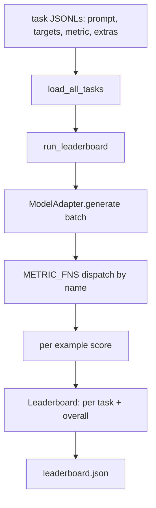
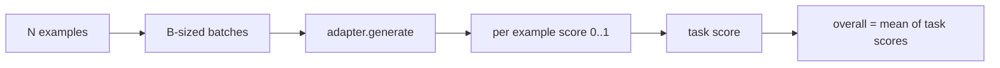

# 语言模型评估工具

> 一个在你无法定义的任务上表现良好的模型，是一个偶然表现良好的模型。评估工具就是任务定义、指标、运行器和排行榜，以简洁、可替换的形式存在。

**Type:** Build
**Languages:** Python
**Prerequisites:** Phase 19 lessons 42 to 45
**Time:** ~90 minutes

## Learning Objectives

- 将任务定义为每样本包含 `prompt`、`targets`、`metric` 和可选 `extras` 的 JSONL 文件。
- 实现五种指标：精确匹配、rouge-l F1、可执行检查、多项选择和包含子串。
- 构建一个运行器，按任务批量处理样本，并分派给可替换的模型适配器。
- 输出一个排行榜 JSON，包含每个任务的得分、延迟和可重现的总体平均分。

## The Problem

每周都会出现一个新的语言模型。营销声称它表现良好。诚实的问题是：擅长什么？诚实的答案是你自己编写的排行榜，因为供应商的排行榜是他们调优过的那个。

如果你的仓库中没有评估工具，你只能凭感觉比较两个模型。有了评估工具，你可以通过固定任务集和固定指标的得分，以及可以 diff 的 JSON 输出来比较它们。评估工具是昨天运行和今天运行之间的合约。没有它，回退就会被发布。

陷阱是将评估工具过度拟合到单个模型。修复是相同的陷阱反过来：评估工具小到可以在十五分钟内读完，任务小到可以随仓库一起发布，指标从零编写以便同事可以审计，而适配器是模型特定代码存在的唯一位置。替换适配器，排行榜会变动；替换任务，排行榜会变动。其他任何东西都不应该变动。

## The Concept



### 任务规范

每个样本是一行 JSONL：

```json
{"id": "arith-00", "prompt": "compute: 2 + 2", "targets": ["4"], "metric": "exact_match"}
```

对于需要评分辅助的指标，`extras` 携带辅助数据负载：

```json
{
  "id": "code-00",
  "prompt": "python: write a function f that doubles its input",
  "targets": ["ok"],
  "metric": "code_exec",
  "extras": {"io_pairs": [[1, 2], [3, 6]]}
}
```

一个任务是 `outputs/tasks/` 下的一个 `.jsonl` 文件。文件名是任务名称。一个文件中的所有样本共享一个指标。

### 五个 fixture 任务

| Task | Metric | What it tests |
|------|--------|---------------|
| arithmetic | exact_match | Token-level correctness on a deterministic answer |
| summary | rouge_l | Longest common subsequence F1 against a one-line reference summary |
| code-exec | code_exec | Executable test: the predicted function must satisfy a list of input-output pairs |
| multiple-choice | multiple_choice | First letter of the prediction must match an allowed letter |
| generation | substring_contains | Free-form text must contain at least one target substring |

### 指标合约

每个指标是一个从 `(prediction, targets, extras) -> float in [0.0, 1.0]` 的函数。评估工具对每个样本的得分求平均以得到任务得分，然后对任务得分求平均以得到总体得分。指标函数都很简短：

- `exact_match`: 小写、压缩空格、相等判断。
- `substring_contains`: 相同的归一化，子串测试。
- `multiple_choice`: 首字符大写。
- `rouge_l`: LCS 长度除以预测和参考长度，精确率和召回率的 F1。
- `code_exec`: 在受限命名空间中执行预测，在每个输入输出对上调用 `f(x)`，计数匹配。

code_exec 指标在精简的内置函数命名空间中运行预测。本课的测试断言 `import os` 会爆炸，因为 `os` 不在命名空间中；你无法从代码预测中到达文件系统。

### 模型适配器

```python
class ModelAdapter(Protocol):
    def generate(self, prompts: Sequence[str]) -> List[str]: ...
    @property
    def name(self) -> str: ...
```

适配器是接缝。本课提供 `ToyAdapter`，一个确定性模式匹配器，为五个 fixture 任务中的每个提示返回正确答案。真实的适配器调用模型并返回其输出。评估工具不关心是哪个。

### 运行器

`run_task` 每次批量处理 `batch_size` 个提示，并分派给指标函数。`run_leaderboard` 遍历每个任务并平均。`write_leaderboard` 输出带有 schema 字符串的 JSON，以便将来的格式更改不会默默破坏仪表盘。



```figure
eval-harness-matrix
```

## Build It

`code/main.py` is the runnable artifact.

### Step 1: seed fixture tasks

`seed_fixture_tasks(target_dir)` writes the five `.jsonl` files. The first run of `main.py` seeds them when the directory is empty.

### Step 2: load tasks

`load_all_tasks(task_dir)` reads every `.jsonl` and returns a dict from task name to a list of `Example` records. Comment lines starting with `#` and blank lines are skipped so contributors can annotate the files.

### Step 3: implement metrics

Each metric is a small function with a unit test. The lesson's test suite includes 13 cases covering normalization, partial overlap, code execution, and unsafe code rejection.

### Step 4: write the runner

`run_task` iterates batches and produces a `TaskResult` with score, correct count, total count, and latency. `run_leaderboard` walks all tasks and produces a `Leaderboard` with the overall average.

### Step 5: emit JSON

`write_leaderboard` serializes the board. The `--include-per-example` flag dumps the per-example records so you can diff predictions against the previous run when scores move.

Run it:

```bash
python3 code/main.py
```

The script seeds the fixtures on first run, scores them with the toy adapter (which gets every fixture right), and writes `outputs/leaderboard.json`. Overall score is 1.0 with the toy adapter; the stub adapter test in `test_main.py` shows the same harness produces 0.0 when the adapter cannot answer.

## Use It

要接入真实模型，编写一个适配器。形状如下：

```python
class HttpAdapter:
    name = "vendor.v1"

    def __init__(self, endpoint, api_key):
        self.endpoint = endpoint
        self.api_key = api_key

    def generate(self, prompts):
        out = []
        for prompt in prompts:
            response = http_post(self.endpoint, prompt, self.api_key)
            out.append(response["text"])
        return out
```

在 `main()` 的顶部将 `ToyAdapter` 替换为 `HttpAdapter`。评估工具、任务、指标和排行榜保持不变。

Three patterns to enforce when shipping the harness in a real project:

- **Pin the task files.** The leaderboard.json carries hash-pinned task content or it carries the JSONLs alongside; otherwise the score moves when the task file does, and you cannot tell which.
- **Diff predictions, not just scores.** The `--include-per-example` flag lets you see what the model said the day the score dropped.
- **Cap the batch size.** Real adapters have rate limits. A small batch size keeps the harness compatible across vendors.

## Ship It

`outputs/skill-lm-eval-harness.md` carries the recipe: JSONL task spec, five metrics, swappable adapter, batched runner, leaderboard JSON with schema string. The task files in `outputs/tasks/` are the fixtures; copy them into a real project as starters.

## Exercises

1. Add a sixth task with a custom metric you write from scratch (BLEU-like overlap, BLEURT-like reference scoring, anything with a clear contract).
2. Extend `code_exec` to capture stdout and accept a list of expected stdouts as targets.
3. Add a leaderboard diff command: given two `leaderboard.json` files, print which tasks moved and by how much.
4. Cap latency per example. Wrap the adapter call in a timeout; surface a separate `timeouts` column in the leaderboard.
5. Pin task content with a sha256 in the leaderboard so a future reader can verify they scored the same tasks.

## Key Terms

| Term | What people say | What it actually means |
|------|-----------------|------------------------|
| Task spec | "The eval format" | 每样本包含 prompt、targets、metric 和可选 extras 的 JSONL 文件 |
| Metric | "How you score" | 从 (prediction, targets, extras) 到 [0, 1] 中浮点数的函数 |
| Adapter | "The model client" | 具有 generate(prompts) -> list[str] 方法的对象；唯一的模型特定代码 |
| Leaderboard | "The scoreboard" | 包含每个任务得分、总数、延迟和总体平均分的 JSON |
| Code exec metric | "Run it and check" | 在受限命名空间中执行预测，与输入输出对进行比较 |

## Further Reading

- The original lm-evaluation-harness for the production reference, much larger but the same shape.
- HuggingFace's lighteval for an alternative implementation of the same contract.
- Phase 19 lesson 46 covers the gradient accumulation patterns used in the training stack the harness scores.
- Phase 19 lesson 47 covers the checkpoint format you score against; pin the checkpoint hash in the leaderboard.
- Phase 19 lesson 48 covers the distributed training stack that produced the model under test.
