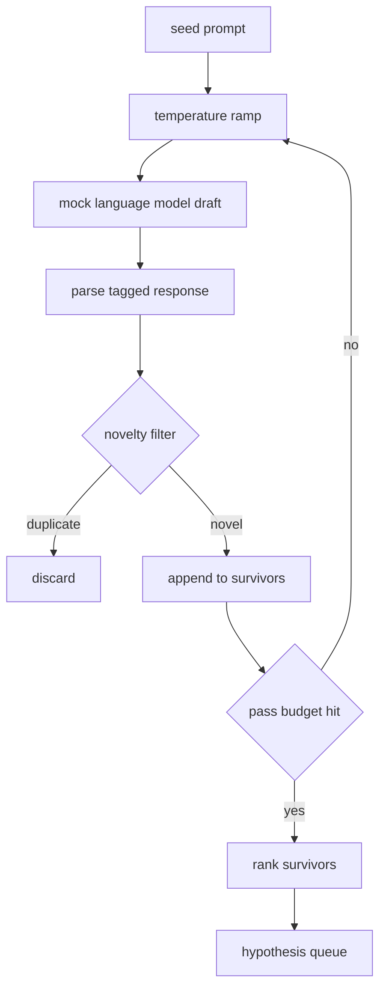

# 假设生成器

> 一个提出相同问题的研究代理是在浪费 token。技巧是强制每个草稿落在新的地方。

**Type:** Build
**Languages:** Python
**Prerequisites:** Phase 19 Track A lessons 20-29
**Time:** ~90 minutes

## Learning Objectives
- 从一个种子提示驱动采样器，并将其输出转化为类型化的假设记录。
- 在每次遍历中逐步提高采样器温度，使下一个草稿比上一个偏离得更远。
- 使用小型嵌入模型和余弦距离阈值过滤近似重复项。
- 使用融合新颖性、具体性和可测试性的评分函数对幸存者进行排名。
- 保持每一步确定性，以便相同的种子始终产生相同的队列。

## 为什么先生成，然后过滤

一个向一个模型问一次的规划者得到一个假设。对于一个工作示例来说，这很好。对于研究循环而言，这是错误的形态。循环需要一个有深度的排名队列，这样当第一个假设失败时，运行器可以在不需要再付出另一轮完整采样的情况下准备好下一个假设。

两个想法结合产生这个队列。第一个是温度递增：每次通过采样器都会将温度提高一个档次，因此后期的草稿被鼓励偏离。第二个是新奇性过滤：每个草稿之后，生成器测量与之前每个幸存者的嵌入距离，并拒绝任何落在集群内部的草稿。

本课提供一个模拟语言模型，为固定提示返回脚本化的 token 序列。这个模拟模型足以测试完整路径：种子提示输入、应用温度递增、解析候选项、运行新奇性过滤器、输出排名队列。

## 假设的形状

```text
Hypothesis
  id             : int           (monotonic within a run)
  text           : str           (the claim)
  variables      : list[str]     (what changes between conditions)
  metric         : str           (what the runner will measure)
  baseline_ref   : str | None    (which paper or run the comparison cites)
  draft_pass     : int           (which sampler pass produced this)
  temperature    : float         (the sampler setting at draft time)
  novelty_score  : float         (distance from prior survivors, 0..1)
  rank_score     : float         (weighted sum used for ordering)
```

`variables` 和 `metric` 不是自由文本。解析器从带标签的响应中提取它们。第五十二课的运行器在构建实验配置时直接读取这些字段。

`baseline_ref` 是可选的但推荐。第五十三课的评估器需要一个基线来比较。如果假设省略了基线，评估器回退到同一指标上的前一次运行。

## 架构



循环很简单。有趣的部分是每个盒子都有一个硬合约。

## 温度递增

从 `t_min` 开始，到 `t_max` 结束，步长为 `(t_max - t_min) / (n_passes - 1)`。每次遍历在当前温度调用采样器，从 `GeneratorConfig.schedule()` 产生 `n_passes` 个均匀分布的值。模拟模型通过在以 `(prompt, temp_bucket)` 为键的一小组脚本化响应之间切换来遵守温度。桶是开区间，因此温度的微小变化会选择不同的桶并产生不同的草稿。在生产环境中，采样器将是一个真实模型，传递 `temperature=t`。

默认调度是从 `0.2` 到 `1.2` 的六次遍历。六次足以填充队列，而不必为新鲜度过滤器反正会拒绝的样本付费。低于 `0.2`，模型会鹦鹉学舌般复述种子。高于 `1.2`，响应往往会偏离主题并且无法通过解析器。

## 新奇性过滤

每个草稿被解析后，生成器嵌入其文本并与每个已接受的假设进行比较。嵌入是一个小的哈希词袋向量，归一化为单位长度。两个单位向量之间的余弦距离是 `1 - dot(a, b)`。如果草稿到任何先前幸存者的最小距离高于 `novelty_threshold`，则通过。默认值为 `0.25`。

哈希嵌入并不花哨。它是确定性的，零依赖，并且足以捕获明显的情况：两个共享大部分名词的草稿。生产部署可以替换为一个小型句子模型。接口保持不变。

## 排名分数

```text
rank_score = w_novelty * novelty_score
           + w_specificity * specificity_score
           + w_testability * testability_score
```

三个子分数。`novelty_score` 是与先前幸存者的最小嵌入距离。`specificity_score` 是假设中具体变量的计数除以目标计数。`testability_score` 如果假设同时指定了指标和基线则为 1，如果只有指标则为 0.5，否则为零。

默认权重为 `0.4`、`0.3`、`0.3`。权重存在于生成器配置中，因此下游课程可以在不分叉代码的情况下调整它们。

## 模拟语言模型

```python
class MockLLM:
    def sample(self, prompt: str, temperature: float, seed: int) -> str:
        ...
```

采样器给定 `(prompt, temperature, seed)` 三元组是确定性的。模拟模型维护一个以 `(prompt_signature, temperature_bucket)` 为键的脚本化响应表。如果表中没有某个键的条目，采样器返回一个无法通过解析器的回退结果。回退路径由其中一个测试覆盖。

种子被混入响应中，因此相同的 `(prompt, temperature)` 对使用不同的种子会产生不同的草稿。在测试中，我们固定种子以保持结果可重现。在真实部署中，种子来自系统时钟或计数器。

## 输出队列

输出是一个按 `rank_score` 降序排列的 `Hypothesis` 记录列表。第五十二课的运行器弹出队首，运行实验，第五十三课的评估器将裁决写回。如果裁决说假设是错误的，运行器弹出下一个假设。

队列是有限的。当它为空时，编排器可以扩大种子提示并再次运行生成器，或者停止并报告预算已耗尽。

## 如何阅读代码

`code/main.py` defines `Hypothesis`, `MockLLM`, `HypothesisGenerator`, and a deterministic demo. The generator exposes a single `run(seed_prompt)` method that returns a sorted queue; the pass count is read from `GeneratorConfig.n_passes` rather than passed as an argument. The embedding is a hashed bag of tokens. The novelty filter is a single function. The rank score is a single function. Nothing depends on `numpy`; the embedding math is pure stdlib so the lesson stays portable.

`code/tests/test_generator.py` covers the linear path, the duplicate rejection path, the parser failure path, the temperature ramp boundaries, and the rank ordering.

## 这一课在整体中的位置

第五十课产生队列。第五十一课取队首运行文献检索以确认或反驳它。第五十二课取相同队首运行实际实验。第五十三课读取两个输出并编写裁决。这四课组合成一个无需人类参与的研究循环；人类可以在任何边界介入。
